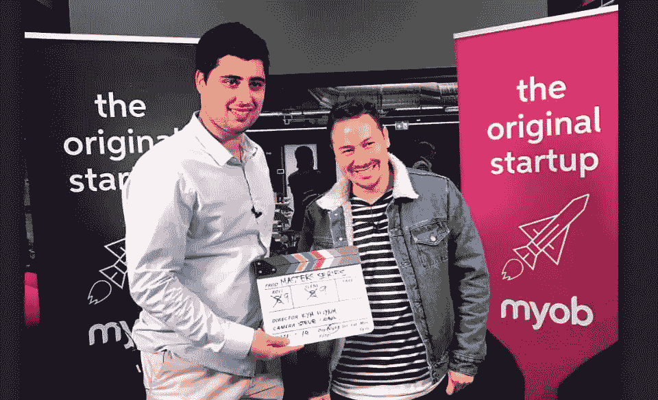

# 如何在网上建立你的品牌

> 原文：<https://www.sitepoint.com/how-to-build-your-brand-online/>

**陈庭威是[创始人](https://foundr.com/)的首席执行官兼出版商，这项业务源于他对营销、内容和创业的热情。在过去的五年里，他在网上建立了一家内容和数字媒体公司。他还采访了我们这一代最伟大的企业家，包括理查德·布兰森、马克·库班和阿里安娜·赫芬顿。**

## 采访

对你在 Foundr 的成功来说，什么是重要的？

第一件事是纪律和一致性。无论是每小时、每天、每周还是每月，制作随时间推移而复合的一致内容都很重要。如果你的内容被认为是有价值的，那么它会随着时间的推移而增长。

互联网也非常强大，因为它为你做了繁重的工作。这不像把内容放在图书馆里，人们总是找不到它。互联网使分发变得容易，你可以使用大的分发渠道，如社交媒体平台，来帮助找到这些内容。

在网上建立品牌的关键要素是什么？

说到在网上建立品牌，你需要做好三个关键要素。

第一个是显而易见的，但不得不说:有一个优越的产品。以我的经验来看，成功并快速成长的创业公司和公司都有一个优秀的产品。很多人想创造一些东西只是为了赚钱，这很好，但如果你想创造一些伟大的东西，那么你必须有一个优秀的产品或服务。这就是你获得口碑的方式，也就是说你的品牌在传播。

第二件事是伟大的设计。伟大的设计现在是一种商品；。这是意料之中的，它本身也可以是一个独特的销售主张。很多成功的创业公司都有卓越的设计。如果是科技产品，他们有很好的用户界面；如果是实体产品，他们有很好的包装。如果你做得更好，花更多的钱和时间来发展你的品牌，它会得到回报。

当我开始创建 Foundr 的时候，我没有多少钱，但是我攒钱，并把好的设计放在首位。我在一个优秀的设计师身上花了大约 4000 美元，当时这让我很受伤，但这是我做过的最好的投资之一。它为人们对该品牌的期望开创了先例和节奏。伟大的设计实际上会让人们高兴，让他们兴奋，这真的很重要。

你可以用很少的预算得到很棒的设计。使用像 [99 Designs](https://99designs.com.au/) 这样的工具，或者去 [Behance](https://www.behance.net/) 寻找东南亚或东欧等价格更低廉的国家的人。你可以使用这种策略，不用花太多钱就能得到好的设计。

第三件事是使用大使。每个伟大的品牌都会使用大使，不管你是否看到。Foundr 没有“官方大使”，但当我们在杂志封面上看到我们行业的理查德·布兰森(Richard Bransons)时，这表明我们是一个合法的品牌。它提升了我们的可信度和权威，让我们通过交往挖掘那个人的影响力。

去 Foundr 网站的首页，你会看到来自鲨鱼池美洲和加里·维纳查克的推荐。他们在称赞我们的品牌，说这是一个你需要分配一些时间的地方。

你也许不能马上找到伟大的大使；直到第八版我们才看到理查德·布兰森。但如果你不问，不去尝试，你永远不会知道。

企业如何利用社交平台来发展其在线品牌？

社交媒体平台非常强大，尤其是在你创业的时候。但是你不能一下子掌握它们。因此，选择一个与你的业务最相关的开始。选择一个你的竞争对手看起来最有吸引力的。这取决于你的受众、你的产品和你正在构建的东西。

一旦你选择了频道，研究你的竞争对手，看看他们在创造什么内容。我非常支持成功会留下线索的观点。看看哪些内容对你的竞争对手最有吸引力。如果 YouTube 是他们最有吸引力的频道，那么看看他们的十大热门视频是什么。然后，您可以创建一个策略来制作关于这些主题的更好的内容。

还要看看那个渠道还有什么其他品牌。他们可能做的事情和你不一样，但他们可能在不同的行业做类似的事情。看看他们在做什么，从他们的内容中获得灵感。

一旦你为你需要制作的内容类型制定了一个策略，你就需要开始并且永不停止。你停下来的那一刻，就是你失去的那一刻。所有的社交媒体平台都是基于内容的。他们想要内容，这样他们就可以在他们的平台上留住尽可能多的用户，他们会奖励你的一致性。一个恰当的例子是 YouTube。如果你连续一年每天都发帖子，YouTube 会奖励你，如果你的内容得到参与，YouTube 也会奖励你。

目前我正在掌握 YouTube。所以，我正在研究我的竞争对手和在不同市场做类似事情的其他品牌。我正在建立一个内容节奏，研究精英中的精英，找出是什么推动了这个频道的发展。我了解到缩略图是让某人点击 YouTube 的重要部分。搜索引擎也很重要，所以我们用关键词做了很多，这样我们就可以对某些主题进行排名。你还需要合作，让其他人引用你的品牌，所以我们正在考虑如何让尽可能多的人推荐我们的内容。我们正在研究、测试，并在这个平台上缓慢但肯定地开拓出我们自己的空间。

使用社交媒体并不昂贵，但确实需要时间。创造伟大的内容需要时间。推广这些内容、获得反向链接以及接触有影响力的人都需要时间。但是如果你在创业，而你又没有钱，你必须花时间。

Nathan Chan (right) during his presentation at the WeTeachMe Masters series

随着规模的扩大，建立一个优秀的团队有多重要？

是一切！你可以一个人把一家公司的年收入从零提高到六位数，但是你会遇到一个需要帮助的平台。除非你有一个了不起的团队，否则你无法扩大一家公司的规模。

你可以一开始就让承包商参与进来，这当然有效，但如果你雇佣全职员工，你会获得更多优势。随着时间的推移，你组建了一个团队，你可以开始从业务的某些方面抽身——无论是客户支持、产品、设计还是营销。但是那支队伍必须是一流的。

你需要与你的愿景一致的真正强大的才能。然后你可以用这个愿景来激励他们。

那么，你如何发现优秀的人才呢？

很难找到优秀的人才，但如果你清楚自己想要建立什么，并确保自己能够清晰地表达出来，这绝对是有可能的。如果可以的话，支付高于市场价的工资，并确保你能向那个人保证，如果他们来和你一起工作，他们能把工作做得最好。

我用了多种方法来寻找优秀的人才。如果我想招聘一个职位，我会在 LinkedIn 上寻找。我可能会在墨尔本寻找顶尖的创业公司，寻找处于那个位置的人。我会联系他们，告诉他们我们在努力建设什么。我还成功地找到了已经在 Foundr 社区中的人。我现有的一些团队也推荐了他们认识的人。

有时候伟大的天赋也是需要训练的。为了获得更好的结果，你必须加倍你的团队。你不能指望你雇了一个人，他们会马上把你踢出局。人们需要指导，他们需要知道成功是什么样的。

我对我的团队投入越多——通过培训或把他们介绍给能帮助他们的人——团队就变得越强大。这为我公司的发展带来了巨大的回报。

* * *

观看内森在 [WeTeachMe 大师赛](https://weteachme.com/masters-series)上的演讲:

[https://www.youtube.com/embed/DDasOrFsC1Y?rel=0](https://www.youtube.com/embed/DDasOrFsC1Y?rel=0)

 

## 分享这篇文章