# 如何在 Photoshop 中清理自拍

> 原文：<https://www.sitepoint.com/how-to-clean-up-a-self-portrait-in-photoshop/>

无论是高级时尚杂志、新产品广告、市场推广，还是你在脸书的新照片，我们都会偶尔修改照片。通过一些 Photoshop 技巧，你可以把一张乏味的、有缺陷的照片变得更加吸引眼球和专业。你的主题可能不是一个模型，但你仍然可以创建一个原始的图片，你可以感到自豪。今天，我们将介绍一些基本的照片修饰技术，这些技术可以在不使图像看起来不自然的情况下增强图像。我们将使我们的整体图像变亮，修正主体的皮肤，[移除一些不想要的物体](https://www.sitepoint.com/remove-background-photoshop/)，并做一些其他的增强。

我将使用 Wacom 竹笔平板电脑工作，但鼠标甚至是你笔记本电脑上的触摸板也可以工作；我已经完成了修图使用所有三个工具。为了确保你能很容易地理解这篇教程，我推荐你从 Photol.com 下载我正在使用的相同的源文件([源图像](http://www.photl.com/380029.html))。您可能需要创建一个帐户来完成此操作，但下载是免费的。

这是我们增强前后的图像:

[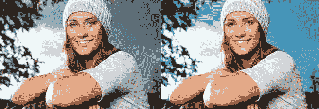](https://www.sitepoint.com/wp-content/uploads/2012/03/beforeafter.jpg)

### 第一步:打开你的图片

如果您还没有打开图像，请在 Photoshop 中打开它。

[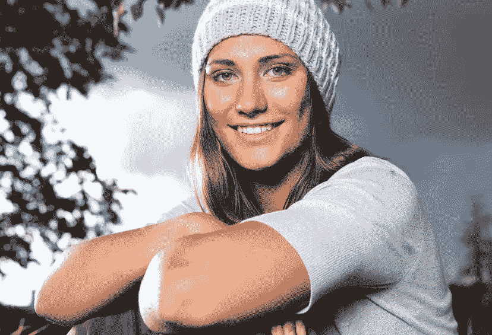](https://www.sitepoint.com/wp-content/uploads/2012/03/tut-pic.jpg)

### 第二步:复制

作为一个经验法则，也为了预防(因为有时事情会出错)，我总是复制我的原始图像。复制您的图像不仅允许您来回切换以查看发生了什么变化，而且还可以防止您“破坏”原始图像。

[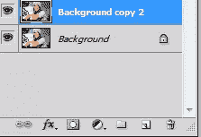](https://www.sitepoint.com/wp-content/uploads/2012/03/step2.png)

### 第三步:放松

正如你所看到的，我们的图像在前景和背景中都有点暗，这使得它看起来有点“灰暗”和单调。为了使我们的图像更明亮，我们将做一个快速的自动颜色调整。确保你在复制的原始图层上，进入“图像”>“自动上色”，或者你可以简单地按 Shift+Ctrl+“B”。您应该会看到立即发生的变化。现在，正如你所看到的，我们的图像是一个有点温暖的色调明智。

[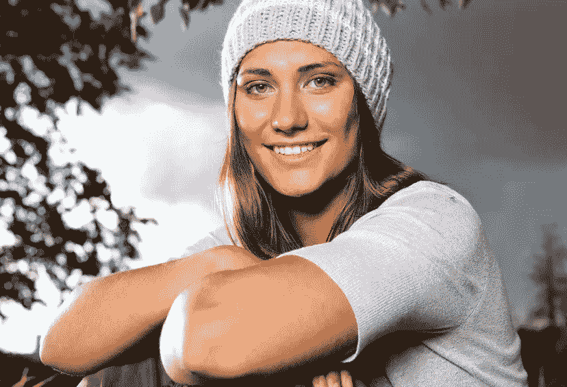](https://www.sitepoint.com/wp-content/uploads/2012/03/Step-3.jpg)

### 第四步:级别

我们的图像仍然很暗，所以为了让它更亮，我们需要进入“图像”>“色阶”(或者 Ctrl+“L”)，把你的前两个滑块改为 19 和 1.27。你可以参考下图，这样你就知道你输入的是正确的值。完成后，单击“确定”

[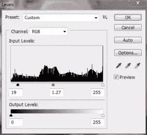](https://www.sitepoint.com/wp-content/uploads/2012/03/step4.png)

就照亮我们的图像而言，我们现在看起来很好，但是我们仍然有灰色的天空作为背景。

[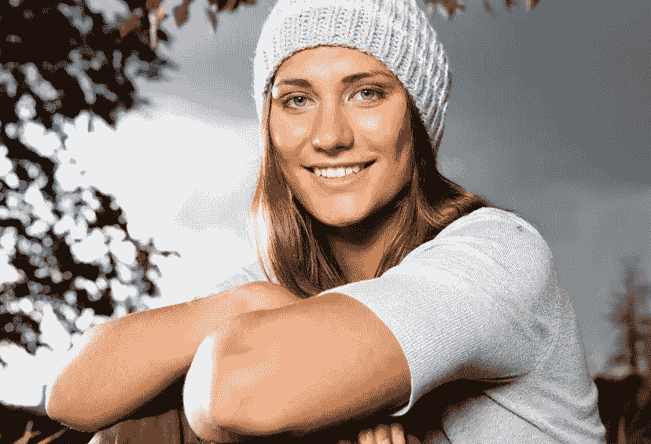](https://www.sitepoint.com/wp-content/uploads/2012/03/Step-4-11.jpg)

### 天空

通过单击图层菜单底部的删除和分组文件夹图标之间的图层图标，创建一个新图层。你也可以只按 Shift + Ctrl + "N "，或去"层" > "新层。"为了保持有序，将该图层命名为“蓝天”一旦你完成了，选择一个硬的圆形笔刷(你默认的圆形笔刷)并用#44cdff 绘制整个背景。当你完成后，改变你的图层模式为“叠加”，不透明度降低到 38%左右。

[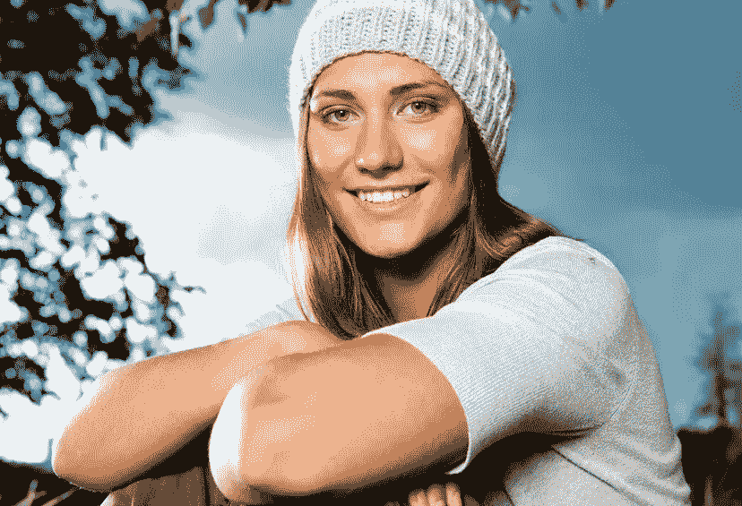](https://www.sitepoint.com/wp-content/uploads/2012/03/step-5.jpg)

### 照亮天空

复制你的蓝天层，改变图层模式为“饱和”，不透明度为 38%。现在我们已经做到了这一点，我们有了一个更蓝更丰富的天空，与原始图片中暴风雨般的灰色天空相比，给了我们一个更阳光的外观。

[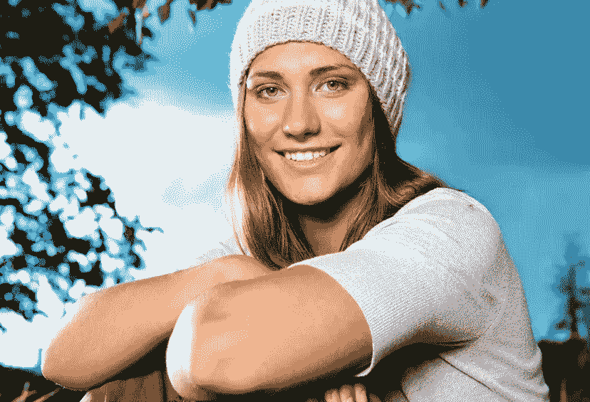](https://www.sitepoint.com/wp-content/uploads/2012/03/step-6.jpg)

### 第七步:斑点愈合

如果我们放大我们的图像，我们可以看到我们的模型没有完美无瑕的皮肤；我们将纠正这一点。找到位于工具栏上的斑点修复笔刷工具；你需要通过点击它或者按键盘上的“J”来获取它。如果由于某种原因，你有一个不同的图标，你需要将光标放在图标上，直到弹出一个更小的菜单，并选择最右边的图标(看起来像一个小创可贴)。确保你的笔刷在 5px 左右，硬度为 0%,选择你复制的图层，放大主体的脸。简单地开始点击最明显的瑕疵，直到面部变得更加清晰。保持你的笔刷尺寸比你要修正的地方大一点。

[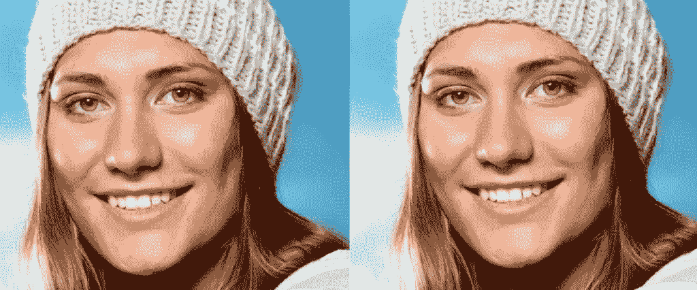](https://www.sitepoint.com/wp-content/uploads/2012/03/step-7.jpg)

### 步骤 8:修补工具

现在我们已经处理了最明显的瑕疵，我们需要在面部的其他部分进行处理。正如您在下图中看到的，我已经突出显示了我们要尽量减少的问题区域。

[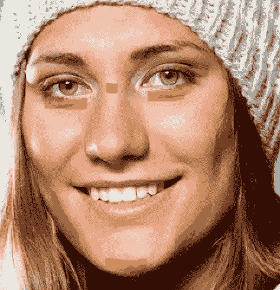](https://www.sitepoint.com/wp-content/uploads/2012/03/step8.png)

选择修补工具，该工具位于小弹出菜单中，带有前面步骤中的斑点修复笔刷工具。一旦你选择了正确的工具，你要选择眼袋。先从右眼开始(你的右边，不是主体的右边)。当你选择了补丁，把它拖到一个透明的皮肤上，在这个例子中我用的是前额。

[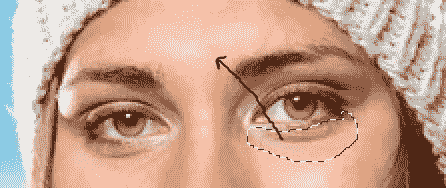](https://www.sitepoint.com/wp-content/uploads/2012/03/step-8-1.png)

完成后，你会注意到补丁太模糊了，所以进入“编辑”>“淡化补丁选择”，或者按住 Shift+Ctrl+“F”来降低不透明度，直到它看起来很自然。这取决于你的选择，但在大多数情况下，你可以把滑块放在 30%-50%左右。继续在脸上的其他地方做这个动作，直到你有了像这样的效果。

### 第九步:快速面膜

与我们开始时相比，我们的模型的表面看起来非常好，我们可以让它保持当前状态，但我们将更进一步。只是为了均匀肤色和皮肤纹理，我们想让一切都变得更加平滑。由于这是日常照片，而不是时尚摄影，我们不想过度使用这种技术，以不自然的外观结束。按键盘上的“D”将您的颜色设置为默认的黑白。然后，按“Q”，或者单击位于左侧工具栏色板下方的快速蒙版工具。你现在应该处于快速蒙版模式。

[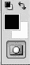](https://www.sitepoint.com/wp-content/uploads/2012/03/Step-9.png)

开始画模特的脸，确保不要超过头发，嘴唇，鼻孔或眼睛，完成后应该是这样的。

[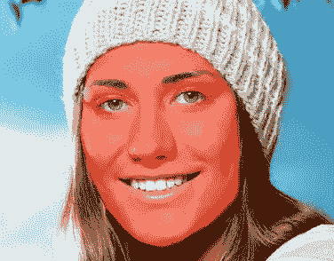](https://www.sitepoint.com/wp-content/uploads/2012/03/step-9-1.png)

### 步骤 10:面部选择和复制

由于快速蒙版工具，现在我们已经完成了脸部的绘制，按下键盘上的“Q ”(或者点击快速蒙版图标),这样你的脸就被选中了。

[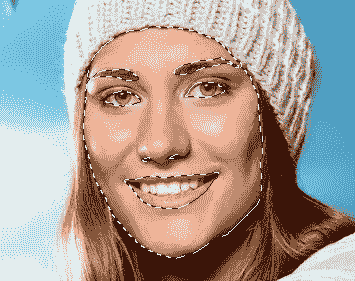](https://www.sitepoint.com/wp-content/uploads/2012/03/step-10.png)

去你顶部的工具栏，点击“选择”>“反转”(或者 Shift+Ctrl+“I”)，然后复制你的选择。确保你的选择被复制，粘贴到你的层菜单两次，命名为底部层“平滑”和顶部复制层“纹理”

[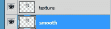](https://www.sitepoint.com/wp-content/uploads/2012/03/step-10-1.png)

### 步骤 11:平滑

关闭你的“纹理”层，在图层窗口中选择“平滑”层。正如我之前提到的，我们只是想稍微平滑面部以融入肤色，但我们不想过度。很多人只是选择面部并使用高斯模糊，这并不总是产生最令人满意的结果。今天，我们不打算这样做；我们将使用一种技术，与专业修图中常用的减淡和加深方法相比，这种技术看起来更好，花费的时间更少。也就是说，进入“滤镜”>“模糊”>“表面模糊”，当窗口弹出时，将半径更改为 9 左右，将阈值更改为 27。然后。单击“确定”

[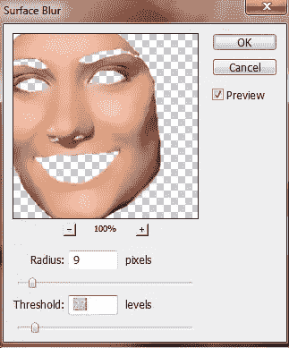](https://www.sitepoint.com/wp-content/uploads/2012/03/step-11.png)

正如你所看到的，模特脸部的肤色很好地融合在一起，消除了斑点变色以及照明和身体位置产生的不必要的阴影。这正是我们想要的。

[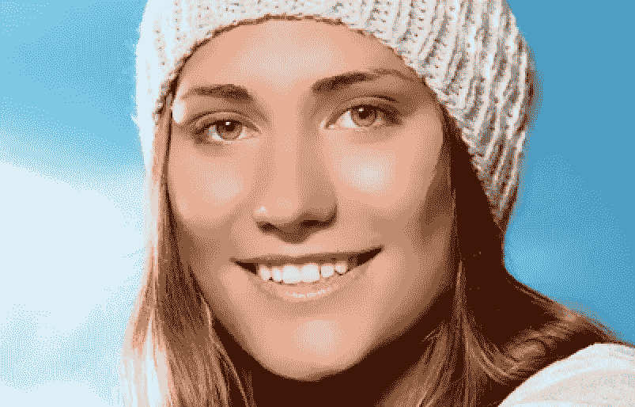](https://www.sitepoint.com/wp-content/uploads/2012/03/step-11-1.png)

### 步骤 12:纹理

就像我之前提到的，当涉及到清洁和平滑皮肤时，许多 Photoshop 用户只会使用高斯模糊滤镜，最终得到一张看起来不太正确的过度平滑的脸。我们需要记住，即使完美的皮肤仍然有毛孔，这就是为什么我们包括这个纹理层。打开纹理层，不透明度降低到 50%。你的模特的脸应该已经从轻微到光滑到自然，清晰的皮肤，如下图所示。

[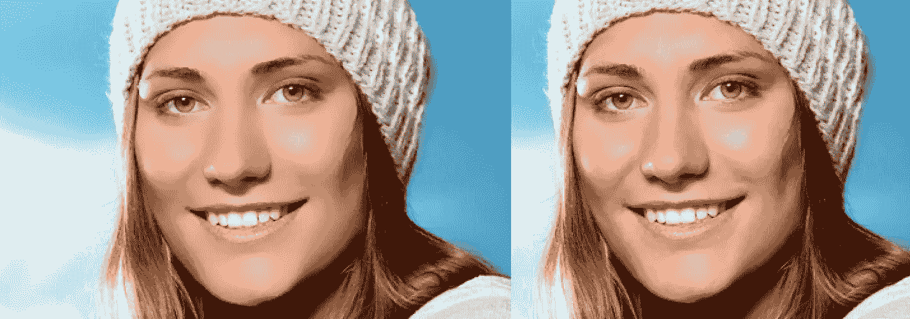](https://www.sitepoint.com/wp-content/uploads/2012/03/step-12.png)

### 步骤 13:皮肤的其余部分

我们刚刚完成了面部，在我们进入任何其他部分之前，让我们完成主体的其余皮肤，包括手臂和脖子。使用斑点修复刷和快速蒙版工具，并利用步骤 10-12 中涵盖的相同技术，使照片中的所有皮肤都具有相同的清晰，自然的外观。你可能需要调整平滑层和纹理层的不透明度。对于我的新平滑层，我将不透明度降低到 69%，并将纹理层的不透明度降低到 48%。

[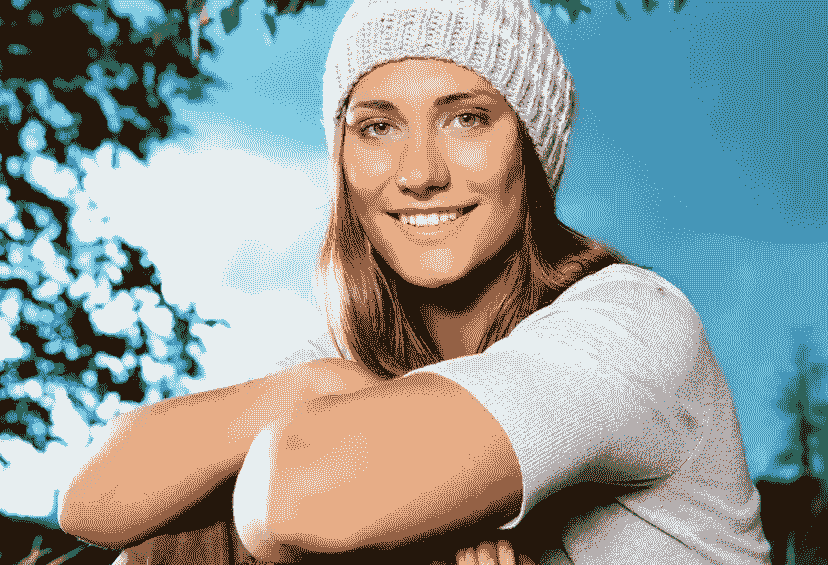](https://www.sitepoint.com/wp-content/uploads/2012/03/step-13.jpg)

### 步骤 14:对象移除

现在我们终于完成了所有的皮肤，我们需要移除模特肩膀上的蚊子。为了去除蚊子，只需创建一个新层，并选择你的斑点愈合刷工具。在工具栏的顶部，确保选择了“近似匹配”和“采样所有图层”。

一旦你检查了所有的设置，只需点击新图层上的蚊子就可以移除它。

[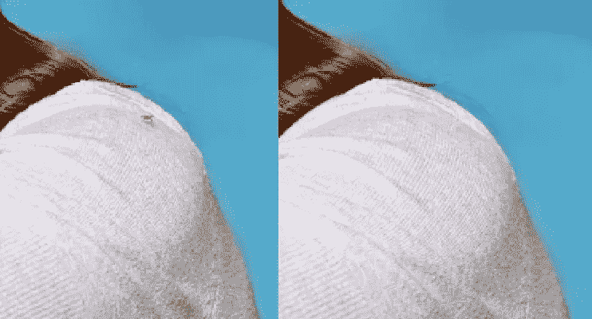](https://www.sitepoint.com/wp-content/uploads/2012/03/step14.png)

### 步骤 15:色调变化(可选)

从技术上来说，你已经完成了对图片的修饰，优化了颜色，保持了自然的外观。但是，如果你想让这张照片更进一步，你可以随时调整你的曲线和水平，以改变整个作品的色调。我调整了曲线和级别，结果如下所示:

[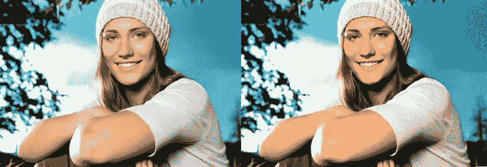](https://www.sitepoint.com/wp-content/uploads/2012/03/step15.jpg)

### 结论

学习提高和优化你的摄影并不像有些人想象的那么难；一点点练习会有很大帮助。我鼓励每个人练习这些技巧，并为自然修饰照片创建自己舒适的工作流程。记住，在 Photoshop 中做任何事情都没有唯一正确的方法；如果适合我正在处理的图像，我会偶尔改变方法。尝试不同的照片，包括风景和其他非人类的摄影。当然，玩得开心！

## 分享这篇文章