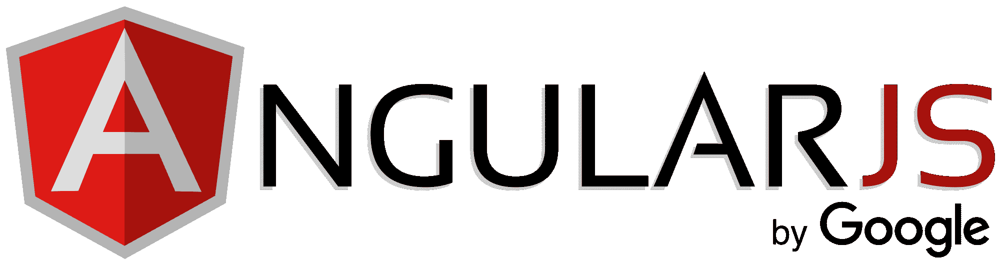
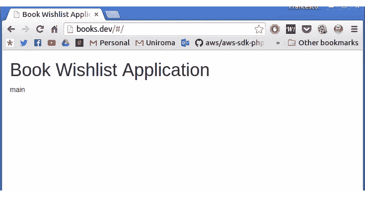
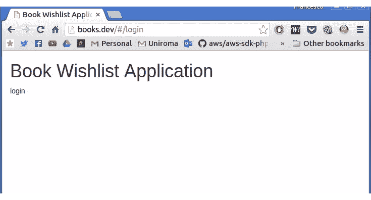
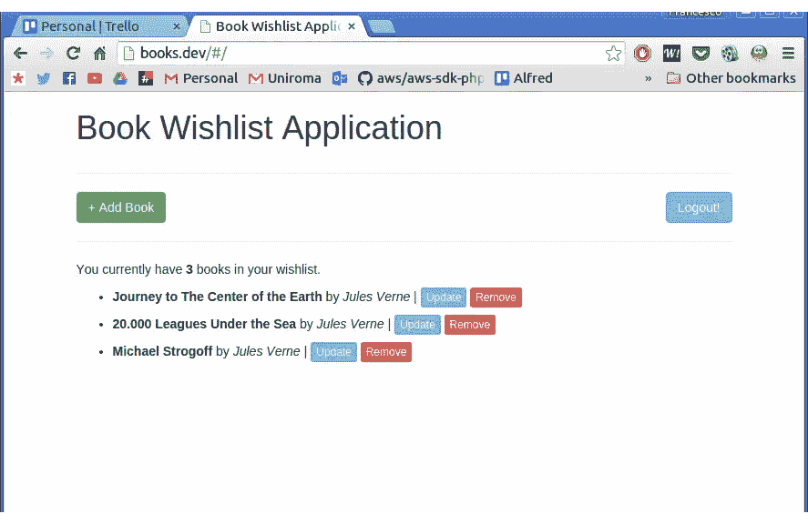

# 如何用 AngularJS 消费 Laravel API

> 原文：<https://www.sitepoint.com/how-to-consume-laravel-api-with-angularjs/>

在第 1 部分中，我们构建了服务器部分。现在我们可以建立我们的客户。我们要用 AngularJS 做一个*单页应用*。我们将使用一个非常基本的动态构建的引导模板。



## 规划

我们的应用程序将由三个屏幕组成。

*   **登录屏幕**:简单的登录屏幕。用户将插入他们的电子邮件和密码。如果出现问题，将会显示一个错误。否则，用户将被重定向到**主屏幕**。他们还可以点击“注册”链接，打开**注册屏幕**；
*   **注册屏幕**:一个简单的注册屏幕，用于在应用程序中创建新帐户。指定所有必需的数据后，用户将自动登录；
*   **主屏幕**:主应用程序屏幕。从这里，用户将能够获得他们的书籍列表，添加新的标题，并更新和删除现有的；

## 准备基本的前端工作环境

我们需要计划在哪里放置我们的应用程序。我们可以为所欲为，但是对于本系列文章以及为了继续，一个非常简单的“集成”设置就可以了。

首先，我们将创建一个名为`index.blade.php`的基本 Laravel 刀片视图，它将“托管”应用程序。前端依赖将由**鲍尔**处理，已经包含在[家园改善](https://www.sitepoint.com/quick-tip-get-homestead-vagrant-vm-running/)中。另一个切换到虚拟机的好理由，如果你还没有这样做的话。

让我们准备一下我们的基本观点。在终端中，我们转到项目的`public`文件夹，依次键入:

```
bower install jquery bootstrap angular angular-route angular-local-storage restangular 
```

我们已经知道了前三个元素:`jquery`、`bootstrap`和`angular`。第四个，`angular-route`，将被用作我们的单页面应用程序的*路由器*。第五个，`angular-local-storage`，将用于本地存储我们的认证令牌。我们将使用最后一个工具`restangular`，在 Angular 中创建一个“资源”，它将通过 HTTP 请求直接与我们的服务器通信。

现在让我们回到拉勒维尔。让我们转到`app/Http/routes.php`文件并添加这个条目:

```
Route::get('/', function () {
    return view('index');
}); 
```

其他条目可以删除。

**注意:**不要混淆`routes.php`档和`api_routes.php`档。

让我们构建将要使用的刀片模板，并在`resources/views`中创建一个名为`index.blade.php`的新文件。

```
<!DOCTYPE html>
<html lang="en">
    <head>
        <meta charset="utf-8">
        <meta http-equiv="X-UA-Compatible" content="IE=edge">
        <meta name="viewport" content="width=device-width, initial-scale=1">

        <title>Book Wishlist Application</title>

        <link href="bower_components/bootstrap/dist/css/bootstrap.min.css" rel="stylesheet">

        <script src="bower_components/angular/angular.min.js"></script>
        <script src="bower_components/lodash/lodash.min.js"></script>
        <script src="bower_components/angular-route/angular-route.min.js"></script>
        <script src="bower_components/angular-local-storage/dist/angular-local-storage.min.js"></script>
        <script src="bower_components/restangular/dist/restangular.min.js"></script>

        <style> li {
                padding-bottom: 8px;
            } </style>
    </head>

    <body>
        <div class="container">
            <div class="row">
                <div class="col-md-12">
                    <h1>Book Wishlist Application</h1>
                </div>
            </div>
        </div>

        <script src="bower_components/jquery/dist/jquery.min.js"></script>
        <script src="bower_components/bootstrap/dist/js/bootstrap.min.js"></script>
    </body>
</html> 
```

在这个文件中，我们可以找到我们需要的一切。

## 基本路由

我们将从前两个屏幕开始:**登录**屏幕和**注册**屏幕。这将涉及到我们的角路由器。基本原理与 Laravel 路由过程非常相似:我们将某个“屏幕”分配给某个路由。

对于每一个屏幕，我们将建立一个角度控制器。这个控制器将处理每一个逻辑操作，把表示的责任留给视图。

让我们在`public`中创建一个名为`js`的文件夹。然后，我们会在里面制作一个新的`app.js`文件。它将是我们主要的单页应用程序文件:

```
var bookWishlistApp = angular.module('bookWishlistApp', [
  'ngRoute',
  'bookWishlistAppControllers'
]);

bookWishlistApp.config(['$routeProvider', function($routeProvider) {

    $routeProvider.
    when('/login', {
        templateUrl: 'partials/login.html',
        controller: 'LoginController'
    }).
    when('/signup', {
        templateUrl: 'partials/signup.html',
        controller: 'SignupController'
    }).
    when('/', {
        templateUrl: 'partials/index.html',
        controller: 'MainController'
    }).
    otherwise({
        redirectTo: '/'
    });

}]); 
```

我们正在定义应用程序的路由结构。如你所见，我们有三条可能的路线。

*   `/login`路线，用于登录屏幕；
*   `/signup`路线，用于注册屏幕；
*   `/`，用于主应用程序屏幕；

在文件的顶部声明模块，我们注入了两个依赖项。第一个是`ngRoute`，用于路由功能。第二个是`bookWishlistAppControllers`，这个模块将包含我们所有的应用控制器。

让我们在同一个文件夹中创建另一个文件，命名为`controllers.js`。

```
var bookWishlistAppControllers = angular.module('bookWishlistAppControllers', []);

bookWishlistAppControllers.controller('LoginController', ['$scope', '$http', function ($scope, $http) {

}]);

bookWishlistAppControllers.controller('SignupController', ['$scope', '$http', function ($scope, $http) {

}]);

bookWishlistAppControllers.controller('MainController', ['$scope', '$http', function ($scope, $http) {

}]); 
```

如我们所见，它们现在都是空的。我们稍后将填写它们。现在，我们只想测试我们的路由系统。

让我们在`public`中创建另一个文件夹:`partials`。我们将在里面放置三个文件:`index.html`、`login.html`和`signup.html`。现在，在它们中的每一个里面，只放置一些演示文本。

在`index.html`中插入:

```
<p>main screen</p> 
```

在`login.html`中:

```
 <p>login screen</p> 
```

…在`signup.html`中:

```
 <p>signup screen</p> 
```

我们现在改变我们的刀片视图:

```
<!DOCTYPE html>
<html lang="en" ng-app="bookWishlistApp">
    <head>
        <meta charset="utf-8">
        <meta http-equiv="X-UA-Compatible" content="IE=edge">
        <meta name="viewport" content="width=device-width, initial-scale=1">

        <title>Book Wishlist Application</title>

        <link href="bower_components/bootstrap/dist/css/bootstrap.min.css" rel="stylesheet">

        <script src="bower_components/angular/angular.min.js"></script>
        <script src="bower_components/lodash/lodash.min.js"></script>
        <script src="bower_components/angular-route/angular-route.min.js"></script>
        <script src="bower_components/angular-local-storage/dist/angular-local-storage.min.js"></script>
        <script src="bower_components/restangular/dist/restangular.min.js"></script>

        <script src="js/app.js"></script>
        <script src="js/controllers.js"></script>

        <style> li {
                padding-bottom: 8px;
            } </style>
    </head>

    <body>

        <div class="container">
            <div class="row">
                <div class="col-md-12">
                    <h1>Book Wishlist Application</h1>
                </div>
            </div>

            <div ng-view></div>
        </div>

        <script src="bower_components/jquery/dist/jquery.min.js"></script>
        <script src="bower_components/bootstrap/dist/js/bootstrap.min.js"></script>
    </body>
</html> 
```

我们在`html`元素中添加了`ng-app="bookWishlistApp"`属性，并将`ng-view`属性添加到新的`div`元素中。这将是我们偏题的“容器”。

我们还需要添加

```
<script src="js/app.js"></script>
<script src="js/controllers.js"></script> 
```

行，用于加载主 app 文件和将作为依赖项注入的`bookWishlistAppControllers`模块。

如果我们测试它，这就是我们将看到的:



角度路由组件自动将`/#/`添加到 URL。现在，如果我们手动将`login`添加到字符串中，我们将得到如下结果:



耶！我们的路由运行良好。

## 注册和登录

为了构建登录和注册屏幕，我们将在一个单独的`userService`中封装一些用户访问相关的逻辑。

让我们在`public/js`中创建一个新文件，并将其命名为`services.js`:

```
var bookWishlistAppServices = angular.module('bookWishlistAppServices', [
    'LocalStorageModule'
]);

bookWishlistAppServices.factory('userService', ['$http', 'localStorageService', function($http, localStorageService) {

    function checkIfLoggedIn() {

        if(localStorageService.get('token'))
            return true;
        else
            return false;

    }

    function signup(name, email, password, onSuccess, onError) {

        $http.post('/api/auth/signup', 
        {
            name: name,
            email: email,
            password: password
        }).
        then(function(response) {

            localStorageService.set('token', response.data.token);
            onSuccess(response);

        }, function(response) {

            onError(response);

        });

    }

    function login(email, password, onSuccess, onError){

        $http.post('/api/auth/login', 
        {
            email: email,
            password: password
        }).
        then(function(response) {

            localStorageService.set('token', response.data.token);
            onSuccess(response);

        }, function(response) {

            onError(response);

        });

    }

    function logout(){

        localStorageService.remove('token');

    }

    function getCurrentToken(){
        return localStorageService.get('token');
    }

    return {
        checkIfLoggedIn: checkIfLoggedIn,
        signup: signup,
        login: login,
        logout: logout,
        getCurrentToken: getCurrentToken
    }

}]); 
```

我们使用基本的 Angular `$http`功能来进行一些 HTTP 调用。更准确地说，我们实现了:

*   检查令牌是否实际存在的`checkIfLoggedIn`方法；
*   一个`signup`方法，以名字、电子邮件和密码作为参数。如果注册过程进展顺利，令牌会自动存储在本地存储器中，以备使用；
*   一种`login`方法，以电子邮件和密码作为参数。如果一切顺利，一个令牌存储在本地存储中；
*   删除存储令牌的`logout`方法；
*   一个`getCurrentToken`方法，用于获取实际存储的令牌。我们将在以后使用它，当向我们的 API 的受保护端点发出请求时；

显然，我们也必须将这个文件添加到主刀片视图:`resources/views/index.blade.php`。

```
<script src="js/app.js"></script>
<script src="js/controllers.js"></script>
<script src="js/services.js"></script> 
```

现在我们有了服务，我们可以从注册屏幕开始。这将是一个非常简单的:只有一个欢迎文本，三个文本框和一个提交按钮。

先从景色说起吧。我们将打开`public/partials/signup.html`并添加:

```
<div class="row">
    <div class="col-md-4 col-md-offset-4">
        <h2>Signup</h2>
        <p>Welcome! If you want to sign up to our awesome service, fill this form and press on "Signup"!</p>

        <hr>

        <p><input type="text" class="form-control" placeholder="Name..." ng-model="name" required /></p>
        <p><input type="text" class="form-control" placeholder="Email Address..." ng-model="email" required /></p>
        <p><input type="password" class="form-control" placeholder="Password..." ng-model="password" required /></p>

        <hr>

        <p><button type="button" class="btn btn-success form-control" ng-click="signup()">Signup</button></p>

        <hr>

        <p><a href="#login">Already signed up? <b>Log in!</b></a></p>
    </div>
</div> 
```

使用按钮中的`ng-click`，我们将调用控制器的`signup()`方法。

现在，让我们打开`js/controllers.js`文件并用

```
bookWishlistAppControllers.controller('SignupController', ['$scope', '$location', 'userService', function ($scope, $location, userService) {

    $scope.signup = function() {
        userService.signup(
            $scope.name, $scope.email, $scope.password,
            function(response){
                alert('Great! You are now signed in! Welcome, ' + $scope.name + '!');
                $location.path('/');
            },
            function(response){
                alert('Something went wrong with the signup process. Try again later.');
            }
        );
    }

    $scope.name = '';
    $scope.email = '';
    $scope.password = '';

    if(userService.checkIfLoggedIn())
        $location.path('/');

}]); 
```

我们来解释一下。

首先我们制作了`signup`方法。由于这是一个已经很长的教程，我们跳过了表单验证。它唯一做的就是调用我们刚刚创建的`userService`的`signup`方法。如果一切正常，它会显示一个警告，并将用户重定向到主应用程序屏幕。

**注意:**不要忘记注册方法已经在存储器中保存了我们的令牌。这就是为什么如果操作成功，我们会立即重定向用户。

最后，我们做一个非常基本的登录检查:

```
 if(userService.checkIfLoggedIn())
        $location.path('/'); 
```

如果令牌已经存在，用户将被自动重定向到主页。

登录页面将非常相似。我们来编辑一下`public/partials/login.html`:

```
<div class="row">
    <div class="col-md-4 col-md-offset-4">
        <h2>Login</h2>
        <p>Welcome! Use this form to log into your application.</p>

        <hr>

        <p><input type="text" class="form-control" placeholder="Email Address..." ng-model="email" required /></p>
        <p><input type="password" class="form-control" placeholder="Password..." ng-model="password" required /></p>

        <hr>

        <p><button type="button" class="btn btn-success form-control" ng-click="login()">Login</button></p>

        <hr>

        <p><a href="#signup">First time here? <b>Sign up!</b></a></p>
    </div>
</div> 
```

我们现在将在`LoginController`中创建一个`login()`方法。打开`public/js/controllers.js`，添加:

```
bookWishlistAppControllers.controller('LoginController', ['$scope', '$http', '$location', 'userService', function ($scope, $http, $location, userService) {

    $scope.login = function() {
        userService.login(
            $scope.email, $scope.password,
            function(response){
                $location.path('/');
            },
            function(response){
                alert('Something went wrong with the login process. Try again later!');
            }
        );
    }

    $scope.email = '';
    $scope.password = '';

    if(userService.checkIfLoggedIn())
        $location.path('/');

}]); 
```

我们再次使用了`userService` `login()`的方法。如果一切顺利，用户将被重定向到主页面。否则，会显示错误警告。

## 图书管理

我们要做的最后一件事是实现图书管理部分。我们将在`MainController`中做所有的事情，从显示列表和创建过程，到更新和删除。

同样，我们将构建一个服务来满足我们对书籍持久性的所有需求——类似于一个知识库。在`public/js/services.js`中，我们添加了一个新的服务:`bookService`。

```
bookWishlistAppServices.factory('bookService', ['Restangular', 'userService', function(Restangular, userService) {

    function getAll(onSuccess, onError){
        Restangular.all('api/books').getList().then(function(response){

            onSuccess(response);

        }, function(){

            onError(response);

        });
    }

    function getById(bookId, onSuccess, onError){

        Restangular.one('api/books', bookId).get().then(function(response){

            onSuccess(response);

        }, function(response){

            onError(response);

        });

    }

    function create(data, onSuccess, onError){

        Restangular.all('api/books').post(data).then(function(response){

            onSuccess(response);

        }, function(response){

            onError(response);

        });

    }

    function update(bookId, data, onSuccess, onError){

        Restangular.one("api/books").customPUT(data, bookId).then(function(response) {

                onSuccess(response);

            }, function(response){

                onError(response);

            }
        );

    }

    function remove(bookId, onSuccess, onError){
        Restangular.one('api/books/', bookId).remove().then(function(){

            onSuccess();

        }, function(response){

            onError(response);

        });
    }

    Restangular.setDefaultHeaders({ 'Authorization' : 'Bearer ' + userService.getCurrentToken() });

    return {
        getAll: getAll,
        getById: getById,
        create: create,
        update: update,
        remove: remove
    }

}]); 
```

**注意:**别忘了添加`restangular`作为模块依赖。

正如我们所见， **Restangular** 用于处理 API 端点。更准确地说，我们有五种方法。

*   一个`getAll`方法，为当前用户检索完整的图书列表；
*   一个`getById`方法，在给定 id 的情况下检索特定的书籍；
*   一个`create`方法，存储一本新书；
*   一个`update`方法，在给定 id 的情况下更新一个现有的方法；
*   一个`remove`方法，在给定 id 的情况下，从列表中删除现有的图书；

在这个服务中，我们也使用我们已经有的`userService`的`getCurrentToken`方法来处理标题和它们的设置。

**注意:**有一点值得注意的是自定义更新方法的存在。通常，更新流程由两个步骤组成。获取实体，然后更新它。这里我们已经有了一个`getById`方法，所以我们不需要`get`部分，因为我们已经知道了图书 id。通过使用`customPUT`,我们设法构建了更新过程的“替代”版本，而不需要额外调用 API 服务。

我们可以从展示清单开始。`public/partials/index.html`:

```
<hr>

<div class="pull-right"><button type="button" class="btn btn-info" ng-click="logout()">Logout!</button></div>

<div class="clearfix"></div>

<hr>

<div class="row">
    <div class="col-md-12">
        <p>You currently have <b>{{ books.length }}</b> books in your wishlist.</p>
        <ul>
            <li ng-repeat="book in books">
                <b>{{ book.title }}</b> by <i>{{ book.author_name }}</i>
            </li>
        </ul>
    </div>
</div> 
```

在第一个模板中，我们只是显示一个图书列表。为了检索我们的数据，我们将在控制器中创建一个`refresh`方法。在调用`userService`中同名方法的`controllers.js` `logout`方法中，我们将这段代码添加到`MainController`中:

```
bookWishlistAppControllers.controller('MainController', ['$scope', '$location', 'userService', 'bookService', function ($scope, $location, userService, bookService) {

    $scope.logout = function(){
        userService.logout();
        $location.path('/login');
    }

    $scope.refresh = function(){

        bookService.getAll(function(response){

            $scope.books = response;

        }, function(){

            alert('Some errors occurred while communicating with the service. Try again later.');

        });

    }

    if(!userService.checkIfLoggedIn())
        $location.path('/login');

    $scope.books = [];

    $scope.refresh();

}]); 
```

我们添加了两个方法:`logout`调用`userService`中同名的方法，以及`refresh`。后者调用`booksService`中的`getAll`方法。然后，它将结果分配给已经绑定到视图的`$scope.books`变量。如果出现问题，就会显示错误。

现在我们必须实现图书创作功能。为此，让我们回到我们的`public/partials/index.html`观点。让我们添加一个用于添加新书的模态，以及一个用于切换新书的按钮。

```
<hr>

<div class="pull-left"><button type="button" class="btn btn-success" data-toggle="modal" data-target="#addBookModal">+ Add Book</button></div>
<div class="pull-right"><button type="button" class="btn btn-info" ng-click="logout()">Logout!</button></div>
<div class="clearfix"></div>

<hr>

<div class="row">
    <div class="col-md-12">
        <p>You currently have <b>{{ books.length }}</b> books in your wishlist.</p>
        <ul>
            <li ng-repeat="book in books">
                <b>{{ book.title }}</b> by <i>{{ book.author_name }}</i>
            </li>
        </ul>
    </div>
</div>

<div class="modal fade" id="addBookModal">
  <div class="modal-dialog">
    <div class="modal-content">
      <div class="modal-header">
        <button type="button" class="close" data-dismiss="modal" aria-label="Close"><span aria-hidden="true">&times;</span></button>
        <h4 class="modal-title">Add a Book</h4>
      </div>
      <div class="modal-body">
        <p><input class="form-control" ng-model="currentBookTitle" placeholder="Title..." type="text"></p>
        <p><input class="form-control" ng-model="currentBookAuthorName" placeholder="Author Name..." type="text"></p>
        <p><input class="form-control" ng-model="currentBookPagesCount" placeholder="Pages Count..." type="text"></p>
      </div>
      <div class="modal-footer">
        <button type="button" class="btn btn-default" data-dismiss="modal">Close</button>
        <button type="button" class="btn btn-primary" ng-click="create()">Save Book</button>
      </div>
    </div><!-- /.modal-content -->
  </div><!-- /.modal-dialog -->
</div><!-- /.modal --> 
```

现在，让我们回到`MainController`并实现`create`方法:

```
bookWishlistAppControllers.controller('MainController', ['$scope', '$location', 'userService', 'bookService', function ($scope, $location, userService, bookService) {

    $scope.logout = function(){
        userService.logout();
        $location.path('/login');
    }

    $scope.create = function(){

        bookService.create({
            title: $scope.currentBookTitle,
            author_name: $scope.currentBookAuthorName,
            pages_count: $scope.currentBookPagesCount
        }, function(){

            $('#addBookModal').modal('toggle');
            $scope.currentBookReset();
            $scope.refresh();

        }, function(){

            alert('Some errors occurred while communicating with the service. Try again later.');

        });

    }

    $scope.refresh = function(){

        bookService.getAll(function(response){

            $scope.books = response;

        }, function(){

            alert('Some errors occurred while communicating with the service. Try again later.');

        });

    }

    $scope.currentBookReset = function(){
        $scope.currentBookTitle = '';
        $scope.currentBookAuthorName = '';
        $scope.currentBookPagesCount = '';
    }

    if(!userService.checkIfLoggedIn())
        $location.path('/login');

    $scope.books = [];

    $scope.currentBookReset();
    $scope.refresh();

}]); 
```

我们的控制器变大了:我们可以看到`create`，以及重置所有作用域变量的`currentBookReset`方法。`create`法明显是用了`bookService`的`create`法。该应用程序现在应该已经运行良好！

我们仍然需要实现书籍的更新和删除。让我们从更简单的开始，即`remove`方法。

在`public/partials/index.html`中，我们在角度中继器中添加了一个删除按钮，它将调用`MainController`中的`remove`方法:

```
<ul>
    <li ng-repeat="book in books">
        <b>{{ book.title }}</b> by <i>{{ book.author_name }}</i> | 
        <button ng-click="delete(book.id)" class="btn btn-danger btn-xs">Delete</button>
    </li>
</ul> 
```

然后我们将`remove`方法添加到`MainController`中:

```
$scope.remove = function(bookId){

    if(confirm('Are you sure to remove this book from your wishlist?')){
        bookService.remove(bookId, function(){

            alert('Book removed successfully.');

        }, function(){

            alert('Some errors occurred while communicating with the service. Try again later.');

        });
    }

} 
```

`bookService`将会完成它的工作。如果出现问题，将向用户显示警报。

我们终于可以实现我们的更新功能，最后一个。在`public/partials/index.html`视图中，我们将为我们的 repeater 添加一个按钮。这次是一个蓝色的“信息”的。中继器现在看起来像这样:

```
<ul>
    <li ng-repeat="book in books">
        <b>{{ book.title }}</b> by <i>{{ book.author_name }}</i> | 
        <button ng-click="load(book.id)" class="btn btn-info btn-xs">Update</button>
        <button ng-click="remove(book.id)" class="btn btn-danger btn-xs">Remove</button>
    </li>
</ul> 
```

这是我们要添加的模态:

```
<div class="modal fade" id="updateBookModal">
  <div class="modal-dialog">
    <div class="modal-content">
      <div class="modal-header">
        <button type="button" class="close" data-dismiss="modal" aria-label="Close"><span aria-hidden="true">&times;</span></button>
        <h4 class="modal-title">Update a Book</h4>
      </div>
      <div class="modal-body">
        <input type="hidden" ng-model="currentBookId" />
        <p><input class="form-control" ng-model="currentBookTitle" placeholder="Title..." type="text"></p>
        <p><input class="form-control" ng-model="currentBookAuthorName" placeholder="Author Name..." type="text"></p>
        <p><input class="form-control" ng-model="currentBookPagesCount" placeholder="Pages Count..." type="text"></p>
      </div>
      <div class="modal-footer">
        <button type="button" class="btn btn-default" data-dismiss="modal">Close</button>
        <button type="button" class="btn btn-primary" ng-click="update()">Save Changes</button>
      </div>
    </div><!-- /.modal-content -->
  </div><!-- /.modal-dialog -->
</div><!-- /.modal --> 
```

我们还需要在控制器中使用一些方法。回到`MainController`我们补充:

```
$scope.load = function(bookId){

    bookService.getById(bookId, function(response){

        $scope.currentBookId = response.book.id;
        $scope.currentBookTitle = response.book.title;
        $scope.currentBookAuthorName = response.book.author_name;
        $scope.currentBookPagesCount = response.book.pages_count;

        $('#updateBookModal').modal('toggle');

    }, function(){

        alert('Some errors occurred while communicating with the service. Try again later.');

    });

}

$scope.update = function(){

    bookService.update(
        $scope.currentBookId, 
        {
            title: $scope.currentBookTitle,
            author_name: $scope.currentBookAuthorName,
            pages_count: $scope.currentBookPagesCount
        }, 
        function(response){

            $('#updateBookModal').modal('toggle');
            $scope.currentBookReset();
            $scope.refresh();

        }, function(response){
            alert('Some errors occurred while communicating with the service. Try again later.');
        }
    );
} 
```

`load`方法将从 API 中检索图书数据，并在模态中显示它。然后，在编辑过程之后，用户将点击“Save Changes”按钮，这将调用`update`方法。这个最后的方法将相应地调用`bookService`，使用 API 存储编辑内容。

我们的控制器，在它的最终形式中，[将看起来像这个](https://github.com/francescomalatesta/laravel-api-boilerplate-angular-example/blob/master/public/js/controllers.js)。

我们的应用程序现在完成了…我们可以使用它了！存储大量书籍的时间。



是的，我喜欢儒勒·凡尔纳。

## 结论

在本系列中，我们使用了两种不同的技术，以一种非常简单的方式构建了一个完整(复杂)的应用程序。感谢 Laravel API Boilerplate 和 Restangular 等工具，我们几乎完全专注于真正的业务逻辑，而不是浪费时间在引导上。

在这一部分中，我们看了如何为我们的 Laravel API 后端实现一个有角度的前端，从一无所有到一个完全成熟的应用程序。显然，旅程并没有到此结束:作为一个练习，我的建议是实现一个机制来检查令牌是否过期，并创建另一个机制来刷新它。

在以后的文章中，我们可能会查看各种不同的 JS 框架来实现相同的事情，并判断哪一个是最简单的。我们应该先试哪一个，有什么建议吗？

## 分享这篇文章