# 如何在 Photoshop 中创建粘性文本效果

> 原文：<https://www.sitepoint.com/how-to-create-a-gooey-text-effect-in-photoshop/>

在本教程中，我将教你如何在 Photoshop 中创建一个带有粘性飞溅的文本效果。

如果你已经对 Photoshop 有所了解的话，这个教程大概需要一个到一个半小时来完成。这种效果非常适合柑橘或糖果广告或海报。

## 试映

以下是您今天将整理的最终结果:

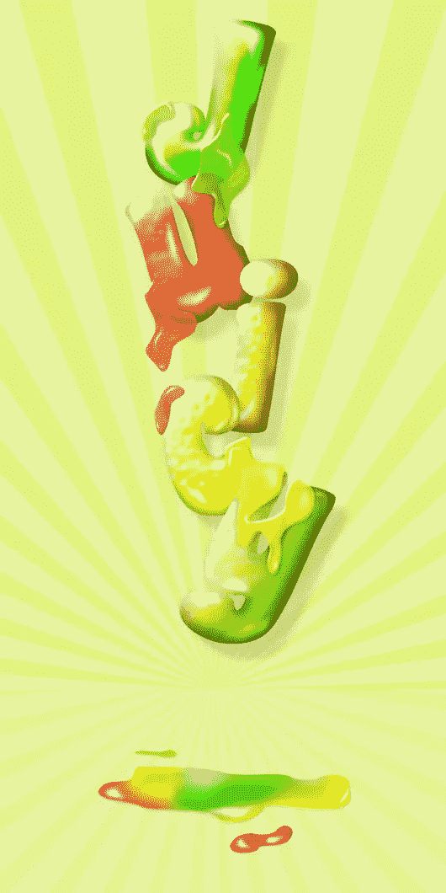

## 资源

对于本教程，您需要一些额外的资源。您可以通过以下链接获得它们:

*   [过山车](http://www.dafont.com/coaster.font)–达丰
*   [太阳爆刷](http://qbrushes.net/objects/risingsun-brushes/)–Brusheezy
*   [橙色皮肤图案](http://www.esterliquoridesign.com/blogdownload/textures/orange_out.jpg)–Brusheezy

### 第一步

在 Photoshop 中创建新文档。我的文档尺寸是 530 像素乘 1060 像素，分辨率为 72DPI。

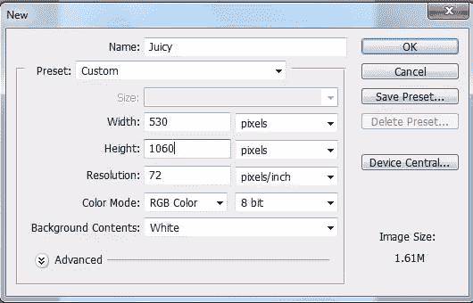

### 第二步

在你的背景层，填充#E6F39F。

### 第三步

使用你的太阳爆发刷，并把它们放在一个新的层。我用的颜色是#7ae008。

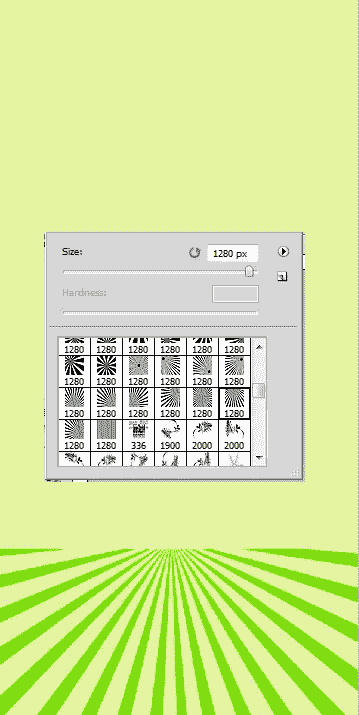

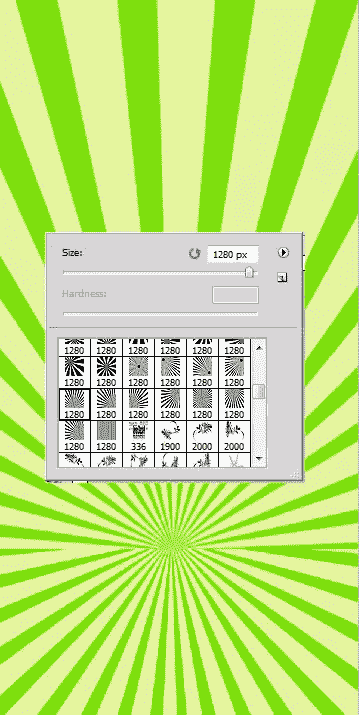

### 第四步

现在改变这一层颜色烧伤的不透明度为 22%

### 第五步

现在想出一个你想在本教程中使用的词。在本教程中，我将使用“多汁”这个词。让我们从字母“j”开始。我使用的字体是杯垫。字体现在可以是任何颜色，我们将会稍加改变。不要忘记使用自由变换工具来调整你的字母的角度。

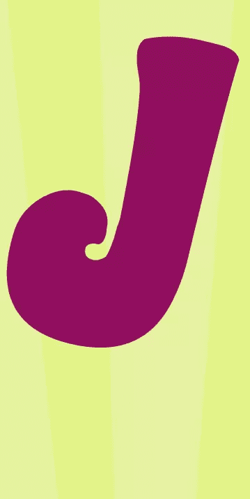

### 第六步

现在添加这些图层样式，双击这个图层。

**投影**

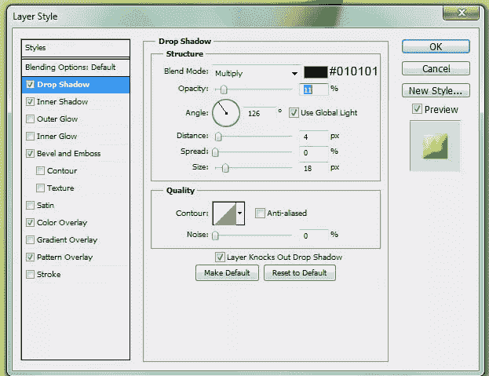

**内影**

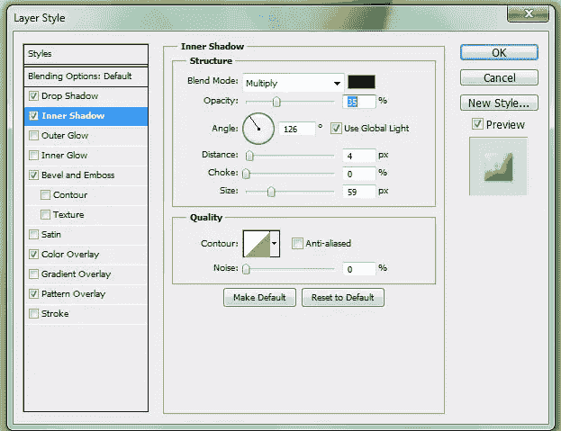

**斜面和浮雕**

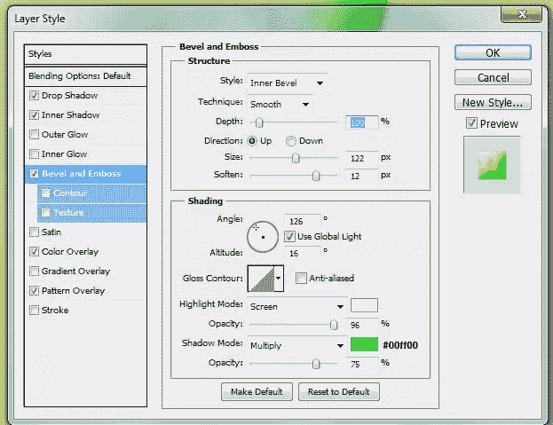

**颜色叠加**

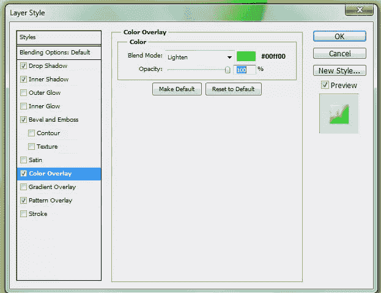

**图案叠加**

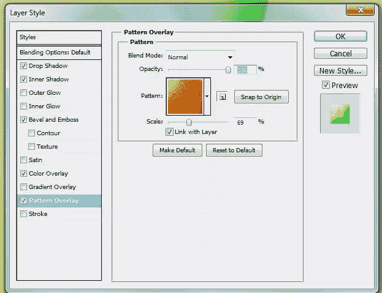

### 第七步

你的信应该是这样的

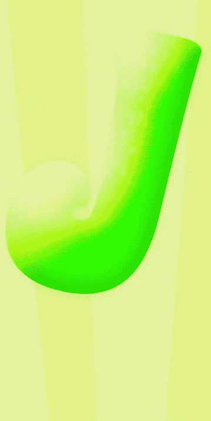

### 第八步

复制这个字母，把它放在原来的“J”层下面。将它向右移动几个像素，增加这个复制图层的阴影。

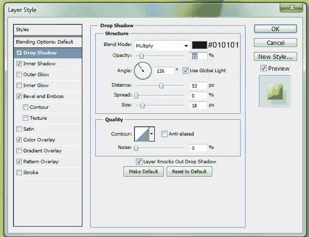

### 第九步

现在我们将为这封信添加一些阴影和高光。创建一个新层以上的两个“J”层。用软圆刷#595757 加深边缘。改变这一层颜色烧伤。

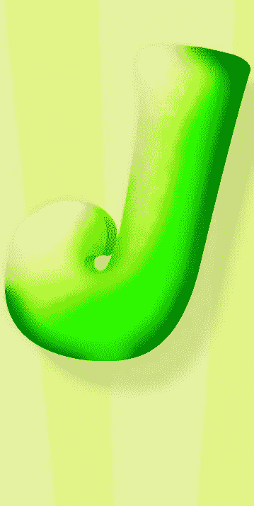

### 第十步

新建一个图层，使用#FFFFFF 软圆形笔刷。我使用 30-60px 的笔刷。

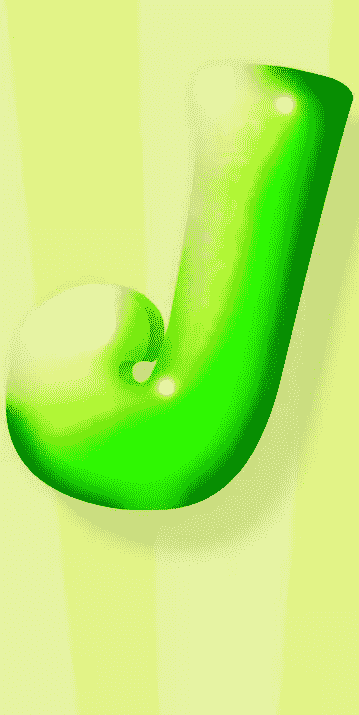

### 步骤 11

使用涂抹工具(44px，强度 50%)涂抹高光，如下图所示。

### 步骤 12

重复步骤 10，添加涂抹工具，但改变这一层覆盖。

### 第十三步

将与字母 J 相关的所有图层放在一个文件夹中是一个好主意，这样可以让所有东西都有条理。现在继续写剩下的字母。唯一不同的是每个字母的颜色覆盖和斜面浮雕层样式。我将放置这些图层样式的屏幕截图。字母 U 图层样式:

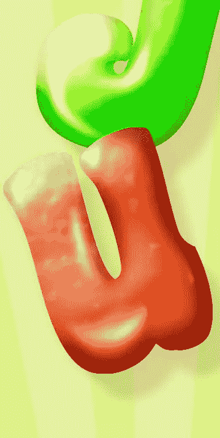

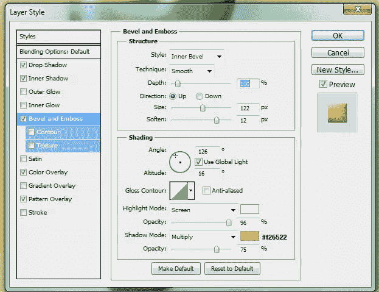

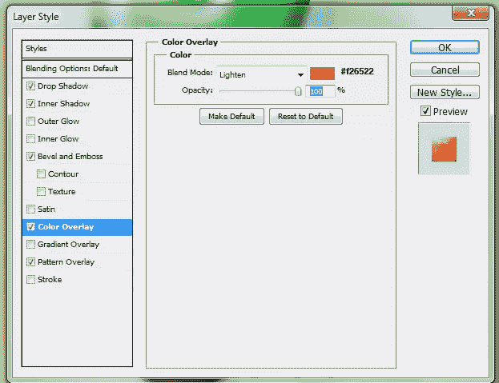

### 步骤 14

字母 I:

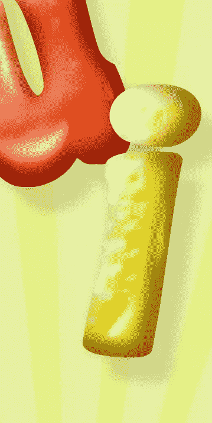

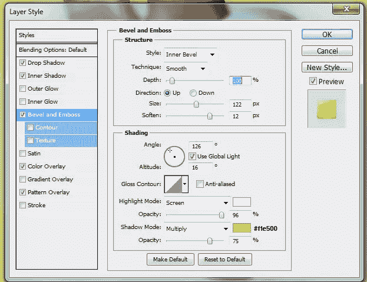

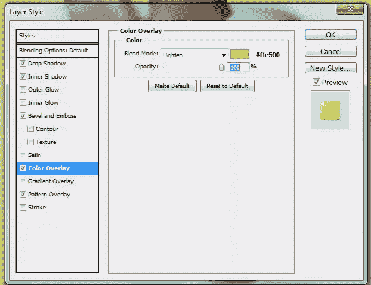

### 第十五步

字母 C:

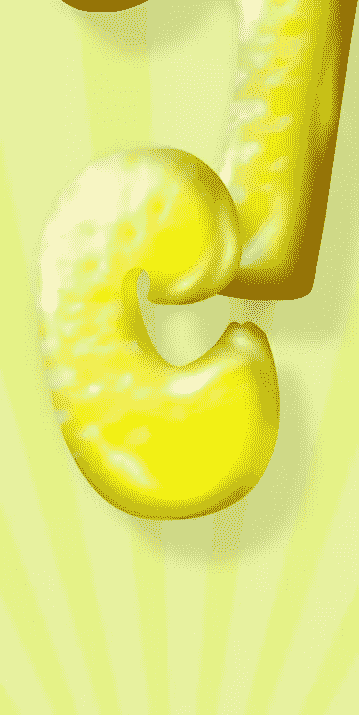

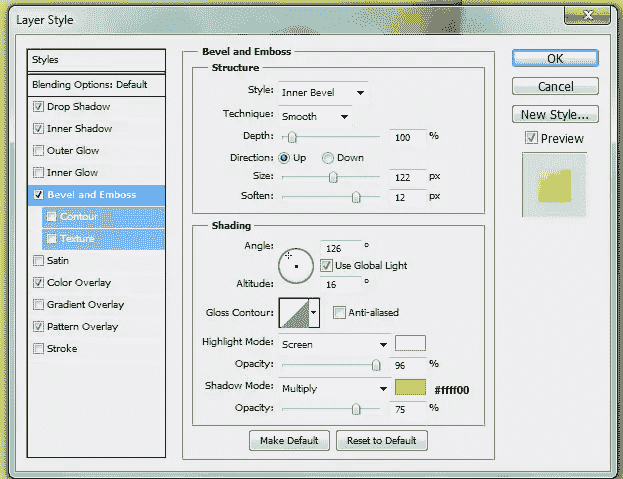

### 第十六步

字母 Y:

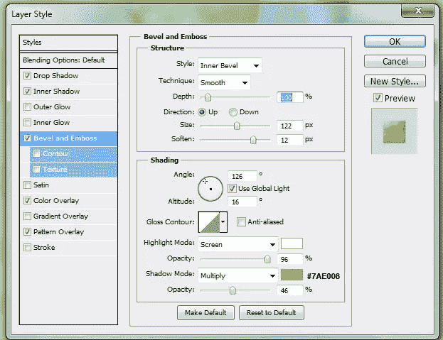

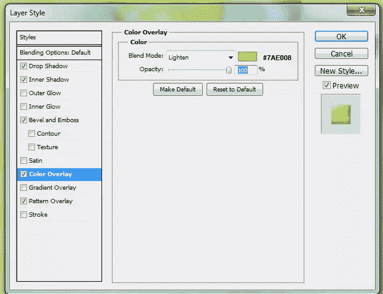

### 步骤 17

现在我们完成了字母，是时候创建软泥了。在你的“J”图层组上新建一个图层，选择钢笔工具，画一个圆形的飞溅，填充任意颜色。

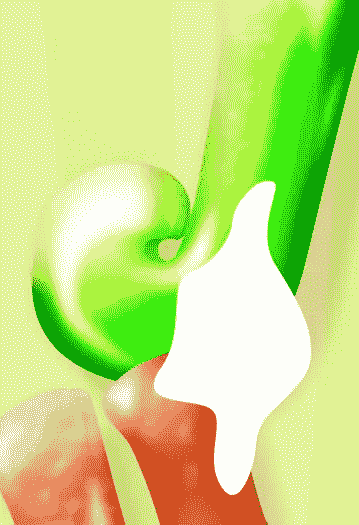

### 步骤 18

改变这个图层填充为 0%，并添加这些图层样式:

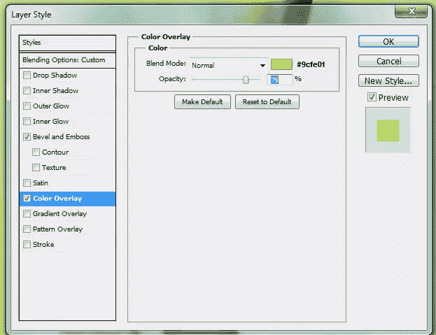

### 步骤 19

现在它应该是这样的:

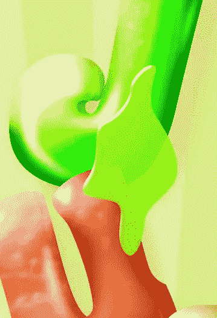

### 步骤 20

但是我们还没有完成。是时候添加一些高光和阴影了。结合使用浅色和深色软刷(不同的不透明度)，给软泥一种黏糊糊的感觉。不要忘记使用你的涂抹工具。

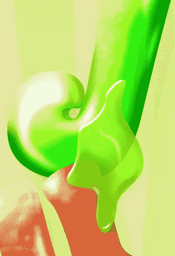

### 步骤 21

重复最后几个步骤，创建另一个。

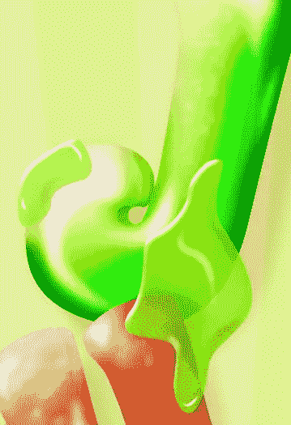

### 步骤 22

再补充几个:

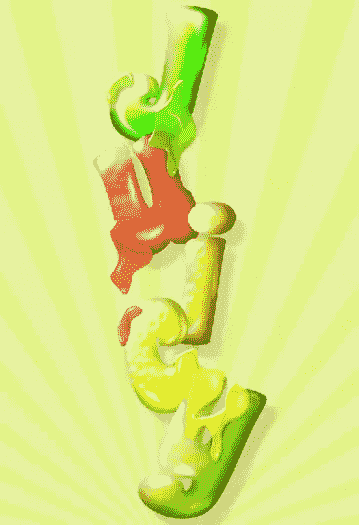

### 步骤 23

最后，我们将在底部留下一个水坑。拿起你的钢笔工具，画一个水坑的形状。选中我的水坑，我用了各种颜色，就像我的字母一样，来形成水坑。

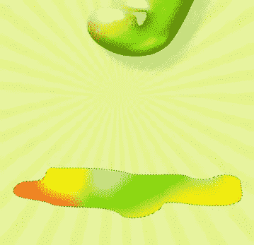

### 步骤 24

添加这些图层样式

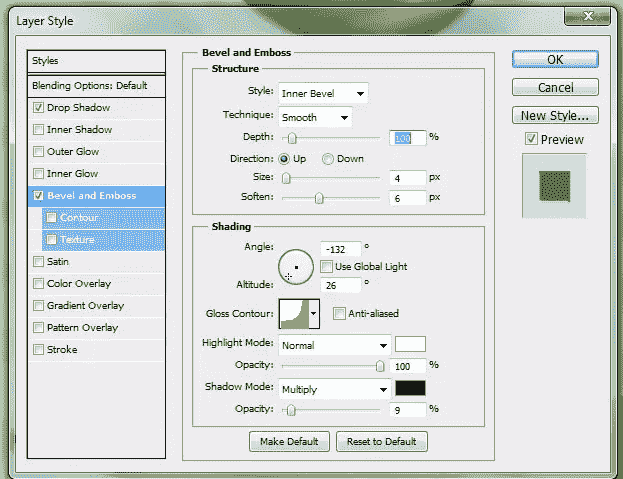

### 步骤 25

添加一些阴影和高光:

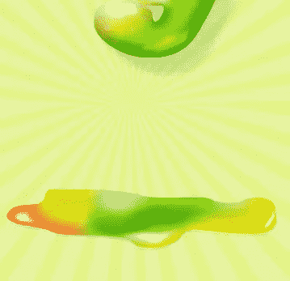

### 步骤 26

再加几个水坑:

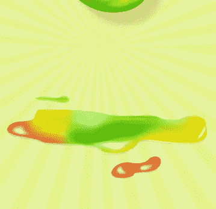

### 步骤 27

现在你完成了！

## 分享这篇文章