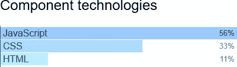
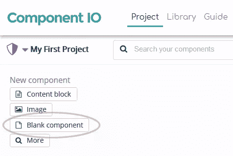
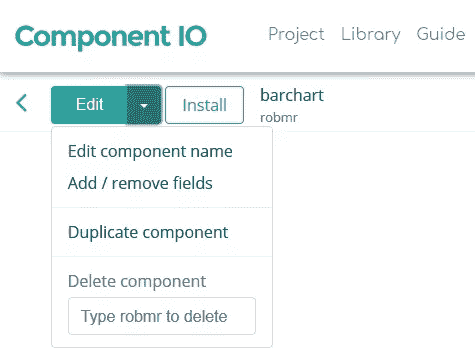
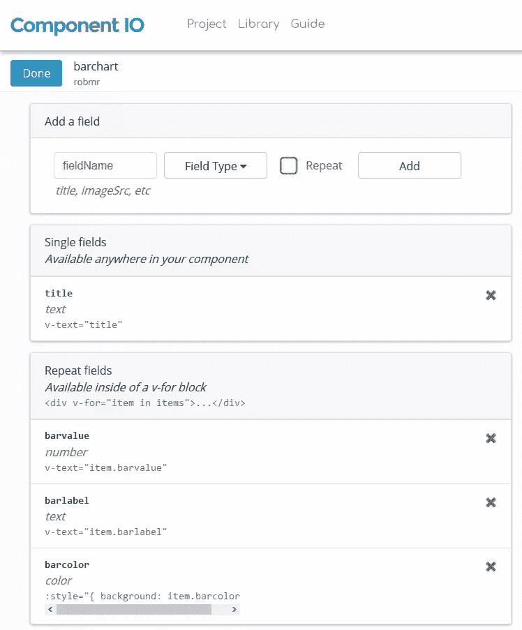
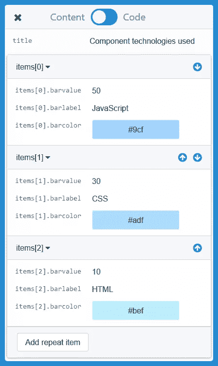
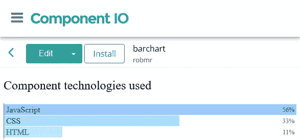

# 如何使用组件 IO 创建定制组件

> 原文：<https://www.sitepoint.com/how-to-create-custom-components-using-component-io/>

我的[Component IO](https://www.sitepoint.com/an-introduction-to-component-io/)介绍文章描述了如何在任何站点上使用预构建的组件，而不管使用的内容管理系统、语言或技术。好处包括:

*   数百个现成的、有吸引力的和可配置的组件可供选择，包括内容块、图库、导航栏、社交媒体小部件、表单等等
*   组件代码可以通过简单的剪切和粘贴来安装
*   同样的组件可以用于其他网页和网站将立即更新
*   对于非技术编辑来说，很容易在所见即所得编辑器中进行更改，并通过实时预览进行检查
*   所有用户都可以共享组件 IO 仪表板链接，并就相同的项目进行协作
*   组件 IO 速度很快，只需一个 API 调用就能快速交付项目，而不管页面中嵌入的数字是多少
*   您可以随时切换 CMS 或构建流程并保留组件
*   提供完整的帮助指南和实时聊天帮助
*   一个[免费试用账户](https://component.io/)可用于测试您系统的服务。

## 组件 IO 自定义组件

尽管有很大的范围，组件 IO 允许开发者创建和编辑他们自己的组件。在本教程中，我将演示如何创建一个简单的自定义条形图组件，它可以在任何站点上显示和配置:



## 组件开发概念

组件 IO 使用 [Vue.js](https://vuejs.org/) 组件模型。那些对框架有经验的人会立即意识到这些概念和语法。也就是说，我不是 Vue.js 专家——但是一点 HTML、CSS 和 JavaScript 知识足以构建一个复杂的组件。

所有组件都被封装；他们的样式和代码不会“泄露”到页面的其他部分。例如，条形图组件的标题是一个`H2`元素，我们可以应用任何样式，例如

```
h2 {
  font-family: comic-sans;
  font-size: 8em;
  color: #f00;
} 
```

Vue.js 会保证那些*(可怕！)*样式只应用于我们的组件，而不是页面上其他地方的`H2`标题。然而，应用于页面上所有`H2`标题的样式可以级联到我们的组件标题。这很有用，因为我们的组件可以继承默认的字体、颜色和尺寸。

## 步骤 1:创建空白组件

登录 [component.io](https://component.io/) ，在**项目**页面点击**空白组件**:



从**编辑**菜单中，选择**编辑组件名称**并输入*“条形图”*或其他合适的名称。



## 步骤 2:定义字段

字段用于配置组件。它们允许:

1.  内容编辑器来修改值。
2.  要用不同配置创建的其他组件。例如，如果我们需要两个条形图，我们可以复制第一个并相应地更改字段值。

从**编辑**菜单中，选择**添加/删除字段**并输入您需要的字段:



对于这个控件，我定义了:

1.  单个**标题**文本字段。
2.  定义条形值的**条形值**数值字段。
3.  定义条形标签的**条形标签**文本字段。
4.  定义条形颜色的**条形颜色**颜色字段。

这最后三项勾选了**重复**复选框。因此，我们可以在条形图中定义任意数量的数据项。

## 第三步:设置初始数据

点击**编辑**菜单，打开内容和代码控制。在**内容**部分，我输入了标题和三个数据项的值:



## 步骤 4:定义组件代码

点击**代码**开关打开代码编辑器。这是组件的 HTML、CSS 和 JavaScript 的定义位置:


组件 HTML 文档描述了如何创建模板。不需要外部的`DIV`或其他元素，因为组件会被自动赋予一个。

首先添加标题字段:

```
<h2 v-text="title"></h2> 
```

或者，我们可以使用:

```
<h2>{{ title }}</h2> 
```

图表条将包含在一个`<ul>`列表元素中，其中每个`<li>`显示一个值。HTML 代码:

```
<ul>
    <li v-for="item in items" :style="item.style">
        <span>{{ item.barlabel }} 
            <strong>{{ item.barpc }}</strong>
        </span>
    </li>
</ul> 
```

`v-for`根据重复的源数据多次渲染`<li>`元素(它被分配给`items`数组)。注意，在这个阶段我还没有为`item.style`和`item.barpc`定义字段，因为它们将在 JavaScript 代码中计算。

现在可以定义组件 CSS 了。这只适用于组件本身，不适用于任何其他页面元素。萨斯 SCSS 语法可以用于变量、嵌套和其他函数，但我在这里保持简单:

```
h2 {
    font-weight: normal;
}

ul {
    padding: 2px 0;
    margin: 1em 0;
    list-style-type: none;
    border-left: 1px solid #666;
}

li {
    line-height: 1.2;
    padding: 1px 4px;
    margin: 0 0 1px 0;
}

span {
    display: block;
    color: #888;
    mix-blend-mode: difference;
}

strong {
    float: right;
    font-size: 0.8em;
    font-weight: normal;
    line-height: 1.5;
} 
```

请注意，我没有设置字体样式或大小，因此组件可以从使用它的页面中继承它们。

每个组件 IO 组件都是一个 Vue.js 实例，并且可以使用标准的 JavaScript 属性和方法。例如:

*   `component.data`保存字段值，如`component.data.title`和`component.data.items[0].barlabel`。如果我们改变一个值，它将在组件中立即更新。
*   一旦组件被渲染，就调用`component.mounted`方法。

条形图组件需要初始化代码来计算:

1.  所有条形值的总和(`totValue`)，以及
2.  最高值(`maxValue`)。这将有一个使用 100%的可用空间的酒吧。

```
// initialisation
let 
    items = component.data.items,
    totValue = 0, maxValue = 0;

for (let i = 0; i < items.length; i++) {
    totValue += items[i].barvalue;
    maxValue = Math.max(maxValue, items[i].barvalue);
    items[i].style = '';
} 
```

`component.mounted`方法现在可以计算每个条形的百分比，并使用 CSS 背景线性渐变创建条形长度:

```
// component created
component.mounted = function() {

    for (let i = 0; maxValue && i < items.length; i++) {

        let 
            color = items[i].barcolor || '#888',
            pc = Math.round(items[i].barvalue / maxValue * 100);

        // calculate bar percentage
        items[i].barpc = (Math.round(items[i].barvalue / totValue * 100)) + '%';

        // set bar style
        items[i].style = 'background-image:linear-gradient(90deg,' + color + ' ' + 
            pc + '%,transparent ' + pc + '%,transparent ' + (100 - pc) + '%);';
    }

}; 
```

点击**保存**(或按 Ctrl + S)并使用左上角的 **X** 关闭编辑器。

## 步骤 5:预览您的组件

一切顺利，组件现在按照预期呈现:



您可以更改字段数据，以查看它如何影响组件。

如果有任何失败，请打开您的浏览器开发工具( **F12** 或 **Ctrl|Cmd + Shift + I** )并在控制台中检查任何错误消息。[组件 IO 指南](https://guide.component.io/)提供了关于 API 和在其他框架中使用代码的更多信息。

## 步骤 6:在您的站点上安装组件

该组件可以安装在任何能够插入 HTML 代码的网站上(像 [CodePen.io](https://codepen.io/) 这样的系统是理想的)。点击**安装**按钮查看说明。

页面上的第一个组件需要组件 HTML，例如

```
<component key=XXXXX></component> 
```

…和组件 IO 脚本(正好在结束的`</body>`标记之前是理想的):

```
<script project="YYYYY" src="https://cdn.component.io/v1"></script> 
```

该页面上的后续组件只需要它们的`<component>`标签。

参见 [CodePen](https://codepen.io) 上 Craig Buckler([@ Craig Buckler](https://codepen.io/craigbuckler))的 Pen [Component.io 自定义组件](https://codepen.io/craigbuckler/pen/QMYvLL/)。