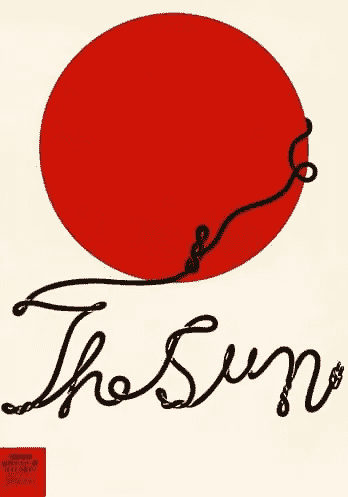
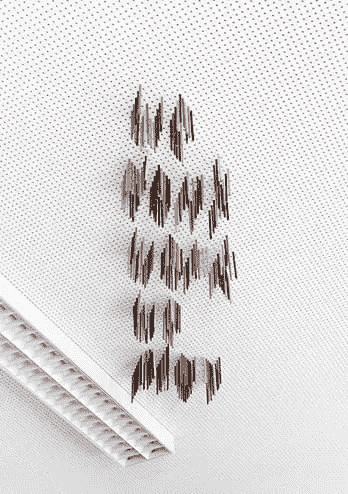
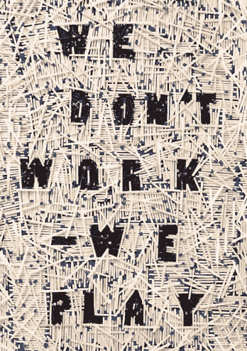
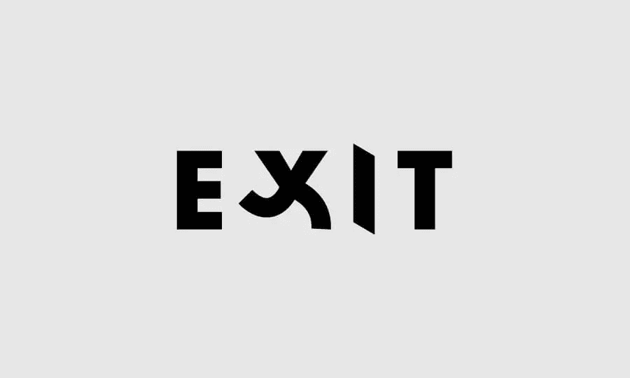
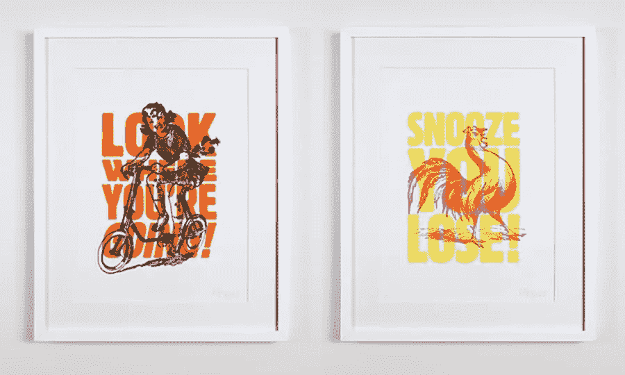
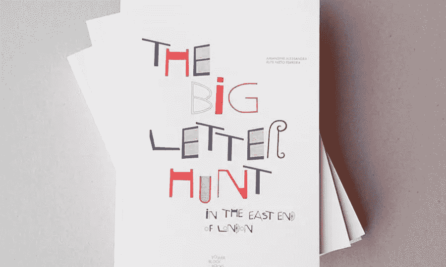
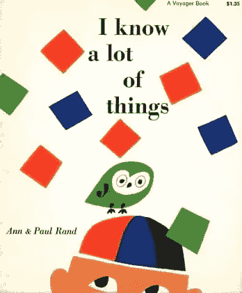
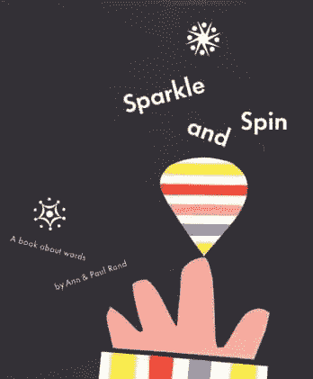

# 如何创造更有趣、好玩的字体

> 原文：<https://www.sitepoint.com/how-to-create-more-fun-playful-typography/>

好的排版可能是艰苦的工作，但是设计师不应该忘记从中得到乐趣！虽然制作字体和印刷字符有时会感觉僵硬和过于数学化，但我们希望您能帮助您找到创建更具表现力和趣味性的印刷字体的乐趣。

当然，这种方法对于面向儿童的设计项目来说很棒——但是我们不要限制自己。毕竟，不是每一家咖啡店、冰淇淋店和标志都需要看起来时髦。让我们找到印刷术更有创意的一面，变得高飞吧！

在这篇文章中，我们将重点介绍一些有趣的字体设计的例子，并向你展示如何在你自己的作品中加入乐趣。

## 1.手工排版

很明显，今天的大多数设计工作都来自计算机。设计通常是“完美的”,并经过仔细推敲，直到每一个瑕疵都被根除。但是我们是否忘记了在过去，计算机甚至不存在？

没错。过去的平面设计师不怕动手动脚。相反，他们使用 100%的模拟工作流程。出于这个原因，他们的许多设计包含了他们手工技术的证据——它们看起来棒极了！

[保罗·兰德](http://www.paul-rand.com)

进入[保罗·兰德](https://99designs.com.au/blog/creative-inspiration/4-principles-by-paul-rand-that-may-surprise-you/):有史以来最著名的平面设计师。上面的例子展示了兰德当时为一家玩具公司 Colorforms 所做的完全手工的设计。Colorforms 的标志是完全不完美的，在一个亮粉色的盒子里有一个歪斜的“C ”,然后遇到了一些温暖人心的手写草书。这整个设计是用剪刀和纸做的！

让我们不要假设计算机不能促进玩耍。但话虽如此，用电脑玩“T1”肯定比 T2 用你手中的实物玩“T3”更难。对于您的下一个项目，请记住这一点，并考虑如何将手工元素引入您的数字工作流程。

## 2.具象印刷术

印刷字符并不总是需要来自字体文件。今天许多优秀的设计通过绘画、涂鸦和涂鸦来表现印刷字体。

见见 Shigeo Fukuda，一位将线条转化为有趣概念的大师。在左边的例子中，Fukuda 创造了“太阳”这个词，这个词是从一个极小的太阳再现后出现的一根电源线的俏皮而弯曲的涂鸦而来的。

你如何从一幅插图或图画中创造出有趣的字体？思考一些想法，比如从蔬菜的插图中创造像“健康”这样的词。或者用正在融化的冰块的插图来绘制像“夏天”这样的单词。

变得俏皮！

## 3.概念游戏

有时候创造一些好玩的东西需要你在做的时候有一些额外的乐趣！它要求你离开电脑，把手弄脏。

We Don’t Work We Play (via [Liam Thinks](http://liamthinks.blogspot.com/2014/04/playful-typography-that-emphasizes.html))

We Don’t Work We Play (via [Liam Thinks](http://liamthinks.blogspot.com/2014/04/playful-typography-that-emphasizes.html))

上面两个例子来自德国设计师马克斯·库沃茨和亚尼克·巴尔泽的一个项目。

在左边，几十支彩色铅笔被描绘成被扔向天花板——这是典型的上班偷懒动作。铅笔幽默地拼出“我们不工作，我们玩耍”的字样，这是字体无法做到的。

与右边类似，数百根火柴被摊开，其中一小把被烧掉了。玩火很好玩！上面两张图片都展示了创造有趣的字体的好方法！

## 4.排版中的拟人化

一个长期的标志趋势是以愚蠢、可爱、有趣和怪异的方式将一切可以想象的东西拟人化。我们经常在动物和自然中看到这种情况。另一个有趣的应用是字体设计！

*字如其像*由[李·吉](http://pleaseenjoy.com/projects/personal/word-as-image/)

在上面李·吉的例子中，字母“X”被拟人化为一个人跑过一扇由字母“I”做成的门。这个印刷人物的“腿”愚蠢而柔韧，创造了一种俏皮的感觉。看起来好像漫画中的“X”在逃避什么。它让你微笑！

## 5.如有疑问，请使用插图

有时候，文字并不足以让乐趣源源不断。这就是插图派上用场的时候。在许多情况下，可能需要一点插图来推动印刷概念。

让我们来看看插图是如何将一些平淡无奇的排版变得有趣的:

你好伙计！和史蒂夫·赖特(通过[行为](https://www.behance.net/gallery/6726217/Bash-It-Out-Riso-Prints)

上面的两个例子突出了粗体和侵略性。就其本身而言，这些话可能看起来很生气，甚至很无聊。然而，在插图的帮助下，它们变得令人捧腹。

在左边，想到这个小女孩骑着自行车尖叫着“看你要去哪里！”就很有趣同样，在右边，一只公鸡喊着“贪睡，你输了！”真是俏皮。

这些例子告诉我们，你可以用插图使字体变得有趣和好玩！

## 6.完美很无聊

事实上，完美与大多数人无关，因为人并不完美。人们充满了怪癖、挣扎和不同的品味。当印刷术是歪的，不可靠或怪异的人可以联系！不要害怕用令人耳目一新的不完美的排版来表达自己。

[塔块书](http://towerblockbooks.com/)

印刷术不完美的一个很好的例子来自于塔块书。《寻大信》的封面以定制字体为特色，充满了乐趣和俏皮的瑕疵。没有什么是对称、平行或对齐的。每封信都很古怪，有自己的个性——就像我们大多数有创造力的人一样。

## 7.玩耍有引力

当我们玩的时候，有一定的重力存在。我们移动、跳跃、滚动和旋转的方式受到重力的影响。考虑到这一点，设计师可以有意识地在他们的设计中引入重力感，以鼓励对乐趣和游戏性的感知。

by [Paul Rand](http://www.paul-rand.com/)

by [Paul Rand](http://www.paul-rand.com/)

最后，我们回到游戏大师保罗·兰德身上。上面的两个例子完美地阐明了重力是如何促进玩耍的。在左边，我们可以感觉到重力让方形的“五彩纸屑”从上面落下。

虽然排版并不完全好玩，但它赞美了狂野和自由的五彩纸屑——它保持了美学上的平衡。另一方面，在右边的示例中，版式接受了重力处理，并在旋转对象的顶部“隆隆”作响。设计中有“旋”字也有帮助！总的来说，重力感让这些例子看起来很有趣。

## 结论

显然，有许多不同的方式通过有趣的字体来表达自己——无论是用手设计，使用图纸，思考喜剧概念，分层有趣的插图还是融入重力。把这些技巧放在你的工具箱里，在你下一次有趣的印刷工作中尝试一下吧！

## 分享这篇文章