# 如何为创业公司创建网站

> 原文：<https://www.sitepoint.com/how-to-create-websites-for-business-startups/>

*这篇赞助文章由我们的内容合作伙伴 [BAW 媒体](https://bawmedia.com)创作。感谢您对使 SitePoint 成为可能的合作伙伴的支持。希望与 SitePoint 合作？在这里获得[更多信息。](https://www.sitepoint.com/advertise/)*

给所有网页设计师打电话:我们有好消息要告诉你。

由于新的全球经济创造的机会，新的创业公司正在全球各地出现。好消息是:

新的创业公司导致对更多商业网站的需求不断增长。反过来，这意味着网页设计师要做更多的工作。

这些也不是孤立的社区企业。他们的外联是全球性和数字化的。他们需要的网站是为转换优化和灵活的。所以，你的机会来了。你可以通过为这些新创业者创建优秀的网站来为他们服务。

你如何着手做这件事？

下面是创建引人注目、高转化率网站的 5 个简单步骤，并附有有用的例子。

## 建立惊人的创业网站的 5 个步骤

### 第一步:选择迷人的调色板

为创业网站选择调色板时，有 3 个简单的规则可以遵循:

*   你想要一个能立即吸引注意力的调色板
*   它必须是品牌的
*   它需要在视觉上支持你想要传达的信息

[Over](https://www.madewithover.com/) 大胆的色彩触感瞬间吸引眼球。

[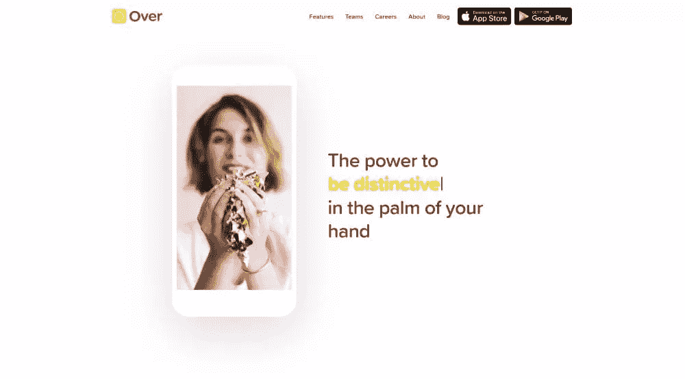
](https://www.madewithover.com/)

这个预建的网站包含在 Be 主题库中，提供了另一个引人注目的调色板示例。

[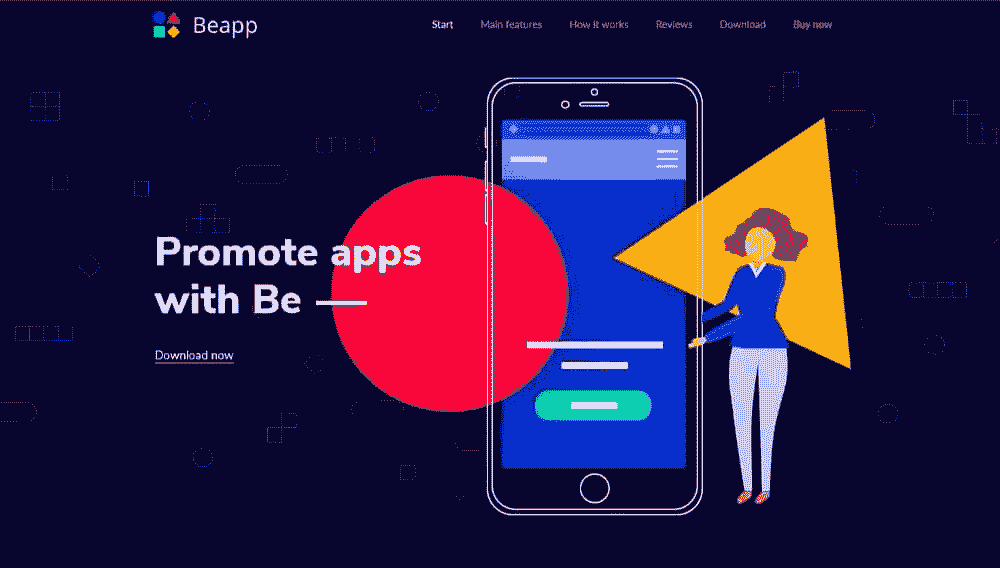
](https://themes.muffingroup.com/be/app4/?utm_source=sitepoint.com&utm_medium=content&utm_campaign=jul19)

Forest 在将调色板与其品牌协调一致方面做得非常出色——绿色和棕色等大地色调随处可见。这些调色板有助于一个视觉上令人难忘的网站。

[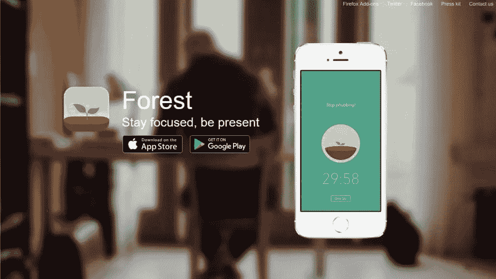
](https://www.forestapp.cc/)

FlightCard 微妙而冰冷的调色板是强化其信息的完美选择:登机牌已经变得如此容易使用，以至于你几乎不会注意到它们。

[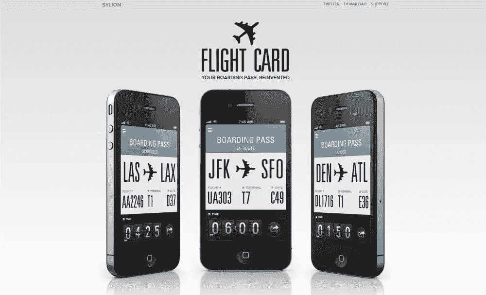](http://www.sylion.com/flightcard/)

如果你需要一种能吸引更多观众的颜色，BeApp2 可以很好地为你服务。

[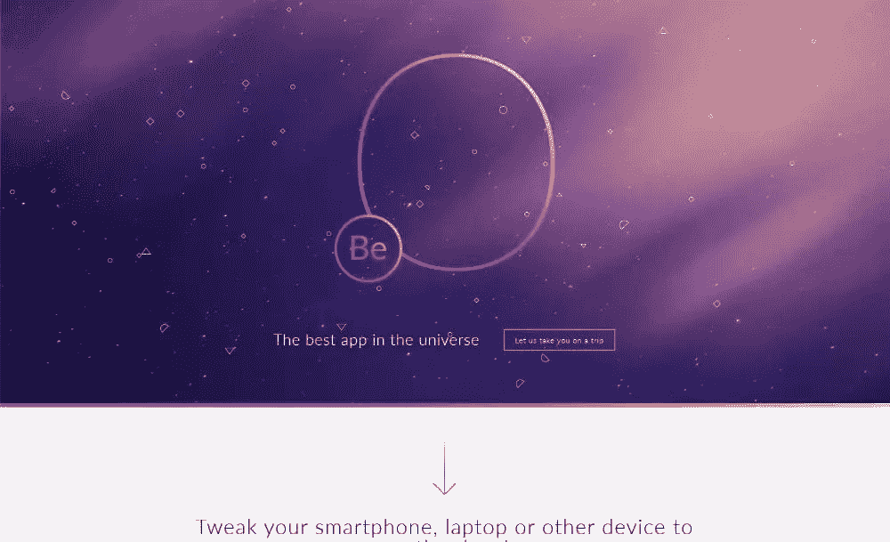](https://themes.muffingroup.com/be/app2/?utm_source=sitepoint.com&utm_medium=content&utm_campaign=jul19)

### 第二步:展示清晰的产品图片

这个应该不难搞清楚。人们想知道他们能得到什么。这和你使用的图标的颜色没有什么关系。

一个创业公司必须展示其产品的天赋和尊严。它的产品照片需要给它一个额外的优势，超过有预算匹配的大企业。

[Pennies](https://www.getpennies.com/) 自豪地展示其获奖应用在智能手机上的外观。只要看一下这个页面，你就可以知道它有多容易使用，甚至可以知道颜色代码是如何工作的。

[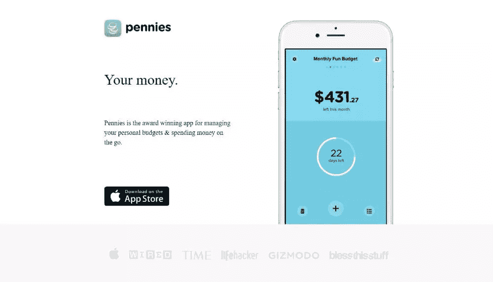](https://www.getpennies.com/)

你可以用 [BeWallet](https://themes.muffingroup.com/be/wallet/?utm_source=sitepoint.com&utm_medium=content&utm_campaign=jul19) 创建一个类似的网站。这个预先构建的网站是为金融服务初创公司从头开始设计的。他们中有大量的观众迫切需要一个更好的网站。

[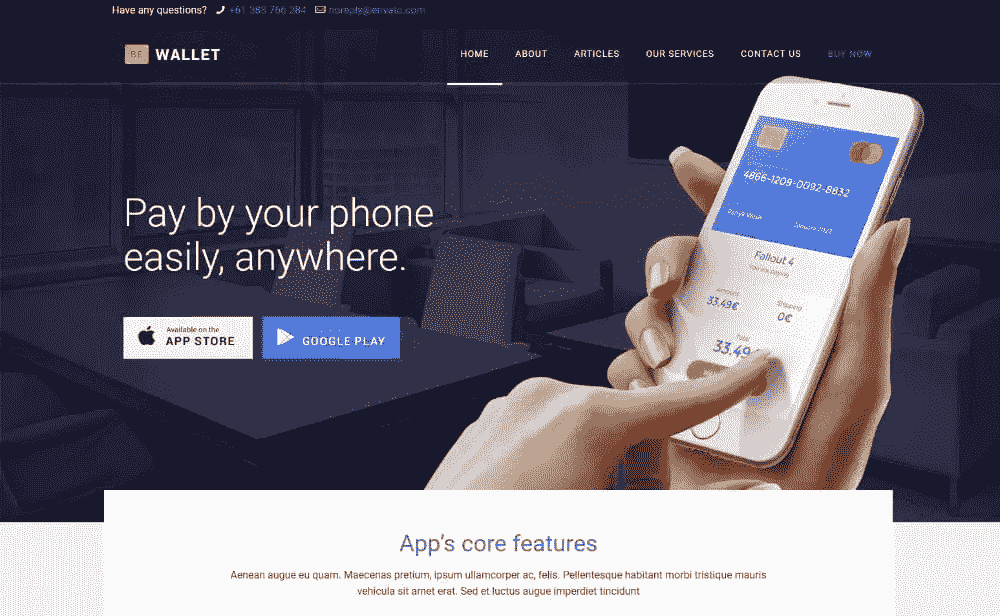](https://themes.muffingroup.com/be/wallet/?utm_source=sitepoint.com&utm_medium=content&utm_campaign=jul19)

或者，你可以选择一个更普通的预建网站，比如 [BeSoftware](https://themes.muffingroup.com/be/software/?utm_source=sitepoint.com&utm_medium=content&utm_campaign=jul19) 来展示一个新创业公司的清晰照片。

[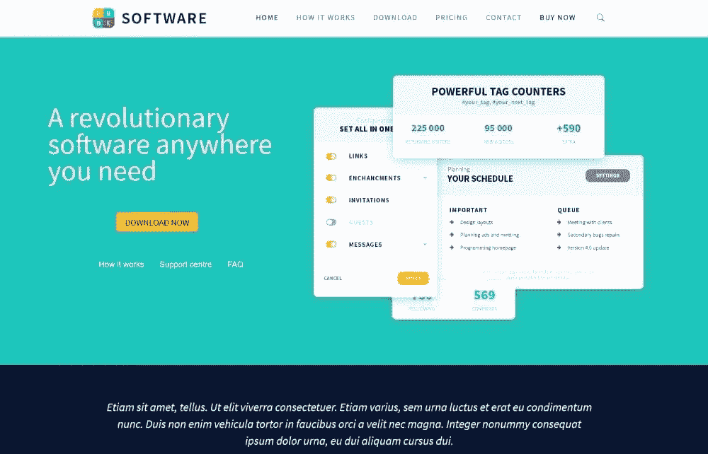](https://themes.muffingroup.com/be/software/?utm_source=sitepoint.com&utm_medium=content&utm_campaign=jul19)

JibJab 更进一步。它的“之前和之后”方法是一种有说服力的简单策略，用来展示初创公司提供的东西。

[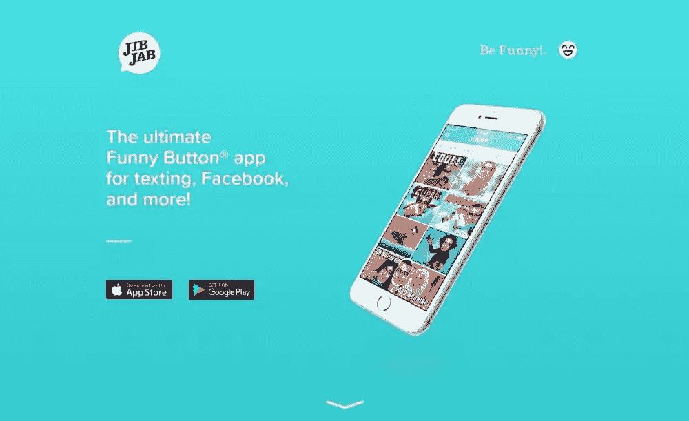](https://www.getjibjab.com/)

### 第三步:向访问者展示创业公司如何为他们服务

这里的关键是通过展示初创公司将如何为他们服务，帮助访客把自己想象成真正的客户。

[PeekCalendar](http://www.peekcalendar.com/) 在英雄版块放置了一段视频。它展示了人们如何从新业务中获益。

[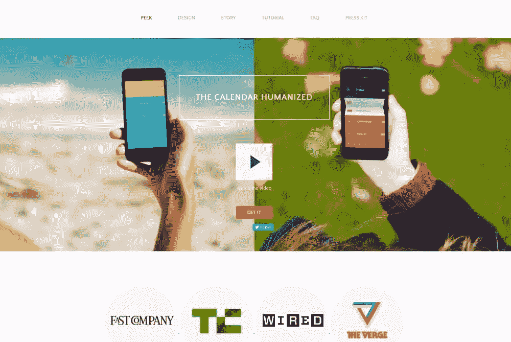](http://www.peekcalendar.com/)

BeApp3 允许你加入产品图片和视频，展示这家新公司将如何让使用其产品和服务的人们受益。

[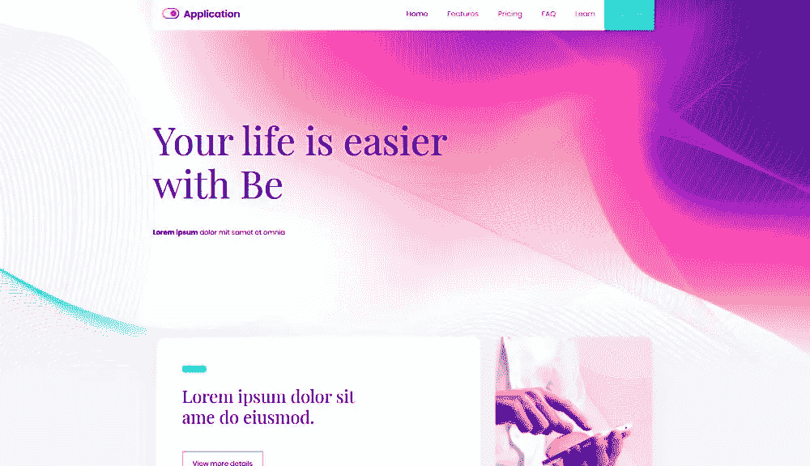](https://themes.muffingroup.com/be/app3/?utm_source=sitepoint.com&utm_medium=content&utm_campaign=jul19)

BePay 的折叠上方有一个观看视频的 CTA 按钮，鼓励你的访客立即观看产品演示。

[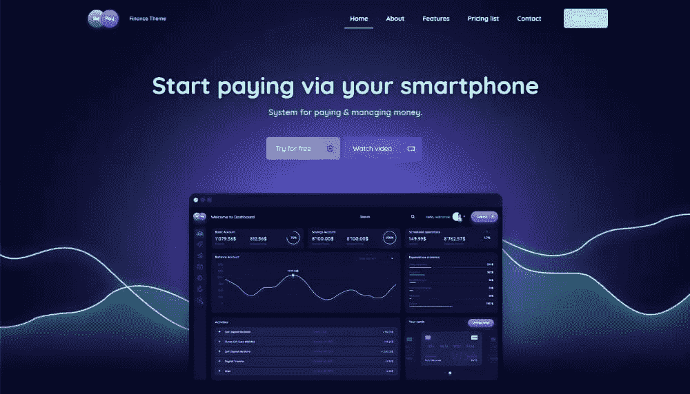](https://themes.muffingroup.com/be/pay/?utm_source=sitepoint.com&utm_medium=content&utm_campaign=jul19)

可爱的爪子会软化最坚硬的心。它的整个操作方法被巧妙地浓缩在一张图片中:一张展示新业务将如何满足用户特定需求的英雄照片。

### 第四步:使用空格

你可以过度使用空白，但是通常空白越多越好。空白是初创网站的首要视觉设计元素。你需要尽可能多的空间来突出你的主要信息和产品照片。

Fly Nation 干净、通风的设计赏心悦目，让它能够专注于最重要的元素。

[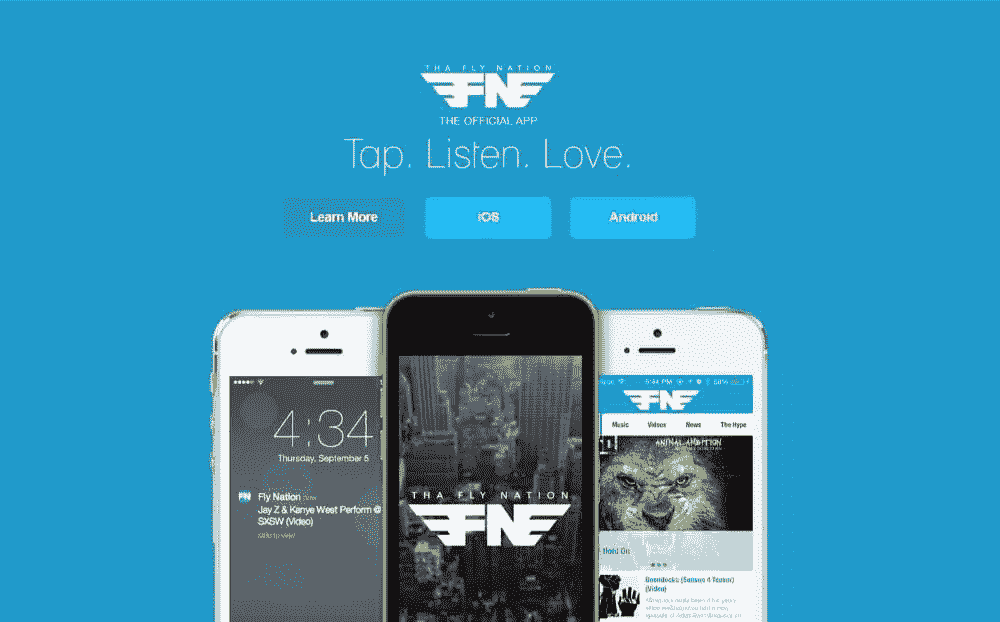](https://fifth.life/release/)

你可以用 [BeProduct4](https://themes.muffingroup.com/be/product4/?utm_source=sitepoint.com&utm_medium=content&utm_campaign=jul19) 或 [BeHosting2](https://themes.muffingroup.com/be/hosting2/?utm_source=sitepoint.com&utm_medium=content&utm_campaign=jul19) 创建一个类似的创业网站。这些都是预建的网站，其中空白空间用于增强用户体验，并强调页面上的关键元素。

[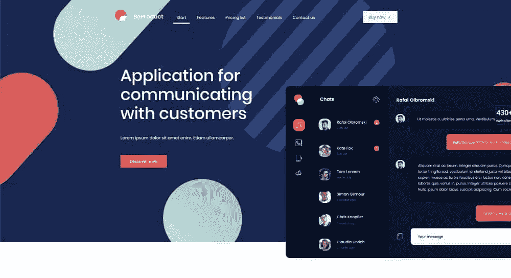](https://themes.muffingroup.com/be/product4/?utm_source=sitepoint.com&utm_medium=content&utm_campaign=jul19)

[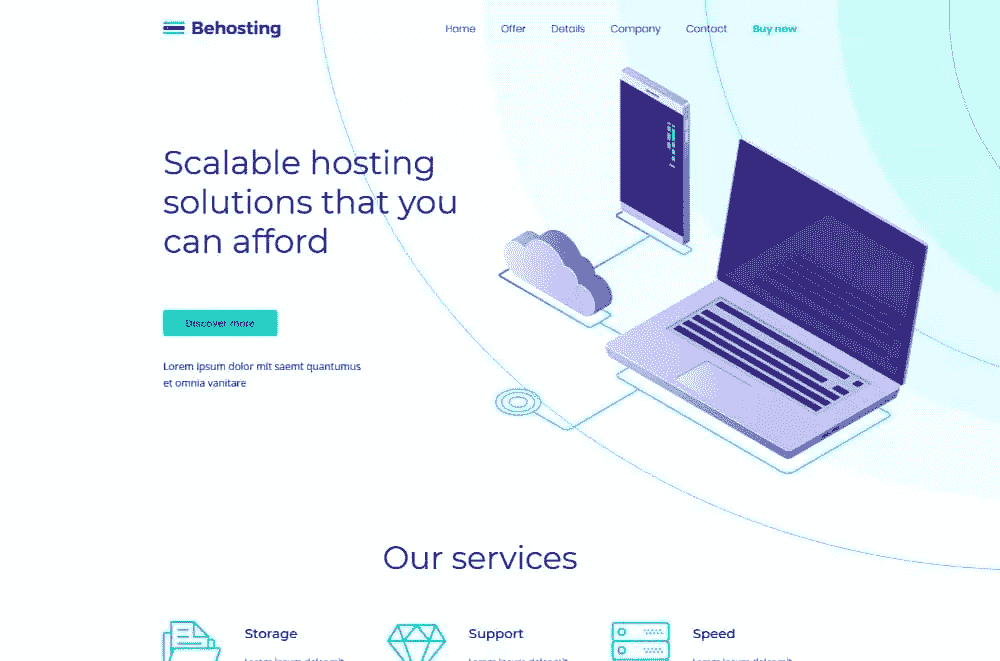](https://themes.muffingroup.com/be/hosting2/?utm_source=sitepoint.com&utm_medium=content&utm_campaign=jul19)

谈到空白，SpellTower 可能是最极端的。这是他们品牌的一部分，其极简设计将信息传递到了家里。

[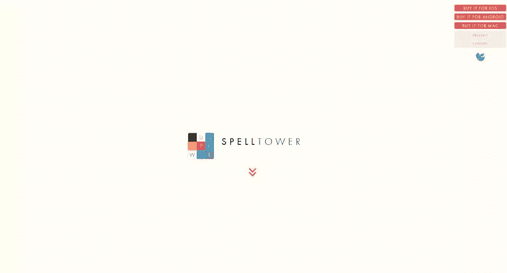](http://www.spelltower.com/)

### 第五步:设计能抓住用户眼球的 CTA

一个容易找到的 CTA 按钮并不总是有用的。如果你想将访问者转化为用户，你需要一个不容忽视的 CTA 按钮——大、亮、醒目。它是如此的明亮，以至于一个访问者感觉不得不点击它！

[Wire](https://wire.com/en/) 的 CTA 按钮在折叠上方清晰可见。它有一个大胆的颜色，它足够大，一旦你读了标题就会吸引你的注意，它位于页面的中心，所以它就像一个“门”，必须点击它才能前进。

[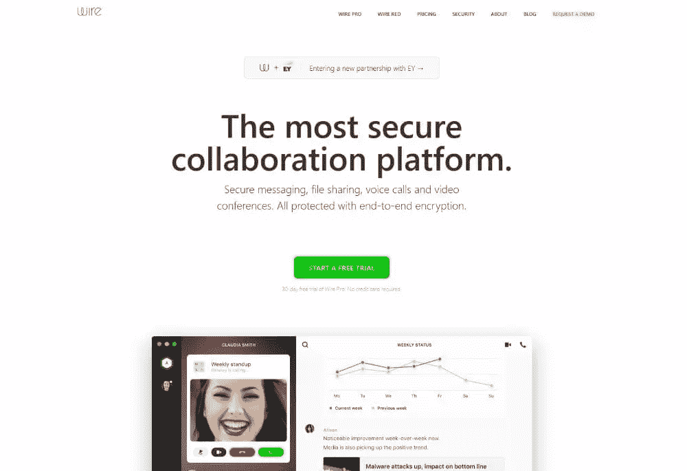](https://wire.com/en/)

BeERP 使用相同的亮绿色按钮作为它的主 CTA(你希望你的访问者点击的那个)。第二个普通的按钮在右边。

[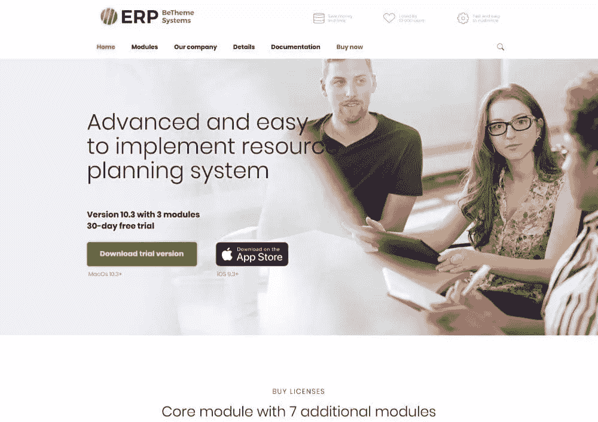](https://themes.muffingroup.com/be/erp/?utm_source=sitepoint.com&utm_medium=content&utm_campaign=jul19)

您还可以通过让 CTA 与页面上的其他元素相匹配来吸引人们的注意力。一个很好的例子就是 [BeKids](https://themes.muffingroup.com/be/kids/?utm_source=sitepoint.com&utm_medium=content&utm_campaign=jul19) 。这里，蓝色 CTA 按钮与 hero 部分的视觉元素相匹配。

[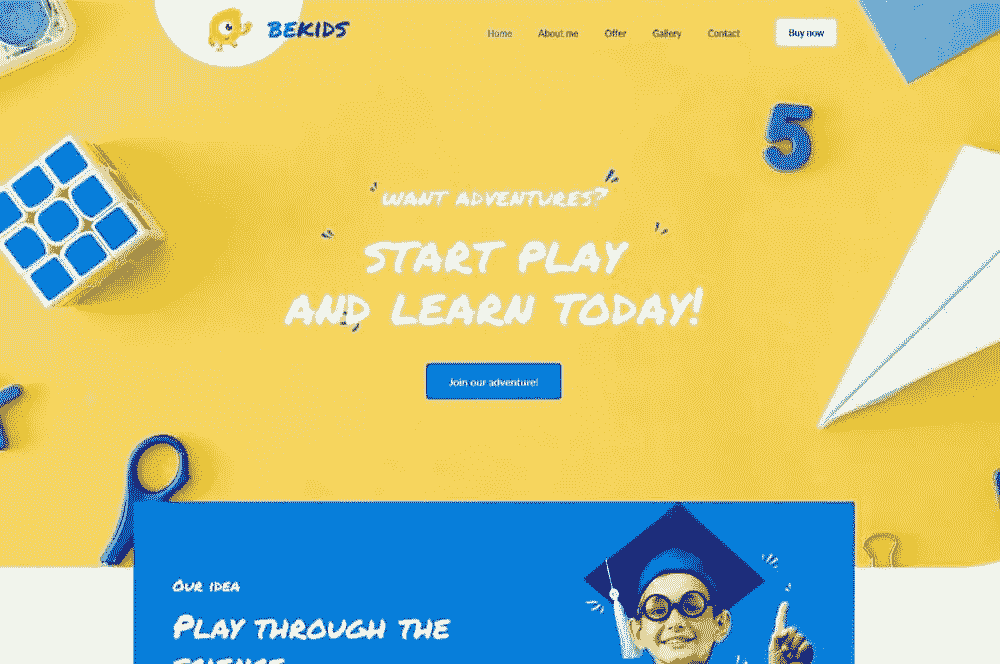](https://themes.muffingroup.com/be/kids/?utm_source=sitepoint.com&utm_medium=content&utm_campaign=jul19)

## 结论

遵循这些万无一失的步骤，这样你就可以给你的客户呈现一个既吸引眼球又能转化的网站。以惊人的视觉效果和巧妙利用留白为特色的网站创造了初创公司需要的访问者。

如果你幸运地抓住了新业务的好机会，你会很容易发现自己超负荷了。在这种情况下，您可以安全地使用专门为企业从头开始构建的网站。

你会发现 [Be Theme](https://themes.muffingroup.com/be/splash/?utm_source=sitepoint.com&utm_medium=content&utm_campaign=jul19) 上最大的图库和超过 450 个预建网站可供选择。预建的网站，你可以根据自己的喜好定制。

这些预建的网站功能强大，视觉效果令人印象深刻，并具有交互式元素、令人惊叹的效果和直观的导航。只需根据您的业务或客户的业务对您选择的产品进行个性化设置，您就可以开始工作了！

## 分享这篇文章