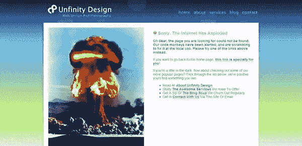
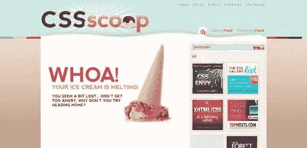
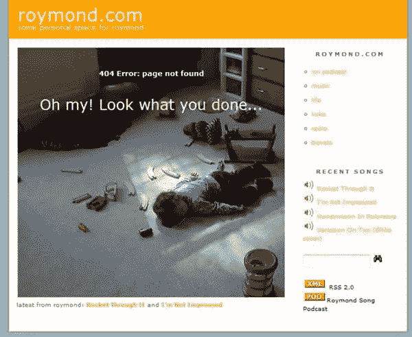
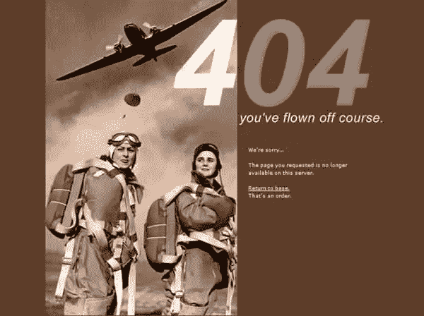
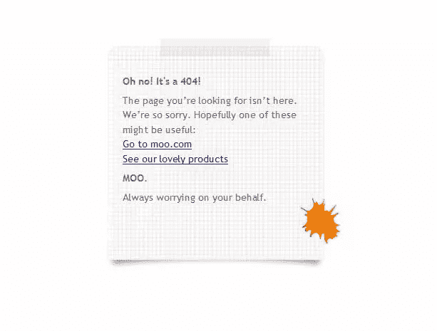
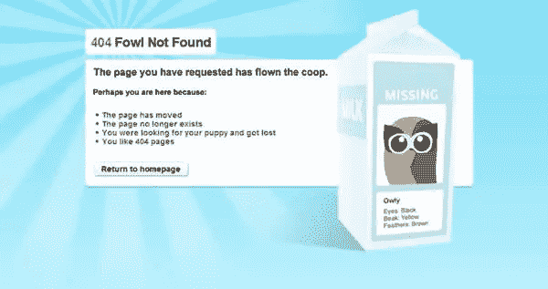
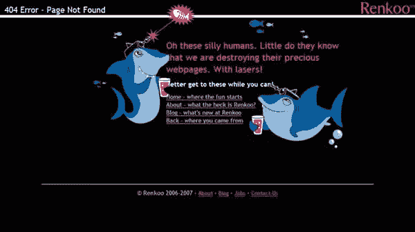
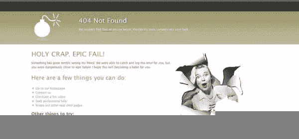
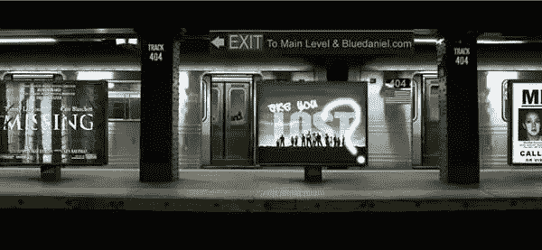

# 如何定制你的 404 页面

> 原文：<https://www.sitepoint.com/how-to-customise-your-404-page/>

在你网上冲浪生涯的某个阶段，你会登陆一个网页，上面写着错误 404 页面未找到。对于访问者来说，这可能很烦人，但是只要一点点的关心和注意，你就可以创建一个能引起访问者兴趣的页面，让他们更喜欢你！

#### 什么是 404 页面？

404 页面是一个 HTTP 标准响应代码，表示客户端能够与服务器通信，但服务器找不到所请求的内容。发生这种情况有几个原因:
1。页面已被移动
2。来自另一个网站的链接不正确
3。访问者可能在输入 URL 时出错

你可以在 Sitepoint 上找到一篇关于 [404 如何工作的非常详尽的文章。](https://www.sitepoint.com/article/error-handling-user-experience/)

#### 什么是好的 404 错误页面？

把 404 想象成牵着你迷路的访问者的手，轻轻地引导他们到你网站的另一个地方。

1.解释页面是什么。不要假设每个人都熟悉 404 这个术语。当普通人在屏幕上看到大字错误 404 时，他们可能会认为发生了严重的错误(我想到了我的父母)。

2.不要让访问者觉得网页找不到是他们的错，也不要只是告诉他们纠正拼写。很可能他们不会回来了。

3.为了改善他们的体验，你应该总是允许他们去别的地方，而不是使用浏览器的后退按钮。不要制造死角。

4.包括到网站其他部分的链接。

5.为访问者提供一种联系网站管理员的方式，让他们知道链接断开了。如果给访问者一张表格，他们更有可能这样做。

6.使用搜索框

7.一幅有趣或幽默的图画对创造善意大有帮助。

通过使用一些或所有这些技巧来定制你的 404 错误页面，你将在很大程度上让人们留在你的网站上。

#### 一些例子

网上有一些 404 页的精彩展示。我挑选了 10 个例子，我觉得它们很吸引人，也很有用。

不合适的设计给出了一个简短的解释，说明网页找不到了，并给出了一些链接，链接指向他们网站的各个部分。

[CSS Scoop](http://cssscoop.com/404) 端上一勺融化的冰淇淋，这是返回主页的链接。顶部的导航栏允许访问者跳转到网站的这些部分。

DigiGuru 有一个非常有趣的 404 页面，它通过一些图片进行转换，同时给出了返回主网站的链接、他的电子邮件和电话号码，以及关于南极之行的信息。

Roymond.com:我不得不承认我把这个包括在内，因为它让我发笑。除了在 404 页面上显示一个幽默(有点扭曲)的图像，还有一整套返回主网站的链接。

[Ultrapop](http://www.ultrapop.org/404.html) 显示了一个很好的图像，命令返回基地。

Moo 有一个简单而“关怀”的信息，链接到它的产品和主页。

[Hootsuite.com](http://hootsuite.com/404)有一个失踪的家禽主题，有一个为什么页面没有找到的简要说明和一个返回主页的链接。

除了有激光的鲨鱼之外，在 [Renkoo 错误页面](http://www.Renkoo.com/404)上，你还可以获得该网站各个部分的链接。

干净、机智并且提供了很多 404 页面之外的方法，包括搜索框，这个[着色像素](http://www.Tintedpixel.com/404)网站还增加了一个漂亮的小触摸，说“这肯定不是你的错”

蓝丹尼尔的 404 页是个例外。虽然它只提供一个返回主网站的链接，但它是用 Flash 制作的，非常有想象力。

出于兴趣，当你不小心进入 404 错误页面时，你会不假思索地点击后退按钮吗？或者你尝试一些建议的链接？你最近看过哪 404 页让你印象深刻？

## 分享这篇文章