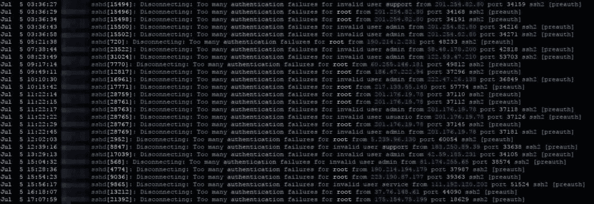
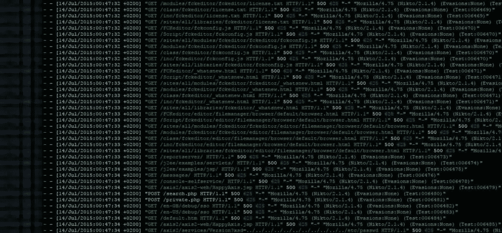
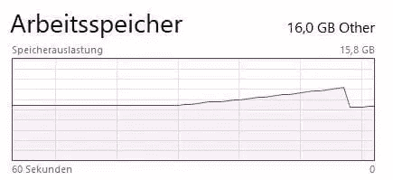

# 如何用 Zip 炸弹保卫你的网站

> 原文：<https://www.sitepoint.com/how-to-defend-your-website-with-zip-bombs/>

*这篇文章最初发表在 [Christian 的博客](https://blog.haschek.at/post/f2fda)上，经他允许在此转载。如果你想了解物联网、加密货币、PHP 等等，可以看看他其他非常有趣的文章。*

* * *

[](https://www.sitepoint.com/wp-content/uploads/2017/07/1499293616nuke.jpg)

如果你曾经托管过一个网站，甚至管理过一个服务器，你会非常清楚坏人试图用你的东西做坏事。

当我 13 岁第一次托管我自己的带有 SSH 访问的 linux 小盒子时，我每天都阅读日志，并向他们的 ISP 报告试图连接我可爱的小盒子(实际上是一台旧的 ThinkPad T21，在我的床下有一个坏掉的显示器)的 IP(主要来自中国和俄罗斯)。

实际上，如果您有一个暴露了 SSH 的 linux 服务器，您可以看到每天有多少次连接尝试:

```
grep 'authentication failures' /var/log/auth.log 
```



## WordPress 让我们所有人都完蛋了

好吧，老实说，web 漏洞扫描器在 WordPress 之前就已经存在了，但由于 WP 被广泛部署，大多数 web 漏洞扫描器都包括扫描一些错误配置的`wp-admin`文件夹或未打补丁的插件。

因此，如果一个小型的新黑客组织想要获得一些热门的信誉，他们会下载[的](https://github.com/sullo/nikto)[一个](https://wpscan.org/)这些扫描仪[的东西](http://rgaucher.info/beta/grabber/)，并开始对许多网站进行测试，希望获得访问某个网站的权限[并破坏](https://en.wikipedia.org/wiki/Website_defacement)它。



这就是为什么所有的服务器或网站管理员都必须处理大量的扫描日志。所以我想知道..

## 有办法反击吗？

在经历了一些带有[id](https://en.wikipedia.org/wiki/Intrusion_detection_system)或 [Fail2ban](https://en.wikipedia.org/wiki/Fail2ban) 的潜在实现后，我想起了过去的 [ZIP 炸弹](https://en.wikipedia.org/wiki/Zip_bomb)。

### WTH 是一个拉链炸弹？

事实证明，ZIP 压缩对重复数据非常有效，所以如果你有一个非常大的文本文件，其中包含重复的数据，比如全零，它会非常好地压缩它。非常好。

正如 [42.zip](http://www.unforgettable.dk/) 向我们展示的，它可以将 4.5 peta 字节(4 . 500 . 000 GB)的文件压缩到 42 字节。当您试图真正查看内容(提取或解压缩)时，您很可能会耗尽磁盘空间或 RAM。

### 我如何压缩一个 vuln 扫描仪？

可悲的是，网络浏览器不理解 ZIP，但他们理解 GZIP。

因此，首先我们必须创建 10gb 的 GZIP 文件，用零填充。我们可以做多次按压，但现在还是简单点。

```
dd if=/dev/zero bs=1M count=10240 | gzip > 10G.gzip 
```


如你所见，它有 10 MB 大。我们可以做得更好，但现在已经足够好了。

现在我们已经创建了这个东西，让我们设置一个 PHP 脚本，将它交付给客户端。

```
<?php
//prepare the client to recieve GZIP data. This will not be suspicious
//since most web servers use GZIP by default
header('Content-Encoding: gzip');
header('Content-Length: '.filesize('10G.gzip'));
//Turn off output buffering
if (ob_get_level()) ob_end_clean();
//send the gzipped file to the client
readfile('10G.gzip'); 
```

就是这样！

我们可以用这个作为简单的辩护:

```
<?php
$agent = lower($_SERVER['HTTP_USER_AGENT']);

//check for nikto, sql map or "bad" subfolders which only exist on wordpress
if (strpos($agent, 'nikto') !== false || strpos($agent, 'sqlmap') !== false || startswith($url,'wp-') || startswith($url,'wordpress') || startswith($url,'wp/'))
{
      sendBomb();
      exit();
}

function sendBomb(){
        //prepare the client to recieve GZIP data. This will not be suspicious
        //since most web servers use GZIP by default
        header("Content-Encoding: gzip");
        header("Content-Length: ".filesize('10G.gzip'));
        //Turn off output buffering
        if (ob_get_level()) ob_end_clean();
        //send the gzipped file to the client
        readfile('10G.gzip');
}

function startsWith($haystack,$needle){
    return (substr($haystack,0,strlen($needle)) === $needle);
} 
```

这个脚本显然不是——正如我们在奥地利所说的——鸡蛋黄，但它可以防御我前面提到的脚本小子，他们不知道所有这些工具都有改变用户代理的参数。

### 调用脚本时会发生什么？

| 客户 | 结果 |
| --- | --- |
| IE 11 | 内存增加(崩溃) |
| 铬 | 内存增加，显示错误 |
| 边缘 | 记忆升起，然后滴下，永远装载 |
| Nikto | 似乎扫描正常，但没有输出报告 |
| sqlcmap | 崩溃前的高内存使用率 |

(如果你用其他设备/浏览器/脚本测试过，请[告诉我](https://twitter.com/geek_at)，我会在这里补充)



如果你是一个冒险者: [**亲自尝试一下**](https://blog.haschek.at/tools/bomb.php)

## 分享这篇文章