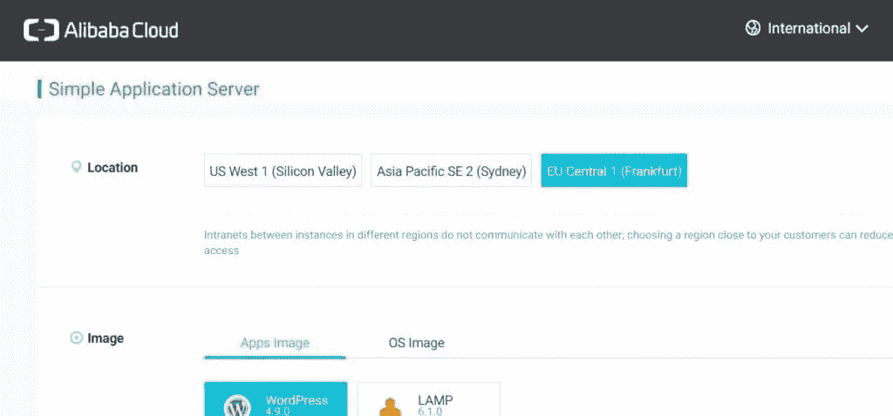
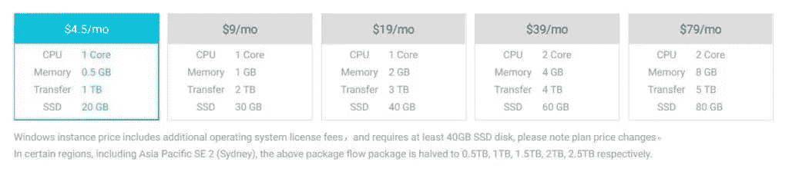
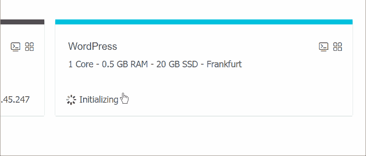
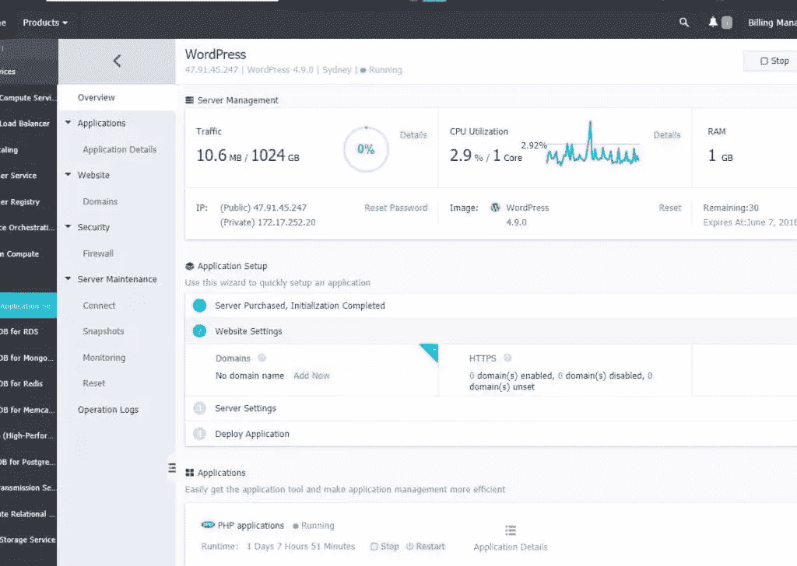
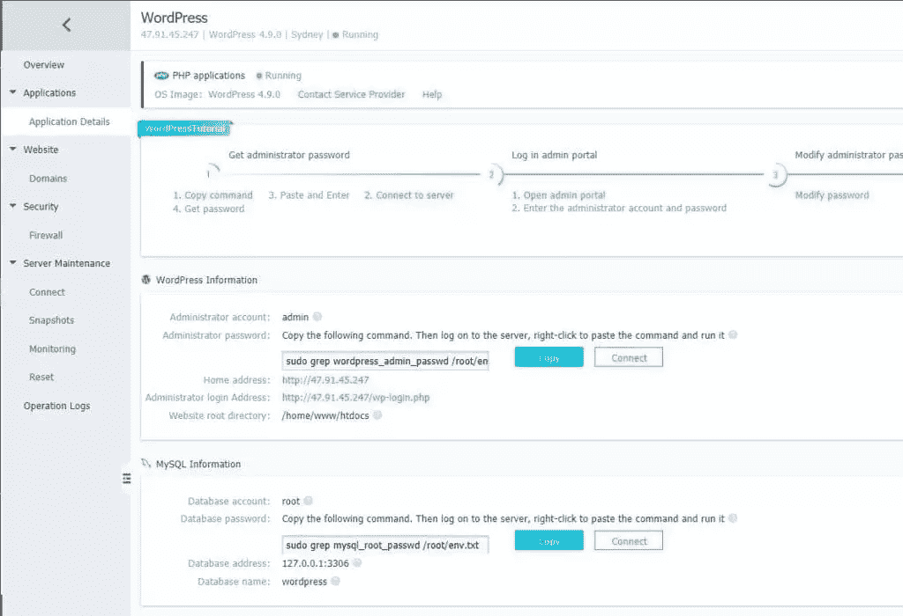
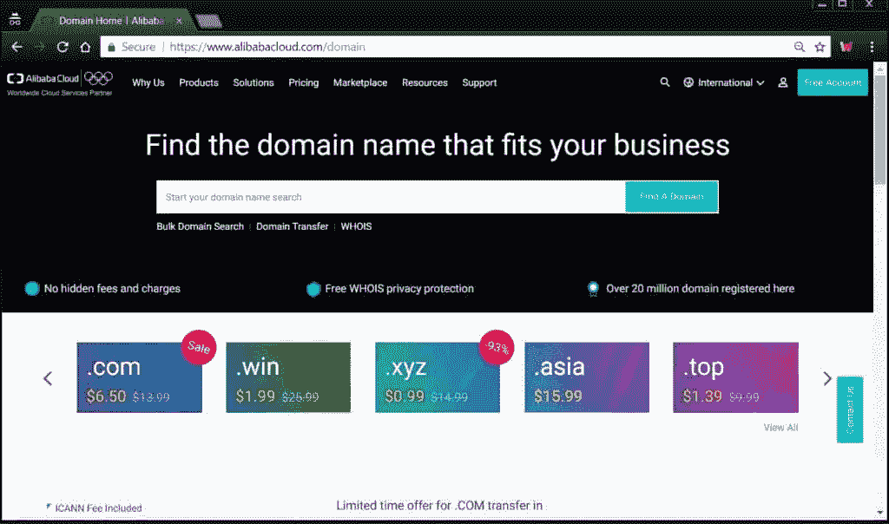
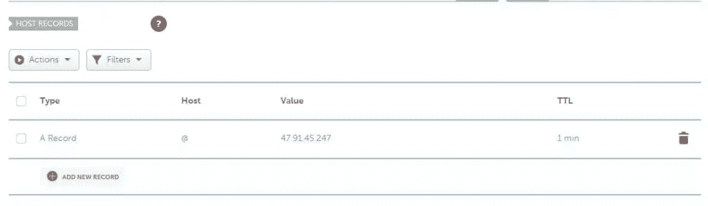
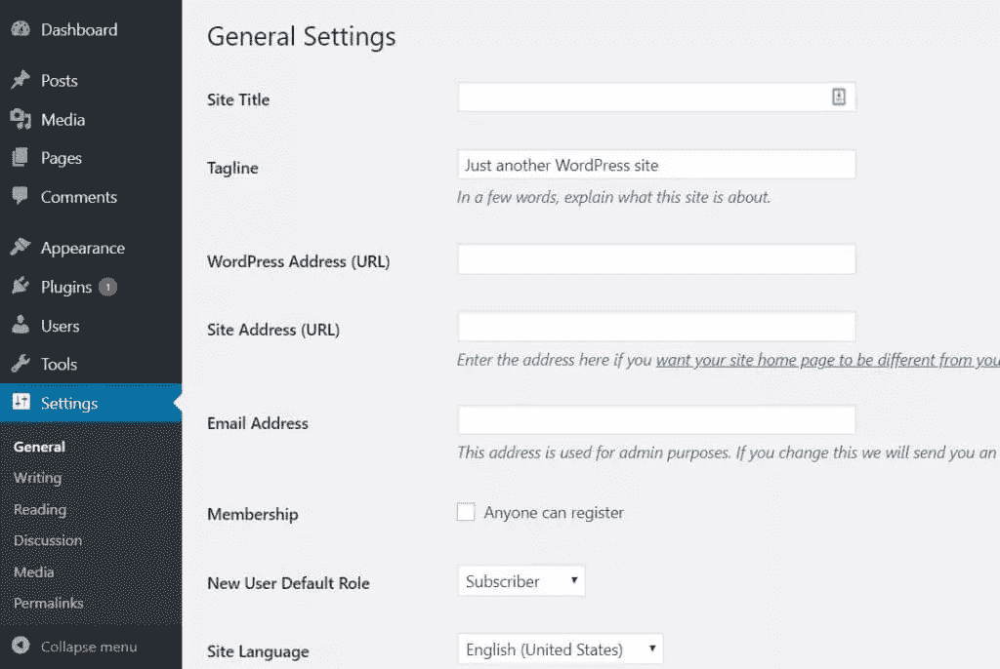
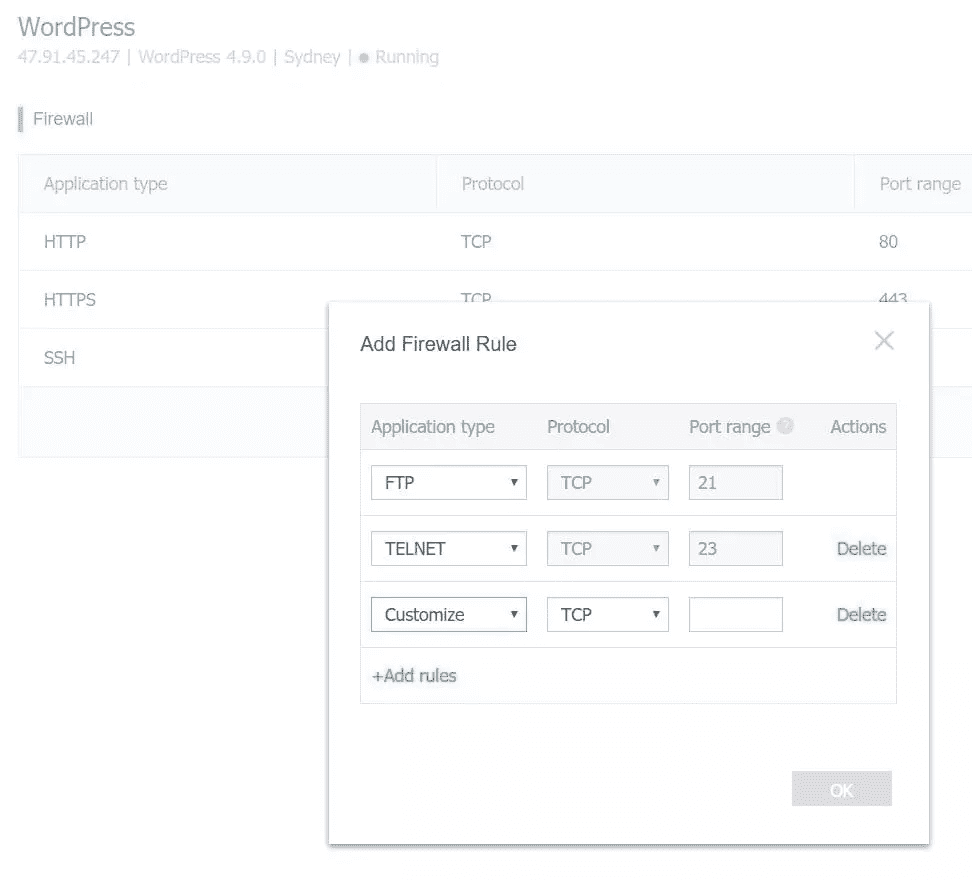

# 如何在阿里云 SAS 上部署 WordPress 站点

> 原文：<https://www.sitepoint.com/how-to-deploy-a-wordpress-site-on-alibaba-cloud-sas/>

*本文是与[阿里云](https://int.alibabacloud.com/m/1000004098/)合作创作的。感谢您对使 SitePoint 成为可能的合作伙伴的支持。*

说到云托管，阿里云是一个相对较新的领域。我们已经习惯了 AWS 及其过多的选项，Heroku 和 Google 的云解决方案，它们要么都有一定程度的复杂性，要么除了演示应用程序之外，价格都相对较高，或者两者兼而有之。

这一领域的复杂性导致了关于这些解决方案的课程和书籍的出现，比如亚马逊的云。

开发人员知道，所有花在调试、学习和完善部署上的时间都没有花在开发我们正在努力部署的核心解决方案上。

说到原始 VPS 解决方案，DigitalOcean、Vultr 和 Linode 多年来一直是首选供应商。这里也有一些权衡:当一个人想要部署一个高级解决方案，比如众所周知的内容管理系统(比如 Drupal 或 WordPress)，或者电子商务解决方案(比如 Magento、WooCommerce 或 OpenCart)，他们可以选择一个专用的、专门化的、高调的托管主机。这些产品的价格相当高，而且没有 100%的专用资源。或者，你可以选择一个专用系统。为了保证 web 应用程序有 4GB 的 RAM 可用，或者保证有处理器内核、可用的系统外壳，或者希望能够切换服务器堆栈组件版本，必须使用专用服务器或 VPS。

共享托管环境只能在从服务器中挤出最后一点性能，或者选择和优化服务器堆栈的组件方面发挥作用。他们没有给你对主机环境的最终控制权，并且经常交付平庸的结果。

我们提到的专用系统通常是高性能系统的最佳解决方案，也是关注经过调整和优化的 web 访问者体验的项目。它们往往相对便宜，它们保证服务器资源，如果不是数据中心的整个机器，但是…它们要求开发人员或系统管理员进行设置。如果这些专用系统包括系统管理员时间和维护，它们通常在价格上没有竞争力。

就托管成本而言，非托管 VPS 和专用服务器解决方案具有最佳优势。这是像 Digital Ocean、Vultr 和类似主机这样的公司蓬勃发展的地方。但是这些供应商需要 Linux 管理知识，以及服务器栈的复杂性知识，比如 LAMP、LEMP 等等。

对于专用的解决方案，必须雇佣系统管理员和开发人员来设置这些东西。他们需要安装最新版本的 PHP 及其所有模块，然后是数据库和服务器(如 Apache 或 Nginx)，然后是虚拟主机的设置、SSL、出现的调试和兼容性问题、软件包问题，等等

这使得专用主机成为一项重要的工作。这是像 Cloudways 这样的公司找到了自己的位置。

## 阿里云

而现在有了阿里云。

阿里云是一家雄心勃勃的供应商，提供全面的服务，从 CDN、基于云的数据库服务、大数据和分析解决方案、媒体流和物联网解决方案，以及共享 web 托管或灵活的 VPS 解决方案。

[他们夸耀自己内部开发的专有虚拟化解决方案，没有虚拟化开销，并且具有良好的资源隔离。到目前为止，一个已知的没有虚拟化开销的主要解决方案是 OVZ，但是它没有提供这么好的资源隔离。这就是为什么它的竞争对手 KVM 和 XEN 技术在高端 VPS 提供商中表现更好。](https://www.alibabacloud.com/help/faq-detail/66558.htm?spm=a2c61.lp622.0.0.FUl0JH)

如果阿里巴巴确实开发出了一种资源开销很少甚至没有的解决方案，但具有出色的隔离性，这将使他们在 VPS 提供商市场上占据优势。

阿里巴巴的产品之一是[SAS——简单应用服务器](https://www.alibabacloud.com/help/product/58607.htm)。由于 SAS 构建在 ECS 体系结构之上，因此它利用了前面提到的虚拟化解决方案。

> 简单应用服务器使用 ECS I/O 优化的共享实例，包括 CPU、内存、操作系统、网络、磁盘和构建服务器所需的其他服务。

每个用户[最多可以运行五个 SAS 实例](https://www.alibabacloud.com/help/doc-detail/59089.htm)。

它的目标是找到我们上面描述的客户的最佳服务点，这些客户需要价格有竞争力的托管解决方案，提供对环境的控制和资源的保证。

## 部署简单

SAS 解决方案引以为豪的是，每个人都可以在几分钟内从阿里巴巴的网络管理平台启动他们的网络应用程序，而无需进行任何设置，甚至无需登录系统外壳。

在很大程度上，这不是那些知名的 VPS 厂商可以夸耀的。

我们已经试过了，从登录我们的阿里巴巴账户到实际看到我们的网站实时运行只花了我们几分钟的时间。

这个过程没有痛苦而且简单明了。

当我们在这里注册[阿里云时，我们会看到它的免费信用优惠——阿里巴巴给新用户 300 美元的信用。我们可以在本教程中使用它——在简单的应用服务器上部署一个 WordPress 网站。在我们确认我们的支付方式，如信用卡或贝宝，我们得到我们的启动信用激活，我们就可以走了！](https://www.alibabacloud.com)

现在我们可以登录到我们的管理控制台，并在左侧栏的基本服务中选择 Simple Application Server。当我们到达那里时，我们可以单击右上角的“创建服务器”按钮，我们将看到用于选择服务器位置的选项-欧盟、美国和亚洲位置都可用。

然后，我们可以选择一个预构建的可用映像，即可用的应用程序或操作系统映像(不同的 Linux 和 Windows 版本)。对于本指南，我们选择了 WordPress 应用程序图片。

然后，我们选择实例计划。这些计划有不同的可用硬件资源和付款计划，包括每月、每季度、半年、每年等付款计划。

可用的计划范围从 0.5 到 8 GB 的 RAM，1 或 2 个 CPU 核心，并且都配有 SSD 存储，从 20 到 80GB。那些需要更多灵活性的人有其他解决方案可用，这些解决方案级别稍低，但提供更多控制，如 [ECS](https://www.alibabacloud.com/help/faq-detail/66558.htm?spm=a2c61.lp622.0.0.FUl0JH) 。

付款后，我们可以转到 SAS 实例的管理控制台，这将需要几分钟的时间来部署。

在我们的实例被部署之后，它已经安装了整个 LAMP 栈，还有 WordPress。然后我们去看网络管理面板，这是最好的面板之一——也许在细节和选项方面，它甚至比竞争对手更有优势，比如 Vultr、Digital Ocean 等等。

这里有大量的选项，即使不太懂技术的用户也应该很容易找到路。

我们可以在这里详细监控服务器资源的利用率。

在应用仪表板中，我们可以找到 WordPress 安装的所有细节、检索登录细节的方向、数据库细节，并且我们可以通过基于 web 的 shell (SSH)连接到我们的实例。

我们还可以将我们的公钥添加到我们的帐户中，这样我们就可以使用真正的 SSH 工具来连接到我们的实例并进行完全控制——我们可以安装其他服务器堆栈组件，如最新的 PHP 版本、NGINX、Litespeed 或 Caddy 等替代服务器，或者 Varnish 等缓存解决方案。如果我们使用普通的 Apache，我们可以选择通过 SSH 登录，并将我们的 Apache 服务器切换到使用更高效的 [event mpm](https://httpd.apache.org/docs/2.4/mod/event.html) ，这将有助于我们更好地利用我们的服务器资源。

如果我们想要托管多个网站，我们可以选择安装一个专有的 SSL 证书，或者向我们的服务器添加更多的虚拟主机。

总之，我们有一个 5 分钟的 WordPress 安装，之后在定制服务器实例上有充分的灵活性。

在我们安装了实例之后，我们有了 IP 地址，当我们在浏览器中访问它时，我们将看到通用的 WordPress 安装。

目前，该网站可通过我们被分配的 IP 地址，因为我们仍然没有附加任何网址到该域。如果我们通过阿里巴巴购买我们的域名([阿里巴巴也从事域名业务](https://www.alibabacloud.com/domain)，在撰写本文时，他们有一些不错的交易)，并且我们使用阿里云 DNS，我们可以通过我们的 SAS web 管理面板直接分配我们的域名。

在这种情况下，我们还能够从实例的 web 面板管理 SSL 证书。

如果不是这样，我们需要将其他提供商的域管理面板中的 DNS 记录指向阿里云分配给我们的 SAS 实例的 IP 地址。

上图: [Namecheap 的](https://www.namecheap.com) DNS 管理控制台

现在，我们的实例并不与通用的、现成的 Linux 实例 100%相同，这意味着，如果我们想要有更多的网站，或者更改我们的设置，我们将不会像预期的那样在/etc/httpd 目录中找到我们的服务器设置。相反，我们的 web 管理面板通知我们相关的环境变量在`/root/env.txt`文件中。

这也是我们找到 WordPress 安装密码和 MySQL 数据库的地方。我们应该在初始安装后登录，并完成我们的 WordPress 用户资料。此时，假设我们之前将我们的域指向我们的服务器实例，我们还需要将我们的域添加到 WordPress 设置中的*设置>常规*下，并添加一个站点标题。

如果我们不设置这两个 URL 设置，WordPress 的安装将不会像它应该的那样工作，尽管我们的主页可能加载没有问题。这样做之后，有时可能需要保存/更新永久链接。

文件`/root/env.txt`会告诉我们相关的 Apache 配置文件在`/usr/local/apache`中。在这里，我们将能够设置我们的虚拟主机，并更改 Apache 设置。

阿里巴巴 SAS 还允许我们设置防火墙规则来关闭对任何 TCP 端口的访问。[每个 SAS 实例最多可以有 50 个防火墙规则](https://www.alibabacloud.com/help/doc-detail/59089.htm)。默认情况下，只有端口 22 (ssh)、443 (https)和 80 (http)是打开的，其他端口都是关闭的。在 SAS web 控制台中，我们可以在*安全>防火墙*下找到防火墙。规则打开端口，我们可以从预设列表中为使用特定端口的应用程序添加规则，如 telnet、FTP、SSH、MySQL 等。

为了备份我们的实例，阿里巴巴简单应用服务器提供免费的快照——每台服务器最多可以有三个快照，可以很容易地恢复。这是一个服务器级的备份解决方案，但是我们建议重要的或者关键的 WordPress 项目也有一个应用级的常规备份解决方案，比如 [Updraft](https://wordpress.org/plugins/updraftplus/) 插件。

这些快照为我们提供了备份整个实例的方法。创建我们服务器的快照可能需要半个小时，然后可用于回滚，这将覆盖整个服务器。

一旦我们创建了服务器实例的快照，我们还可以选择升级它，以获得更多的服务器资源。这也是一个无缝的过程，我们可以通过在实例的管理 web 控制台中单击快照旁边的升级链接来启动。

由于 SAS 实际上是构建在更基本的 ECS(弹性计算服务)之上的更高级别层，我们可以利用这一点，通过了解弹性计算服务(ECS)的复杂性来获得对服务器的更多控制。

## 结论

在本文中，我们概述了由阿里云提供的简单应用服务器包，阿里云是云服务市场的最新主要参与者和竞争者。尽管一些细节可能需要打磨，但我们可以说，市场将因阿里巴巴提供的东西而改善——无论是在定价方面还是在技术方面。

我们也完成了 WordPress 网站的部署——但是我们坚持使用最基本的安装。实际上，这是一个通常更加复杂的努力，取决于实际的用例和网站。

阿里巴巴简单应用服务器的优势在于简单和易于部署。用 WordPress 网站在线获取完整的 VPS 服务器只需不到 5 分钟——无需高级知识。

阿里云最好的功能之一是统一的管理界面，允许我们监控系统资源，创建和恢复快照，通过 shell 访问服务器，以及通过 web 进行更多操作。这意味着整个系统的无痛 WP-CLI 管理在安装后就可以通过 web 界面实现——这意味着轻松的更新、插件安装和管理、post bootstrapping、对象缓存刷新等等。

利用[阿里云为新用户提供的 300 美元免费积分](https://www.alibabacloud.com/)，亲自体验一下这项服务吧！

## 分享这篇文章