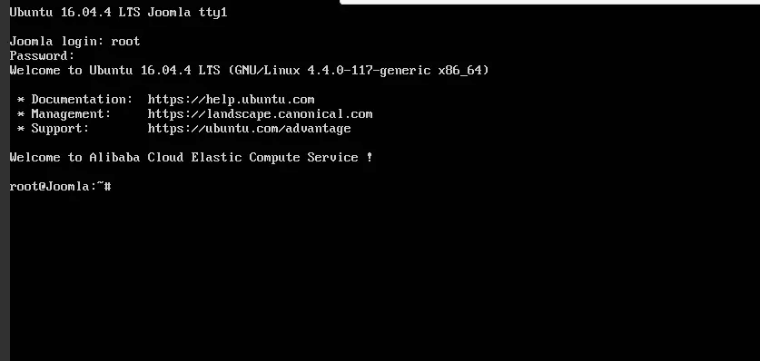

# 如何在阿里云 ECS 上部署和托管 Joomla 网站

> 原文：<https://www.sitepoint.com/how-to-deploy-and-host-a-joomla-website-on-alibaba-cloud-ecs/>

*本文原载于[阿里云](https://community.alibabacloud.com/blog/how-to-deploy-and-host-a-joomla-website-on-alibaba-cloud-ecs_593873?spm=a2c65.11461478.0.0.5c835355u5CXTf)。感谢您对使 SitePoint 成为可能的合作伙伴的支持。*

珠姆拉。是一个免费的开源内容管理系统(CMS ),也是其中最受欢迎的一个。官网上说，Joomla！建立在模型-视图-控制器 web 应用程序框架之上，可以独立于 CMS 使用，允许您构建强大的在线应用程序。

我个人最喜欢的 Joomla 特性之一！是多语言支持及其庞大的语言包库。你也可以用语言扩展翻译网站管理后台，帮助你轻松地本地化你的网站。

这个分步指南将带你完成 Joomla 的设置和部署！基于 Ubuntu 16.04 的[阿里云弹性计算服务(ECS)](https://int.alibabacloud.com/m/1000019610/) 实例的网站。

## 要求和先决条件

在我们部署我们的 Joomla 之前！实例，我们需要满足以下要求。我们需要设置一个具备基本配置的阿里云弹性计算服务(ECS) Linux 服务器(Ubuntu 16.04)。您还应该为非 root 用户分配管理员(sudo)权限。

您可以参考[本指南](https://int.alibabacloud.com/m/1000019611/)来设置您的阿里云 ECS 实例。如果你没有阿里云账户，你可以免费注册，享受[300 美元的免费试用信用](https://int.alibabacloud.com/m/1000019612/)。

## 在 Ubuntu 16.04 ECS 实例上安装 Joomla

要在我们的服务器上安装 Joomla，我们需要首先安装一个 LAMP (Linux，Apache，MySQL，PHP)栈。

### 步骤 1:连接到您的服务器

有很多方法可以将[连接到你的服务器](https://int.alibabacloud.com/m/1000019613/)，但是为了简单起见，我将使用阿里云控制台。为此，请转到您的实例部分，并从您创建的实例中单击 connect。您将被重定向到终端。

输入用户名作为 Root，并输入您创建的密码。如果您没有创建密码，只需按 enter 键继续。您以系统管理员身份登录到服务器。



以下各节中的所有命令都应该在此终端中键入。

### 步骤 2:安装 Apache

要安装 Apache，请通过键入以下命令来更新您的服务器存储库列表。

`sudo apt-get update`

然后安装 Apache web 服务器。

`sudo apt-get install apache2`

### 第三步:安装 MySQL

Joomla 和大多数其他内容管理系统一样，需要 MySQL 作为后端。所以我们需要安装 MySQL 并链接到 PHP。

为此，添加以下命令。

`sudo apt-get install mysql-server php7.0-mysql`

您将被要求输入一个 MySQL 密码。请保管好密码，因为您以后会用到它。

使用下面的命令完成 MySQL 的安装过程。

`/usr/bin/mysql_secure_installation`

您将被要求输入刚刚创建的 MySQL 密码。通过选择以下选项继续安装过程。

```
Would you like to setup VALIDATE password plugin ? [Y/N] N
Change the root password ? [ Y/N ] N
Remove anonymous users ? [Y/N] Y
Disallow root login remotely ? [Y/N] Y
Remove test database and access to it ? [Y/N] Y
Reload privilege tables now ? [Y/N] Y 
```

### 步骤 4:安装 PHP

珠拉。需要安装 PHP。执行下面的命令来安装 PHP 7.0 和其他需要的 PHP 模块。

`sudo apt-get install php7.0 libapache2-mod-php7.0 php7.0-mcrypt php7.0-xml php7.0-curl php7.0-json php7.0-cgi`

### 步骤 5:确认灯的安装

要确认 LAMP stack 已安装在您的 Ubuntu 16.04 服务器上，请遵循以下步骤。

打开 web 浏览器，导航到您的服务器的 IP 地址。你会看到 Apache2 Ubuntu 的默认页面。

**注意**:要检查您的服务器的公共 IP 地址，请检查您的 ECS 实例仪表板。您会看到私有和公共 IP 地址。使用公共 IP 地址访问您的网站。如果您没有看到公共 IP 地址，请考虑设置一个[弹性 IP 地址](https://int.alibabacloud.com/m/1000019614/)。

为了确认服务器上的 PHP 安装，请删除默认页面，并用下面的 PHP 代码替换它。为此，请使用下面的命令。

`rm /var/www/html/index.html`

用新文件替换:

```
touch /var/www/html/index.php
nano /var/www/html/index.php 
```

在下面输入一个示例 PHP 代码:

```
<?php
phpinfo();
?> 
```

要检查您的页面，请导航到您的 web 浏览器并输入公共 IP 地址。如果 LAMP 堆栈正确安装在您的服务器上，您应该会看到关于 PHP 安装的信息。

现在使用下面的命令删除 index.php 文件:

`rm /var/www//html/index.php`

### 步骤 6:安装和配置 Joomla！在 ECS 上

我们差不多完成了。在这一步，我们将安装 Joomla！。

在下载和安装 Joomla 之前！，我们需要打开 Apache web 服务器的根目录。

`cd /var/www/html`

然后，下载 Joomla！安装文件。

`wget [https://downloads.joomla.org/cms/joomla3/3-7.5-Stable-Full-Package.zip](https://downloads.joomla.org/cms/joomla3/3-7.5-Stable-Full-Package.zip)`

确保您安装的版本是最新版本。

要解压缩下载的归档文件，请安装 unzip。

`sudo apt-get install unzip`

解压缩下载的 Joomla Zip 文件:

`unzip Joomla_3-7.5-Stable-Full_Package.zip`

如果不能解压缩`.tar.gz`文件，使用以下命令:

`tar -xvzf Joomla_3-7.5-Stable-Full_Package.tar.gz`

接下来，激活。重命名 htaccess 文件。

`mv htaccess.txt .htacess`

然后设置适当的文件权限:

```
chown -R www-data /var/www/html
chmod -R 755/var/www/html 
```

### 步骤 7:为 Joomla 创建一个 MySQL 数据库和用户！

珠姆拉。利用关系数据库来存储和管理站点和用户数据。在本教程中，我们将在 ECS 实例上使用 MySQL。然而，出于生产目的，我建议使用[阿里云 Apsara DB](https://int.alibabacloud.com/m/1000019615/) 以增加安全性和可靠性。

由于我们之前已经安装了 MySQL，我们只需要为 Joomla 创建一个数据库和用户。为此，请使用下面的命令登录您的 MySQL 帐户。

`mysql -u root -p`

系统会提示您输入上面创建的 MySQL 密码。成功登录后，您将进入 MySQL shell。

现在让我们为 Joomla 创建一个数据库！。你可以给它起任何你喜欢的名字。在我下面的命令中，我使用了“joomla”。

`mysql > CREATE DATABASE joomla ;`

记住 MySQL 中的每个命令都以一个终止符分号(；).创建一个新用户，并授予其访问数据库的权限。您可以用自己选择的用户名和密码替换“用户”和“密码”。

`mysql>GRANT ALL PRIVILEGES on joomla.* to ‘ user'@ ‘locahost' identified by ‘password';`

现在，刷新特权，以便当前的 MySQL 实例知道我们最近所做的特权更改。在下面输入命令。

`mysql>FLUSH PRIVILEGES ;`

使用以下命令退出 MySQL shell:

`msql>exit;`

现在你应该回到你的服务器终端。

### 步骤 8:通过 Web 界面完成安装过程

首先，我们需要重启 Apache Web 服务器。为此，请输入以下命令:

`systemct1 restart apache2`

打开 web 浏览器，导航到服务器的公共 IP 地址。你会看到珠穆朗玛的！网络界面。继续安装过程。

在**数据库配置**部分输入您的 MySQL 用户名、密码和数据库。在我们的例子中，这看起来像:

```
Database Type : MySQL
Host Name : localhost
Username : user
Password : password
Database Name : joomla
Table Prefix : joomla_
Old Database Process : Remove . 
```

填写剩余的必填信息，直到完成安装过程。就是这样！

## 最后的想法

如前所述，如果你计划部署一个 Joomla 网站用于生产，我会推荐使用[阿里云 ApsaraDB](https://int.alibabacloud.com/m/1000019615/) 用于 RDS。阿里云 ApsaraDB for RDS(关系数据库服务)是一种按需数据库服务，将您从管理数据库的管理任务中解放出来。这让你有更多的时间专注于核心业务。

## 分享这篇文章