# 如何将你的第一个应用部署到 PHP Cloud

> 原文：<https://www.sitepoint.com/how-to-deploy-your-first-app-to-phpcloud/>

有越来越多的[平台即服务](http://searchcloudcomputing.techtarget.com/definition/Platform-as-a-Service-PaaS)选项可供开发者选择，因此 Zend 加入这一行列并不令人惊讶。 [PHP Cloud](http://www.phpcloud.com) 目前是一个公共预览版，但它已经提供了一些关键功能，如:MySQL 访问、通过 Git 的源代码管理、部署到其他云服务以及 SFTP 访问。

在本文中，我将向您展示如何在 PHP Cloud 的应用程序容器中设置 CakePHP 安装。在这个过程中，您将看到如何访问 MySQL、部署代码，以及如何从 FTP 客户端使用 SFTP 来访问应用程序容器。

## 首先，获得一个 zend.com 帐户和一个 phpcloud.com 邀请

如果你还没有 zend.com 账户(免费)，你需要[创建一个。然后你需要向](https://www.zend.com/en/user/register)[申请邀请](http://www.phpcloud.com/develop)。通常 Zend 会在 24 小时内给你发邀请。

## 访问键

收到邀请并创建帐户后，首先要做的是设置访问密钥(登录后从左侧菜单中)。如果您已经有一个 RSA 对，您可以上传您现有的公钥。如果没有，或者如果您想只为 PHP Cloud 创建一个，您可以使用该选项来生成一个新的密钥对:

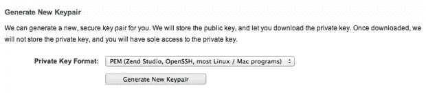

然后，您可以下载。pem 文件(私钥)并将其安全地存储在您的机器上。

## 创建一个容器

要创建容器，请在登录后从左侧菜单中单击我的容器。您将看到一个表单，询问您想要设置的容器的基本信息:

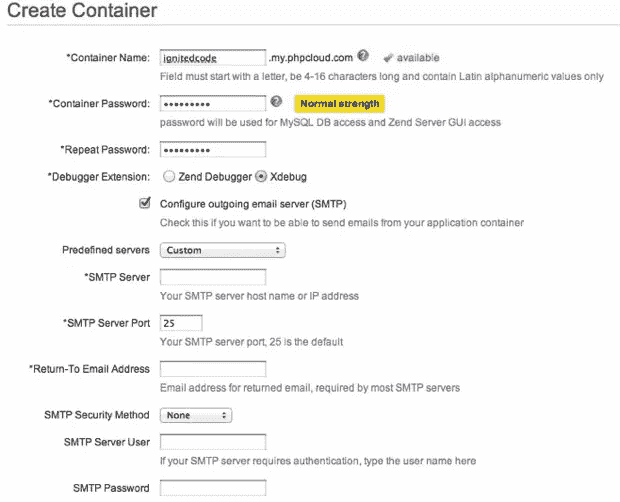

请注意，您也可以设置容器来发送电子邮件。然后会要求您稍等片刻，等待您的容器被调配:

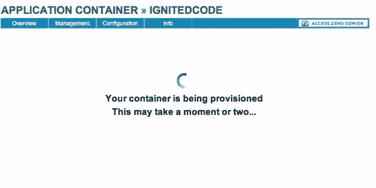

这就是创建容器的全部内容。

## 关于 SSH/Shell 访问的一句话

在撰写本文时，还没有提供对 shell 的访问。有一些有限的 SSH 访问。您可以访问 MySQL 实例或 Zend Studio 进行远程调试。虽然看起来确实有问题，但是我在通过 SSH 连接时遇到了很多问题，主要是关于:

```
Connection timed out during banner exchange
```

请记住，目前这是一个预览版，所以肯定会有初期问题。我们现在可以解决这个问题。

## 数据库访问

我们获得访问权限的另一种方式是通过 phpMyAdmin 安装。从应用程序容器中，单击管理->数据库管理:

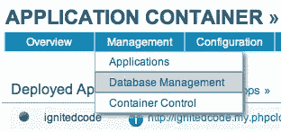

这将提供到 phpMyAdmin 的链接:

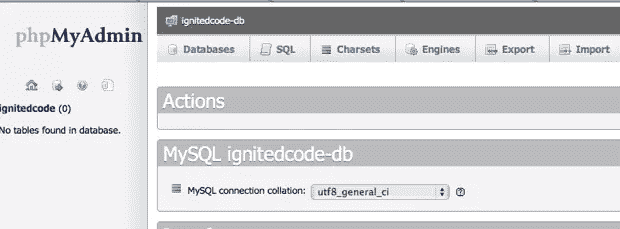

现在你可以像平常一样使用 MySQL，导入数据，创建表格等等。为了能够通过您的代码连接到您的数据库，您需要:

*   数据库主机:mycontainer-db.my.phpcloud.com
*   数据库端口:3306
*   数据库架构名称:mycontainer
*   数据库用户:mycontainer
*   数据库密码:您的容器密码

## Git 访问

您可以通过 Git:
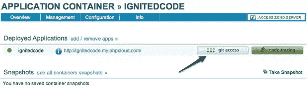
直接使用您的源代码。该按钮将提供一个指向您可以克隆的存储库的 url:

```
cd ~/sites
git clone https://mycontainer@mycontainer.my.phpcloud.com/git/container-root.git myproject
```

显然，您需要将您的目录更改为您想要存储代码的位置，并且添加您已经使用的容器名称来代替 *mycontainer* 。

## SFTP 入口

如果您使用支持 STFP 的 FTP 客户端，那么您也可以通过这种方式访问您的容器。您将需要以下信息:

*   用户名:mycontainer
*   主持人姓名:mycontainer.my.phpcloud.com
*   端口:22(这是默认的 SFTP 端口，通常不需要指定)
*   RSA 私钥:您的私钥文件的路径

私钥路径应该指向。pem 文件或您现有的私钥。

一旦连接完毕，您将看到一个如下所示的文件结构:

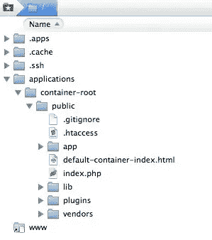

您的代码应该放在公共文件夹中。您将看到我已经添加了属于 CakePHP 安装的文件和文件夹。

你可以通过 Git 工作，也可以通过 SFTP 上传工作，选择权在你。

## 试用——一个简单的 CakePHP 应用程序

我们将安装 CakePHP，并构建一个简单的博客应用程序，这样我们就可以证明在 Zend Cloud 上工作正常。

> CakePHP 的正常安装要求您更改某些文件夹和文件的权限。因为 PHPCloud 没有 shell 访问权限，所以您必须通过 SFTP 访问安装。

下载 CakePHP 的[稳定版本的新副本，解压缩，然后使用上述 SFTP 方法将其上传到您的容器中。确保你上传了**所有的**文件；CakePHP 有一些隐藏文件，你也需要确保上传。](https://github.com/cakephp/cakephp/zipball/2.0.6)

### 1.更改权限–应用程序/tmp

接下来，使用您首选的 FTP 客户端将 app/tmp 文件夹的权限更改为 777(读写)。Cake 使用这个文件夹来存储会话数据、日志、缓存和测试结果。

### 2.更新 app/config/core.php

向下滚动到第 182 行，将安全盐更改为您自己的盐。此外，将 cipherSeed 值更改为随机数字字符串。

### 3.添加您的数据库设置

您用于 phpMyAdmin 的数据库设置应该添加到 app/config/database.php 中(您需要从 database.php.default 中重命名该文件)。

### 4.测试你的网站

通过单击应用程序容器中的链接，从访问您的站点:

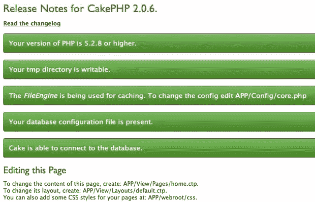

运气好的话，你会看到类似上面的截图。

### 4.向数据库中添加表

登录到容器中的 phpMyAdmin 实例，单击窗口左侧的数据库名称，然后将下面的 SQL 代码复制并粘贴到 SQL 选项卡的文本框中。单击“Go”按钮，您的表将被创建:

```
/* First, create our posts table: */
CREATE TABLE posts (
    id INT UNSIGNED AUTO_INCREMENT PRIMARY KEY,
    title VARCHAR(50),
    body TEXT,
    created DATETIME DEFAULT NULL,
    modified DATETIME DEFAULT NULL
);

/* Then insert some posts for testing: */
INSERT INTO posts (title,body,created)
    VALUES ('The title', 'This is the post body.', NOW());
INSERT INTO posts (title,body,created)
    VALUES ('A title once again', 'And the post body follows.', NOW());
INSERT INTO posts (title,body,created)
    VALUES ('Title strikes back', 'This is really exciting! Not.', NOW());
```

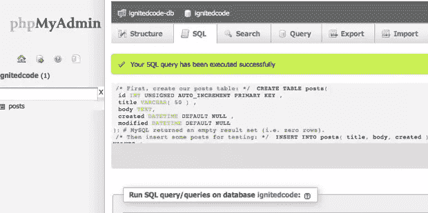

在这个阶段，您现在可以恢复使用 Git，因为文件权限问题已经解决了。

## 克隆您的存储库

我将假设您已经安装了 Git，并且知道如何使用它。回到您的容器，您可以在以下位置找到克隆 url:

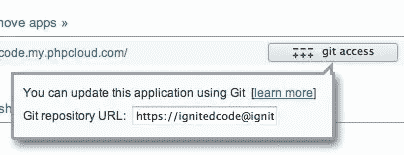

打开你的终端/控制台，将目录切换到你想要存储项目的地方。然后克隆存储库:

```
git clone https://your_container.my.phpcloud.com/git/container-root.git myproject
```

## 是时候写点代码了

我们将从创建处理博客帖子的代码开始。

### 1.创建帖子模型

在 app/Model 中创建一个名为 Post.php 的新文件，并添加以下代码:

```
<?php
class Post extends AppModel {
    public $name = 'Post';
}
```

### 2.创建帖子控制器

我们将为控制器创建公共轮廓:

```
<?php
class PostsController extends AppController {
    public $name = 'Posts';
    public $helpers = array('Html', 'Form');
}
```

你会注意到我们也加载了一些常用的助手。接下来，我们将添加一个动作来获取 posts 表中的所有条目:

```
public function index() {
        $this->set('posts', $this->Post->find('all'));
    }
```

### 3.添加视图文件

在 app/views/Posts 中创建一个名为 index.ctp 的新文件，并添加以下代码:

```
<!-- File: /app/View/Posts/index.ctp -->

<h1>Blog posts</h1>
<table>
    <tr>
        <th>Id</th>
        <th>Title</th>
        <th>Created</th>
    </tr>

    <!-- Here is where we loop through our $posts array, printing out post info -->

    <?php foreach ($posts as $post): ?>
    <tr>
        <td><?php echo $post['Post']['id']; ?></td>
        <td>
            <?php 
                echo $this->Html->link($post['Post']['title'],
                    array('controller' => 'posts', 'action' => 'view', $post['Post']['id'])); 
            ?>
        </td>
        <td><?php echo $post['Post']['created']; ?></td>
    </tr>
    <?php endforeach; ?>

</table>
```

### 4.检查进度

这似乎是 PHP 云处理方式的一个问题。htaccess 文件。要让事情正常进行，请转到 app/config/core.php，并按照以下建议进行操作:

```
/**
 * To configure CakePHP *not* to use mod_rewrite and to
 * use CakePHP pretty URLs, remove these .htaccess
 * files:
 *
 * /.htaccess
 * /app/.htaccess
 * /app/webroot/.htaccess
 *
 * And uncomment the App.baseUrl below:
 */
    Configure::write('App.baseUrl', env('SCRIPT_NAME'));
```

您现在可以访问您的网站:http://my-container.my.phpcloud.com/index.php/posts/index:

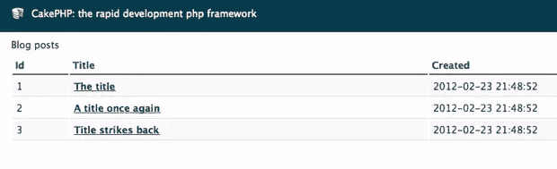

### 5.添加视图操作

您会注意到单击链接会导致一个错误。这是因为我们在 posts 控制器中没有一个视图动作，也没有一个相关的视图文件。

因此，在 app/Controller/posts Controller . PHP 中添加所需的操作:

```
public function view($id = null) {
        $this->Post->id = $id;
        $this->set('post', $this->Post->read());
}
```

然后，在 app/View/Posts 中添加 view.ctp:

```
<!-- File: /app/View/Posts/view.ctp -->
<h1><?php echo $post['Post']['title']?></h1>
<p><small>Created: <?php echo $post['Post']['created']?></small></p>
<p><?php echo $post['Post']['body']?></p>
```

现在，您可以点击链接来查看单个帖子。

## 最后…

您已经看到了如何在 PHP Cloud 上创建并运行一个简单的应用程序。仍然有一些问题，但是一旦它们被解决，这无疑将是一个强大的云托管解决方案。

通过 SFTP 登录的能力很重要，但是缺少 shell 访问是不幸的。然而，通过 phpMyAdmin、Git 以及部署到其他云服务的能力，PHP Cloud 已经提供了很多。

## 分享这篇文章