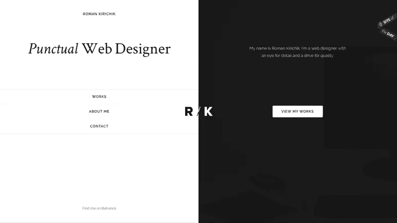
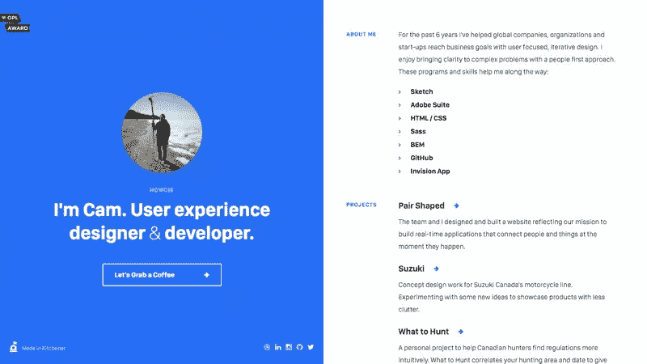
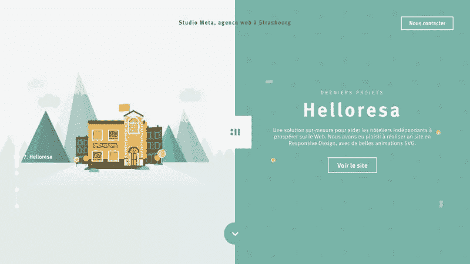
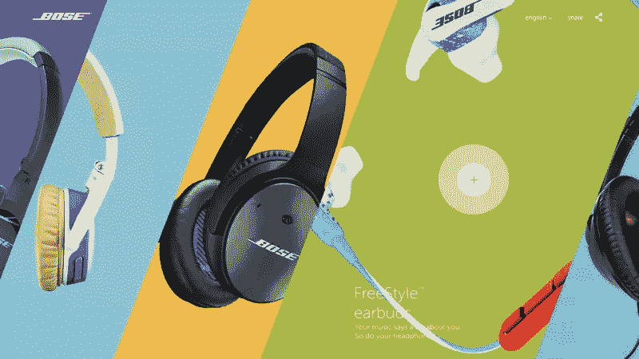
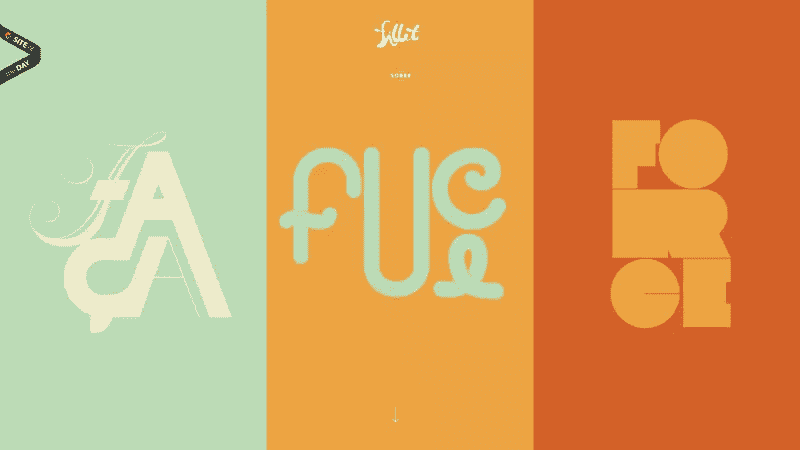

# 如何设计一个可爱但有效的分屏布局

> 原文：<https://www.sitepoint.com/how-to-design-a-daring-but-effective-split-screen-layout/>

分屏布局是被分成两个(或更多)相等的垂直列的全屏 web 组件。

然而，尽管分屏布局非常流行，但如果你的选择背后没有合理的逻辑原因，那么*会*伤害用户体验，这是一个大胆的风格决定。

据说，当正确执行时，它可以为用户提供美妙的观看体验。

罗曼·基里切克的分屏网站设计

## 为什么要使用分屏布局？

分屏组件在极简主义的网页设计中工作得最好，因为负空间与大胆的垂直分割相结合增加了对重要区域的极大关注。

除了这些优点，分屏布局的好处远远超出了视觉美感；它们对于带有两个并排可选选项的网页登陆特别有效。

一些明显的例子包括:

*   登录和注册表单
*   付费和免费订阅
*   有不同颜色的产品

## 分屏组件的好例子

首先，让我们看看一些很棒的例子，并讨论为什么它们对*他们的*用例如此有效。分屏布局可以有很多不同的使用方式，所以不同网站的优势也不同，这取决于网站想要达到的目标。

### 凸轮频闪

不是每个网站设计都需要访问整个水平视口。在超小型设计中，如 [Cam Strobel 的](http://www.camstrobel.com/)网站，将屏幕分成两个垂直栏意味着所有内容都可以在折叠上方，完全消除了用户滚动的需要。

### Studio Meta

全幅“大标题”设计仍然很常见——这是一个巨大的趋势，也是理所当然的，但是，由于缺乏文本易读性，很少有机会使用大胆的图像(我们通常必须模糊图像或添加颜色覆盖)。分屏布局解决了这个问题， [Studio Meta](http://www.studiometa.fr/helloresa/) 向我们展示了具体方法。

通过把图片和内容放在一起，我们可以使用更丰富多彩、更有勇气和更深刻含义的图片，因为我们不必以任何方式模糊图片。

### Bose

分屏不一定要由两个 50/50 的组件组成——[Bose](http://special.bose.eu/en/)将这种趋势发挥到了极致，尽管我确实注意到该网站甚至没有*尝试*适应更小的屏幕。不管这看起来有多漂亮，响应式设计是你必须考虑的事情，而且很难将分屏布局应用到更小的设备上。

除此之外，这是我最喜欢的分屏例子，因为这种布局允许 Bose 通过使用不同的颜色来展示每个具有独特个性的项目。结合前卫的对角线形状，这个网站真的抓住了我的眼睛。

Fillet 是另一个很好的例子，展示了分屏布局如何将个人个性注入同等重要的 web 组件中。此外，因为只有*三个*垂直栏，几乎没有内容(每个栏展示艺术作品)，这在移动设备上显示正确。

## 设计分屏布局时要记住的 3 件事

如果你正在考虑为你的网站设计一个分屏组件，你应该在设计的时候记住这三点。

### 1.移动友好型

分屏组件确实有一个缺点:它们不太适合移动设备。很难让它们反应灵敏并适应更小的屏幕(横向视图中的平板电脑除外)——你几乎肯定不得不缩小规模，这可能需要比平时多一点的编码，所以确保你采取移动优先的方法。

*注意:由于上面的 Bose 例子被分成五个部分，而不是两个部分，它根本不适应更小的屏幕** 。*

### 2.没有好的理由不要分屏

你应该首先考虑你的网站是否需要分屏组件。当然，这是“潮流”，看起来很酷，但这本身并不足以成为实施它的理由。

*   让组件具有响应性的额外工作值得吗？
*   你的用户是否有足够的趋势意识来欣赏这种布局，还是会让他们感到困惑？
*   是否会有足够的负空间让布局发挥作用？
*   当一个更单一的焦点对你来说是更好的结果时，你是否有将用户的注意力一分为二的危险？

如果这些答案中有任何一个是否定的，那么你应该投票反对这个想法。

### 3.利用负空间

桌面网站水平显示，但当使用分屏布局时，每个组件都成为主视窗中的一种垂直视窗。

正因为如此，有更多的机会去探索新的方式来显示内容。这绝对是一个发挥创意的机会，所以戴上你的创意帽吧！

## 结论

分屏布局很吸引人，正如我们从例子中看到的，这种趋势的好处取决于网站要实现的目标；它们可以用来为每一列定义不同的身份，或者它们可以用于一个更简单的原因:在不需要整个视窗宽度的最小网站中保持所有的内容。

如果你以前没有尝试过设计分屏布局，是什么诱惑你现在尝试呢？是视觉美感，还是尝试新的内容展示方式的机会？

请在下面的评论中告诉我！

## 分享这篇文章