# 如何消除你的五大网页设计难题

> 原文：<https://www.sitepoint.com/how-to-eliminate-your-top-5-web-design-pains/>

*这篇赞助文章由我们的内容合作伙伴 [BAW 媒体](https://bawmedia.com?utm_source=sitepoint.com&utm_campaign=oct18&utm_medium=content)创作。感谢您对使 SitePoint 成为可能的合作伙伴的支持。*

对于网页设计师来说，有什么比在几周的辛勤工作后看到自己的设计被展示出来更令人满意的呢？

设计一个新网站并不容易。事实上，兴奋和失望总是交织在一起的。尤其是当网页设计师开始建立一个新网站的时候。

而这样的感受可以击垮任何一个设计师的精神。真正的问题是网页设计师如何消除与建立网站相关的痛苦？

答案很简单。通过发现预建网站的伟大世界。

让我们一起去这个有趣的世界旅行吧。你将学会如何消除 5 个最恼人的网站问题。

如果你在整个旅程中感到轻松，不要感到惊讶。这就是当你摆脱恼人的东西时会发生的事！

## 发现预建网站的伟大世界

预建网站使设计网站的整个过程更加容易。它们消除了所有的编码、线框和原型制作。它们为您提供了一个可编辑的布局，让您快速起步。你会喜欢与预先建立的网站。

以最流行的多用途 WordPress 主题 Be Theme 为例。

[**Be 主题**](https://baw.agency/a/p4h8d?utm_source=sitepoint.com&utm_campaign=oct18&utm_medium=content) 在主题森林中享有稳定的五星评级。它有超过 380 个预建网站。这些涵盖了 30 多个不同的行业。

这意味着你有很多设计选择。他们可以帮助你消除网站的烦恼。

让我们来看看。

### 预建网站将消除这五大网站难题

> 1.  "Help! I don't know how to start my client's web design. My client is an environmentally friendly chihuahua trainer AI robot. "

现在的网站是如此的专注和复杂。这使得研究新项目更具挑战性。

当然，我们都知道研究在网站设计中起着非常关键的作用。这不就是他们说*“在设计单个像素之前，你必须了解你的市场”*的原因吗？

是的，了解你的市场很重要。但是你不应该用不必要的研究使你的大脑过热。

预建网站使这一过程更加容易。只需浏览预建网站的目录。看一看那些可与 Be 主题。他们所需要的只是一点定制，他们已经准备好了。

例如，它可以适用于你的环保吉娃娃教练的情况。WordPress BeTheme 预建网站可以迎合这类小众。以下是一些例子:

**——一个神奇的环保网站**

 **[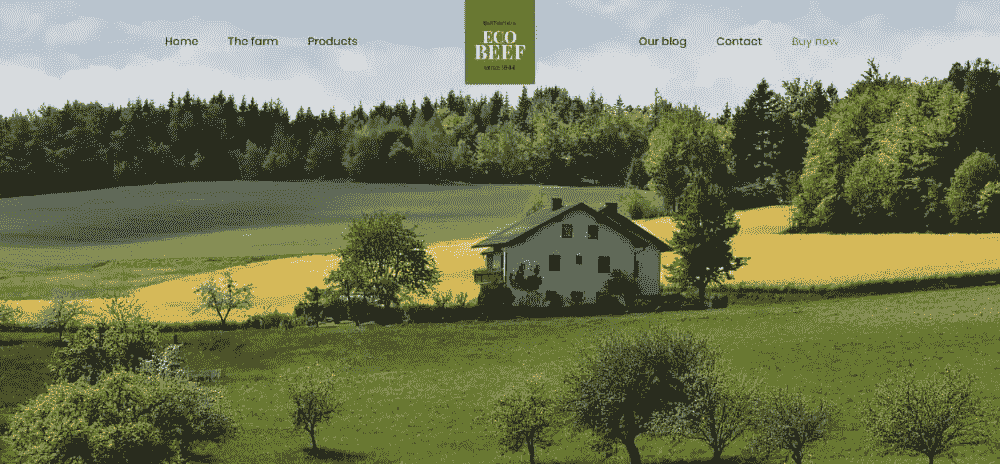](https://baw.agency/a/oeez4?utm_source=sitepoint.com&utm_campaign=oct18&utm_medium=content)

[**【bevet 2】**](https://baw.agency/a/7v8dy?utm_source=sitepoint.com&utm_campaign=oct18&utm_medium=content)——也是一个宠物爱好者的好网站

[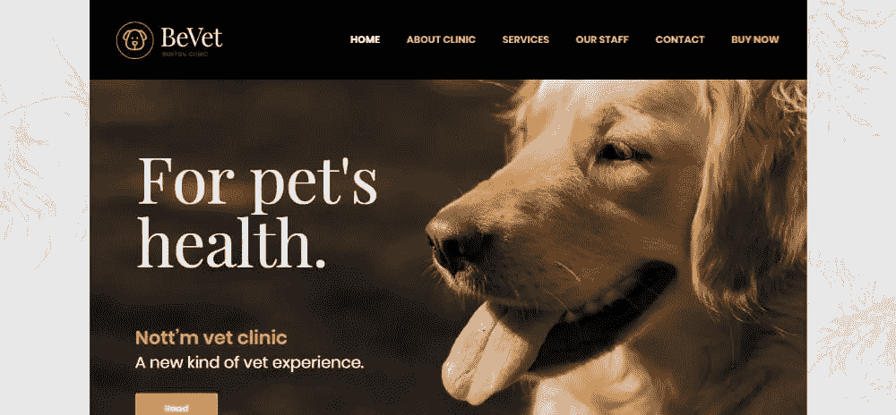](https://baw.agency/a/7v8dy?utm_source=sitepoint.com&utm_campaign=oct18&utm_medium=content)

[**BeDrone**](https://baw.agency/a/p52dq?utm_source=sitepoint.com&utm_campaign=oct18&utm_medium=content)——一个面向人工智能小众的科技网站

当你使用这些预建的网站时，你不需要了解这个行业。你也不需要进行任何形式的研究。只需编辑预建的网站，添加您的信息。

> 1.  "Bright green is my client's favorite color. She owns a funeral home and hopes her website will adopt this color. "

你的客户提出的一些要求可能会很痛苦。有多少次你把一个项目交给一个客户，只听到“我能得到一个更大的标志设计吗？”或者“这个设计太单调了，我喜欢鲜艳的颜色，你能换一个吗？”

那很痛苦，不是吗？

这也是预建网站如此酷的原因之一。预建网站使用与当前行业标准兼容的设计。你可以设计网站来满足你的客户和访问者的期望。

这是所有你的客户需要看到和知道的，这将消除他们的担忧。

下面是一些 Be Theme 明亮大胆的预建网站的例子。受到启发。

 **

[**【饮料 3】**](https://baw.agency/a/571q9)

[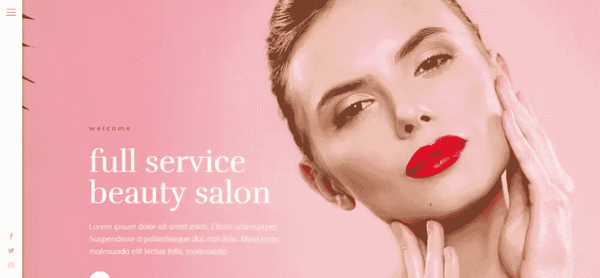](https://baw.agency/a/571q9)

[**becoffee 3**](https://baw.agency/a/fprj2)

> 1.  "Is my client really serious? How can I make the logo bigger and make it pop up on the page? "

是的，你的委托人是认真的。你无法逃脱网页设计师的噩梦？一点也不！而且很痛苦。

客户总会有意想不到的要求，当然，你不必同意。但是记住，你的目标是取悦客户。

如果你的客户要求一个更大的标志，不要惊慌或痛苦。Be 主题有预先建立的网站，将使公司看起来很好。不再需要一个巨大的标志。

这里有几个例子:

[**伪钞**](https://baw.agency/a/eygcx?utm_source=sitepoint.com&utm_campaign=oct18&utm_medium=content)

[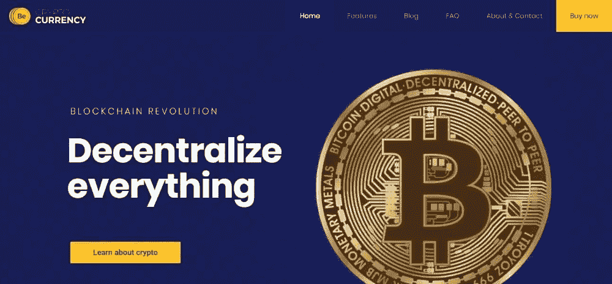](https://baw.agency/a/eygcx?utm_source=sitepoint.com&utm_campaign=oct18&utm_medium=content)

 **[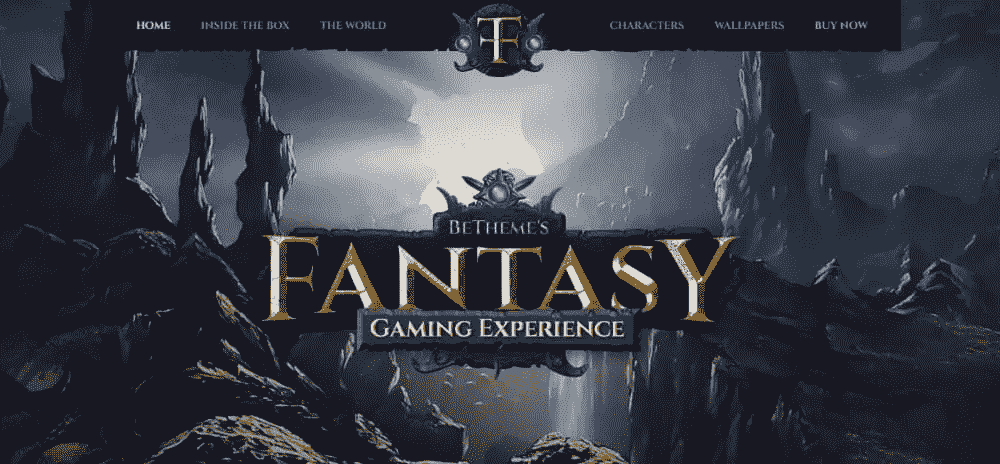](https://baw.agency/a/kkrsy?utm_source=sitepoint.com&utm_campaign=oct18&utm_medium=content)

[**安全 2**](https://baw.agency/a/pg2su?utm_source=sitepoint.com&utm_campaign=oct18&utm_medium=content)

[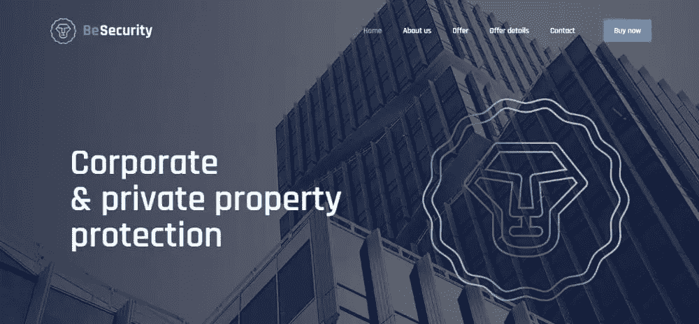](https://baw.agency/a/pg2su?utm_source=sitepoint.com&utm_campaign=oct18&utm_medium=content)

[**钟表匠**](https://baw.agency/a/tibj2?utm_source=sitepoint.com&utm_campaign=oct18&utm_medium=content)

[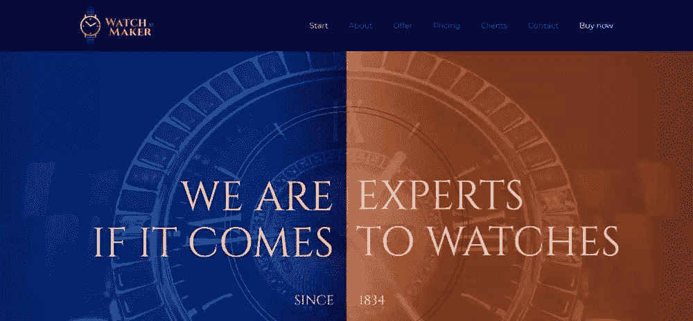](https://baw.agency/a/tibj2?utm_source=sitepoint.com&utm_campaign=oct18&utm_medium=content)

[**成为公司 3**](https://baw.agency/a/moaod?utm_source=sitepoint.com&utm_campaign=oct18&utm_medium=content)

> 1.  "This is really incredible! My client wants me to make it look like it's moving, not moving! "

现在你知道#thestruggleisreal 标签背后的真正灵感了。

从头开始设计一个网站是一场斗争。这是一场痛苦而真实的斗争，尤其是当你有要求很高的客户时。

但是不要害怕。老实说，网上有太多无聊的网站。尽管看起来很乏味很累，但你会享受最终的结果。

预建网站正在创造令人敬畏的解决方案。出色的解决方案正是您的客户所需要的。发挥你的想象力和创造力。你也可以增加乐趣，但保持你的设计的专业性。

你会喜欢这些预建的网站。偷看一眼！

[**贝巴尔曼**](https://baw.agency/a/k21am)

[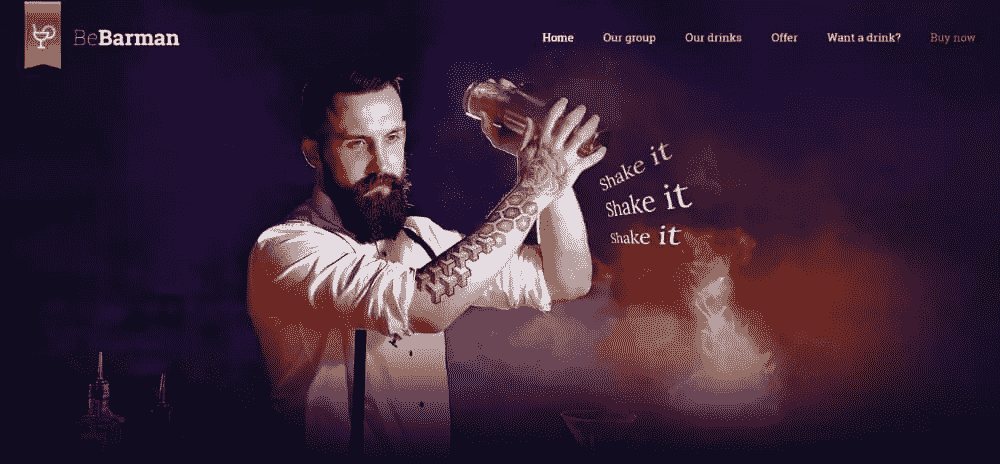](https://baw.agency/a/k21am)

[**BeManicure**](https://baw.agency/a/3ojk0)

 **[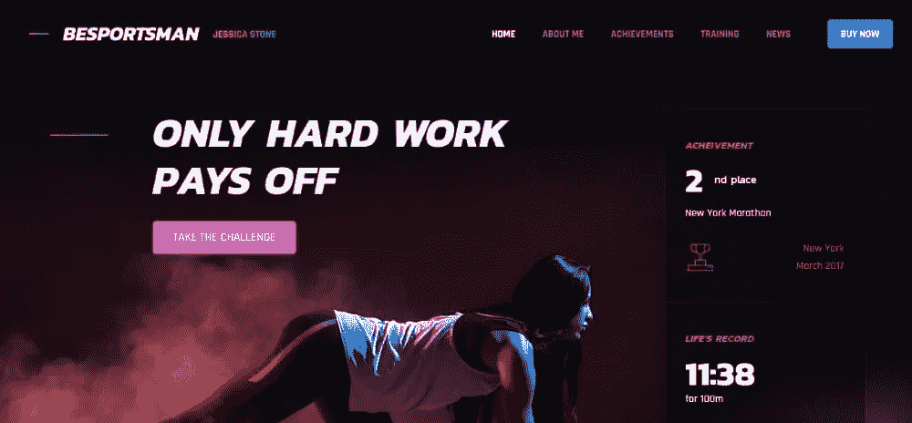](https://baw.agency/a/f3k6w)

> 1.  "I need an innovative, technological and amazing website, and I won't be satisfied with it. What did I get myself into? "

是的，我们知道…你想设计迷人和惊人的网站。没关系。

但现实是，也许，太过不堪。有大量的紧急邮件需要你回复，还有一些日程安排的变动。这对你来说太难了。所以你的创新、技术和惊人的网站计划几乎被遗忘了。

你不必把你的想法撇在一边。有超过 380 个美丽和创新的预建网站设计。

例如:

 **[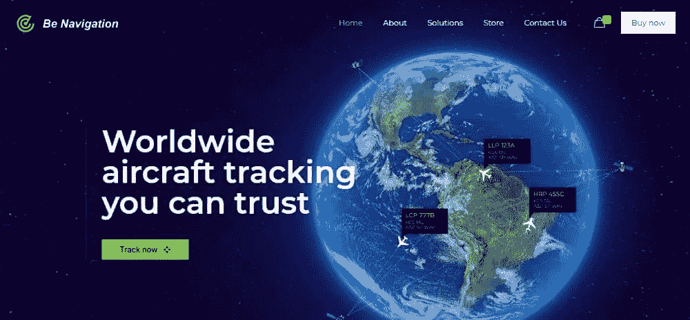](https://baw.agency/a/ivckm?utm_source=sitepoint.com&utm_campaign=oct18&utm_medium=content)

[**bee CO2**](https://baw.agency/a/6d4iw?utm_source=sitepoint.com&utm_campaign=oct18&utm_medium=content)

[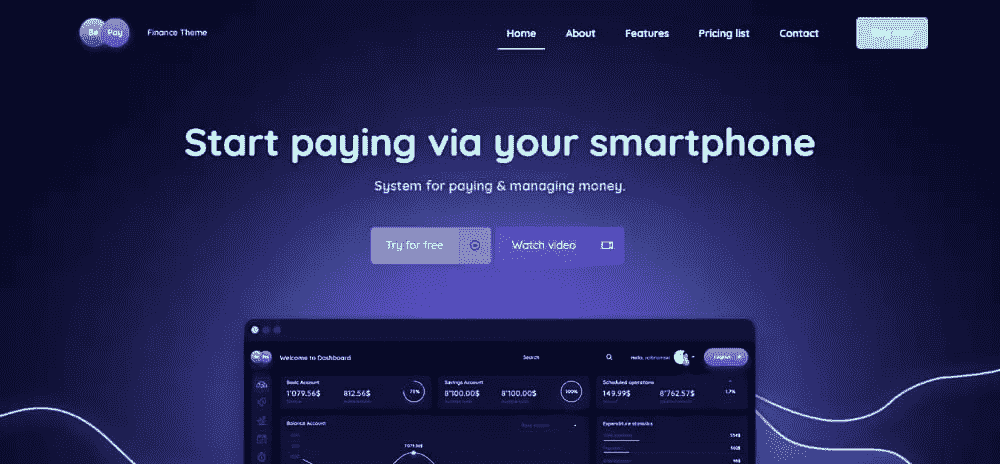](https://baw.agency/a/64jhs?utm_source=sitepoint.com&utm_campaign=oct18&utm_medium=content)

那么，为什么要退而求其次呢？

## 结论

没有人想在工作时感到烦恼。

使用 [Be Theme 的预建网站](https://baw.agency/a/p4h8d?utm_source=sitepoint.com&utm_campaign=oct18&utm_medium=content)会消除小烦人。例如，在极大的压力下工作，以满足最后期限和工作在长期拖长的项目。

你想对自己的工作感觉良好。

当你使用预建的网站时，你将快速而轻松地创建出令人惊叹的网站，吸引并吸引用户。你的客户会喜欢的。有趣的是，你不必牺牲工作质量。

让你的想象力和创造力引领你，享受你作为网页设计师的生活。

现在，继续前进，检查那些预建的网站，主题已经-你会爱上他们！

## 分享这篇文章**********