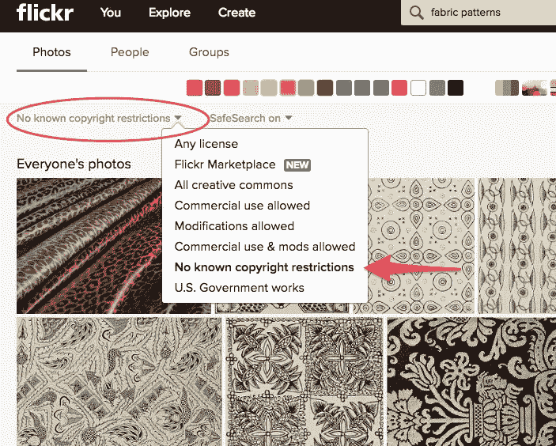
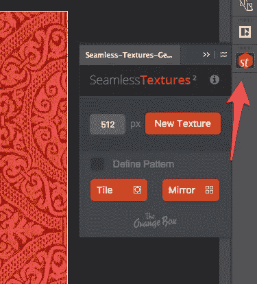
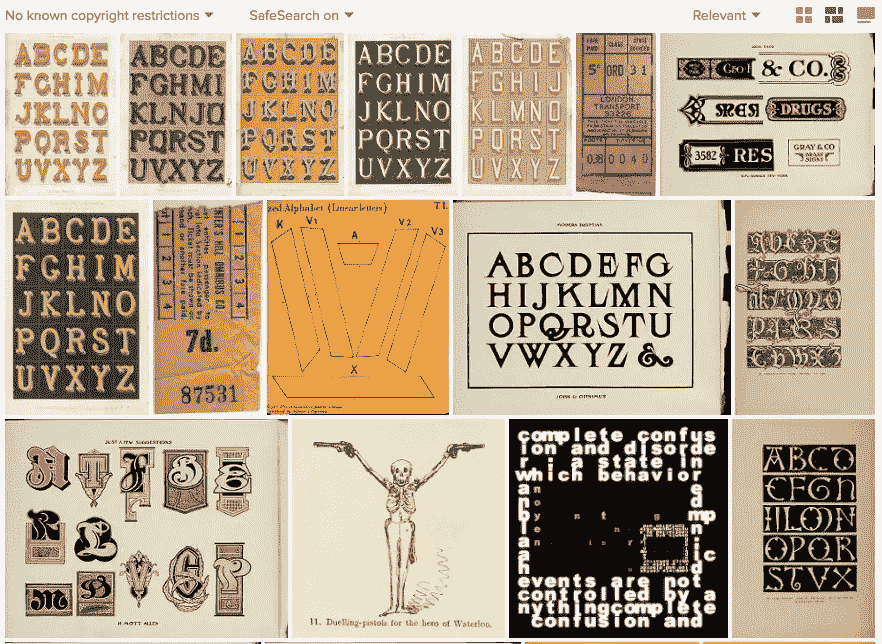
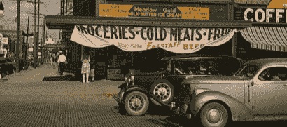

# 如何在 Flickr 上找到酷、古怪、无版权的照片

> 原文：<https://www.sitepoint.com/how-to-find-cool-quirky-copyright-free-photos-on-flickr/>

我想我们都一直在寻找那种让设计感觉新鲜和不同的感觉——一个图案、一张照片或一种感觉不像是普通的纹理。我最喜欢的来源之一是[Flickr](https://www.flickr.com/)——但可能不是你使用它的方式。

当然，我们大多数人都知道 Flickr 巨大的知识共享许可图像库，但是还有另一种丰富的迷人图像值得探索。

![J.L.M. Lauweriks. Alphabet, [1900]. NAI Collection](img/20457494aca5ada85c34934da52ae34f.png)

<small>[J.L.M .劳韦里克斯。字母表，[1900]。奈收藏](https://www.flickr.com/photos/nai_collection/8474899479/)</small>

世界上许多著名的图书馆、政府机构、私人公司、国家档案馆、博物馆和历史学会都使用 Flickr 作为他们的书籍、文档、插图和照片的目录。它的大部分是在公共领域和版权免费。

这包括以下组织:

*   国会图书馆
*   [大英图书馆](https://www.flickr.com/photos/britishlibrary/)
*   [新学院-建筑](https://www.flickr.com/photos/nai_collection/)
*   [沃尔特斯艺术博物馆](https://www.flickr.com/photos/medmss/)

令人难以置信的是，[仅图书图片互联网档案馆](https://www.flickr.com/photos/internetarchivebookimages/)就已经数字化过期的版权书籍十多年了，现在网站上有超过五百万张*图片。*

 *这些作品分为两大类。

1.  版权过期的作品:这些都是旧作品——书籍、杂志、海报和广告材料——版权和创作者本身早已过期。
2.  **未知创作者的作品**:通常是存档的照片，这些是创作者的身份(以及延伸的版权)已经无法确定的作品。

访问这些图像并不难。执行标准搜索，点击左上方的“*任何许可*”下拉菜单，并点击“*无已知版权限制*”。

<small>Flickr 搜索—“无已知版权限制”</small>

## 你会如何使用这些图片？

很明显，我们不是在谈论那种你期望在大型股票网站上找到的目标明确、可预测的图形。这是一个巨大的图书馆，所以你需要有一个计划，否则你可能会连续几天点击“下一页”。

## 想法 1:创建一个模式

互联网[Archive.org](http://Archive.org)已经为 20 世纪早期的室内设计和时尚书籍[建立了一个庞大的图书馆，里面包含了几乎无穷无尽的织物和墙纸样本。](https://www.flickr.com/search/?user_id=internetarchivebookimages&license=7,9,10&tags=bookiddiebiezenfarbsto00farb)。

这可能是一个测试无缝平铺工具的好机会，比如来自[的免费提供的橙色盒子。](http://www.the-orange-box.com/)

<small>橙色框无缝纹理工具</small>

## 想法二:寻找排版灵感

在 1900 年以前，插图在书籍中相对少见，但是排版和文字装饰有着悠久的历史。如果你正在寻找一种略带神秘色彩的“达芬奇密码”的设计风格，你会发现一些令人惊叹的可追溯到 9 世纪的图文并茂的例子。

然而，如果你在寻找一些更现代的东西，简单地搜索一下“[字体文本](https://www.flickr.com/search/?text=typography%20text&license=7,9,10)，就足以找到非凡的、经常被遗忘的字体页面。

<small>Flickr 上的排版</small>

## 想法三:用一件古装作品来营造气氛

如果你想唤起一种情绪，像国会图书馆这样的资源提供了数万张令人难以置信的日常生活照片，可以给设计带来温暖和质朴的魅力。

<small>国会图书馆:[内布拉斯加州林肯市老鹰水果店和首都酒店](https://www.flickr.com/photos/library_of_congress/2179171500/)</small>

现在，我不得不承认，在 Flickr 上找到有用的公共领域图片需要聪明的“搜索”和顽强的决心。你必须在搜索中发挥创造力。将这些图片批量上传到 Flickr 的自动化系统在给它们添加有意义的标签方面做得很好，但是庞大的数量是你需要处理的事情。

里面也有一些非常奇怪的东西——古老的医学图表、颅相学和奇怪的炼金术士文本。这是一次有趣的旅行。

但我不得不说——重铺路面的工作有一些好的地方，可能几十年来都没有被正确地看待。

浏览一下。

*原载于 [SitePoint 设计简讯](https://www.sitepoint.com/newsletter/)* 。

## 分享这篇文章*