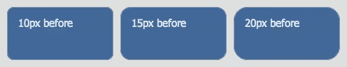
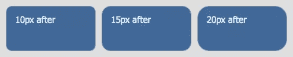

# 如何获得更光滑的圆角

> 原文：<https://www.sitepoint.com/how-to-get-smoother-rounded-corners/>

边框半径——难道你不喜欢吗？它很容易被过度使用，但做得好，不要太频繁，圆角可以为几乎任何东西增加一点档次。

然而，某些颜色组合可能会产生某种锯齿效果，即使所有浏览器都应用了抗锯齿功能。以我的经验来看，令人不快的是深色背景和浅色边框，尤其是在灰白色背景下，这在 Safari 中尤为明显，尽管它在所有浏览器中都有。

这是用 Safari 拍摄的一张图片，用三种不同的边框半径说明了这一点:

看起来很好，但你可以清楚地看到每个角落略有锯齿效果。现在，这些盒子又出现了，这次边角更光滑了:

区别在哪里？简单地**在不同的元素**之间拆分颜色——外部元素有边框和指定的边框半径，而内部元素有背景色和*略小的边框半径*。

这是一个简单的技巧，并没有很大的差别，但正如你所看到的，这确实是一个差别和明显的改进。我不完全确定*为什么*会有所不同，但我猜想这是因为反走样算法的应用方式；因为每种算法只处理一种颜色，而不是两种，或者现在分离的反锯齿合并在一起的方式；一些事情。

如果你想更详细地了解这些例子，[这里是截图的现场演示](https://www.sitepoint.com/examples/smoothcorners/)。但是你也可以在这个页面上看到它——顶部的类别标签，以及右边带有深蓝色标题的框，都使用了这种技术。我在创建这些模板的时候开发了它，因为它的参差不齐困扰着我！

现在它们光滑得像谚语中的婴儿屁股！

*图片来源:[熔化噪音](http://www.flickr.com/photos/meltingnoise/1391718561/)*

## 分享这篇文章