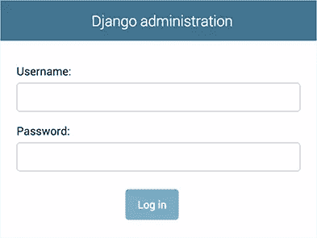
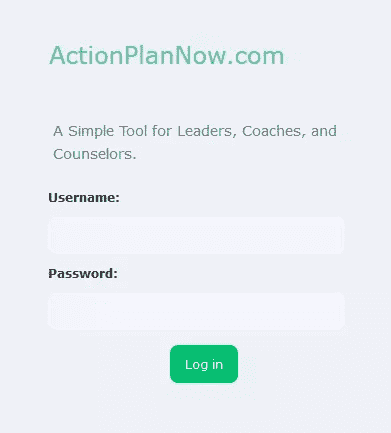

# 如何用 Bootstrap 重新设计 Django Admin

> 原文：<https://www.sitepoint.com/how-to-hack-redesign-customize-the-django-admin-with-bootstrap/>

**[Django 管理网站](https://docs.djangoproject.com/en/dev/ref/contrib/admin/)很棒——功能齐全、易于使用、设计安全、坚如磐石……但有些丑陋，当你想把它与网站的其他部分的外观和感觉结合起来时，这可能是一个缺点。我们来解决这个问题。**

## 如果它没坏…


The default Django admin. ([Source](https://docs.djangoproject.com/en/dev/_images/admin02.png))

假设你刚刚用 Django 和 Vue.js 做了一个 web 应用的原型。在很多情况下，将 Django 的 admin 用于后台办公，甚至在[适当设置权限](https://docs.djangoproject.com/en/dev/topics/auth/default/)后将它移交给你的客户端，都没问题。毕竟，它工作得非常好，而且[它可以通过内置工具](https://docs.djangoproject.com/en/dev/ref/contrib/admin/)进行大量定制，以覆盖许多情况。

所以，又何必呢？

### 黑掉管理员外观和感觉的原因

然而，有许多合理的理由让整合更进一步:

*   **品牌**:想要贵公司的名称和颜色而不是“Django administration”并没有错(并且声明，这符合 Django 的 [BSD 许可](https://github.com/django/django/blob/master/LICENSE))。
*   主站点和管理员之间的无缝集成:通过一个通用的[导航条](https://getbootstrap.com/docs/4.1/components/navbar/)，你可能希望在浏览站点时能够在后台功能之间转换，反之亦然。
*   **美化**:虽然管理员看起来还不错，甚至从 v2 开始就实施了[响应式网页设计](https://en.wikipedia.org/wiki/Responsive_web_design)原则(它在手机和桌面上都运行良好)，但还有很多*一个精心制作的样式表可以让它看起来更好。*
*   **绕过功能**:你可能还想为管理员创建自定义下拉菜单，显示你实际使用的选项，并从[用户界面](https://en.wikipedia.org/wiki/User_interface)中隐藏你并不真正需要的东西，这可以带来更好的[用户体验](https://en.wikipedia.org/wiki/User_experience)。

## 实际例子

对于这个例子，为了不重复我们自己，我们将继续我们在文章[用 Django 和 Vue.js 制作 web 应用程序原型中开始的简单发布 Web 应用程序。](https://www.sitepoint.com/web-app-prototype-django-vue)

简而言之:

*   一个 Django 应用程序有两个[模型](https://docs.djangoproject.com/en/dev/topics/db/models/):
*   **`Article`** 带字段`name` `author`(关联)、`content`和`slug`
*   **`Author`** :带字段`name`和`slug`
*   名为`frontend`的单个[视图](https://docs.djangoproject.com/en/dev/topics/http/views/)查询两种模型中的所有注册中心。
*   名为`template`的单个模板。
*   使用 [Vue 路由器](https://router.vuejs.org/)和 [Vuex](https://vuex.vuejs.org/) 实现 [Vue.js](https://vuejs.org/) 用于反应式可扩展接口。

在这一期中，我们不会特别关心 Vue.js 集成，在这里我们也不会修改它。

### 基本模板


[Source](https://upload.wikimedia.org/wikipedia/commons/thumb/7/75/Django_logo.svg/100px-Django_logo.svg.png)

Django 模板非常通用和强大，既可以在[应用级别](https://docs.djangoproject.com/en/dev/ref/applications/)(Django 站点的一个组件)创建，也可以在站点级别创建，甚至可以覆盖 Django 自带的模板(这就是我们在这里要做的)。


[Source](https://upload.wikimedia.org/wikipedia/commons/thumb/b/b2/Bootstrap_logo.svg/100px-Bootstrap_logo.svg.png)

我们创建了一个链接到 [Bootstrap](https://getbootstrap.com/) 的 JavaScript 和样式表的基本模板，以及它的配套工具 [jQuery](https://jquery.com/) 和 [Popper](https://popper.js.org/) 。

这是我们用于主站点的基本模板，与我们通常用于任何其他 Django 站点的模板没有任何不同:

```
<!doctype html>
<html lang="en">
  <head>
    <!-- Required meta tags -->
    <meta charset="utf-8">
    <meta name="viewport" content="width=device-width, initial-scale=1, shrink-to-fit=no">

    <!-- Bootstrap CSS -->
    <link rel="stylesheet" href="https://stackpath.bootstrapcdn.com/bootstrap/4.4.1/css/bootstrap.min.css" integrity="sha384-Vkoo8x4CGsO3+Hhxv8T/Q5PaXtkKtu6ug5TOeNV6gBiFeWPGFN9MuhOf23Q9Ifjh" crossorigin="anonymous">

    <title>Django and Vue.js</title>
  </head>
  <body class="bg-light">
    <div class="bg-white container">
      <h1>Prototyping a Web App with Django and Vue.js</h1>

      <!-- Content -->
    </div>

    <!-- Vue.js -->
    <script src="https://unpkg.com/vue"></script>
    <script src="https://unpkg.com/vue-router"></script>

    <!-- jQuery first, then Popper.js, then Bootstrap JS -->
    <script src="https://code.jquery.com/jquery-3.4.1.slim.min.js" integrity="sha384-J6qa4849blE2+poT4WnyKhv5vZF5SrPo0iEjwBvKU7imGFAV0wwj1yYfoRSJoZ+n" crossorigin="anonymous"></script>
    <script src="https://cdn.jsdelivr.net/npm/popper.js@1.16.0/dist/umd/popper.min.js" integrity="sha384-Q6E9RHvbIyZFJoft+2mJbHaEWldlvI9IOYy5n3zV9zzTtmI3UksdQRVvoxMfooAo" crossorigin="anonymous"></script>
    <script src="https://stackpath.bootstrapcdn.com/bootstrap/4.4.1/js/bootstrap.min.js" integrity="sha384-wfSDF2E50Y2D1uUdj0O3uMBJnjuUD4Ih7YwaYd1iqfktj0Uod8GCExl3Og8ifwB6" crossorigin="anonymous"></script>
  </body>
</html> 
```

接下来，我们将把它集成到管理中，并在两端添加一个共享的导航栏——主站点和后台！

## 将主 UI 模板与管理员集成

如上所述，我们可以[覆盖模板](https://docs.djangoproject.com/en/dev/howto/overriding-templates/)，包括管理员的模板。然而，由于 Django 的设计，不出所料，主站点和后台是两个不同的系统，每个系统都有自己的模板、样式表和 [`contrib`包](https://docs.djangoproject.com/en/dev/ref/contrib/)。所以即使它们*几乎*一样，*我们也需要维护两个不同的模板——一个用于主 UI，一个用于管理员。*

### 启用模板目录

首先，我们需要告诉 Django 我们将被攻击的管理模板存储在基本目录中的什么地方。

所以我们需要编辑`myproject/settings.py`。首先，找到`TEMPLATES`常数和这个`DIRS`键:

```
'DIRS': [], 
```

将代码改为:

```
'DIRS': [os.path.join(BASE_DIR, 'templates')], 
```

### 包装管理模板(`admin/base` Hack)

如果我们只是想做一些修饰性的改变，比如向管理员传递一个定制的样式表，或者删除/替换它的标题，我们可以通过编辑`admin/base_site`模板并跳过当前的步骤来完成。然而，如果我们想一路走下去，并且“[包装](https://www.quora.com/In-programming-what-is-a-wrapper)”管理部分，就像它包含在我们的主站点中一样，有可能有一个共同的页眉和页脚，那么继续阅读。

我们需要将 Django 的 [`admin/base.html`](https://github.com/django/django/blob/master/django/contrib/admin/templates/admin/base.html) 复制到`templates/admin/base.html`中的模板目录，这样我们就可以放置包装器了。

我们将编辑`container`部分的代码，因此它是这样的:

```
<!-- Container -->
<div id="container">
(...)
</div>
<!-- END Container --> 
```

对此:

```


<!-- Container -->
<div id="container">
(...)
</div>
<!-- END Container -->

 
```

仅此而已！我们简单地创建了`bodyheader`和`bodyfooter` block 标签，这样我们就可以注入代码来包装下一步的管理。

### 编写一个定制的管理模板

然后，我们将在`templates/admin/base_site.html`中编写实际的模板(我们需要在项目的根目录下创建目录):

```


Django with Bootstrap | Admin site




bg-light


    <link rel="stylesheet" href="https://stackpath.bootstrapcdn.com/bootstrap/4.4.1/css/bootstrap.min.css" integrity="sha384-Vkoo8x4CGsO3+Hhxv8T/Q5PaXtkKtu6ug5TOeNV6gBiFeWPGFN9MuhOf23Q9Ifjh" crossorigin="anonymous">
    <style> #header, .breadcrumbs { display: none; }

      /* Bootstrap issues with admin */
      * { box-sizing: unset; }
      div.module caption { caption-side: top !important; }
      .collapse { display: block !important; } </style>



    <div class="bg-white container">

      <div class="jumbotron">
        <h1 class="display-4">Hacking the Django Admin with Bootstrap</h1>
        <p class="lead">
          The <a ref="https://docs.djangoproject.com/en/dev/ref/contrib/admin/">Django administration site</a> is great—full-featured, easy to use, secure by design, rock solid… and somewhat ugly, which can be something of a downside when you want to integrate it with the look-and-feel of the rest of the website. Let’s sort that out.
        </p>
      </div>



    </div>

    <!-- jQuery first, then Popper.js, then Bootstrap JS -->
    <script src="https://code.jquery.com/jquery-3.4.1.slim.min.js" integrity="sha384-J6qa4849blE2+poT4WnyKhv5vZF5SrPo0iEjwBvKU7imGFAV0wwj1yYfoRSJoZ+n" crossorigin="anonymous"></script>
    <script src="https://cdn.jsdelivr.net/npm/popper.js@1.16.0/dist/umd/popper.min.js" integrity="sha384-Q6E9RHvbIyZFJoft+2mJbHaEWldlvI9IOYy5n3zV9zzTtmI3UksdQRVvoxMfooAo" crossorigin="anonymous"></script>
    <script src="https://stackpath.bootstrapcdn.com/bootstrap/4.4.1/js/bootstrap.min.js" integrity="sha384-wfSDF2E50Y2D1uUdj0O3uMBJnjuUD4Ih7YwaYd1iqfktj0Uod8GCExl3Og8ifwB6" crossorigin="anonymous"></script>
 
```

#### 故障

让我们试着解释一下我们在做什么:

1.  我们告诉模板引擎我们“扩展”了`admin/base_site.html`模板，以有效地覆盖它的一些定义。
2.  我们利用`title`块为正在浏览的管理页面定制一个标题。
3.  我们清空了`branding`和`breadcrumbs`块的内容，因为我们并不真正需要它们。
4.  我们使用`bodyclass`块来设置 Bootstrap 的`bg-light`，就像我们在`frontend`模板中所做的一样。
5.  我们使用`extrastyle`块来嵌入 Bootstrap 和一些 CSS 代码。
    答:好的，`#header, .breadcrumbs { display: none; }`是数字 3 的重述；但是知道您可以用两种方式禁用品牌和面包屑部分是很有用的。
    b .在 admin 中，当 Bootstrap 与 Django 的 CSS 重叠时，可能会出现一些问题，所以这里有一些修正。
6.  使用`bodyheader`和`bodyfooter`块包装管理内容。

既然我们已经访问了管理模板，我们可以进一步扩展它的样式表，或者就让它保持与主 UI 共享的样式。

### 警告

我们维护两个不同的模板(主用户界面和管理)来做本质上相同的演示。诚然，这并不理想，因为我们明显违反了软件开发的准则之一:[不要重复自己](https://en.wikipedia.org/wiki/Don%27t_repeat_yourself)(干)。

正如我们所评论的，这是因为 Django admin 被设计成与主 UI 分离。这没有错，就像跳出框框思考没有错一样。但是是的，这迫使我们使用两个内容几乎相同的模板。

*实际上*，原则上我们可以设计一个模板模式，包括主 UI 和管理中的导航条和其他公共元素，并从单一来源重用它们；但是在这一点上，就本文的目的而言，这种方法有点矫枉过正。不管怎样，我会把这个想法留给你。😉

## 制作共享导航栏

现在主用户界面和管理站点看起来几乎一样了，我们可以进一步整合，创造一个通用的导航体验…甚至更进一步，在主菜单上显示一些管理选项！

下面是导航栏的片段:

```
<nav class="navbar navbar-expand-lg navbar-light bg-light">
  <ul class="navbar-nav mr-auto">
    <li class="nav-item">
      <a
        class="nav-link text-primary"
        href="/author/"
      >
        Go to Authors
      </a>
    </li>
    <li class="nav-item">
      <a
        class="nav-link text-primary"
        href="/article/"
      >
        Go to Articles
      </a>
    </li>
    
    <li class="nav-item dropdown">
      <a
        aria-expanded="false"
        aria-haspopup="true"
        class="font-weight-bold nav-link text-primary dropdown-toggle"
        data-toggle="dropdown"
        href="#"
        role="button"
      >
        Admin
      </a>
      <div class="dropdown-menu">
        <a class="dropdown-item" href="/admin/myapp/author/">
          Manage authors
        </a>
        <a class="dropdown-item" href="/admin/myapp/article/">
          Manage articles
        </a>
      </div>
    </li>
    
  </ul>
</nav> 
```

注意`dropdown-menu`部分，它将呈现一个管理菜单(更多信息请参见 Bootstrap 的 [Navbar](https://getbootstrap.com/docs/4.1/components/navbar/) 组件)。

我们还用`` / ``做了一个[条件检查](https://docs.djangoproject.com/en/dev/ref/templates/builtins/#if)，以决定我们是否显示管理菜单。

最后，请记住，由于我们现在维护两个不同的主模板，我们需要将导航条的 HTML 代码添加到这两个模板中，`myapp/templates/myapp/tempalte.html` *和* `templates/admin/base_site.html`。

## 额外:管理员登录屏幕

管理站点已经处理好了，*但是还有一个未解决的问题:登录屏幕。*

现在我们可以这样做:



[Source](https://docs.djangoproject.com/en/dev/_images/admin01.png)

…变成这样:



我们可以通过在`templtes/admin/login.html`中创建以下模板来完成更接近的事情:

```





{{ block.super }}
<style> #header {
  background-color: transparent !important;
} </style>



<h1>
  <span style="color: #57C5A5 !important">ActionPlanNow.com</span>
  <br />
  
</h1>



<p class="lead" style="font-size: larger">
A Simple Tool for Leaders, Coaches, and Counselors.
</p>
 
```

### 故障

我们正在做的是:

1.  `{{ block.super }}`标签告诉模板引擎我们没有覆盖`extrastyle`(我们在`templates/admin/base_site.html`模板中定义的)的内容，而是简单地将内容附加到它上面(更多信息见[模板继承](https://docs.djangoproject.com/en/dev/ref/templates/language/#template-inheritance))。
2.  `branding`块允许我们将“Django administration”头改为更有趣的内容。
3.  我们通过设置一个空定义来去掉`head_title`块。
4.  我们使用`content_title`块来添加一些额外的信息。

## 一些考虑


[Source](https://upload.wikimedia.org/wikipedia/en/thumb/9/9e/JQuery_logo.svg/100px-JQuery_logo.svg.png)

就像 Bootstrap 一样，Django 管理站点也发布了自己的捆绑包 [jQuery](https://jquery.com/) ，但幸运的是，Django 开发人员考虑到了这一点，为了避免与用户提供的脚本和库冲突，Django 的 jQuery 命名空间为`django.jQuery`。因此，我们可以安全地包含您自己的副本(就像我们已经做的那样)。

在主样式表中疯狂使用类定义时要小心，因为这也会影响管理站点，以意想不到的方式影响其功能。在这种情况下，你总是可以看到你的浏览器调试工具发生了什么，比如 [Chrome DevTools](https://developers.google.com/web/tools/chrome-devtools) 、 [Firefox Developer Tools](https://developer.mozilla.org/en-US/docs/Tools) (尤其是[页面检查器](https://developer.mozilla.org/en-US/docs/Tools/Page_Inspector))，或者 [Safari Developer Tools](https://developer.apple.com/safari/tools/) 。

## 演示和完整代码

我们在这里讨论的这个实现将如下所示:

[https://www.youtube.com/embed/O9UGjQgxITQ?rel=0](https://www.youtube.com/embed/O9UGjQgxITQ?rel=0)

<br>

您可以在我的 GitHub 存储库中导航所有项目代码， [luzdealba / djangovuejs](https://github.com/luzdealba/djangovuejs) 。

## 包裹

虽然有些人可能会说——相当合理——没有必要改变 Django 的管理外观，但同样真实的是,*平滑地集成一个站点的不同端点对于改进的 UX* 来说是一个很好的技巧，因为它可以提供两者之间的无缝转换，甚至可以更好地控制管理员的导航。

这样做并不困难。您需要注意的是如何包装 admin，以及如何将第三方库与您自己的 JavaScript 代码和样式表混合在一起。幸运的是，您可以非常容易地将一些集成到管理中，一些集成到主站点的其余部分，一些集成到两者中。

希望您对如何以不太明显的方式进一步定制 Django 有所了解！

如果你需要一个借口来构建一个 web 应用程序，这样你就可以和 Django 管理员一起玩了，看看上周的教程[用 Django 和 Vue.js](https://www.sitepoint.com/web-app-prototype-django-vue/) 制作一个 web 应用程序的原型——这非常有趣。如果你想进一步提高你的 Django 技能， [SitePoint Premium](https://www.sitepoint.com/premium/library?utm_source=blog&utm_medium=articles) 图书馆为你提供了大量资源。

## 分享这篇文章