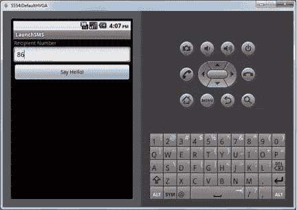
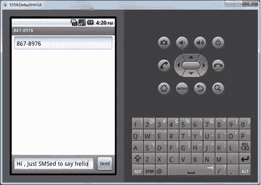
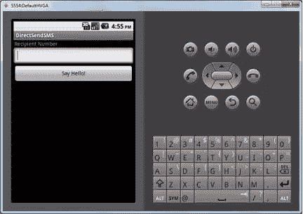
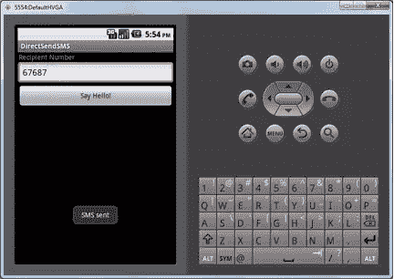
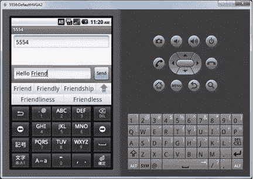
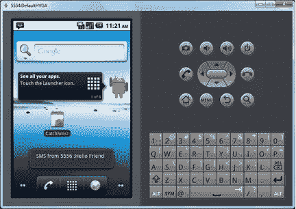
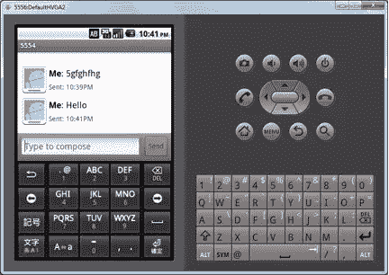
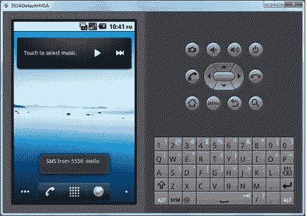

# Android 开发中如何处理短信

> 原文：<https://www.sitepoint.com/how-to-handle-sms-in-android/>

SMS 是移动设备和移动应用程序不可或缺的一部分。绝大多数移动用户在他们的手机上使用 SMS 服务；有些人每天使用它几十次。Android 提供了一个非常好的 API，因此开发者可以将 SMS 技术集成到他们的应用程序中，增加他们的应用程序的实用性和吸引力。在本文中，我们将通过 Android 提供的 API 来检查几个使用 SMS 技术的应用程序。

### 如何从您的程序启动 SMS 应用程序。

我们现在要创建一个小应用程序，它将通过发送短信向我们的朋友问好。该应用程序将从用户那里获取朋友的号码，然后该应用程序将使用用户输入的号码启动手机的短信应用程序，最后它将发送一条“你好”消息。

#### 步骤 1:创建 UI 和布局

首先，创建一个名为 LaunchSMS 的简单活动，然后我们将创建如下布局:

```
<LinearLayout xmlns:android="http://schemas.android.com/apk/res/android"
    android:orientation="vertical"
    android:layout_width="fill_parent"
    android:layout_height="fill_parent"
    >
<TextView
android:layout_width="wrap_content"
android:layout_height="wrap_content"
android:paddingLeft="2dip"
android:paddingRight="4dip"
android:text="Recipient Number"
/>

<EditText android:id="@+id/messageNumber"
android:layout_width="fill_parent"
android:layout_height="wrap_content"
android:cursorVisible="true"
android:editable="true"
android:singleLine="true"

/>

<Button android:id="@+id/sayhello"
android:layout_width="fill_parent"
android:layout_height="wrap_content"
android:text="Say Hello!"
android:onClick="sayHello"
/>
</LinearLayout>
```

上面，我们用一个 TextView 创建了一个线性布局，告诉用户他必须输入收件人的号码。然后，我们有一个 EditText 来接收来自用户的号码，还有一个按钮，单击它将调用 sayHello 方法。

该活动的代码如下:

```
package launchSMS.com;

import android.app.Activity;
import android.content.Intent;
import android.net.Uri;
import android.os.Bundle;
import android.view.View;
import android.widget.EditText;

public class LaunchSMS extends Activity {
    /** Called when the activity is first created. */
	private EditText messageNumber;
    @Override
    public void onCreate(Bundle savedInstanceState) {
        super.onCreate(savedInstanceState);
        setContentView(R.layout.main);
        messageNumber=(EditText)findViewById(R.id.messageNumber);
    }

    public void sayHello(View v) {

		String _messageNumber=messageNumber.getText().toString();
		String messageText = "Hi , Just SMSed to say hello";

		Intent sendIntent = new Intent(Intent.ACTION_VIEW);
		sendIntent.setData(Uri.parse("sms:"+_messageNumber));
        sendIntent.putExtra("sms_body", messageText);
        startActivity(sendIntent);
	}
}
```

#### 步骤 2:初始化活动

使用 onCreate 方法，我们将把我们创建的主布局设置为内容视图。然后，我创建了一个私有成员来保存消息编号的编辑框。

```
public void onCreate(Bundle savedInstanceState) {
        super.onCreate(savedInstanceState);
        setContentView(R.layout.main);
        messageNumber=(EditText)findViewById(R.id.messageNumber);
    }
```

应用程序的用户界面将如下所示:

[](https://www.sitepoint.com/wp-content/uploads/2012/04/sms1.png)

#### 步骤 3:启动短信应用程序

```
public void sayHello(View v) {

		String _messageNumber=messageNumber.getText().toString();
		String messageText = "Hi , Just SMSed to say hello";

		Intent sendIntent = new Intent(Intent.ACTION_VIEW);
		sendIntent.setData(Uri.parse("sms:"+_messageNumber));
        sendIntent.putExtra("sms_body", messageText);
        startActivity(sendIntent);
	}
```

在函数 sayHello 中，我们首先获取用户在编辑文本中输入的数字。然后，我们创建一个字符串变量来保存我们想要发送的消息文本。

现在，要启动 SMS 应用程序，我们必须创建以下内容:

```
Intent sendIntent = new Intent(Intent.ACTION_VIEW);
```

然后，我们用用户输入的数字设置意图数据，如下所示:

```
sendIntent.setData(Uri.parse("sms:"+_messageNumber));
```

最后，使用方法 putExtra 将消息文本作为意向中的额外数据。

```
sendIntent.putExtra("sms_body", messageText);
```

然后，通过将创建的意图传递给 startActivity 来发送意图。这将启动用户的 SMS 应用程序，其中已经预填充了号码和消息文本。用户可以根据需要进行编辑，然后他们只需按“发送”就可以将消息发送给他或她的朋友。

[](https://www.sitepoint.com/wp-content/uploads/2012/04/sms2.png)

因此，使用 intents，我们可以从程序中启动 SMS 应用程序。

### 如何通过 Android 提供的 API 直接发送短信

现在，我们将创建一个应用程序，其中 DirectSendSMS 将是上一个应用程序的增强版本。这个应用程序将使用 Android SMS API 直接向用户发送“你好”消息。

#### 步骤 1:创建 UI 和布局

首先，我们需要创建一个新的活动 DirectSendSMS。这个应用程序的用户界面将与上面描述的相同，因此我们也将创建一个线性布局，并添加一个文本视图，一个编辑文本和一个按钮。

布局如下:

```
<LinearLayout xmlns:android="http://schemas.android.com/apk/res/android"
    android:orientation="vertical"
    android:layout_width="fill_parent"
    android:layout_height="fill_parent"
    >
<TextView
android:layout_width="wrap_content"
android:layout_height="wrap_content"
android:paddingLeft="2dip"
android:paddingRight="4dip"
android:text="Recipient Number"
/>

<EditText android:id="@+id/messageNumber"
android:layout_width="fill_parent"
android:layout_height="wrap_content"
android:cursorVisible="true"
android:editable="true"
android:singleLine="true"

/>

<Button android:id="@+id/sayhello"
android:layout_width="fill_parent"
android:layout_height="wrap_content"
android:text="Say Hello!"
android:onClick="sayHello"
/>
</LinearLayout>
```

[](https://www.sitepoint.com/wp-content/uploads/2012/04/sms3.png)

#### 步骤 2:初始化活动

活动的初始化也与前面应用程序中描述的相同。在 onCreate 函数中，我们将主布局设置为内容视图，并将编辑框放在私有变量中。

```
public void onCreate(Bundle savedInstanceState) {
        super.onCreate(savedInstanceState);
        setContentView(R.layout.main);
        messageNumber=(EditText)findViewById(R.id.messageNumber);
    }
```

#### 步骤 3:指定发送 SMS 的权限

在 Android 中，必须在 AndroidManifest.xml 中指定应用程序所需的所有权限。通过在安装应用程序时这样做，应用程序所需的所有权限都将显示给用户。

为了让我们的应用程序能够发送消息，我们需要将 android.permission.SEND_SMS 权限添加到 AndroidManifest.xml 中，如下所示:

```
<manifest xmlns:android="http://schemas.android.com/apk/res/android"
      package="directSendSMS.com"
      android:versionCode="1"
      android:versionName="1.0">
    <application android:icon="@drawable/icon" android:label="@string/app_name">
        <activity android:name=".DirectSendSMS"
                  android:label="@string/app_name">
            <intent-filter>
                <action android:name="android.intent.action.MAIN" />
                <category android:name="android.intent.category.LAUNCHER" />
            </intent-filter>
        </activity>

    </application>

<uses-permission android:name="android.permission.SEND_SMS">
    </uses-permission>
</manifest>
```

#### 步骤 4:发送短信

```
public void sayHello(View v) {

    String _messageNumber=messageNumber.getText().toString();
    String messageText = "Hi , Just SMSed to say hello";

    SmsManager sms = SmsManager.getDefault();
    sms.sendTextMessage(_messageNumber, null, messageText, null, null);

}
```

在 sayHello 函数中，我们获得用户输入的号码。在一个变量中，我们保存我们想要发送的消息文本。然后，我们得到如下所示的 SmsManager 对象:

```
SmsManager sms = SmsManager.getDefault();
```

然后，使用 SmsManager 的 sendTextMessage 方法发送消息。

#### 步骤 5:当消息成功发送时，显示一个祝酒词

```
public void sayHello(View v) {

    	String _messageNumber=messageNumber.getText().toString();
		String messageText = "Hi , Just SMSed to say hello";
		String sent = "SMS_SENT";

        PendingIntent sentPI = PendingIntent.getBroadcast(this, 0,
            new Intent(sent), 0);

        //---when the SMS has been sent---
        registerReceiver(new BroadcastReceiver(){
            @Override
            public void onReceive(Context arg0, Intent arg1) {
            	if(getResultCode() == Activity.RESULT_OK)
                {
                  Toast.makeText(getBaseContext(), "SMS sent",
                                Toast.LENGTH_SHORT).show();
                }
                else
                {
                	Toast.makeText(getBaseContext(), "SMS could not sent",
                            Toast.LENGTH_SHORT).show();
                }
            }
        }, new IntentFilter(sent));

        SmsManager sms = SmsManager.getDefault();
        sms.sendTextMessage(_messageNumber, null, messageText, sentPI, null);

	}
```

现在，我们增强了 sayHello 方法，以便在成功发送消息时显示祝酒辞。我们为此创建一个新的 PendingIntent，并将其作为参数传递给 sendTextMessage 方法。为此，我们还注册了一个接收器，它检查结果代码并显示一个提示，说 SMS 已发送。

现在，该应用程序将如下所示:

[](https://www.sitepoint.com/wp-content/uploads/2012/04/sms4.png)

### 如何让你的应用程序响应短信

现在，我们将创建一个应用程序，它会在收到短信时做出响应。这个应用程序将只在一个吐司上显示收到的消息。

#### 步骤 1:创建一个新的应用程序

对于这个应用程序，我们将创建一个 BroadcastReciever 来捕获传入的 SMS 消息。虽然我们没有为此创建活动，但通常这类应用程序可以为此类应用程序的设置页面创建活动。

以下是此应用程序的 AndroidManifest.xml:

```
<manifest xmlns:android="http://schemas.android.com/apk/res/android"
      package="recieveSMS.com"
      android:versionCode="1"
      android:versionName="1.0">
    <application android:icon="@drawable/icon" android:label="@string/app_name">

    </application>
<uses-permission android:name="android.permission.RECEIVE_SMS"></uses-permission>
</manifest>
```

这里，我们在应用程序中添加了 android.permission.RECEIVE_SMS 权限，这样我们就可以对收到的短信进行响应。

#### 步骤 2:创建 SMS 接收器

SMS 接收器的代码如下:

```
package recieveSMS.com;

import android.content.BroadcastReceiver;
import android.content.Context;
import android.content.Intent;
import android.os.Bundle;
import android.telephony.SmsMessage;
import android.widget.Toast;

public class RecieveSMS extends BroadcastReceiver
{
    @Override
    public void onReceive(Context context, Intent intent)
    {

        Bundle bundle = intent.getExtras();
        SmsMessage[] recievedMsgs = null;
        String str = "";
        if (bundle != null)
        {

            Object[] pdus = (Object[]) bundle.get("pdus");
            recievedMsgs = new SmsMessage[pdus.length];
            for (int i=0; i            	recievedMsgs[i] = SmsMessage.createFromPdu((byte[])pdus[i]);
                str += "SMS from " + recievedMsgs[i].getOriginatingAddress()+ " :" + recievedMsgs[i].getMessageBody().toString();
            }

            Toast.makeText(context, str, Toast.LENGTH_SHORT).show();
        }
    }
}
```

我们必须创建一个扩展 BroadcastReceiver 的类，并且我们必须覆盖 onRecieve 方法。

在 onRecieve 方法中，我们从接收的 Intent 中删除数据，删除 SmsMessage 对象，并获取发送者的地址和文本以显示在 toast 上。

#### 第三步:运行应用程序

为了测试这一点，您将需要两个 Android 模拟器实例。我们将使用 SMS 应用程序从一个实例向另一个实例发送 SMS。您将能够在顶部看到实例编号。如下图所示，我的号码是 5554 和 5556。

因此，从第二个实例开始，我将向第一个实例发送一条短信，如下所示:

[](https://www.sitepoint.com/wp-content/uploads/2012/04/sms5.png)

一旦第一个实例收到短信，信息将显示为一个 Toast，如下所示:

[](https://www.sitepoint.com/wp-content/uploads/2012/04/sms6.png)

[](https://www.sitepoint.com/wp-content/uploads/2012/04/sms7.png)

[](https://www.sitepoint.com/wp-content/uploads/2012/04/sms8.png)

### 结论

如今，短信已经成为我们手机中不可或缺的重要组成部分，短信可以以多种不同的方式集成到你的下一个杀手级 Android 应用中。如果 SMS 被正确集成，你的 Android 应用程序的可用性和功能将会大大增加。

如上所述，Android 作为一个平台，为在应用程序中集成 SMS 提供了很好的支持。所以，走出去，将短信集成到你的下一个令人敬畏的 Android 应用程序中！

## 分享这篇文章