# 如何用 Dareboost 提高网站性能(和转化率)

> 原文：<https://www.sitepoint.com/how-to-improve-site-performance-and-conversions-with-dareboost/>

*本文由 [Dareboost](https://www.dareboost.com?utm_source=sitepoint&utm_campaign=sitepoint_042017&utm_medium=sponsor) 赞助。感谢您对使 SitePoint 成为可能的合作伙伴的支持。*

网站性能是严肃的事情。有多少次你对一个加载缓慢的网站感到极度沮丧？如果你和我一样，你可能已经关闭了很多标签页——并且再也没有回到那个令人讨厌的网站。

一个运行缓慢的网站会把访问者拒之门外，这意味着浏览量、转化率、互动、销售和广告收入的减少。此外，如果你经营网上业务，这也将导致购物车的放弃。

根据 WPO 统计数据，Trainline 团队发现，通过转换漏斗将他们产品的延迟减少 0.3 秒，客户每年会多支出 1150 万美元。

幸运的是，监控和管理网站性能真的很容易，这就是 [Dareboost](https://www.dareboost.com/?utm_source=sitepoint&utm_campaign=sitepoint_042017&utm_medium=sponsor) 的用武之地。

Dareboost 是一个会跟踪网站性能和质量的平台，它真的很容易使用——你不需要安装任何东西。注册一个账户，输入你的网站信息，让它发挥它的魔力。

Dareboost 是一款免费增值产品。虽然你可以从免费账户获得丰富、有用的数据，但更先进的工具可用于[付费账户](https://www.dareboost.com/en/offers?utm_source=sitepoint&utm_campaign=sitepoint_042017&utm_medium=sponsor)。

Dareboost 的工具可为您提供大量数据，独立分析可立即提供可操作的数据。此外，Dareboost 的监控工具会随着时间的推移积累有关您的站点性能的数据，从而提供更深入的见解。

Dareboost 还具有强大的警报功能，允许您为对您重要的指标设置自定义警报。

## Dareboost 是给谁的？

无论你是经营自己的博客，还是参与公司的在线活动，如果你对网站表现有兴趣，Dareboost 都适合你。每个网络专业人士都可以从这个工具中受益。

使用 Dareboost 的网站性能和质量管理，您可以测试、分析、基准测试和优化您的网站。

## 网站性能和质量分析

让我们直接进入，看看这些伟大的功能，从[网站速度测试](https://www.dareboost.com/en/tool/website-speed-test?utm_source=sitepoint&utm_campaign=sitepoint_042017&utm_medium=sponsor)开始。请注意，我们使用的是高级帐户，它提供了更多选项，我们将在下面探讨。

首先，你需要选择一个页面进行测试。你还可以选择是否要在使用 Chrome 的桌面上测试，或者在移动设备上测试，从五个 Android 选项或 iPhone 6 中选择一个，并选择一个位置。

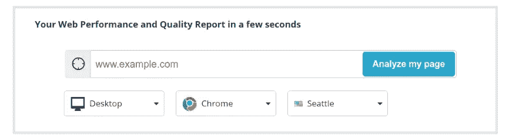

然后是一些高级设置。您可以提供 htaccess 身份验证凭证，决定是否要阻止广告或其他测试脚本，保持报告仅供您个人使用，以及是否要禁用 HTTP/2。

此外，您可以:

*   设置测试可用的带宽——3G、电缆、光纤或自定义值。
*   设置各种屏幕分辨率进行测试。
*   模仿 POST 请求，模拟用户提交表单后会看到的内容。
*   设置 HTTP 头，如用户代理。
*   允许和拒绝来自特定域的查询。
*   将一个主机名映射到另一个主机名，或者通过 IP 映射，然后…
*   否定各种动画。

总而言之，你正在进行真正的浏览器测试，你可以设置它来模拟几乎任何类型的潜在访问者。

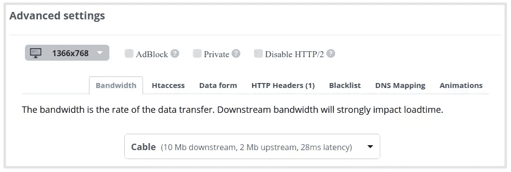

一旦你做出了选择，执行测试就成了问题。不管你的账户类型如何，你都会得到同样令人惊讶的详细报告，从网站质量和性能的概述开始。

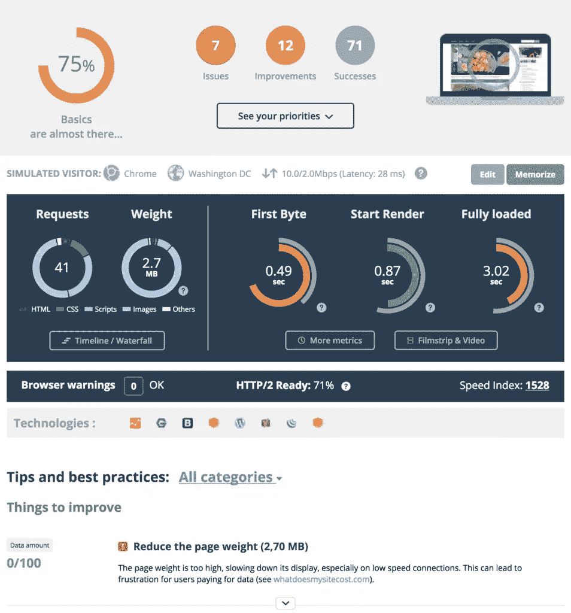

很快，我们就能了解我选择的网站的表现，包括 7 个错误和 11 个突出的改进。我们还被告知发出了多少请求，以及构建页面所需的数据传输。该报告还告诉我们 TTFB(到达第一个字节的时间，一种衡量服务器响应速度的方法)，页面开始呈现需要多长时间，以及页面完全加载需要多长时间。

它还注意到网站上检测到的各种技术。对于这个网站，我们可以看到谷歌分析，Gravatar，Bootstrap，Twemoji，WordPress，Yoast SEO，jQuery 和 PHP。

但也许我最喜欢的功能之一是能够观看一个视频，展示页面在加载和呈现过程中是如何出现的，下面以 gif 格式显示，供您欣赏。

您可以使用连续画面逐帧查看过程，并且有一系列通过视频分析计算的指标。这些包括开始渲染，速度指数和视觉完整，是非常有用的指标，以改善您的用户体验(UX)。

要确定首先要做什么，您可以单击“查看您的优先级”按钮(如上图的报告截图所示)，或者根据您要开始处理的问题类别来优化视图。你可能想从任何有红色标记的东西开始，因为它们可能是你最容易获利的地方。

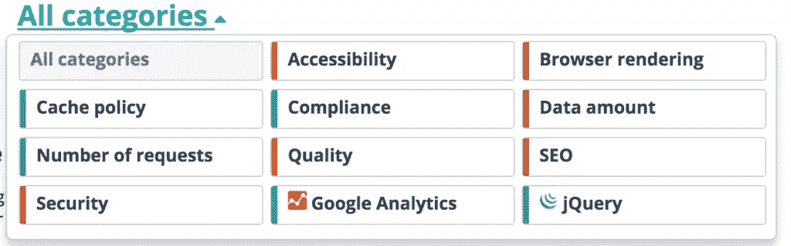

我测试的网站的一个改进领域是图像大小，因为 Dareboost 知道该网站在 WordPress 上运行，它会准确地告诉我哪些图像需要优化，并提供一些插件建议来完成这项工作。

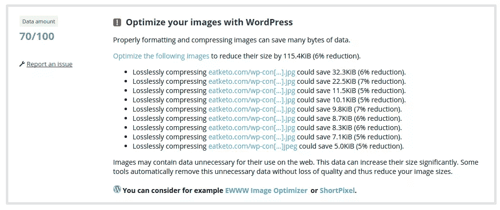

Dareboost 将根据至少 9 个类别中的 100 多个标准来判断您的页面。这里涉及的内容太多了，而且鉴于[网站速度测试](https://www.dareboost.com/en/tool/website-speed-test?utm_source=sitepoint&utm_campaign=sitepoint_042017&utm_medium=sponsor)是完全免费的，我推荐你加入并尝试一下。

## 网站性能监控

接下来我们有[网站性能监控](https://www.dareboost.com/en/tool/website-monitoring?utm_source=sitepoint&utm_campaign=sitepoint_042017&utm_medium=sponsor)，它允许你随时监控你网站上的页面。

向监控添加页面非常容易。事实上，它在很大程度上使用了来自性能和质量测试工具的相同接口，并增加了一些内容。这里的直接区别是设置一个名称，否则设置(包括高级)是相同的。

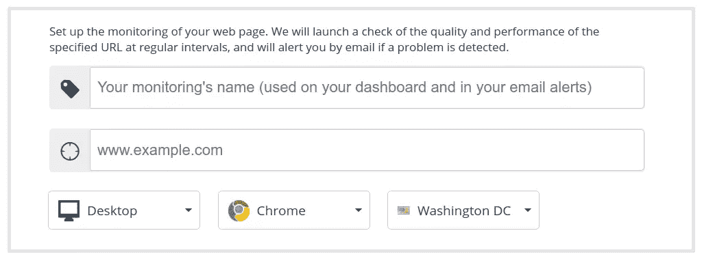

在此之后，您可以设置时间表，您可以选择每天或每小时监控一次(也可以按需提供 15 分钟的频率)。如果您选择每天，您可以设置它执行的时间，如果您选择每小时，它将简单地每小时运行一次。

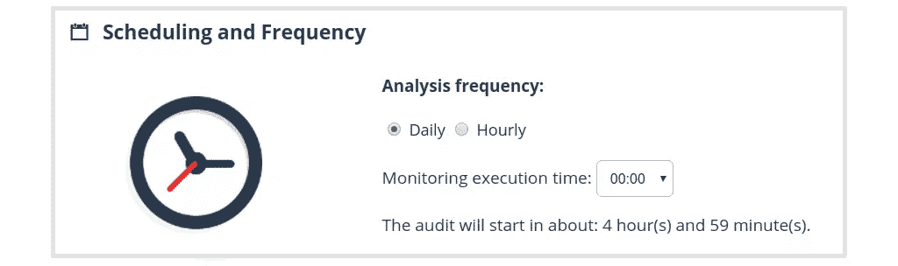

最后，您可以修改摘要设置。默认情况下，你会收到一个每周的电子邮件摘要，自然，这里唯一的选择是禁用它。

一旦你完成了这个配置，只需点击 save，Dareboost 就会完成剩下的工作。

首先，您将看到如下所示的概述，其中没有数据，因为监控尚未开始。但是，您现在可以配置警报。

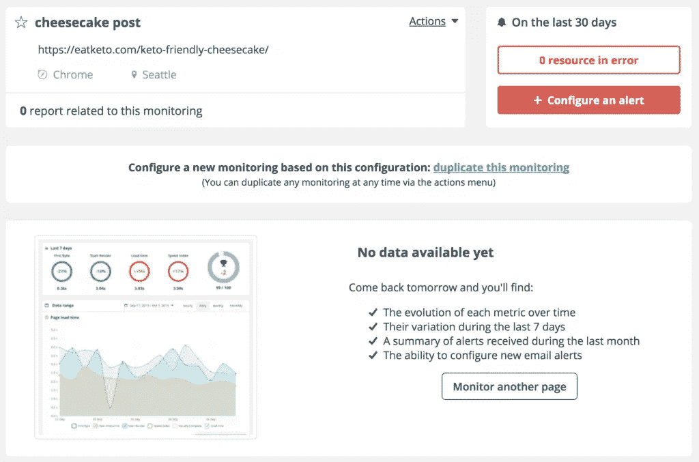

设置警报非常简单。您只需要选择您希望收到警报的指标，以及当指标高于或低于某个数值时触发警报的阈值。该功能将帮助您立即发现速度变慢和质量下降，或者知道页面何时变得过重。

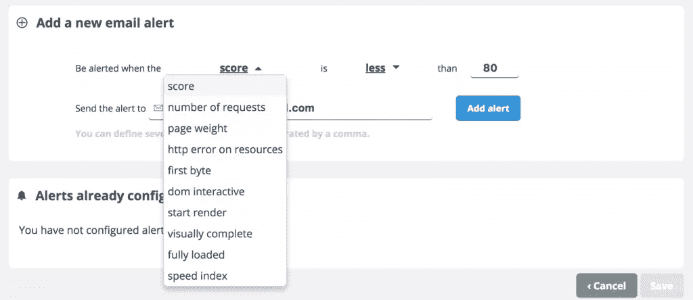

我已经设置了一个提醒，如果我的页面触发了 HTTP 错误(损坏的图像、第三方提供者错误等)，它会通知我。)，因为如果发生这种情况，需要快速修复。

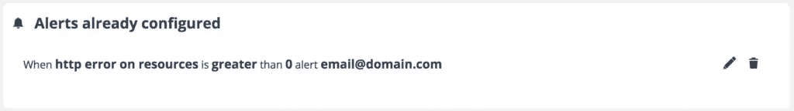

一旦您设置了一些要监控的页面，您需要做的就是等待数据随着时间的推移被填充，并留意任何可能出现的电子邮件警报。

在 Dareboost 中，为您提供了一个监控仪表板，它让您可以简要查看您所监控的每个页面，只显示需要知道的详细信息。

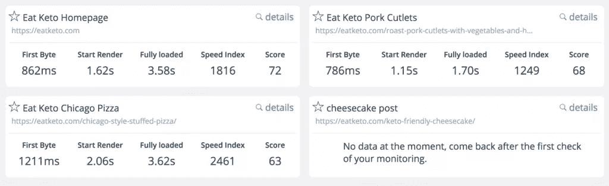

现在向您展示监控真正的亮点:查看和分析数据。点击你想了解更多的页面，你会看到大量的信息。

您将看到的第一个数据涵盖了过去七天的重要统计数据的变化，包括 TTFB、开始渲染的时间、完全加载的时间、速度指数以及您成功达到 Dareboost 的 100 个标准中的多少个，图表分为四个部分:

1.  性能指标
2.  页面分数
3.  页面重量
4.  请求数量

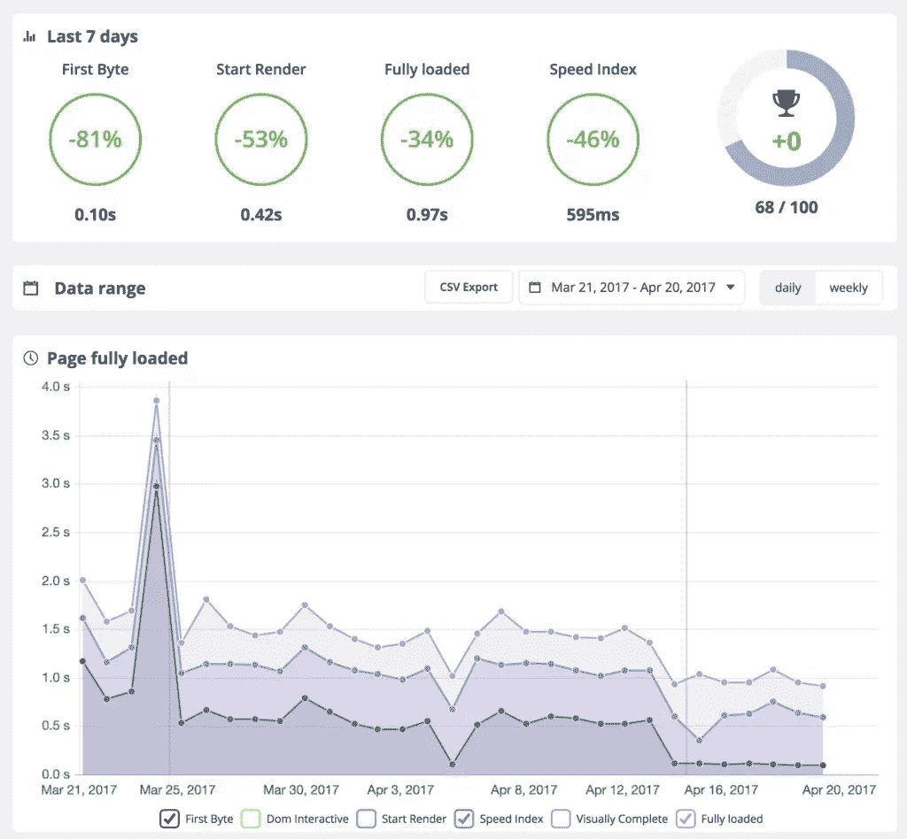

我不会一一列举，而是向您展示一个请求数量图表的示例。我把重点放在 3 月 13 日，你可以看到对这个页面的 48 个请求，主要是图片，其次是 JavaScript，然后是其他。

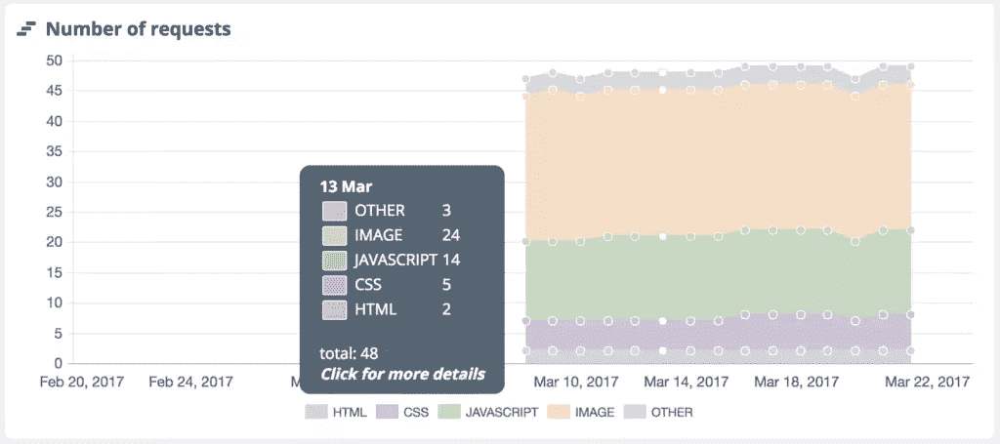

然而，在监控过程中也存在差异，主要是请求的数量增加了。我不能确定原因是什么，但鉴于这是一个 WordPress 网站，我敢打赌这是由更新 WordPress 核心和插件引起的。不过，如果这种情况发生在你身上，并且不容易解释，这可能是你需要关注的原因，也是一个很好的提醒，你需要弄清楚到底发生了什么。

## 比较

另一个伟大的 Dareboost 功能是[竞争报告](https://www.dareboost.com/en/tool/website-speed-comparison?utm_source=sitepoint&utm_campaign=sitepoint_042017&utm_medium=sponsor)。这其中有很多东西，所以我们不要再浪费时间，直接投入进去。

### 竞争性比较

这可能是我最喜欢的比较报告。你可以直接比较任意两个站点的两个网页，看看哪个性能更优越。与之前的功能一样，竞争报告非常易于使用。输入两个页面的地址，选择桌面或手机，选择一个位置，然后点击 go。我选择了两个新闻网站。

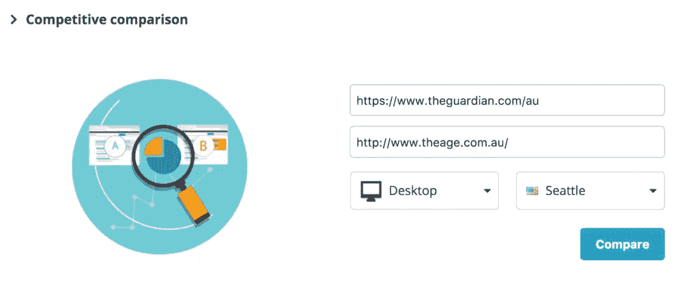

如果您已经了解我这么多，那么您阅读竞争对比报告就不会有任何问题，因为它本质上是两份并排的独立报告。这包括每个站点的预览、所用技术的列表、质量和性能分数的概述，以及每个站点的详细报告的链接。有更多的数据显示，有能力深入了解细节。

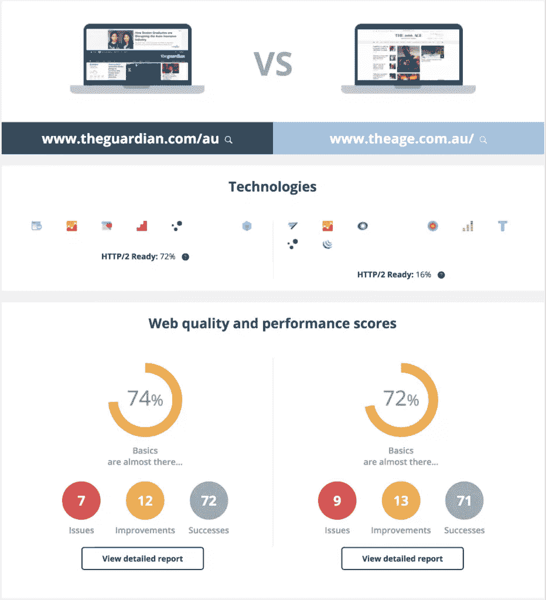

不出所料，我最喜欢的功能之一是并排视频比较。能够看到两个页面在相同的时间内是如何构建的，这是一种有用的方法，可以找出哪个网站对用户来说加载得更好，除了指标之外。

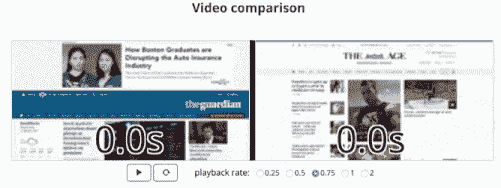

报告中有大量的内容——太多了，本文无法一一涵盖，所以可以随时在线查看[报告](https://www.dareboost.com/en/comparison/58d263cf0cf2f870a310300d/58d263d00cf2f870a310300e?utm_source=sitepoint&utm_campaign=sitepoint_042017&utm_medium=sponsor)(任何 Dareboost 报告都可以在线共享)。

### 移动与桌面比较

如果你想比较你自己网站上的两个页面，看看是否缺少一个版本，移动和桌面比较工具特别方便。

同样，这与其他报告基本相同，只是有两个并排的报告。你可以在这里自己看看这个报告[。](https://www.dareboost.com/en/comparison/58d2595a0cf2f870a31029d7/58d2595b0cf2f870a31029d8?utm_source=sitepoint&utm_campaign=sitepoint_042017&utm_medium=sponsor)

### HTTP/1.1 与 HTTP/2

我认为这是一份非常值得关注的比较报告，因为即使 HTTP/1 将在未来很长一段时间内得到支持，我们都将在适当的时候迁移到 HTTP/2。

我发现最有趣的是，测试页面在两种协议下的加载时间大致相同，但是使用 HTTP/2 在屏幕上显示一些功能性内容要快得多。您可以在此查看我的示例报告[。](https://www.dareboost.com/en/comparison/58d25cf20cf2f870a3102beb/58d25cf20cf2f870a3102bec?utm_source=sitepoint&utm_campaign=sitepoint_042017&utm_medium=sponsor)

### 缓存测试

缓存测试是一个强大的工具，它可以向你展示你的网站在正确缓存资源的情况下有多快，如果你认真对待网站性能的话，我想你已经掌握了这一点。

我会让结果说话。这是加载时间图，其中缓存版本(浅蓝色)显示了显著的性能提升。

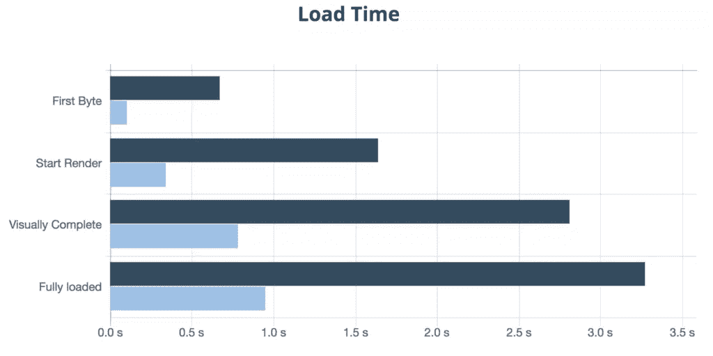

如果你想看完整份报告，你可以点击这里。

### 高级比较

这让我们看到了最后一个比较报告，即高级比较报告。本质上，它是两个并排的高级报告，能够配置设备、位置、连接和许多更高级的设置。

我们已经查看了构成报告的内容，但是它提供了一个特别全面的概述。这里是我们的例子。

## 仪表盘

仪表板是您管理 Dareboost 监控配置和报告的控制中心。在顶部，您可以在独立报告和比较报告之间切换选项卡。它们都是过时的，你可以在打开一个之前看到高水平的数据。

仪表板提供了添加监控页面、创建组和概述警报的快捷方式。我们将创建一个新组。

您将看到这样的内容:

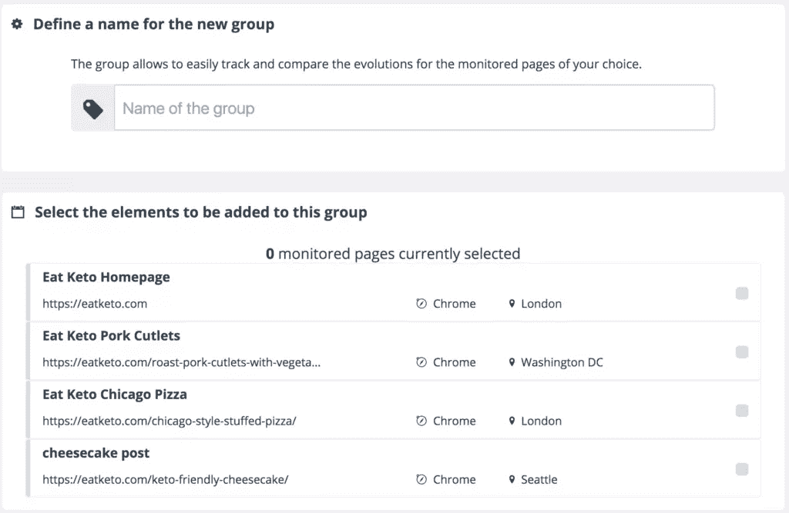

为您的跟踪组命名，并添加您已经设置的任何受监控页面。请注意，您可以创建任意多的组，它们将允许您从不同的角度探索您的监控数据(例如，竞争性基准测试，或按浏览位置或项目/网站分组)。创建组后，您将看到类似于以下内容的报告:

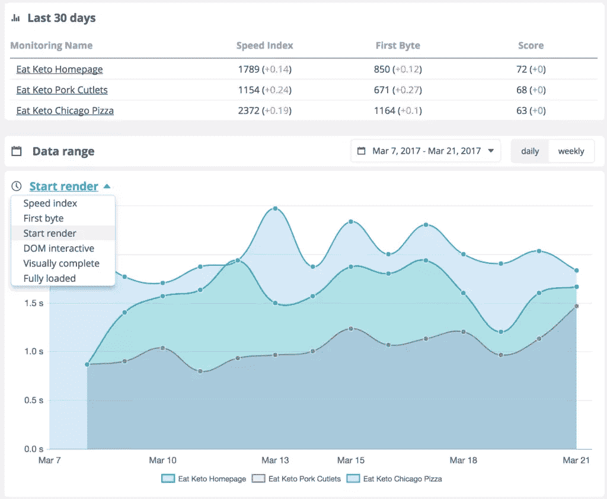

您可以看到页面的一些概述信息，并能够访问其中任何页面的更详细信息。这里最酷的是显示组中所有页面上所选指标随时间变化的性能的图表。

您可以单击此图中的任何点，查看所有受监控页面(最多 12 个)之间的比较报告。看起来是这样的:

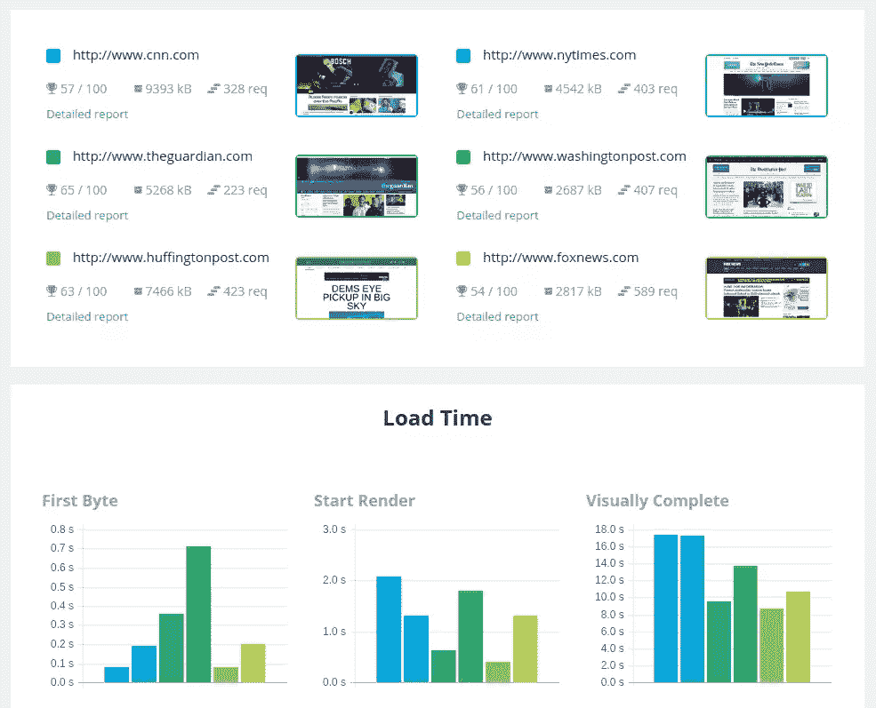

## 结论

Dareboost 是一个强大的工具，它提供了丰富的数据和行动项目来提高网站的性能和质量——即使是作为一个免费用户。对于新手和网站优化专家来说，它会给你一切你需要的东西，让你的网站运行得更快，并弥补那些失去的转换。

## 分享这篇文章