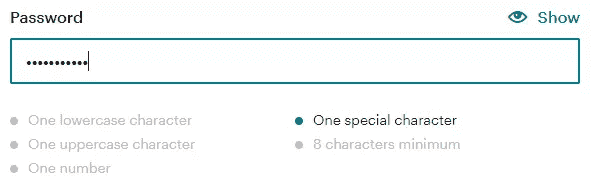
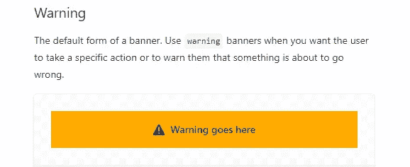
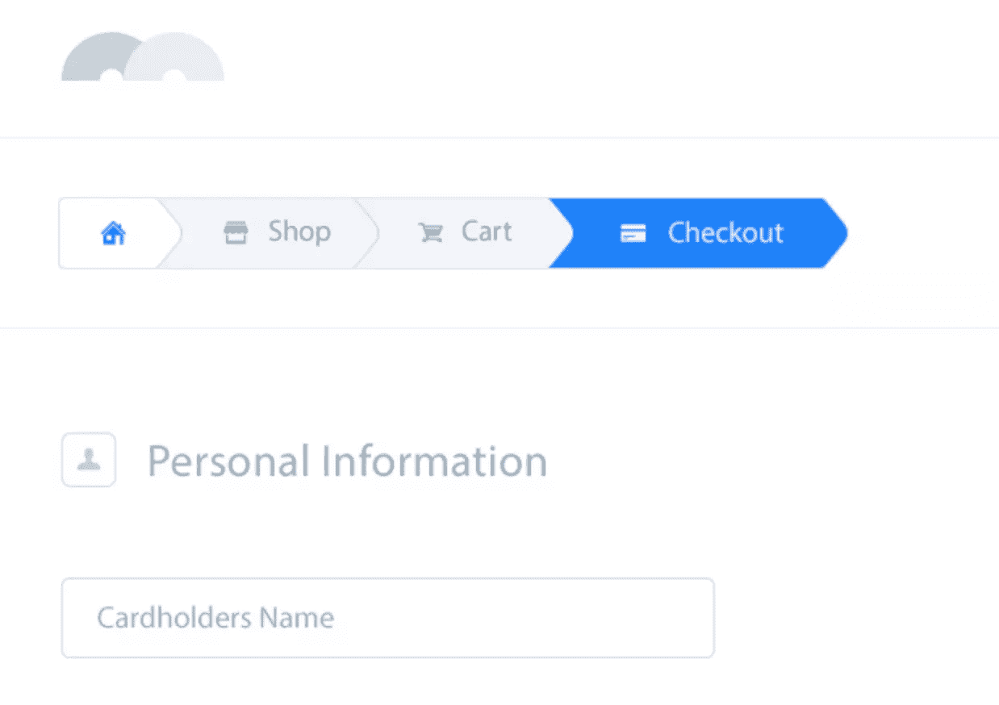

# 如何通过准确的用户反馈改善用户体验

> 原文：<https://www.sitepoint.com/how-to-improve-user-experience-with-accurate-user-feedback/>

对于网络上的每一个动作，都应该有一个反应。反馈可能会告诉用户操作是否成功，但理想情况下，它会告诉他们更多信息，比如下一步该做什么，或者为什么一个操作需要这么长时间。

您可能经历过提交表单的情况。单击提交按钮后，似乎什么也没发生。表格提交了吗？可能是表单提交失败。

这是一个很好的例子，反馈可以消除用户可能经历的任何疑虑或恐惧。一个简单的进度指标可以解决这个问题。它会直观地告诉用户服务器已经收到了表单，并且正在积极地处理它。

不提供反馈会带来很多麻烦。例如，我们提交了表单，但是没有得到任何反馈。以下情况是可能的:

*   用户在认为表单提交失败时刷新页面。这种情况会导致重复提交数据，从而影响数据质量。
*   用户会寻找其他方式联系你，比如 Twitter、LinkedIn 或脸书。
*   用户通过其他通信方式提交数据，例如他们在网站上找到的电子邮件地址。因此，您必须手动处理这些数据，并通过电子邮件跟踪用户。
*   用户没有完成表单提交就离开了网站。

如您所见，像显示进度指示器这样简单的事情可以为组织节省大量开销。在这个例子的最坏情况下，您失去了一个潜在的客户，因为他们没有等待表单提交完成。

本文探讨了反馈的重要性、提供反馈的常见 UI 元素以及反馈的好例子和坏例子。

## UX 设计中的反馈是什么？

用户界面响应动作。这就是我们定义的反馈。反馈用于参与、解释和消除恐惧或困惑，所有这些都可以提高用户满意度。

您遇到的大多数反馈都是用户界面的视觉反馈。对于游戏或其他类型的内容，用户反馈可以采取听觉反馈的形式。让我们关注视觉反馈。

视觉反馈有三个主要目标，详述如下。

### 1.信号响应度

通常不清楚元素是否是可点击的。因此，当你悬停在按钮上时，[按钮实现视觉反馈](https://www.invisionapp.com/inside-design/comprehensive-guide-designing-ux-buttons/)。当用户悬停在 Web 元素上时，web 设计人员使用 [CSS :hover 选择器](https://developer.mozilla.org/en-US/docs/Web/CSS/:hover)来应用不同的样式。我们都知道这样一个例子，当你将鼠标悬停在按钮上时，按钮的颜色会发生变化。

这种形式的反馈对于告诉用户他们可以与元素交互是必不可少的。没有它，用户不得不猜测哪些元素允许接合。但是请记住，触摸设备的用户可能无法利用悬停效果。

<video class="wp-video-shortcode" id="video-180497-1" width="640" height="360" preload="metadata" controls=""><source type="video/mp4" src="https://uploads.sitepoint.com/wp-content/uploads/2021/01/1609715094hover.mp4?_=1">[https://uploads.sitepoint.com/wp-content/uploads/2021/01/1609715094hover.mp4](https://uploads.sitepoint.com/wp-content/uploads/2021/01/1609715094hover.mp4)</video>

[视频来源](https://dribbble.com/shots/14639664--Hover-w-animated-letters)

### 2.提高参与度

反馈不仅仅是行动结果的信号。它还可以引导用户。视觉效果将用户的注意力吸引到特定的 UI 元素上，并鼓励用户单击它。因此，您可以使用视觉反馈来告诉用户下一步该做什么。

假设你想增加订阅你的时事通讯的用户数量。在注册表单中添加一个小的视觉线索怎么样？例如，当时事通讯表单是可视的时，让“注册”按钮短暂摇动以吸引用户的注意。这是一种简单而有效的提高参与度的方法。

<video class="wp-video-shortcode" id="video-180497-2" width="640" height="360" preload="metadata" controls=""><source type="video/mp4" src="https://uploads.sitepoint.com/wp-content/uploads/2021/01/1609715286buttons.mp4?_=2">[https://uploads.sitepoint.com/wp-content/uploads/2021/01/1609715286buttons.mp4](https://uploads.sitepoint.com/wp-content/uploads/2021/01/1609715286buttons.mp4)</video>

[视频来源](https://dribbble.com/shots/7441241-Button-Hover-Effects)

### 3.信号活动

最后，反馈最有助于告诉用户正在发生的事情。正如 web 表单示例中提到的，进度指示器告诉用户表单提交已经收到，并且正在由服务器处理。

这是最重要的反馈形式！一个动作总是需要反应。缺乏反馈是与应用程序交互的用户感到困惑或恐惧的主要原因。最重要的是，反馈通过消除困惑改善了用户体验。

<video class="wp-video-shortcode" id="video-180497-3" width="640" height="360" preload="metadata" controls=""><source type="video/mp4" src="https://uploads.sitepoint.com/wp-content/uploads/2021/01/1609801315feedback.mp4?_=3">[https://uploads.sitepoint.com/wp-content/uploads/2021/01/1609801315feedback.mp4](https://uploads.sitepoint.com/wp-content/uploads/2021/01/1609801315feedback.mp4)</video>

[视频来源](https://dribbble.com/shots/12567603-Upvote)

## 网络反馈最常见的例子是什么？

以下是提供反馈的常见 web 元素及其用法的列表。

*   **加载指示器或进度指示器**:该元素提供视觉反馈，告诉用户流程已经开始。如果这个过程花费的时间超过一秒钟，加载指示器就会吸引用户的注意力。一秒以下的进程不需要负载指示器，因为我们仍然认为这是“实时”的。

*   交互式表单标签:交互式表单标签立即向用户提供关于他们输入的反馈。例如，密码字段必须符合特定标准。

    如果输入的密码不符合标准，我们会立即告诉用户出了什么问题，并在视觉上发出信号。

    MailChimp 的注册表单实现了在满足条件时改变颜色的标准。在这个例子中，我忘记了在密码输入中包含至少一个特殊字符。

    

    (来源:MailChimp [注册表单](https://login.mailchimp.com/signup/) )

*   **通知铃**:提高参与度最广泛采用的反馈形式之一是通知铃。设计师通常将通知铃与显示未读通知数量的小圆圈配对。许多网站选择摇动通知铃声来吸引用户的注意。

*   悬停效果:大多数情况下，你会看到链接和按钮的悬停效果。首先，它表明 UI 元素是可点击的。然而，这对于避免误击也很重要。如果没有悬停效果，用户将鼠标移向链接，并且必须猜测何时可以点击链接。有了悬停效果，用户知道他们的鼠标在元素的上面，他们一看到效果就可以点击元素。

*   **Toast 消息/横幅/小吃店**:这些类型的通知允许您共享临时消息，这些消息在没有用户输入的情况下来来去去。大多数情况下，它们提供应用程序流程的上下文信息。

    您经常会看到关于某些功能正在维护或暂时不可用的警告消息。一些设计师更喜欢它们有组织地弹出和消失，而另一些设计师更喜欢用户丢弃它们，以确保他们已经看到了消息的内容。

    

    (来源: [Atlassian.design](https://atlassian.design/components/banner/examples) )

*   面包屑导航:面包屑导航向用户呈现状态信息，让他们知道他们在流程中的位置以及仍然需要哪些操作。这种类型的反馈提高了用户的参与度，因为用户确切地知道需要多少步。

    

    [图片来源](https://dribbble.com/shots/2436989-Breadcrumbs-Day-056-dailyui)

## 结论:我们应该关注 UX 吗？

提供出色的用户体验是关键。用户体验通常会推动销售。例如，让用户知道他们在结账过程中处于哪一步。面包屑是向用户提供快速反馈的好工具。

同样，反馈有助于消除对这个过程需要多长时间的困惑或恐惧。在上面的例子中，用户知道他们必须完成三个步骤才能有效地购买产品。它提供了精神上的平静。

本文展示了反馈和标准 UI 元素的重要性，您可以实现这些元素来提供用户反馈。反馈的最基本的 UI 元素之一是进度指示器。这是消除对过程的恐惧或困惑的一个很好的工具。

请记住，您可以通过各种方式使用反馈。除了发出活动信号，你还可以提高参与度或信号响应度。

## 分享这篇文章