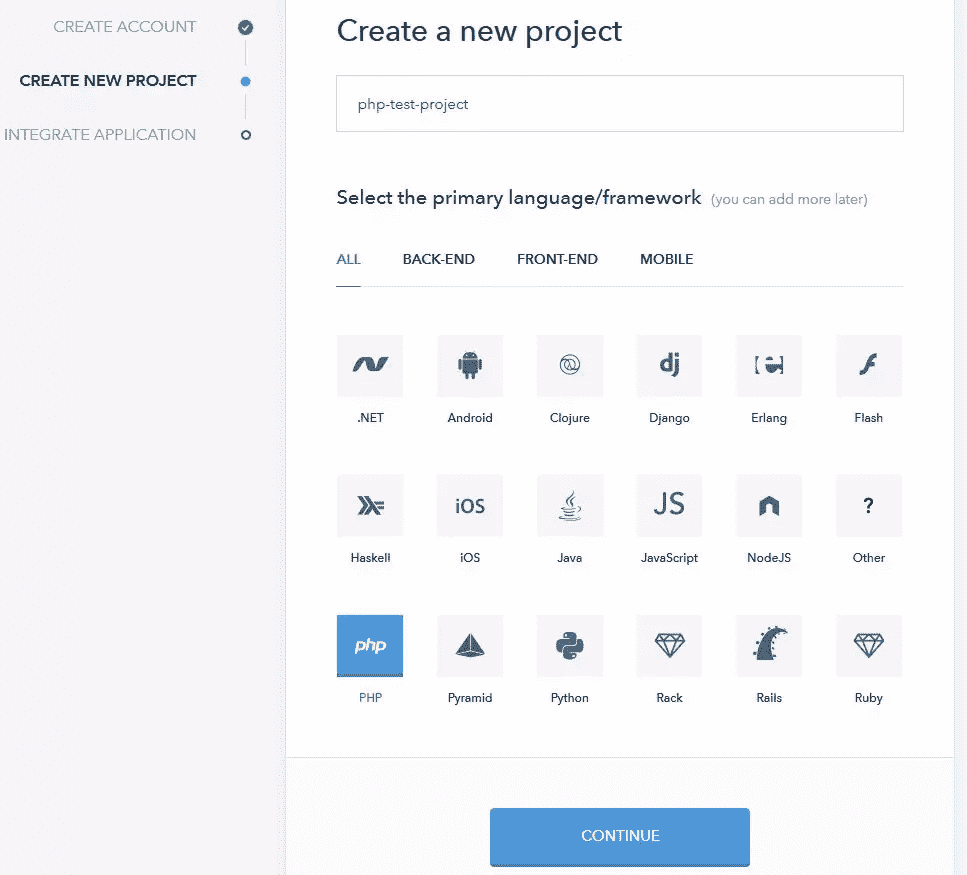
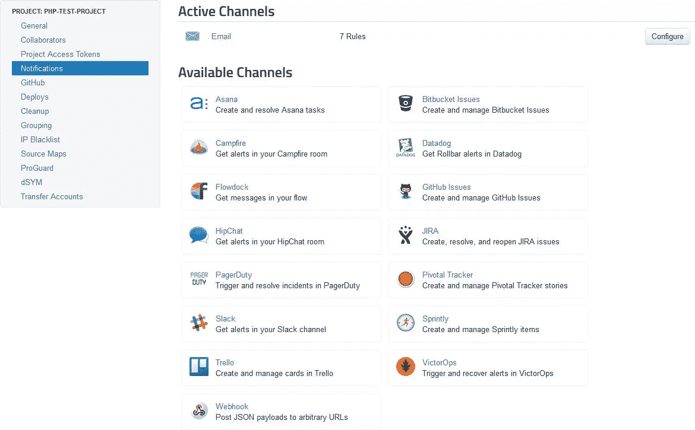

# 如何用 Rollbar 缩短团队的调试时间

> 原文：<https://www.sitepoint.com/how-to-improve-your-teams-debugging-times-with-rollbar/>


*本文由 [Rollbar](https://rollbar.com/) 赞助。感谢您对使 SitePoint 成为可能的赞助商的支持。*

作为一名 SitePoint 读者，你可以为每个项目编写完美的无错代码…

但是你能对你团队的每个成员都这么说吗？

你的产品越复杂，你的团队就越大，你会发现越多的错误。您可能有健壮的测试过程，但是您能确定您的框架的最新版本是没有错误的吗？第三方模块、数据库、组件呢？语言或运行时是否完美？你对底层部署操作系统有把握吗？对于最愚蠢的用户来说，整个堆栈可以被认为是防呆的吗？！

理解错误是不可避免的是第一步。更复杂的第二步是记录错误，跟踪频率，确定问题的优先顺序，编写解决方案，测试修复并部署到一个活动的服务器上。如果没有仔细的管理，团队可能会花比编写新代码更长的时间来修复错误。

幸运的是， [Rollbar](https://rollbar.com/) 可以大幅减少调试时间和成本。Heroku、Walmart、LogMeIn、Lyft、Twitch 和 Intuit 等公司信任这项服务[，可以集中管理网站、网络应用程序、移动和桌面应用程序上的关键错误。](https://rollbar.com/customers/)

在撰写本文的时候， [Rollbar](https://rollbar.com/) 已经记录了将近 130 亿个错误*(这只是我的粗制滥造的代码！)*。

## 调试滚动条方式

Rollbar 将您的工具整合成一个无缝的错误处理工作流。从长远来看，几分钟的设置可以节省大量精力。

### 1.签约雇用

从[滚动条主页](https://rollbar.com/)注册首次免费试用。您可以使用电子邮件地址或链接您的 [GitHub](http://github.com/) 账户。

首次登录时会运行快速设置指南。

### 2.创建新项目

输入项目名称，并从众多语言和框架中选择一种。所有流行的移动、桌面和 web 后台和前端平台都可用。



创建时，您的项目被分配一个唯一的访问令牌，该令牌标识发送到滚动条系统的所有消息。

### 3.将滚动条集成到您的项目中

根据项目语言的不同，集成也会有所不同。对于 PHP，可以使用 Composer 或者通过下载两个文件来安装一个[滚动条组件](https://github.com/rollbar/rollbar-php)。包括 rollbar.php，初始化并发送测试消息:

```
<?php
// include Rollbar component
require_once 'rollbar.php';

// initialize Rollbar
Rollbar::init(array('access_token' => 'your-project-token'));

// send a test message
Rollbar::report_message('testing 123', 'info'); 
```

然后，您可以添加一个或多个异常处理程序来捕获所有错误:

```
// catch exception and send to Rollbar
try {
  throw new Exception('test exception');
} catch (Exception $e) {
  Rollbar::report_exception($e);
} 
```

对于 Node.js Express 项目，您可以使用 npm 安装 Rollbar 模块:

```
npm install --save rollbar 
```

然后添加滚动条错误处理中间件:

```
var 
  rollbar = require('rollbar'),
  express = require('express'),
  app = express();

// Rollbar middleware
app.use(rollbar.errorHandler('your-project-token'));

// basic route
app.get('/', function (req, res) {
  res.send('Hello World!');
});

// start server
app.listen(3000); 
```

Rollbar 为 Android、Clojure、ColdFusion、Dart、Erlang、Flash、Go、Haskell、iOS、Java、JavaScript(客户端)、。NET、Node.js、PHP、Python、Ruby 和 web 服务器日志。或者，您可以将[完全文档化的 RESTful API](https://rollbar.com/docs/api/items_post/) 用于其他语言。

### 4.访问您的滚动条仪表板

[滚动条](https://rollbar.com/)仪表盘提供所有错误的实时概览和发生频率:


您可以分析单个问题以:

*   跟踪受影响的用户、设备和浏览器
*   定位类似或相关的错误
*   与其他团队成员讨论问题，以及
*   重放 web 服务调用以重现相同的错误。

从**设置**面板，您还可以:

*   添加更多团队协作者
*   应用分组规则以减少噪音，以及
*   连接其他服务…

### 5.连接其他服务

团队成员将有不同的通知和问题跟踪偏好。滚动条允许您通过一系列流行的渠道发送警报和任务，包括电子邮件、GitHub 问题、BitBucket 问题、JIRA、Pivotal Tracker、Trello、PagerDuty、Slack 等等:



您可以从仪表板上为开发人员分配任务，并且知道它已经在他们选择的错误跟踪工具中进行了更新。

### 6.修复和部署

最后，Rollbar 可以与 Heroku、Capistrano、Engine Yard 和 Fabric 等部署平台集成。Rollbar 监控已部署的修复程序，并在所有连接的服务上将问题标记为“已解决”。

并不是每个修复都按计划进行，所以每当历史回归发生时，Rollbar 会立即提醒您。

## 关键滚动条功能

翻车保护杆支架:

*   各种各样的语言和框架
*   所有流行的消息传递系统
*   最常用的部署平台
*   即时错误报告
*   在您自己的场所安装
*   [保证隐私](https://rollbar.com/privacy/)

如果你需要更有说服力的…

### 易于集成

滚动条可以集成到您的网络，桌面或移动应用程序在几分钟内。比阅读这篇文章要快得多！

### 优秀的文档

我希望所有的文档都像 [Rollbar 的](https://rollbar.com/docs/)一样好！该指南组织良好，简明扼要，并提供了各种语言的大量例子。

如果你需要支持另一种语言或者将你的服务与滚动条集成，RESTful API 指南是必不可少的。

### 快速和高级搜索

滚动条仪表板提供了快速搜索选项，但是，如果这还不够，您可以使用新的[滚动条查询语言(RQL)](https://rollbar.com/docs/rql/) —一种类似 SQL 的语法，用于对您的滚动条数据运行查询。

### JavaScript 源代码地图

您的生产系统会报告错误，这些系统可能*(或者应该)*托管您的客户端 JavaScript 文件的缩小版本。缩小可以重命名函数名和对行重新编号。滚动条允许你上传相关的 [JavaScript 源代码图](https://rollbar.com/docs/source-maps/)，这确保了消息被识别为原始的、未压缩的源代码。

### 成本效率

Rollbar 对于个人项目和原型是免费的。[定价基于每月举办的活动数量](https://rollbar.com/pricing/) — *，与团队规模*无关。添加另一个合作者不需要任何成本。

Rollbar 团队平均有 30 名开发人员，但是该系统可以扩展到无限大小的项目。

### 团队时间节约

最大的好处: *Rollbar 节省了相当多的时间*。团队成员有一个中心位置，可以整理所有报告的错误，并将任务分配给他们喜欢的任何消息传递和错误跟踪系统。

**[今天就注册 roll bar](https://rollbar.com/)**—有一个功能齐全、无义务的 14 天试用期，不需要信用卡或初始付款。你很快就会想知道没有 Rollbar 你是怎么开发的。

## 分享这篇文章