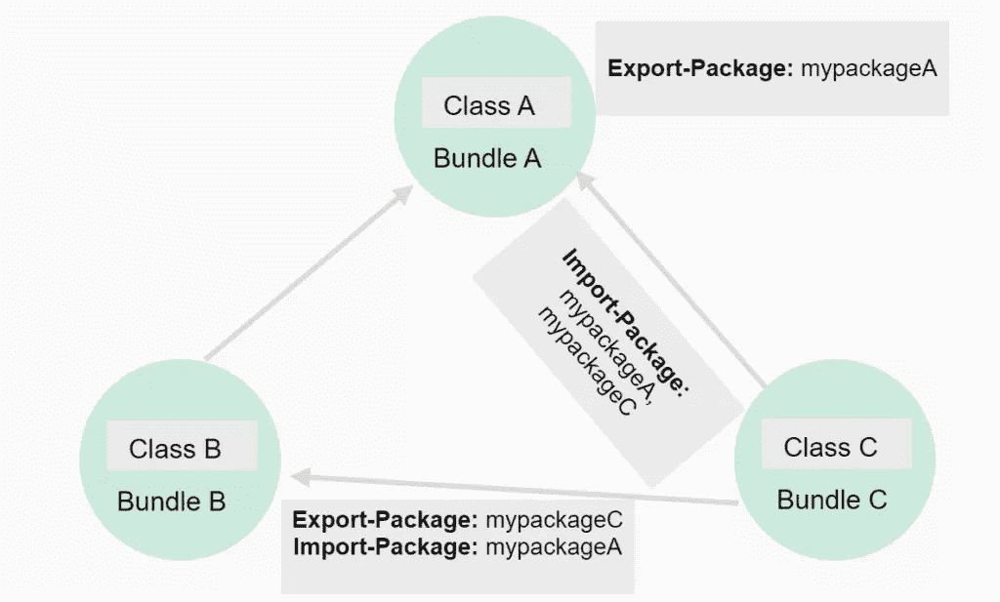
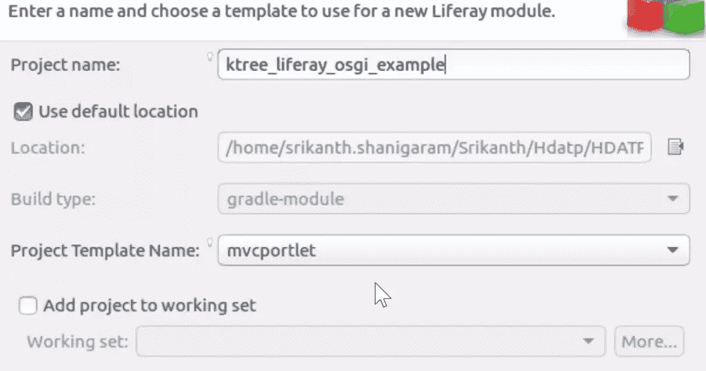
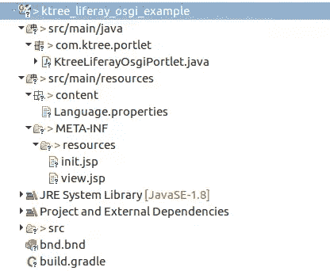
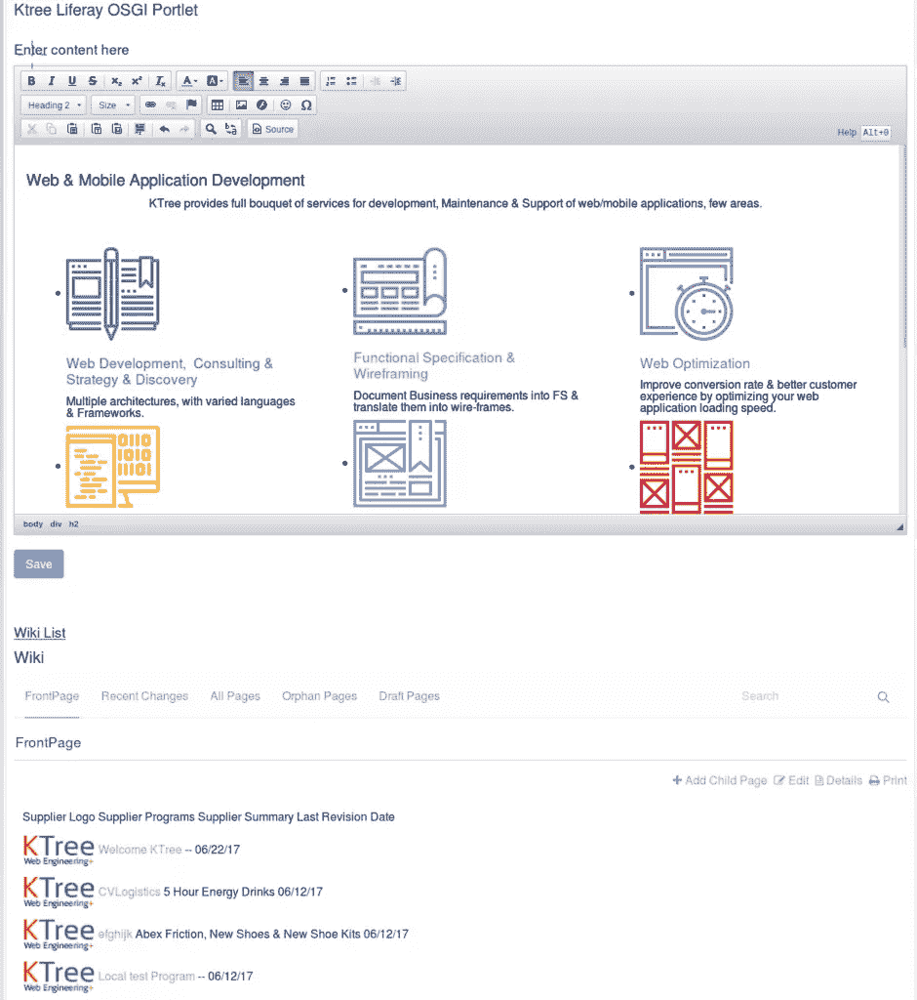

# 如何在 Liferay 7 中的定制 Portlets 中注入 OSGi 依赖

> 原文：<https://www.sitepoint.com/how-to-inject-osgi-dependencies-in-custom-portlets-in-liferay-7/>

*本文是与 [Ktree](https://ktree.com) 合作创作的。感谢您对使 SitePoint 成为可能的合作伙伴的支持。*

Liferay 7/DXP 利用 OSGi 框架为模块化应用程序提供开发环境。最近，我们使用这个特性将 Liferay 标准模块功能注入到我们的定制 portlet 中。

我们通过将 wiki 资产作为依赖项注入到我们的自定义 portlet 中来实现这一点。出于本文的目的，我们将使用一个显示一个字段文本区域的示例定制模块，下面我们将在屏幕上注入 wiki 资产。

在开始实际程序之前，让我们先来看几个概念。

## OSGI 简介

OSGi(Open Services Gateway Initiative)允许您将应用程序划分为多个模块，从而更容易地管理它们之间的交叉依赖。Liferay 使用 OSGi 容器实现 [Equinox](http://www.eclipse.org/equinox/) 。

OSGi 的主要优势:

*   您可以动态地安装、卸载、启动和停止应用程序的不同模块，而无需重新启动容器。
*   您的应用程序可以同时运行特定模块的多个版本。
*   OSGi 为开发面向服务的应用以及嵌入式、移动和富互联网应用提供了非常好的基础设施。

想了解更多关于 OSGi 的信息，请查阅以下文章:

*   [你好，OSGi，第 1 部分:初学者捆绑包](http://www.javaworld.com/article/2077837/application-development/java-se-hello-osgi-part-1-bundles-for-beginners.html)

*   [和本页底部的链接资源](https://www.javaworld.com/article/2077837/application-development/java-se-hello-osgi-part-1-bundles-for-beginners.html?page=5)



Liferay 7/DXP 目前支持这些类型的依赖。这是您需要在您的`build.gradle`文件中指定的，您将在步骤 1 中完成。本教程只关注“编译”和“编译”。

**编译**

编译项目的生产源代码所需的依赖项。正如您在本文后面部分看到的，对于这个依赖项，您需要在`build.gradle`和`bnd.bnd`中配置它。

**完全地**

编译时需要依赖项，但运行时从不需要。由于 wiki 资产已经在 OSGi 容器中，我们将使用这个选项。把这个加到`build.gradle`就足够了。

**运行时**

运行时生产类所需的依赖关系。默认情况下，还包括编译时依赖项。

**提供了**

编译项目所需的所提供范围内的依赖项，但不应随项目一起分发。

除了依赖类型，我们还需要指定一些参数，如下所述。

*   **group**–通常，这是您的组织名称或项目名称。
*   **名称**–项目名称。
*   **版本**–版本号。
*   **fileTree**–从本地文件系统提供依赖关系。

有了这些概念，我们就可以编写一些代码了，所以让我们启动 Eclipse Liferay IDE 吧。

## 步骤 1:创建 Liferay 工作空间项目

跟随[这个链接](https://dev.liferay.com/develop/tutorials/-/knowledge_base/7-0/creating-a-liferay-workspace-with-liferay-ide)创建你的 Liferay 工作空间项目。

## 步骤 2:创建 Liferay 模块

这将构建`build.gradle`文件。出于开发目的，通过添加依赖项来编辑`build.gradle`。请参见示例代码。

在 IDE 中创建一个 Liferay 模块，选择*文件>新建> Liferay 模块项目*。


**举例:`build.gradle`文件**

```
dependencies {
        compileOnly group: "com.liferay", name: "com.liferay.wiki.api", version: "2.1.0"
        compile group: 'org.jsoup', name: 'jsoup', version: '1.8.3'
        compile group: 'commons-io', name: 'commons-io', version: '2.0.1'
        compile group: "velocity-tools", name: "velocity-tools", version: "1.4"
        compile group: "org.apache.velocity", name: "velocity", version: "1.6.4"
        compile fileTree(dir:"lib",include:"*.jar")
} 
```

注意:由于这个包(`com.liferay.wiki.api`)已经装入集装箱，所以我们必须使用`CompileOnly`选项。

## 第三步:编辑`bnd.bnd`

通过添加`Compile`依赖项的依赖项来编辑`bnd.bnd`文件。Eclipse 会自动生成这个文件。

**举例:`bnd.bnd`文件**

我们可以用两种不同的方式包含 jar，下面给出了两种选择。

*选项 1:*

*-include source:

这个头文件用于将外部依赖项添加到我们的模块中。下面的语法提取 jar 并将包添加到我们的模块中。

```
-includeresource: \
@jsoup-1.8.3.jar,\
@opencsv-2.2.jar,\
@commons-io-2.0.1.jar,\
@velocity-[0-9]*.jar,\
@velocity-tools-[0-9]*.jar 
```

*选项二:*

以下语法将 jar 添加到我们的模块中:

```
-includeresource: \
lib/jsoup.jar=jsoup-1.8.3.jar,\
lib/opencsv.jar=opencsv-2.2.jar,\
lib/velocity.jar=velocity-[0-9]*.jar,\
lib/velocity-tools.jar=velocity-tools-[0-9]*.jar 
```

因为我们已经在。gradle 文件`CompileOnly`，我们必须通过在`bnd.bnd`文件中添加这两行来导入这些包。如果不添加它们，bndtool 将扫描项目并添加到清单文件中。

```
com.liferay.wiki.model;version="[1.0,2)",
com.liferay.wiki.service;version="[1.1,2)" 
```

## 步骤 4:运行 Eclipse 构建

现在使用路径`eclipse->Gradle Module ->`运行 Eclipse Build。Eclipse 使用 Bndtools 来生成清单。样本清单如下。

导航到 Gradle 任务视图。它列出了工作区项目中所有可用的模块。进入*展开项目>构建>构建*。

这些是 bnd 标题中自动添加到`manifest.mf`的指令或设置。

**示例生成`manifest.mf`文件**

```
Manifest-Version: 1.0
Bnd-LastModified: 1496664974738
Bundle-ManifestVersion: 2
Bundle-Name: ktree_liferay_osgi_example
Bundle-SymbolicName: ktree_liferay_osgi_example
Bundle-Version: 1.0.0
Created-By: 1.8.0_131 (Oracle Corporation)
Import-Package: com.liferay.portal.kernel.exception;version="[7.0,8)",
 com.liferay.portal.kernel.portlet.bridges.mvc;version="[1.0,2)",com.l
 iferay.portal.kernel.service;version="[1.0,2)",com.liferay.portal.ker
 nel.theme;version="[1.0,2)",com.liferay.portal.kernel.util;version="[
 7.0,8)",com.liferay.wiki.model;version="[1.0,2)",com.liferay.wiki.ser
 vice;version="[1.1,2)",javax.portlet;version="[2.0,3)",javax.servlet,
 javax.servlet.http
Javac-Debug: on
Javac-Deprecation: off
Javac-Encoding: UTF-8
Private-Package: com.ktree.portlet,content
Provide-Capability: osgi.service;objectClass:List<String>="javax.portl
 et.Portlet",liferay.resource.bundle;bundle.symbolic.name=ktree_lifera
 y_osgi_example;resource.bundle.base.name="content.Language"
Require-Capability: osgi.extender;filter:="(&(osgi.extender=jsp.taglib
 )(uri=http://java.sun.com/portlet_2_0))",osgi.extender;filter:="(&(os
 gi.extender=jsp.taglib)(uri=http://liferay.com/tld/aui))",osgi.extend
 er;filter:="(&(osgi.extender=jsp.taglib)(uri=http://liferay.com/tld/p
 ortlet))",osgi.extender;filter:="(&(osgi.extender=jsp.taglib)(uri=htt
 p://liferay.com/tld/theme))",osgi.extender;filter:="(&(osgi.extender=
 jsp.taglib)(uri=http://liferay.com/tld/ui))",osgi.ee;filter:="(&(osgi
 .ee=JavaSE)(version=1.8))"
Service-Component: OSGI-INF/com.ktree.portlet.KtreeLiferayOsgiPortlet.
 xml
Tool: Bnd-3.2.0.201605172007

Import-Package:
com.liferay.portal.kernel.exception;version="[7.0,8)",
com.liferay.portal.kernel.portlet.bridges.mvc;version="[1.0,2)",
com.liferay.portal.kernel.service;version="[1.0,2)",
com.liferay.portal.kernel.theme;version="[1.0,2)",
com.liferay.portal.kernel.util;version="[7.0,8)",
javax.portlet;version="[2.0,3)",
javax.servlet,
javax.servlet.http,
com.liferay.wiki.model;version="[1.0,2)",
com.liferay.wiki.service;version="[1.1,2)" 
```

**Export-Package:**bnd 头中的这个指令将包导出到 OSGi 容器，其他模块可以访问这个容器。例如:

```
Export-Package: com.audit.esprocessor 
```

如果包已经被导出，我们不需要再做一次——我们可以立即使用选项`CompileOnly`而不是`build.gradle`中的`Compile`。

**导入包:**

*   这个 bnd 头在运行时将指定的包导入到我们的模块中。
*   每当我们导入一个包时，它必须由其他模块导出。

```
Import-Package: \
com.audit.esprocessor;version=&quot;1.0.0&quot;,\ 
```

在导入包中，我们有两个解决方案，即:

1.  命令的
2.  可选择的

**强制**

*   这是默认分辨率(当没有为导入指定分辨率时)。
*   如果导入的包在容器中可用，则模块将处于活动状态，否则模块将处于已安装状态。

**Optional**

*   模块将进入活动状态，而不依赖于导入包的可用性。
*   如果导入的包在容器中不可用，它会在运行时抛出异常。

```
Import-Package: \
com.audit.esprocessor;version="1.0.0",\ 
```

## 步骤 5:创建 Liferay MVC Portlet

最后一步是创建一个普通的 Liferay MVC portlet 并开始使用依赖项。

因为我们已经在 Eclipse 中定义了依赖项，所以我们应该能够选择我们已经绑定的类。

```
WikiPageLocalServiceUtil.addPage(themeDisplay.getUserId(), 123, "First Wiki", 1.0, htmlContent, "", false, "html", true, "FrontPage", "", new ServiceContext()); 
```

`KtreeLiferayOsgiPortlet-> addContentToWiki`请参考出处。

```
public class KtreeLiferayOsgiPortlet extends MVCPortlet {
    @ProcessAction(name="addContentToWiki")
    public void addContentToWiki(ActionRequest actionRequest,ActionResponse actionResponse) throws PortalException{
        String htmlContent = ParamUtil.getString(actionRequest, "wikiEditor");
        ThemeDisplay themeDisplay = (ThemeDisplay) actionRequest.getAttribute(WebKeys.THEME_DISPLAY);
        WikiPageLocalServiceUtil.addPage(themeDisplay.getUserId(), 123, "First Wiki", 1.0, htmlContent, "", false, "html", true, "FrontPage", "", new ServiceContext());
        System.out.println(WikiPageLocalServiceUtil.getWikiPagesCount());

    }
} 
```



**样品救生筏 OSGi 模块:**

*   将 wiki api 作为编译时依赖项添加到 compileOnly 中

*   UI 是用`aui`组件构建的。

*   UI 有创建 wiki 页面的选项，还显示 wiki 页面的列表。





**例题`init.jsp`**

```
<%@ taglib uri="http://java.sun.com/jsp/jstl/core" prefix="c" %>

<%@ taglib uri="http://java.sun.com/portlet_2_0" prefix="portlet" %>

<%@ taglib uri="http://liferay.com/tld/aui" prefix="aui" %>
<%@ taglib uri="http://liferay.com/tld/portlet" prefix="liferay-portlet" %>
<%@ taglib uri="http://liferay.com/tld/theme" prefix="liferay-theme" %>
<%@ taglib uri="http://liferay.com/tld/ui" prefix="liferay-ui" %>

<liferay-theme:defineObjects />

<portlet:defineObjects />
<portlet:actionURL name="addContentToWiki" var="addContentToWikiUrl">
</portlet:actionURL> 
```

**例题`View.jsp`**

```
<%@include file="init.jsp" %>
<aui:form action="${addContentToWikiUrl}" name="wikiform">
<h3>Enter content here</h3>
    <liferay-ui:input-editor name="wikiEditor" placeholder="Enter content here"></liferay-ui:input-editor>
    <aui:button-row>
        <aui:button type="submit"></aui:button>
    </aui:button-row>
    <br/>
    <h3><u>Wiki List</u></h3>
    <liferay-portlet:runtime portletName="com_liferay_wiki_web_portlet_WikiPortlet"/>
</aui:form> 
```

**示例控制器—`KtreeLiferayOsgiPortlet.java`**

```
@Component(
    immediate = true,
    property = {
        "com.liferay.portlet.display-category=KTree",
        "com.liferay.portlet.instanceable=true",
        "javax.portlet.display-name=Ktree Liferay OSGI Portlet",
        "javax.portlet.init-param.template-path=/",
        "javax.portlet.init-param.view-template=/view.jsp",
        "javax.portlet.resource-bundle=content.Language",
        "javax.portlet.security-role-ref=power-user,user"
    },
    service = Portlet.class
)
public class KtreeLiferayOsgiPortlet extends MVCPortlet {
    @ProcessAction(name="addContentToWikiUrl")

    public void addHtmlToWikiPage(ActionRequest actionRequest,ActionResponse actionResponse) throws PortalException{

        //add logic here to add wikipage        
    }
} 
```

## 分享这篇文章