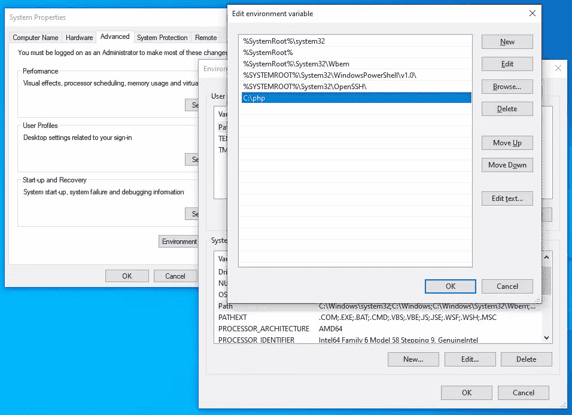

# 如何在 Windows 10 和 11 上安装 PHP(用 Apache 和 MySQL)

> 原文：<https://www.sitepoint.com/how-to-install-php-on-windows/>

**本文介绍如何在 Windows 10 或 11 (64 位)上安装 PHP 8.2 和 Apache 2.4。**

Linux 和 macOS 用户通常预装了 Apache 和 PHP，或者通过包管理器获得。Windows 需要多一点努力。下面的步骤*可能*适用于其他版本的 Windows、PHP 和 Apache，但是请查看每个依赖项的文档以获得具体说明。

**内容:**

1.  [为什么选择 PHP？](#whyphp)
2.  [为什么要在本地安装 PHP？](#whyinstallphplocally)
3.  [替代安装选项](#alternativeinstallationoptions)
    *   [使用一体化包装](#usinganallinonepackage)
    *   [使用 Linux 虚拟机](#usingalinuxvirtualmachine)
    *   [将 Windows 子系统用于 Linux 2](#usingwindowssubsystemforlinux2)
    *   [使用 Docker](#usingdocker)
4.  [安装 Apache(可选)](#installingapacheoptional)
5.  [安装 PHP](#installingphp)
    *   [第一步:下载 PHP 文件](#step1downloadthephpfiles)
    *   [第二步:提取文件](#step2extractthefiles)
    *   [第三步:配置`php.ini`](#step3configurephpini)
    *   [第四步:将`C:\php`添加到`PATH`环境变量](#step4addcphptothepathenvironmentvariable)中
    *   [第五步:将 PHP 配置为 Apache 模块](#step5configurephpasanapachemodule)
    *   [第六步:测试一个 PHP 文件](#step6testaphpfile)

## 为什么选择 PHP？

PHP 仍然是网络上最广泛和最流行的服务器端编程语言。它由大多数 web 主机安装，具有简单的学习曲线、与 MySQL 数据库的紧密联系、极好的文档以及大量的库，可以减少您的开发时间。PHP 可能并不完美，但是您应该考虑将它用于您的下一个 web 应用程序。它是脸书、Slack、维基百科、MailChimp、Etsy 和 WordPress 的首选语言(内容管理系统[为将近 45%的网络](https://w3techs.com/technologies/overview/content_management)提供动力)。

## 为什么要在本地安装 PHP？

在您的开发 PC 上安装 PHP 允许您创建和测试网站和应用程序，而不会影响您的实时服务器上的数据或系统。

## 替代安装选项

在您开始之前，可能有一个更简单的安装选项…

### 使用一体化包

适用于 Windows 的一体化软件包。它们在单个安装文件中包含 Apache、PHP、MySQL 和其他有用的依赖项。这些包包括 [XAMPP](http://www.apachefriends.org/) 、 [WampServer](http://www.wampserver.com/en/) 和 [Web。开发商](http://www.devside.net/server/webdeveloper)。

这些软件包很容易使用，但是它们可能与您的实时服务器环境不匹配。手动安装 Apache 和 PHP 将帮助您了解更多关于系统和配置选项的信息。

### 使用 Linux 虚拟机

微软 Hyper-V(在 Windows Professional 中提供)和 [VirtualBox](https://www.virtualbox.org/) 是免费的虚拟机管理程序，它们模拟 PC，因此您可以安装另一个操作系统。

您可以安装任何版本的 Linux，然后按照它的 Apache 和 PHP 安装说明进行操作。或者，像 [Ubuntu Server](https://ubuntu.com/download/server) 这样的发行版提供它们作为标准(尽管*它们可能不是最新版本*)。

### 使用 Linux 2 的 Windows 子系统

[WSL2](https://www.sitepoint.com/wsl2/) 也是一个虚拟机，但它紧密集成到 Windows 中，因此文件共享和`localhost`解析等活动是无缝的。您可以安装各种 Linux 发行版，所以请参考相应的 Apache 和 PHP 说明。

### 使用 Docker

[Docker](https://www.docker.com/) 围绕预配置的应用依赖项(如 Apache、PHP、MySQL、MongoDB 和大多数其他 web 软件)创建一个包装器(称为**容器**)。容器看起来像完整的 Linux 虚拟机，但是要轻量得多。

一旦你在 Windows 平台上安装了 Docker 桌面，下载、配置和运行 Apache 和 PHP 就很容易了。

Docker 目前被认为是设置 PHP 开发环境的最佳选择。查看 SitePoint 的文章[使用 Docker](https://www.sitepoint.com/docker-php-development-environment/) 设置现代 PHP 开发环境，获得设置的完整指南。

## 安装 Apache(可选)

下面几节描述了如何在 Windows 上直接安装 Apache 和 PHP。

PHP 提供了一个内置的 web 服务器，您可以通过导航到一个文件夹并运行带有`-S`参数的 PHP 可执行文件来设置`localhost`端口，从而启动该服务器。例如:

```
cd myproject
php -S localhost:8000 
```

然后，您可以在浏览器中查看 PHP 页面，网址为 [http://localhost:8000](http://localhost:8000) 。

这对于快速测试来说可能足够了，但是您的实时服务器将使用 Apache 或类似的 web 服务器软件。尽可能接近地模拟那个环境允许更高级的定制，并且应该防止开发错误。

要安装 Apache，从[https://www.apachelounge.com/download/](https://www.apachelounge.com/download/)下载最新的 Win64 ZIP 文件，并将它的`Apache24`文件夹解压到你的`C:`驱动器的根目录下。您还需要安装 Visual Studio 2015–2020 的 Visual C++可再发行软件(`vc_redist_x64`)；页面顶部有一个链接。

打开一个`cmd`命令提示符(**而不是** PowerShell)并启动 Apache:

```
cd C:\Apache24\bin
httpd 
```

在服务器开始运行之前，您可能需要接受防火墙例外。在浏览器中打开 [http://localhost](http://localhost) ，一个“它工作了！”应该会出现消息。注意:

*   `C:\Apache24\conf\httpd.conf`是 Apache 的配置文件，如果需要更改服务器设置。

*   `C:\Apache24\htdocs`是 web 服务器的根内容文件夹。它包含一个带有“它工作了！”消息。

如果 Apache 无法启动，另一个应用程序可能会占用端口 80。(Skype 是首选，Windows 应用程序不会让你禁用它！)如果出现这种情况，编辑`C:\Apache24\conf\httpd.conf`并将线路`Listen 80`更改为`Listen 8080`或任何其他自由端口。重启 Apache，从那时起，您可以在 [http://localhost:8080](http://localhost:8080) 加载 web 文件。

在`cmd`终端按`Ctrl` + `C`停止服务器。ZIP 中的`ReadMe`文件还提供了将 Apache 安装为 Windows 服务的说明，以便它在引导时自动启动。

## 安装 PHP

按照下面的步骤安装 PHP。注意，配置 Apache 和 PHP 的方法不止一种，但这可能是最快的方法。

### 步骤 1:下载 PHP 文件

从 https://windows.php.net/download/[获得最新的 PHP **x64 线程安全** ZIP 包。](https://windows.php.net/download/)

### 步骤 2:提取文件

在您的`C:\`驱动器的根目录下创建一个新的`php`文件夹，并将 ZIP 文件的内容提取到其中。

您可以在系统的任何地方安装 PHP，但是如果您使用除了`C:\php`之外的任何东西，您将需要更改下面引用的路径。

### 第三步:配置`php.ini`

PHP 的配置文件是`php.ini`。这个最初不存在，所以把`C:\php\php.ini-development`复制到`C:\php\php.ini`。这个默认配置提供了一个报告所有 PHP 错误和警告的开发设置。

您可以在文本编辑器中编辑`php.ini`，您可能需要更改如下建议的行(使用搜索找到设置)。在大多数情况下，您需要删除前导分号(`;`)来取消值的注释。

首先，根据您想要使用的库启用任何需要的扩展。以下扩展应该适用于大多数应用程序，包括 WordPress:

```
extension=curl
extension=gd
extension=mbstring
extension=pdo_mysql 
```

如果您想使用 PHP 的`mail()`功能发送电子邮件，请在`[mail function]`部分输入 SMTP 服务器的详细信息(您的 ISP 设置应该合适):

```
[mail function]
; For Win32 only.
; http://php.net/smtp
SMTP = mail.myisp.com
; http://php.net/smtp-port
smtp_port = 25

; For Win32 only.
; http://php.net/sendmail-from
sendmail_from = my@emailaddress.com 
```

### 步骤 4:将`C:\php`添加到`PATH`环境变量中

为了确保 Windows 可以找到 PHP 可执行文件，您必须将它添加到`PATH`环境变量中。点击 **Windows 开始**按钮，输入“环境”，然后点击**编辑系统环境变量**。选择**高级**选项卡，点击**环境变量**按钮。

向下滚动**系统变量**列表，点击**路径**，然后点击**编辑**按钮。点击**新建**并添加`C:\php`。



*注意，旧版本的 Windows 提供了一个单独的文本框，用分号(`;`)分隔路径。*

现在**好了**你的出路。您不需要重新启动，但是您可能需要关闭并重新启动任何已经打开的`cmd`终端。

### 步骤 5:将 PHP 配置为 Apache 模块

确保 Apache 正在运行**而不是**，并在文本编辑器中打开它的`C:\Apache24\conf\httpd.conf`配置文件。将下面几行添加到文件的底部，将 PHP 设置为 Apache 模块(如有必要，更改文件位置，但使用正斜杠而不是 Windows 反斜杠):

```
# PHP8 module
PHPIniDir "C:/php"
LoadModule php_module "C:/php/php8apache2_4.dll"
AddType application/x-httpd-php .php 
```

可选地，更改`DirectoryIndex`设置，优先使用`index.php`作为默认设置，而不是`index.html`。初始设置是:

```
<IfModule dir_module>
    DirectoryIndex index.html
</IfModule> 
```

将其更改为:

```
<IfModule dir_module>
    DirectoryIndex index.php index.html
</IfModule> 
```

保存`httpd.conf`并从`cmd`命令行测试更新:

```
cd C:\Apache24\bin
httpd -t 
```

`Syntax OK`会出现… *除非你的配置*有错误。

如果一切顺利，用`httpd`启动 Apache。

### 步骤 6:测试一个 PHP 文件

在位于`C:\Apache24\htdocs`的 Apache 的 web 页面根文件夹中创建一个名为`index.php`的新文件。添加以下 PHP 代码:

```
<?php
phpinfo();
?> 
```

打开 web 浏览器，输入您的服务器地址: [http://localhost/](http://localhost/) 。应该会出现一个 **PHP 版本**页面，显示所有 PHP 和 Apache 配置设置。

您现在可以在`C:\Apache24\htdocs`的任何子文件夹中创建 PHP 站点和应用程序。如果你需要处理多个项目，考虑定义 [Apache 虚拟主机](https://httpd.apache.org/docs/2.4/vhosts/index.html)，这样你就可以在不同的`localhost`子域或端口上运行单独的代码库。

更多信息:

*   [如何安装 Apache](https://www.sitepoint.com/how-to-install-apache-on-windows/)
*   [如何安装 MySQL](https://www.sitepoint.com/how-to-install-mysql/)
*   MySQL:MyISAM 表的利与弊
*   [MySQL:InnoDB 表的利与弊](https://www.sitepoint.com/mysql-innodb-table-pros-cons/)
*   [如何使用 MySQL 外键加快数据库开发](https://www.sitepoint.com/mysql-foreign-keys-quicker-database-development/)
*   书: *[PHP & MySQL:新手到忍者，第 7 版](https://www.sitepoint.com/premium/books/php-mysql-novice-to-ninja-7th-edition)*
*   书: *[跳转启动 PHP 环境](https://www.sitepoint.com/premium/books/jump-start-php-environment)* ，还有我们[图书馆](https://www.sitepoint.com/premium/topics/all?q=&limit=400&offset=0&page=1&content_types%5B%5D=Book&slugs%5B%5D=php&states%5B%5D=available&order=)更多的书。

祝你好运！

## 分享这篇文章