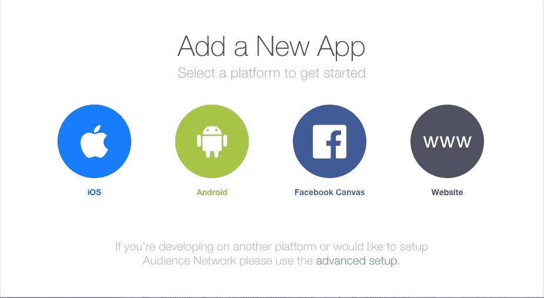
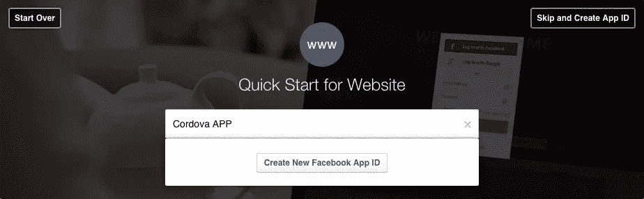
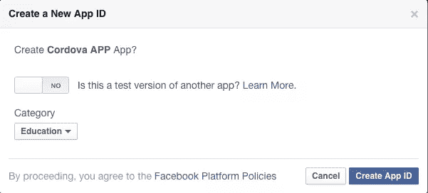
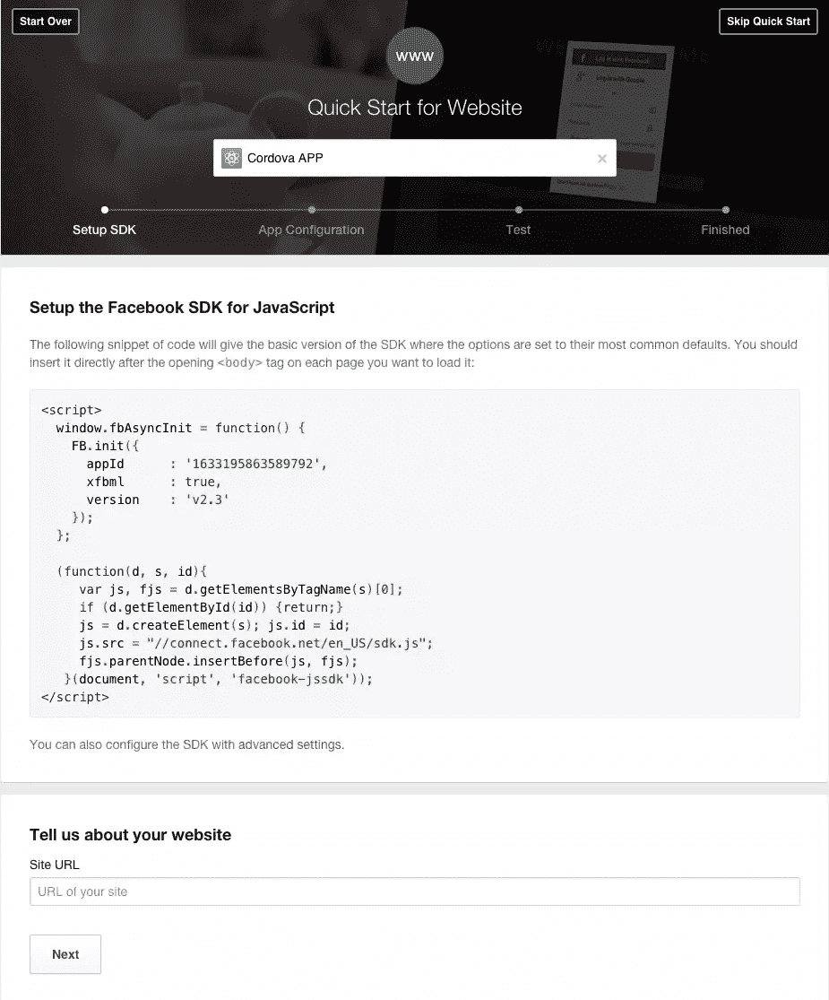
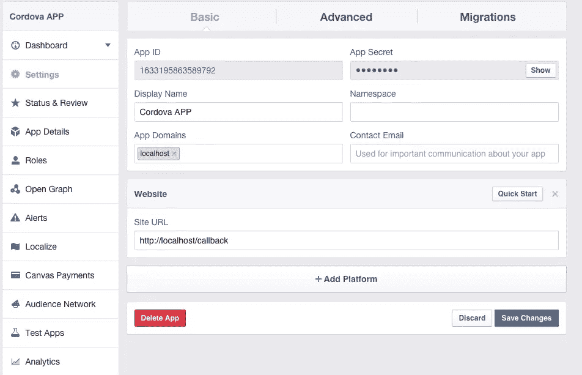
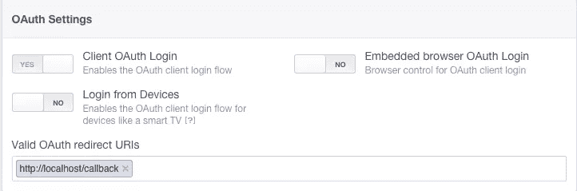
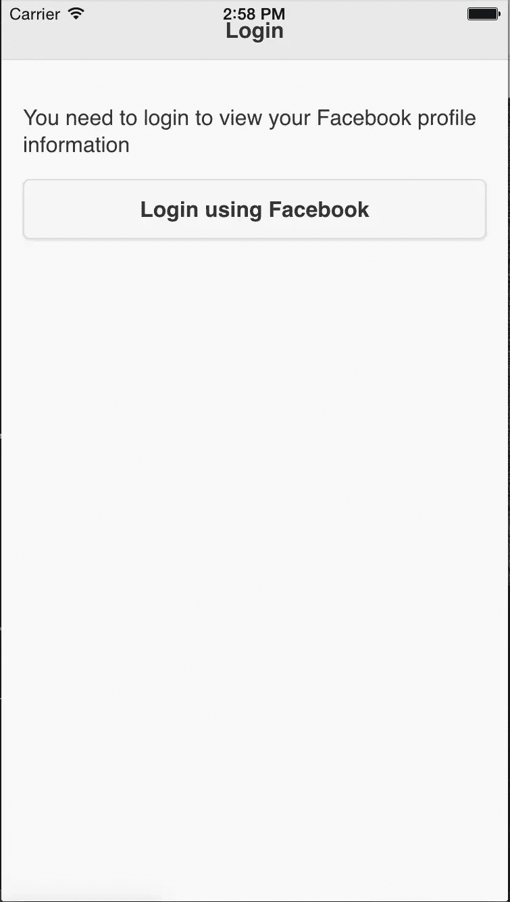
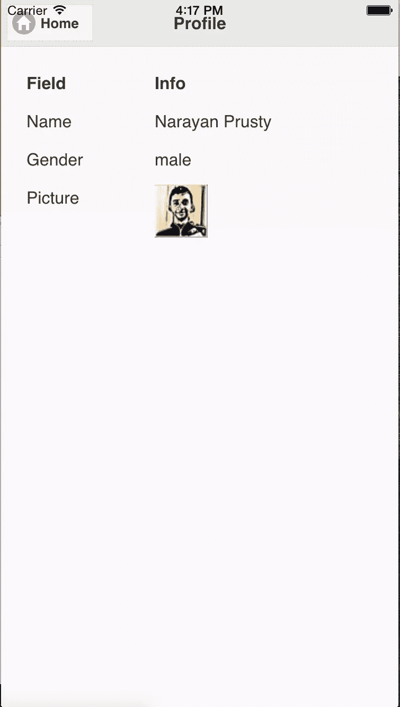

# 如何将脸书登录整合到一个基于科尔多瓦的应用程序

> 原文：<https://www.sitepoint.com/how-to-integrate-facebook-login-into-a-cordova-based-app/>

如果你的应用需要登录或注册功能，那么使用第三方服务，如[脸书认证](https://developers.facebook.com/docs/facebook-login)是有用的工具。

本教程是为使用 [Cordova](https://cordova.apache.org/) 和 [jQuery Mobile](https://jquerymobile.com/) 进行 UI 和 [ngCordovaOauth](https://github.com/nraboy/ng-cordova-oauth) 添加脸书登录功能的开发者准备的。该应用程序将使用户能够通过脸书登录，然后显示他们的基本资料信息。本教程的主要目的是展示如何在 Cordova 应用程序中实现脸书登录，以及如何在基于非离子或非 AngularJS UI 的应用程序中使用 ngCordovaOauth。

## OAuth 认证是如何工作的？

OAuth 协议是许多网络服务(如脸书、Twitter 和 LinkedIn)用来向第三方应用提供用户信息的认证机制。

根据 [OAuth 协议](http://oauth.net/2/)，用户应该首先被第三方 app 重定向到 web 服务。然后，用户向应用授予许可，并且生成返回给第三方应用的访问令牌。访问令牌的作用类似于访问用户信息的许可。

## 什么是 ngCordova 和 ngCordovaOauth？

[ngCordova](http://ngcordova.com/) 是 63+ [AngularJS](https://angularjs.org/) 模块的集合。有些是 Cordova 插件的包装器，有些是纯 JavaScript 库的包装器。ngCordovaOauth 是 ngCordova 模块之一。

ngCordovaOauth 是一个封装在 AngularJS 模块中的 JavaScript 库。这个库的目的是从 web 服务获取访问令牌，以使用它们的 API 和访问用户信息。

我将使用 ngCordovaOauth，因为它可以在所有平台上工作，并支持其他 web 服务，这些服务可以使用与脸书登录实现相同的方法来实现。

## 创建脸书开发者应用

集成脸书登录的每个第三方应用程序都需要创建一个脸书开发者应用程序。一个开发者应用程序帮助脸书跟踪第三方应用程序，并提供额外的配置选项。

要为我们的 Cordova 应用程序创建脸书开发者应用程序，请执行以下操作:

访问[脸书开发者应用页面](https://developers.facebook.com/apps/)，点击*添加新应用*。选择*网站*作为平台。



输入应用程序名称并点击*创建新的脸书应用程序 ID* 。



选择您的应用类别并点击*创建应用 ID* 。



点击右上角的*跳过快速启动*。



在*基本*设置选项卡中输入应用域和站点 URL，如下图所示



在*高级*选项卡下，添加重定向 OAuth URL，如下所示。



## 创建科尔多瓦应用程序

为了创建我的应用程序模板，我需要包含 jQuery mobile 和 ngCordovaOauth 及其依赖项。我不会在这里介绍安装和创建 Cordova 应用程序，如果你以前没有这样做过，[请阅读本入门指南](http://cordova.apache.org/docs/en/4.0.0//guide_cli_index.md.html#The%20Command-Line%20Interface)。运行和构建应用程序的说明位于同一页面上。

给应用程序一个合适的名称，并添加支持的平台。我正在使用 Cordova 的 [InAppBrowser](https://github.com/apache/cordova-plugin-inappbrowser) 插件在本教程中，[你可以在这里找到添加插件的说明](http://docs.phonegap.com/en/edge/guide_cli_index.md.html#The%20Command-Line%20Interface_add_plugin_features)。

你可以在 gitHub 上找到这个[项目的最终代码。](https://github.com/sitepoint-editors/Cordova-Facebook-Login)

在 *www/index.html* 文件中，在`head`标签中添加以下 JavaScript 和 CSS 文件。这些是从 CDNs 加载的 jQuery Mobile 和 ngCordovaOauth。您应该在本地嵌入这些文件，以便该应用程序在没有互联网连接的情况下也能工作。

```
<link rel="stylesheet" href="https://code.jquery.com/mobile/1.4.5/jquery.mobile-1.4.5.min.css">

<script src="https://code.jquery.com/jquery-2.1.4.min.js"></script>
<script src="https://code.jquery.com/mobile/1.4.5/jquery.mobile-1.4.5.min.js"></script>

<script src="http://code.ionicframework.com/nightly/js/ionic.bundle.js"></script>
<script src="https://cdn.rawgit.com/driftyco/ng-cordova/master/dist/ng-cordova.min.js"></script>
<script src="https://cdn.rawgit.com/nraboy/ng-cordova-oauth/master/dist/ng-cordova-oauth.min.js"></script>

<script type="text/javascript" src="cordova.js"></script>
<script type="text/javascript" src="cordova_plugins.js"></script>
```

## 创建主屏幕

我们的应用程序的主屏幕将显示一个按钮，指示用户通过脸书登录。当用户点击按钮，用户将被重定向到脸书。

使用`ng-app`指令创建 AngularJS 应用程序，使用`ng-controller`指令创建控制器。将这段代码放在 *www/index.html* 的`body`标签内，替换当前的`div`:

```
<div ng-app="facebookApp">
    <div ng-controller="mainCtrl">
    </div>
</div>
```

现在创建主屏幕。将这段代码放在我们刚刚添加的代码下面的 *www/index.html* 文件的`body`标签中:

```
<div data-role="page" id="home">
    <div data-role="header">
        <h1>Login</h1>
      </div>

      <div data-role="main" class="ui-content">
        <p>You need to login to view your Facebook profile information</p>
        <a target="_blank" href="#" onclick="login()" style="text-decoration: none"><button>Login using Facebook</button></a>
      </div>
</div>
```

主屏幕现在应该是这样的:



## 创建配置文件屏幕

一旦用户允许访问应用程序，就显示用户个人资料信息。以下是个人资料页面的代码，请将此代码放在主屏幕页面下方:

```
<div data-role="page" id="profile">
    <div data-role="header">
        <a target="_blank" href="#home" class="ui-btn ui-icon-home ui-btn-icon-left">Home</a>
        <h1>Profile</h1>
    </div>
    <div data-role="main" class="ui-content" id="listTable"></div>
</div>
```

## 实施脸书登录

要启动 AngularJS 应用程序，我们需要获取脸书登录的`ngCordovaOauth`方法的引用。将这段代码放在 *www/index.html* 页面中结束的`body`标签之前的`script`标签中:

```
angular.module("facebookApp", ["ionic", "ngCordova"]).controller("mainCtrl", ["$scope", "$cordovaOauth", "$http", function($scope, $cordovaOauth, $http) {
    window.cordovaOauth = $cordovaOauth;
    window.http = $http;
}]);
```

在这里，AngularJS 应用程序被初始化，然后加载必要的模块来使用`ngCordovaOauth`。然后全局保存对`ngCordovaOauth`和`http`模块的引用。

当点击登录按钮时，`login`方法被调用，`login`方法调用`facebookLogin`函数。`facebookLogin`是重定向到脸书网站的自定义功能。将此代码放入之前创建的`script`标签中:

```
function login()
{
    facebookLogin(window.cordovaOauth, window.http);
}

function facebookLogin($cordovaOauth, $http)
{
    $cordovaOauth.facebook("1633195863589792", ["email", "public_profile"], {redirect_uri: "http://localhost/callback"}).then(function(result){
        displayData($http, result.access_token);
    },  function(error){
            alert("Error: " + error);
    });
}
```

`$cordovaOauth.facebook()`方法需要几个参数:
1。**应用 ID**:Facebook 开发者应用的 ID。这可以在应用程序的仪表板上找到。
2。**权限**:访问用户的信息。在[脸书权限页面](https://developers.facebook.com/docs/facebook-login/permissions/v2.3)上可以找到完整的权限列表。

`$cordovaOauth.facebook()`方法返回一个 promise 对象。一旦用户访问了我们的应用程序，就会调用`displayData`函数，该函数发出一个 Graph API 请求来检索用户的一系列信息。

下面是`displayData`函数，它应该放在上面创建的`script`标记中:

```
function displayData($http, access_token)
{
    $http.get("https://graph.facebook.com/v2.2/me", {params: {access_token: access_token, fields: "name,gender,location,picture", format: "json" }}).then(function(result) {
        var name = result.data.name;
        var gender = result.data.gender;
        var picture = result.data.picture;

        var html = '<table id="table" data-role="table" data-mode="column" class="ui-responsive"><thead><tr><th>Field</th><th>Info</th></tr></thead><tbody>';
        html = html + "<tr><td>" + "Name" + "</td><td>" + name + "</td></tr>";
        html = html + "<tr><td>" + "Gender" + "</td><td>" + gender + "</td></tr>";
        html = html + "<tr><td>" + "Picture" + "</td><td></td></tr>";

        html = html + "</tbody></table>";

        document.getElementById("listTable").innerHTML = html;
        $.mobile.changePage($("#profile"), "slide", true, true);
    }, function(error) {
        alert("Error: " + error);
    });
}
```

这里发出一个 [Graph API](https://developers.facebook.com/docs/graph-api/using-graph-api/v2.2) 请求来检索用户的姓名、个人资料图片和性别。发出图形 API 请求时，需要访问令牌。然后创建一个响应的 jQuery mobile 表，并将其添加到配置文件页面内容中。

下面是个人资料页面的外观:



## 结论

这个应用程序向开发者展示了如何在 Cordova 应用程序中实现脸书登录，以及如何在基于非离子或非 AngularJS UI 的应用程序中使用`ngCordovaOauth`。目前，该应用程序是功能性的，但基本的，可以部署到多个平台。接下来的步骤是显示更多信息，让用户发布或更改他们的个人资料图片。

让我知道你尝试本教程的经历和扩展它的想法。

## 分享这篇文章