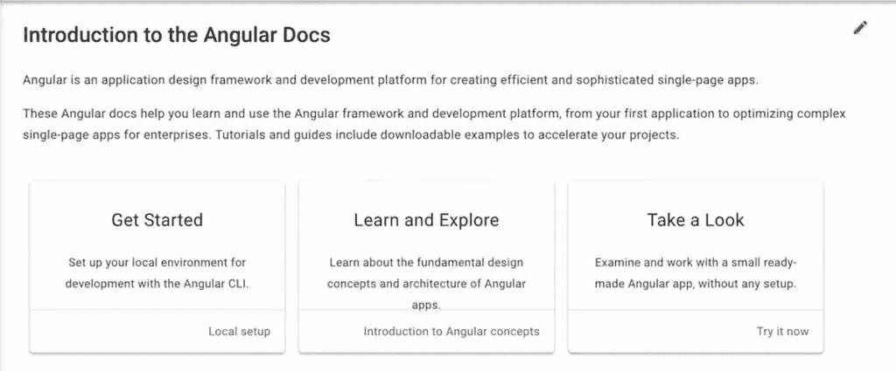
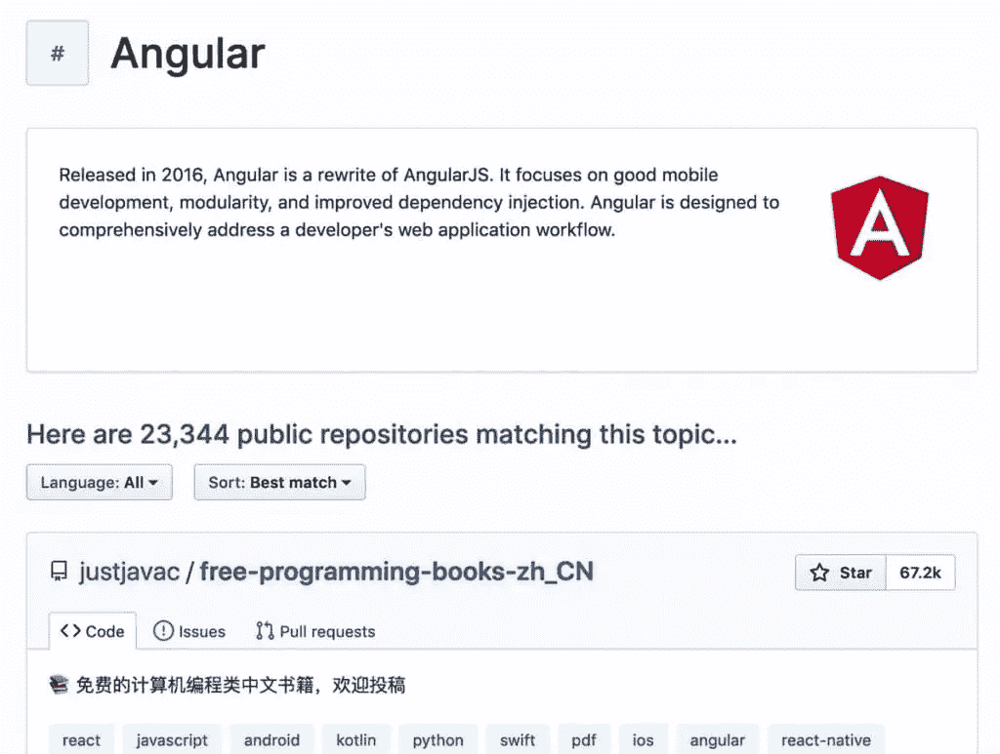
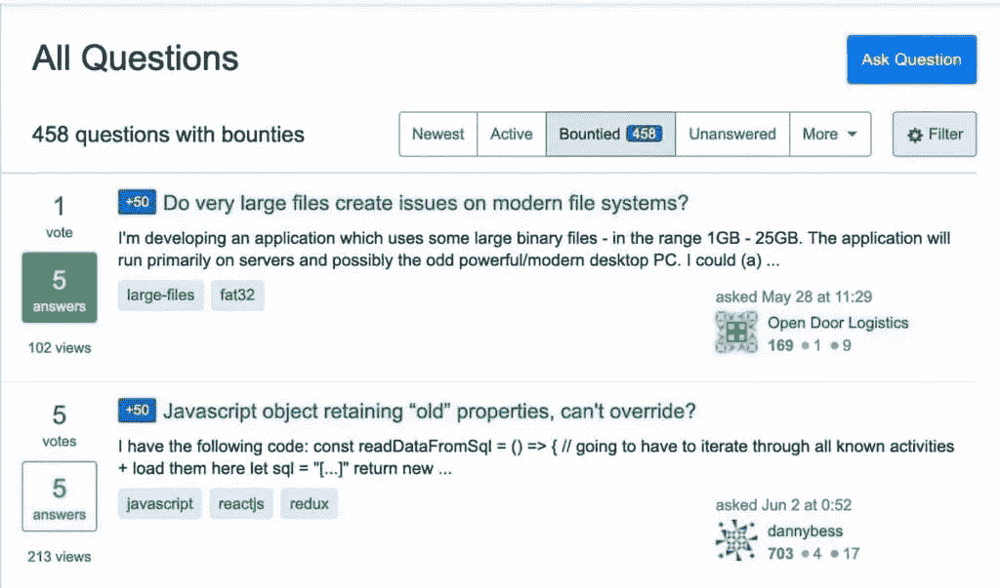

# 如何将职业转变为 Web 开发

> 原文：<https://www.sitepoint.com/how-to-make-a-career-transition-into-web-development/>

在过去的十年里，人们对 web 开发的兴趣激增，越来越多的人希望将职业生涯转移到这个领域。

2008-09 年金融危机导致数百万年轻成年工人失业，并从零开始重新思考他们的整个职业生涯。从这场危机的灰烬中，网络开发已经成为就业市场的宠儿。

越来越多的公司，无论大小，都求助于 web 开发的奇迹来扰乱或适应新的“web 2.0”环境。这些公司知道，如果没有网络，他们的业务注定会被忽视。

对 web 开发兴趣的高涨使得数以百万计的年轻人不仅将它视为一项需要学习的技能，还将其视为一项职业。但是对于那些已经完成大学学业并花了一生积蓄来获得学位的人来说，将职业生涯转向网络开发似乎是一个艰难的提议。

如果你在这个位置，问题就很难了。你必须从头再来，参加昂贵而冗长的课程来学习技能吗？或者你可以从传统职业跳槽到网络开发，直到你找到一份高薪工作？

答案是，不，你不必回到大学去[成为一名网页开发者](https://www.sitepoint.com/21-steps-to-becoming-a-successful-web-developer/)。是的，如果你做好准备，你可以把职业生涯转移到 web 开发上。

各种背景的人都可以转行从事网站开发。他们的建议将为那些想做同样事情而不必牺牲一切的人带来光明。

## 选择正确的自我教育途径

20 年前，说通过自学成为一名网络开发人员是可能的似乎像炼金术一样。2020 年，自我教育似乎将成为普遍现象，而非例外。

2016 年 StackOverflow 年度调查发现，几乎 70%的受访者认为自己是“自学成才的”调查遗漏了他们是完全自己学会了编码还是部分学会了编码。然而，它仍然显示了自我教育对于专业网站开发者的重要性。

对于想成为开发人员的人来说，自主学习更多的是一种务实的义务，而不是道德上的义务。如果没有正式的学位，自学是获得从事网络开发职业所需技能的唯一途径。

然而，问题不应该集中在自我教育是不是一个好主意。几位开发人员认为，真正重要的是在专注于特定的框架之前，选择正确的语言，并投入所有可用的精力来掌握它。似乎不像商业上所说的那样，把所有的鸡蛋放在一个篮子里比把它们分散开来要好。

对于 Lexis Hanson 来说，一个前金融专业人员变成了开发人员，首先掌握一门编程语言——一门基于她需求的语言——然后关注框架和库对她的自学是至关重要的。

> (首先掌握一门编程语言)迫使我在钻研框架之前，必须非常熟悉普通的 JavaScript，这使得下一步变得非常容易。

将语言置于框架之上可能是明智的决定，但这仍然无助于做出正确的选择。解决这个问题的一个办法是*选择一个个人项目*。完成项目所需的特定技术需求将更好地指导您的选择。

Avi Flombaum 是一位自学成才的开发人员，他支持这种方法。他没有选择谷歌搜索中出现的第一种语言，而是解释道:

> 初学者不应该关心他们正在使用的语言。他们应该关心他们选择的语言是否符合他们的目标，如果他们在其中获得了专业知识和深度，当然，如果他们喜欢使用它。

一个个人项目将培养你对编程的热情，它将帮助你决定你应该考虑用什么语言来构建它。一些常见的想法包括:

*   静态网站
*   一个基本的应用程序，比如待办事项列表
*   自动化脚本

如果你缺乏想法，你可以查看[r/daily programmer](https://www.reddit.com/r/dailyprogrammer/)sub Reddit，它发布了每日项目，并附有详细的背景、挑战和要使用的输入。

在选择一种特定的语言之前，另一个需要考虑的重要方面是考虑你自然的解决问题的方法。你如何分解问题？你如何看待他们的解决方案？

在 Hanson 的例子中，她不确定是选择基于面向对象编程的语言还是基于函数编程的语言。但是她没有听从群众的意见，选择一种流行的语言，而是思考她解决问题的一般方式。基于这种反思，她选择了最适合自己的编程范式(恰好是 JavaScript)。

> 函数式编程引起了我的共鸣(您可能有其他偏好)，我挑战自己从“函数优先”的角度来处理问题。在我看来，这迫使我更加灵活地思考编程以及函数和组件应该如何彼此“组合”。

当你学习一门语言的基础时，考虑阅读它的文档，特别是如果你已经在摆弄一个特定的框架。起初，这可能看起来很难，但是你练习技能越多，阅读文档越多，这一切就越有意义。

Vinicius Brasil [推荐](https://hackernoon.com/how-to-learn-a-new-programming-language-faster-dc31ec8367cb)使用 GitHub 查找和阅读你正在学习的语言的产品代码。他补充道，“如果你有信心做出贡献，那就更好了。”

无论何时遇到困难，都不要惊慌。Web 开发是一种友好的技能，它的实践者分享常见问题的解决方案。栈溢出是开发人员提问和分享建议最受欢迎的地方。当你似乎找不到解决方案时，记住:“[谷歌是你的朋友](https://www.urbandictionary.com/define.php?term=Google%20is%20your%20friend)”

自学成才的开发人员经常面临的许多挑战之一是习惯于相当奇怪的编写代码的方式。许多有经验的开发人员会告诉你，你写一串代码的方式和代码要做什么一样重要。这种说法的真实性值得讨论，它有其优点，但对于一个正在利用自己的资源学习的初学者来说，编写完美的代码更多的是一种奢侈而不是必要，至少在开始时是这样。

杰里米·冈特(Jeremy Gunter)的情况就是如此，他“先学习，后清洁”的心态在自我教育的早期成为了他自信的最大助力。他的方法包括使用伪代码使他的代码工作，然后在谷歌上搜索它们应该如何编写。

> 我没有绞尽脑汁去记住方法名，而是专注于我需要执行什么动作。当我想在数组的开头添加一个项目时，我发现在 google 上搜索“在数组的开头添加项目”比尝试使用自己的记忆来区分 shift()、unshift()和 pop()更容易。

任何有经验的开发人员都可能会对使用伪代码而不是语法的想法咬牙切齿。尽管如此，对于自学成才的人来说，冈特的方法更像马克·扎克伯格的“快速学习并打破东西”的咒语，而不是蒂姆·彼得斯的“美丽胜过丑陋”

一切尽在不言中，彼得斯先生，一切尽在不言中。

## 建立一个网络

大学教育通常被认为是一个机械的过程，在这个过程中，学生获得了成为他们所选择领域的专业人士所需的所有知识。在这种心态下，任何不暗示学习和记忆技术概念的事情都是次要的。

这种简单化的想法留下了受过大学教育的开发人员相对于自学成才的开发人员的一个显著优势，如果后者想要与前者处于平等的地位，就必须在这一点上努力。也就是*学院提供给学生的*专业网络。

职业网络是建立在导师、教授、求职者和同学的网络之上的。其中一些人最终会成为同事，一些人会成为求职者的推荐人和参考人，这两者都是任何职业生涯中取得成功的关键因素。

忽视像这样的网络对网络开发者的重要性，就是低估了大学带给学生的最突出的优势之一。因此，任何考虑转行从事 web 开发的人都必须在发展技能的同时优先考虑建立这个网络。

作为一个自学成才的开发者，你身边可能没有教授或者求职者。那么，工作应该集中在与那些可能在你的旅程中帮助你的开发者建立牢固的关系上。

首先，你需要考虑参加当地的发展活动和聚会。这些会议是一般性的还是特定语言的并不重要。重要的是你主动去认识其他人，成为社区的一员。

Nnena Ndukwe 是一名退学生，也是一名前晒黑顾问，[解释了](https://codeburst.io/how-i-went-from-mopping-floors-at-a-tanning-salon-to-becoming-a-software-developer-7dc4d2e8d21a)在她整个自学过程中参加聚会的益处:

> 与该领域的人进行这些关于技术的对话帮助我获得了更多关于工作机会、志愿组织以及参加技术或社会活动的知识。通过人际关系网，一个机会总会带来下一个机会。

为了证明她的观点，Nnenna 说她通过一个训练营得到了她的第一份开发工作，她在她参加的一个聚会上听说了这个训练营。meetups 是直接还是间接创造就业机会并不重要。关键是它们增加了转行到 web 开发职业的机会。

最受欢迎的寻找当地聚会的网站是 Meetup.com，但是你也可以使用脸书事件和 Eventbrite。在这些网站上快速搜索一下，你会找到你所在地区的几十个聚会。

就像谷歌是你学习编码的朋友一样，你也可以用它来查找你所在地区的事件。你可以使用一般的搜索查询，比如“web development”加上你所在的城市，或者更具体的搜索查询，比如“Python”(或者任何你想要的其他语言或框架)加上你所在的城市，你会得到很多离你很近的活动。

你既可以作为与会者参加，也可以利用现有的关系网来结识能帮助你的人，或者你可以就你的自学过程发表一次演讲。

大多数与会者会很惊讶，也很高兴遇到一个没有学位却想改变的人。你甚至可能遇到其他人，他们碰巧实现了你的职业转换目标，并能在你的旅程中给你反馈和支持。

建立网络的另一个选择是加入在线社区。有几十个针对开发者的聊天，这些会给你提供大量关于最新的新闻、想法和人们的信息。你甚至可以搜索你所在地区的开发商，你可以和他们一起喝杯咖啡。

这些活动和聚会不仅仅是为了结识同事。正如 Nnenna Ndukwe 所证明的那样，他们也能有效地会见潜在客户或雇主。

## 利用零工经济

在你成为一名网站开发人员的过程中，会有一个时刻，你会开始考虑找份工作。不管你的教育背景如何，再多的学习也不能让你为真正的工作做好准备。你应该什么时候开始发送申请？

最直接的答案是，这样做从来没有正确或错误的时间。你可以在开始学习网页开发后不久或者几年后开始申请工作。如果你担心自己还没有准备好做出改变，一个可以用来建立自信和积累经验的方法就是利用“零工经济”

像 Craigslist、Fiverr 和 PeoplePerHour 这样的网站允许像你这样的人获得有偿“工作”——有时间限制的合同工作。这些工作不仅能帮你赚些外快，还能帮你获得工作经验(甚至可能是推荐信和推荐)。

根据 Walt Schlender 的说法，零工在某种意义上是独一无二的

> 太小、太专业或太实验性，不值得雇佣全职员工。他们为之工作的雇主雇佣他们是因为他们需要完成一份临时工作，而临时工可以并且愿意做这项工作。

众所周知，使用这些平台的潜在收入需求很低，通常以成本为导向，服务也会相应调整，其用户群中有很大一部分来自巴基斯坦和菲律宾等低工资国家。认为可以从这些平台谋生不一定是最聪明的想法，但对于缺乏专业经验的人来说，这可能是一个很好的机会——尤其是对于那些患有严重“冒名顶替综合症”的人来说

自学成才的开发者和前厨师 Tania Rascia [解释说](https://www.taniarascia.com/how-i-made-a-career-change-into-web-development/)在 Craigslist 上做自由职业帮助她建立了自己的简历，并在移动中学习，同时还赚了一些钱。她一边学习，一边不断申请工作，直到她最终找到了一份全职的网站开发工作。有趣的是，她说:

> 对我帮助最大的是创建一个博客来记录我学到的所有东西，我会把它推荐给任何想学习的人。

其他自由职业网站，如 Upwork 和 Freelancer，都是这些类型工作的不错选择。一份单独的工作可能不是你职业生涯的全部，但随着时间的推移，它们会复合。在你意识到之前，你简历中的一打或更多这样的工作可能会像在大学里学过的一样有用，尤其是如果你已经把所有东西都存入了你的 GitHub 账户。

更重要的是，其中一些工作可以转化为更大的工作。Schlender 通过使用零工经济开始了他的网络开发生涯，他解释道:

> 我会开出 2 个小时的单子(这个单子实际上花了我更多的时间)，我会准确地交付我的客户要求的东西。第二天，客户会问我是否有时间做另一个项目。
> 
> 我创建的每个项目都是我可以添加到我的投资组合中的另一个项目。每个项目也扩大了我的网络。我遇到的人会把他们的朋友和同事介绍给我。这些年来，我最终为一些知名公司工作。

另一个类似的(同样有效的)选择是把你的技能交给非营利组织、当地企业或你的网络。如果使用得当，免费工作本身就是一种货币。它可能没有货币价值，但它有道德意义。它建立了良好的信誉，如果收到它的人或公司知道你的旅程并从中获得价值，他们可能会向团队中需要专业开发人员的人推荐你。

像 [Catchafire](https://www.catchafire.org/) 或 [donate:code](https://www.donatecode.com/) 这样的公司可以成为你在真实项目中练习新技能的完美杠杆，让你获得经验并建立自信。只要你把这些非营利项目当成工作，而不仅仅是出于自私的原因做的一件有趣的事情，你就会学到很多东西，相关的组织也会受益匪浅。如果你投入其中，你也会建立良好的因果关系。

## 结论

转行做 web 开发这样的技术职业，无疑是一个很吓人的命题。不管大学能给你带来什么，对这个领域的热爱和大量的努力可以弥补教育机构给学生带来的大部分优势。

对于自学任何技能的人来说，学习、实践和分享你所学到的东西是成功的三重法宝。如果你接受它，你新的网络开发事业将有很大的成功机会。祝你好运！

* * *

准备好开始旅程了吗？你可以做更多的准备。了解[顶级开发人员如何通过面试](https://www.sitepoint.com/ace-job-interviews/)，如何[准备远程求职](https://www.sitepoint.com/how-to-prepare-for-a-remote-job-search/)和[为你找到合适的远程工作](https://www.sitepoint.com/finding-perfect-remote-job-opportunity/)，以及[参与开发社区](https://www.sitepoint.com/personal-brand-boost-developer-career/)如何改善你的职业前景。

当你准备好的时候，在 SitePoint Remote 上找到科技领域的[最佳远程工作。](https://www.sitepoint.com/jobs/)

## 分享这篇文章