# 如何制作纸质原型

> 原文：<https://www.sitepoint.com/how-to-make-paper-prototypes/>

以下是我们的书《设计 UX:原型制作 T2》的一小段摘录，作者是丹·古德温和本·科尔曼。这是原型制作的终极指南。SitePoint Premium 会员可以通过他们的会员身份访问，或者您可以在世界各地的商店购买一份。

制作纸质原型没有规则——这就是它的伟大之处。你需要在任何家庭或办公室都能找到的材料，但如果你不得不买，它们相对便宜。

## 你需要什么

至少你需要纸和笔——这种低门槛是这种方法最好的方面之一。然而，对于更复杂和交互式的原型，你将需要一个更大的武器库，如果你正在运行研讨会或做大量的原型，组装一个包含以下项目的工具包是一个好主意。

在进行原型制作会议时，我们建议以下事项:

*   带网格或点网格的纸张(首选)
*   便利贴(出门必带！)
*   铅笔
*   橡皮擦
*   钢笔(不同颜色和粗细的记号笔最理想)
*   剪刀或工艺刀
*   胶水(最好是可再粘的)

值得拥有的物品包括:

*   索引卡片
*   安装油灰
*   胶带(最好是可移除的，以便四处移动物品)
*   荧光笔
*   细笔尖和普通笔尖的双头记号笔
*   透明片和标记
*   用于归档或运输原型的盒子

在本章的后面，我们将探讨使用不同材料的可能性。

### 你的方法

严格地说，你可以一头扎进去，开始制作；然而，我们发现 fffunction 的一个有用的流程是由外向内思考，在进行过程中关注越来越小的部分，例如:

1.  设备
2.  屏幕
3.  元素
4.  交互性或状态变化

### 设备

在这个例子中，我们设计的视窗或设备的尺寸是多少？任何可用的用户研究都可以提供这方面的信息。分析数据将表明现有受众可能更喜欢使用什么。设计工作的目标可以是在小屏幕设备上原型化改进的体验。

#### 台式机或笔记本电脑

一张 A4 或美国信纸大小的纸在这里是合适的，你可以使用不同的方向来模仿设备，如桌面或笔记本电脑的风景。如果您想要一个更真实的源，您可以打印出一个浏览器框架图形。

#### 药片

A5 或 US 半信纸大小的纸张应该足够了，尽管如果你是为苹果 iPad Pro (12.9 英寸)这样的大平板电脑设计的，你可能想坚持使用 A4/信纸大小。同样，您可以根据您对用户的期望来选择方向。如果您想让这更真实，创建一个虚拟设备是一个选项。最低级的方法是把它画在一张卡片上，然后在屏幕的地方剪一个洞，如下图所示。

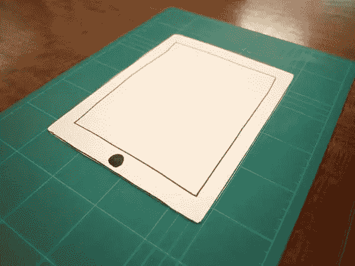

激光切割和 3D 打印设备专门用于以更自然的方式使用纸质原型，使原型成为设备的一部分。

#### 电话

和前面的例子一样，你可以直接在纸上画草图:A5 或 us 半张信纸大小、索引卡或便笺条，并使用不同的方向。不过，与其他形式相比，移动设备有更多的选择。

你可以做一个手机边框，在屏幕上开一个窗口，或者用放在手机顶部的卡片作为不同的屏幕。

如上所述，也有激光切割和 3D 打印设备模型可用。下图显示了我们在工作中使用的激光切割胶合板手机模型。

塑料或卡片模型设备也是可用的，其具有插入纸片以模拟滚动的通道。你甚至可以把所有的屏幕放在一张长纸上，滑动它来模拟导航。

另一种选择是使用小型螺旋装订笔记本在屏幕之间快速切换，标签或彩色点形成导航元素，如下所示。这是一个很好的方法，因为它模仿了人们使用手机的方式:一只手拿着手机，另一只手轻触手机进行互动。

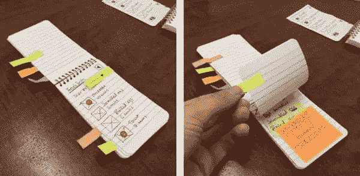

### 屏幕

现在，我们将定义传达设计所需的屏幕。考虑用户将在旅程中采取哪些步骤是有帮助的。我们可以从现有的工作中开发一个列表，比如用户旅程、任务模型、网站地图、信息架构或者功能规范。第二章的 [*收集资源*](#gather-resources) 一节已经介绍过了，如果你需要复习的话，可以参考一下。一旦你制定了一个清单，你就可以开始考虑每个屏幕需要哪些元素。

如果你不知道屏幕的大小，或者对你所设计的东西没有一个完整的概念，在进入更多细节之前，在卡片上勾画出这些步骤对一个高层次的产品是很有用的。我们建议从较小的 A5 或索引卡开始
,帮助你关注每个屏幕上的个人互动；每个屏幕有一个目标是一个好的开始。然后，您可以将它们排列在一张桌子上，通过流程试验不同的流程。

### 元素

当查看组成屏幕的元素时，考虑用户在原型过程中将如何与它们交互。当它们接触到那个元素时需要发生什么？

在某些情况下，您可能有一个一致的界面，只有一个窗口根据周围的交互而变化。一个简单的例子是左侧栏中的菜单改变右侧栏的内容。这可以用左边的同一个卡片来表示，而右边的每一个可互换的内容用不同的卡片来表示，如下所示。

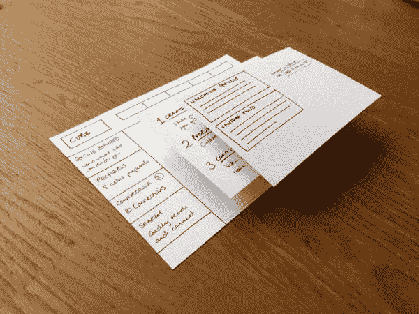

### 交互性

你建立的所有元素都将在不同的点上相互作用。如何在纸上复制这种功能是一个挑战。同样，很可能没有“第一次正确”的解决方案，因此有必要尝试不同的材料和方法。

##### 滚动和滑动

我们使用的一种方法是从屏幕上剪下一些部分，然后穿入纸条来实现滑动和滚动元素。一个 1-2 毫米的洞足够大，可以让纸滑过去，并为“滚动”留出适量的间隙下图描述了纸张垂直滚动设备。

另一种方法是使用一种更先进的设备模型，该模型带有一个插槽，用于滑动纸张，指示水平滚动。

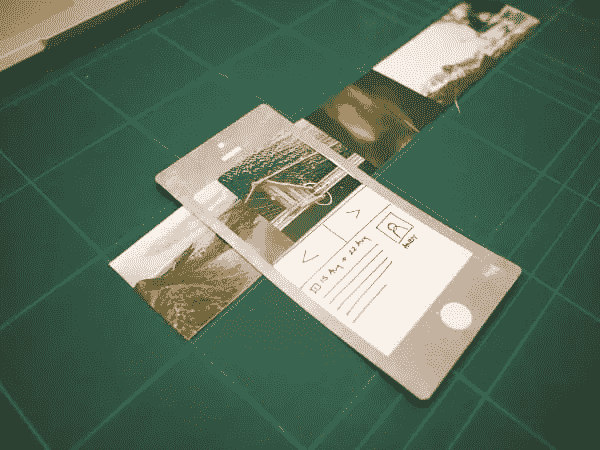

#### 菜单

对于一个菜单来说，可以把纸片放在交互的位置上，或者，类似地，你可以使用便签纸，这样它们可以保持在原来的位置上，但是很容易移动。

如果你使用的是剪切设备，菜单可以放在画布之外或者看不见的地方，然后滑入显示出来，如下图所示。

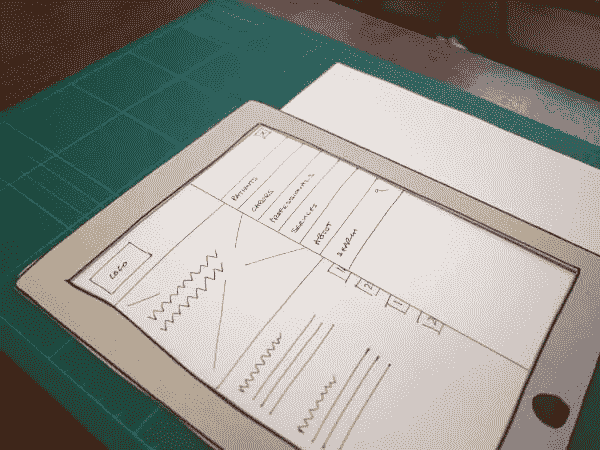

#### 消息和弹出框

便笺对于消息、弹出窗口或工具提示来说很方便，因为它们可以放在屏幕上，然后在交互后或一段时间后移除。你可以购买更小的尺寸，甚至是如下图所示的非常适合的气泡形状。

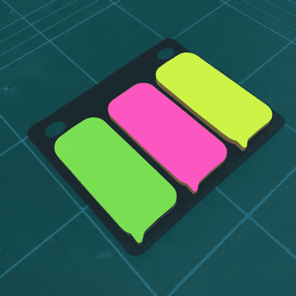

#### 制表符

你可以从纸上剪下自己的标签，或者购买索引卡。当选择另一个选项卡时，洗牌并把所选的选项卡放在最上面。
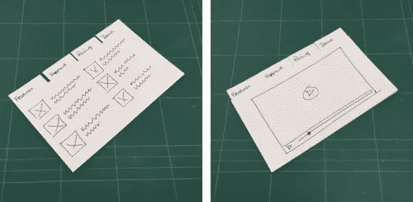

#### 手风琴

现在是时候来点折纸了。在页面上绘制包含所有视图的手风琴内容。从顶部开始，折叠手风琴，这样只有标题是可见的，抽屉里的内容是隐藏的。然后，当你点击一个标题，你可以显示折叠的内容。下图展示了这一过程。

如果你想跳过折叠，你可以制作单独的作品，或者在将要展示的部分使用便利贴。

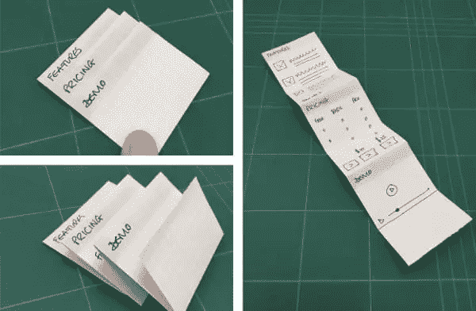

一种常见的响应式设计模式是将较小屏幕上的手风琴式菜单与较大屏幕上的选项卡互换。您可以在下图中看到这两个不同元素的原型。

#### 向上/向下滑动分隔缝

我们已经讨论过的技术可以在这里使用。你可以选择隐藏画布上的内容，或者从纸缝中滑入查看。或者，您可以简单地将内容放在单独的卡片上，并在需要时放置到位。

#### 选择框

粘滞便笺在这里很好地描述了在 select 元素中可以看到的可移动的项目列表，如下所示。用户将能够看到选择并选择一个，此时您可以从原型中删除列表。

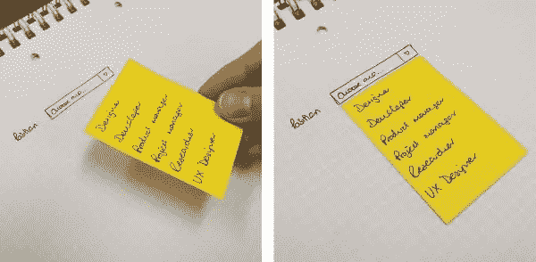

#### 复选框和单选按钮

简单地画出这些通常就能满足原型的需求。在交互之后，您甚至可以将已检查的版本放在未检查的版本之上。

如果原型的部分目的是试验元素在页面上的定位，那么一个条状的便利贴就可以了。

您必须权衡在测试场景中构建和操作这个元素的复杂性与拥有细节的好处。做得太复杂，操作你的原型会变得困难。

#### iOS / Android 原生设计元素

可以选择添加来自 iOS 或 Android 的复杂设计元素，这些元素可能很难复制或需要时间来绘制。例如，要复制一个日历，更简单的方法是从设备上截取一个日历的截图，然后打印并剪切下来，而不是绘制草图。

你可以详细说明这一点，并打印出一个设备的模板或工具包库，如果你认为这将加快进程，而不会使设计过于规范。

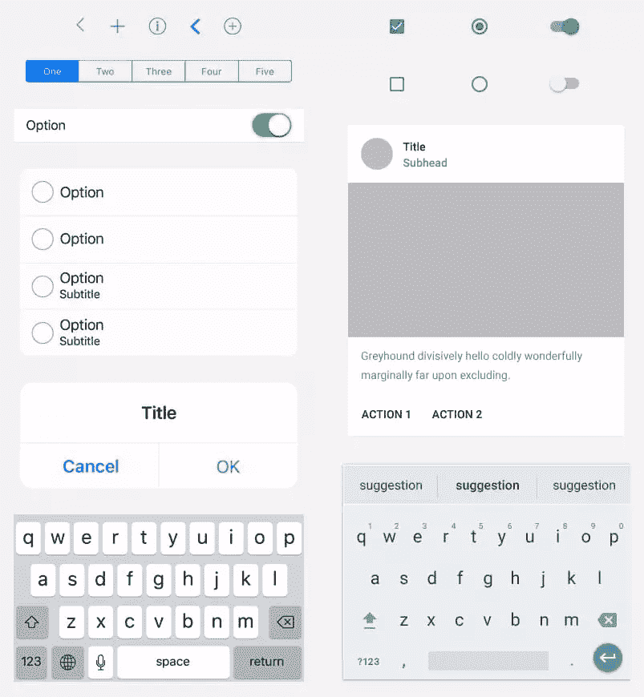

#### 字面上的*任何东西*

前面提到的例子是常见的设计元素，可以在标准的网站、平板电脑或手机上找到，但没有理由局限于你以前见过的东西。如前所述，纸质原型的优点之一是你不会受到数字媒体的限制。如果你能想象出来，你大概可以用纸做出来，用它做原型。

## 绘画技巧

当创建纸上原型时，你需要绘制元素来组成你的草图。在某些情况下，您可能不需要拼写内容，也不需要特别详细地描述页面上的元素。这可能是因为您将交互集中在某个模块或元素上，并希望避免其他元素的干扰。

在这种情况下，您可以利用速写来表示常见元素。如下图所示，标题可以是波浪线，段落文本可以是直线，图像框可以是对角线，就像你在线框图中看到的那样。

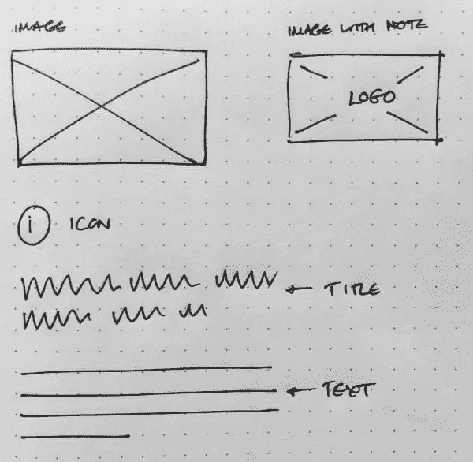

当然，这忽略了另一个与线框相比使用纸质原型的优势。线框用一个有对角线的盒子来代表图像。你可以给一个盒子贴上标签来表明它是什么，但是除非你添加一张图片，否则你的交流是相当有限的。在素描中，你可以进一步探索，勾画出图像的实际内容。在下图中，我们通过描绘一个英雄形象来介绍一种新产品，有两个客户在使用该产品。这为用户提供了最终设计的大致体验。

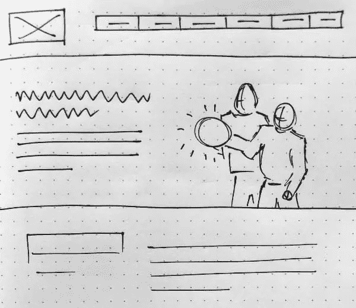

## 分享这篇文章