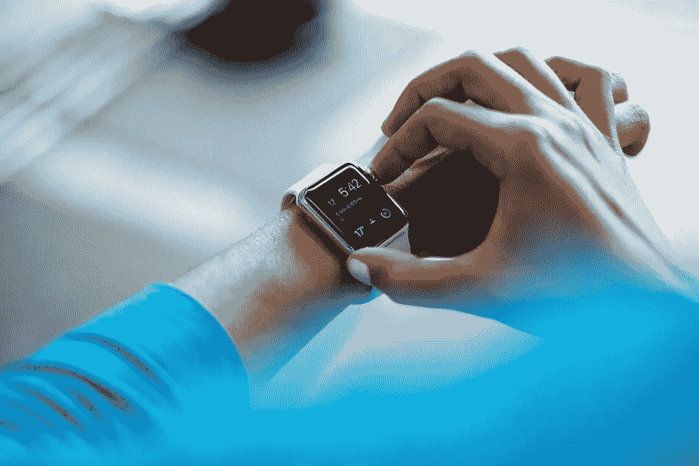

# 如何掌握养成良好习惯的习惯

> 原文：<https://www.sitepoint.com/how-to-master-the-habit-of-forming-good-habits/>

作为人类，我们做的 40%的事情都是习惯性的，从早上刷牙到一到办公室就查看邮件。根据《欧洲社会心理学杂志》的报道，养成一个新习惯平均需要 66 天**。**

虽然只需要我们生活中的一小部分，就可以改掉坏习惯，达到更好的生活目标，但我们经常发现这样做非常困难。但是为什么，当改掉坏习惯的好处如此明显的时候？

向坏习惯屈服会让我们感到虚弱，缺乏更加努力的信心，这就是为什么我们中的许多人会一次又一次地重复同样的坏习惯。当你习惯于以某种方式做事时，改变会带来极大的压力，但是改变习惯使之变得更好会对我们的生活产生持久的积极影响。

让我们来看看一些方法，我们可以忘记坏习惯，并采取新的，更好的。

## 我们为什么会形成习惯？

神经科学家发现，当某些行为变成下意识的自动行为时，我们的大脑不必再努力工作了。基本上，我们形成习惯是为了让大脑可以懈怠一段时间！这是什么意思？这意味着自发地做一些不同寻常的事情会锻炼我们的大脑。

(当然，暂时打破了这个习惯)。

## 通过预先计划来治疗坏习惯

坏习惯通常是我们之前做的决定的结果，比如决定在不提供健康选择的地方吃午餐。这个错误可能直到你坐下来看菜单的时候才想到(“该死，我又来了，好吧，我要双层芝士汉堡和薯条”)。预谋是关键，因为坏习惯往往会导致其他坏习惯，比如⏤:“既然我今天吃得这么不健康，我还是喝全糖可口可乐吧，忘了零度可乐吧。”**不不不**

记下坏习惯并想出可行的替代方法不仅能帮助你避开它们，还能让你更容易想出不像是一种自我惩罚的解决方案。

## 养成写下坏习惯的习惯

在这种情况下，便条可能会说“午餐吃些健康的东西”。“午餐不要吃不健康的东西”有负面含义，可能会对你过去的习惯产生潜在的羞耻感——这确实会对你的方法产生影响。积极的氛围意味着更多的动力。如果一开始你仍然觉得这很难(这是可以理解的，它不应该是容易的)，从简单的“午餐喝水或无糖饮料”开始，然后朝着更大的目标前进。

在列表或待办事项应用程序中以数字方式记录你的习惯，这样你就可以随时随地记笔记，并为它们设置提醒。

## 3 个能帮助你养成良好习惯的应用程序

[**Wunderlist**](https://www.wunderlist.com) 是一个很小但非常有用的待办事项应用程序，用于记录重要任务、截止日期、即将到来的事件等等。为什么不用它来改掉坏习惯呢？Wunderlist 是一个很棒的方式来提醒你自己(通过你的手机、平板电脑或电脑)在一天中的特定时间喝水，在早上 7 点吃一顿健康的早餐，或者在早上 8 点挤出一个 [10 分钟的大脑锻炼](https://www.sitepoint.com/8-brain-warm-up-exercises-for-mental-clarity-in-the-morning/)，在一天中获得更好的精神表现(这也将增强你的意志力，帮助战胜坏习惯！).

[**不干了！**](https://itunes.apple.com/gb/app/quit-that!-track-how-long) 是一款告诉你距离上次做了不该做的事有多长时间的应用。人们讨厌打破他们的连胜，所以这是一个打破像吸烟这样的坏习惯的完美方式。看到你整整一周没有吸烟，这是非常值得的。它甚至让你知道打破这些习惯你省了多少钱，这总是一个额外的收获！

[**习惯清单**](http://habitlist.com) 结合了神童和戒那。它通过条形图直观地让你知道你有多长时间没有做这些事情来帮助你打破坏习惯，而且还允许你为好习惯设置提醒(待办事项风格)。该应用程序使用徽章作为一种视觉提醒，提醒你一天中还有哪些习惯需要养成。你甚至可以给自己设置一个提醒来养成使用这个应用的习惯！

## 结论

所以你终于根除了一个坏习惯！但事情并没有就此结束，因为你永远不会真正忘记一个坏习惯，而且你永远都有重蹈覆辙的风险。最好把这篇文章加入书签，*以防万一！*

通过积极地提醒自己你的坏习惯，你可以将它们带到你意识的前面，并在为时已晚之前处理它们。

有哪些坏习惯你已经带了太久，或者为了显著改善你的生活而改掉了？

## 分享这篇文章