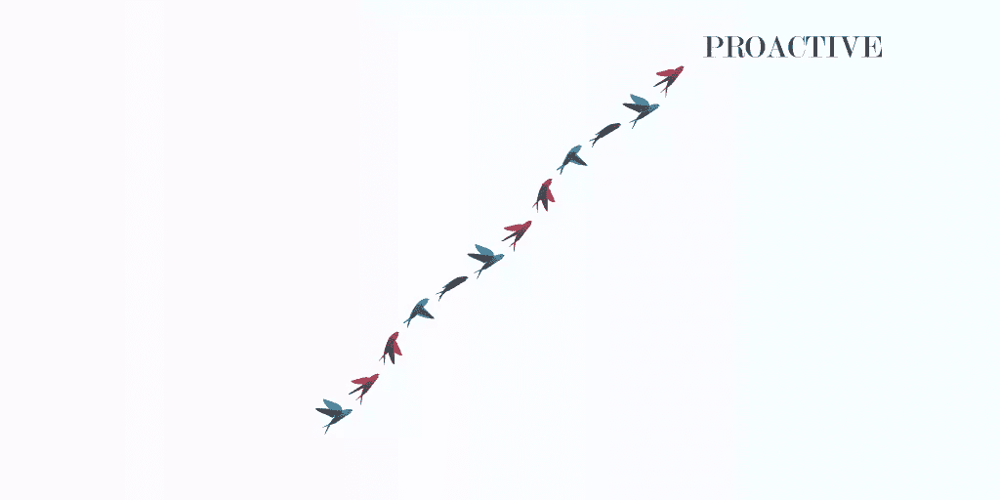
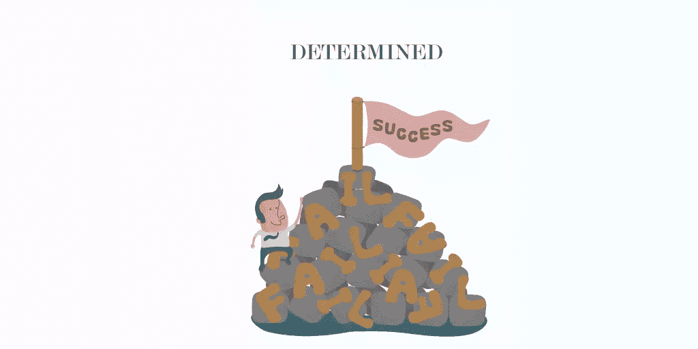
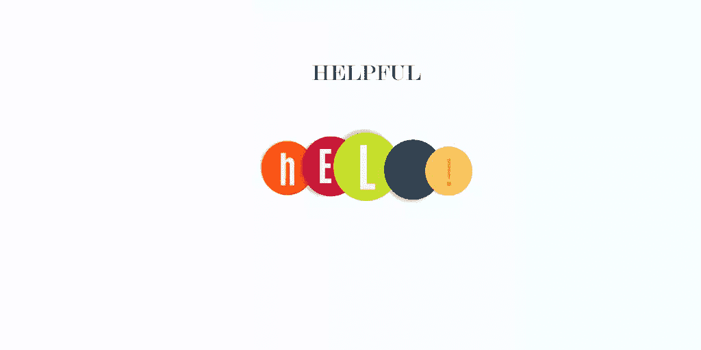

# 当你住在荒郊野外时，如何建立人际网络

> 原文：<https://www.sitepoint.com/how-to-network-anywhere/>

我:“人脉是成功的关键！”

我绝对相信这一点。然而，当我第一次开始建立自己的事业时，我才 18 岁，在加利福尼亚中部海岸一个可爱但僻静的地方上学。我们离海滩只有 5 分钟的路程，但离最近的“大城市”却有 1 小时 45 分钟的路程我渴望建立关系网。但是和谁呢？

我没有耸耸肩说:“大学毕业后，我搬到纽约后，我会结交朋友的。”我决定通过唯一可用的方式建立联系:互联网。

以下是我学到的东西。

## **有选择性**

很容易陷入所有的选项中。但是在 LinkedIn、 、Twitter、 [Slack](https://www.sitepoint.com/best-slack-communities/) 、 GitHub、 *和* Quora 上做一个账号，意味着你不会在一两个平台上有强大的存在，而是在六个平台上有微弱的存在。

当谈到在社交媒体上建立关系和建立声誉时，一致性和频率是关键。因此，即使你在很多不同的平台上都有账户(我们大多数人都有)，出于建立关系网的目的，你也应该选择两个来集中精力。

想知道选择哪一个？

*   几乎每个职业人士都上了 [LinkedIn](http://www.linkedin.com/) ，无论你是谁，这都是一个绝妙的选择。
*   如果你正在寻找更年轻、技术娴熟的用户，Twitter 是一个不错的社区。
*   联系你的客户(或潜在客户)，走。
*   如果你想要一种非常类似于现实生活互动的网络体验，那么 [Slack](http://slack.com/) 是最好的选择。
*   如果你是一名开发者， [GitHub](http://github.com/) 更多的是强制而非可选。
*   [Quora](http://quora.com/) 有利于给予和接受帮助。
*   视觉创意人员应该在 [行为](http://behance.com/) 上创建一个作品集。
*   寻找合作伙伴和顾问，查看。

我决定在 LinkedIn 和脸书上进行大部分的社交活动。LinkedIn 有一个奇怪的笨拙的界面，但它在你的网络呈指数增长中令人敬畏——你的每个联系人都会给你带来 10+潜在的更多联系人。我喜欢脸书的个人元素；经常评论其他用户的状态更新、照片和链接帮助我建立了许多很好的职业友谊。

## **做正宗的**

不幸的是，社交仍然有“低俗”的名声——而且网上社交可能会感觉更不真实，因为你是在和人们的头像而不是他们的真实面孔互动。

为了克服这一点——并建立一些有用的联系——尽可能地真实。

例如，如果你在推特上，不要害怕赋予你的推文一些个性。在你的网络形象中加入幽默和个性可以让其他人了解你，就像他们在现实生活中一样。

如果你克服了一个巨大的挑战，取得了今天的成就，考虑写一篇关于它的文章，发布在 LinkedIn 或 Medium 上(或者两者都有！)展示网络角色背后的人，会让人信任你，喜欢你。毕竟，我们都有不安全感和弱点——但我们大多数人都不愿意在网上暴露出来。

注意:确保你的真实性不会变得不恰当。有些事情显然不应该在网上分享！一般来说，如果你认为这些信息会让别人在雇佣你的问题上三思而行，那就不要发布。

## **积极主动**

在网上交流方面，你绝对需要采取主动。建立一个强大的、真实的形象是很好的，但是你在网上遇到的大多数人不会同时开始与你的对话 *和* 继续下去——这意味着责任将落到你身上。

你与人互动的方式会因平台而异。

想象一下，你在 Twitter 上看到一个企业家朋友的简介，他有一个很酷的新兴企业，一些很棒的见解(从他的推文来看)，还有一群坚定的追随者。你可能想关注他，向他发推文，“对你与[公司名称]的合作印象深刻！期待跟随它的成长。”

然后，几个星期后，你会喜欢并转发他的推文，偶尔加入你自己的评论来引发讨论。

他很有可能最终(如果不是立即)开始与你交往。

但是你需要一种完全不同的技术，比如说在 LinkedIn 上。向感兴趣的人发送连接请求后(确保您对其进行了个性化设置！)，你应该发信息感谢对方接受你的请求。然后问几个关于他或她的职业、当前项目、兼职等深思熟虑的问题。如果一切顺利，你们将会有一个聪明有趣的交流，这将会带来未来的对话——最终，一段关系。

## **待定**

我试图在社交媒体上与每 10 个人交流，我就与其中两个人建立了长期联系。这个低比率并不意味着我没有做所有正确的事情。这表明在网上建立一段关系有多难。每个专业人士都很忙，所以如果你的努力被忽视或没有变成任何持久的东西，不要觉得自己被拒绝了。

但是下定决心并不意味着你要和同样的人一遍又一遍地尝试。如果你给某人发了两条脸书信息，而她两次都没有回复，那就去找另一个人。外面有很多潜在的联系。你建立人际网络的努力不会依赖于任何一个人。

下定决心是不是说你一直在努力。给多几个人发一条脸书的信息——也许调整一下你的信息，看看新的信息是否能更有效地得到回复。或者你应该尝试在不同的平台上建立联系。

## **乐于助人**

当你专注于如何帮助他人时，人际关系网就会发挥作用。我知道，这是违反直觉的，但是如果你一直是某人的一个很棒的资源，他或她一定会推荐你一份工作，传递一个很酷的机会，或者甚至在时机成熟时雇用你！

当你在网上交际时，这个原则仍然适用。利用他人档案中的信息来衡量他们的需求，看看你能做些什么。

也许你是一名平面设计师。为什么不为某人设计一个定制的标志呢？或者你发现了一篇很棒的文章，你认为你所在领域的另一位专业人士真的会从阅读中受益。用短信发给他或她，并解释你为什么要发送它！

因为我是一名作家，我养成了浏览人们网站的习惯，寻找不正确的语法或措辞笨拙的内容。一旦我发现了什么，我会截屏并通过电子邮件给那个人一个非常礼貌的建议。这项技术让我接触到了一些超级有影响力的专业人士。

无论你的专长或天赋是什么，你都应该在寻求网络的过程中充分利用它。

## *期末快速提示*

*   在你的所有网站上保持你的个人资料图片相同，这样你就很容易被认出来
*   永远不要低估一封手写信件在巩固或启动一段关系方面的力量
*   对别人的副业表现出热情；他们会感谢支持
*   对与你认为不一定“值得认识”的人建立联系持开放态度事实上，你会惊讶地发现这些人中有多少人非常值得了解！

这些策略帮助我在全国范围内建立了一个繁荣的专业人士网络。如果一个不知从哪里来的 18 岁少年，加州可以做到——你绝对可以。

## 分享这篇文章