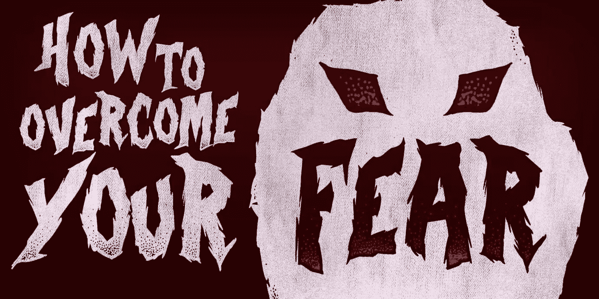
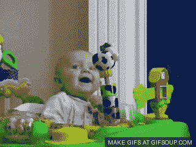
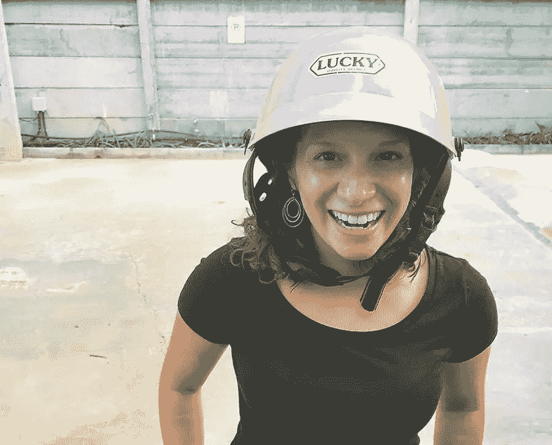

# 如何在不勇敢的情况下克服所有的恐惧

> 原文：<https://www.sitepoint.com/how-to-overcome-all-your-fears-without-being-brave/>

这篇文章来自杰森的个人博客 Lengstorf.com

根据 CDC 的数据，在美国，平均每年有 63 人被割草机杀死。另有 37 人死于热自来水。

仅在 2013 年，就有超过 33，000 名美国人死于车祸。

但是我找不到确凿的证据证明有人在接吻后尴尬而死，或者因为他们的展示失败而严重失血。

我们的恐惧反应似乎是落后的——至少从逻辑的角度来看是这样——因为比起割草或洗澡，更多的人害怕公开演讲。

这到底是怎么回事？为什么我们害怕安全的东西，却对实际上危险的东西满不在乎？ [2](#fn2)

研究提供了一个答案，如果我们把它用在我们的优势上，**我们可以用科学来克服我们对……嗯，*任何事情*的恐惧。**

我们甚至不需要勇气来完成它。

## 我们想要新的——但不要太新

[根据研究](http://bit.ly/1iT4fL6)，动物(和人)“似乎会被温和的新奇刺激所吸引，并回避极其新奇的刺激。”这意味着我们不喜欢无聊，但我们也不喜欢太远离舒适区的事情。换句话说，**当一件事太陌生时，我们会觉得它很可怕。**

只有新的时候才吓人。之后，我们可以嘲笑它。

但是重复暴露在“新奇刺激”下会消除新鲜感——简单地说，它会变成旧闻。

我们经常接触的任何东西最终都会失去让我们害怕的力量。这就是为什么有人玩电锯，或者在 40 层楼高的钢梁上随便吃午餐，或者自愿把自己塞进地下培养皿，以震耳欲聋的速度扔进地上的一个洞。

### 这是真的可怕，还是只是新的？

当我想到要和一个陌生人交谈时，我感到一阵恐惧。请人帮忙，或者更糟的是，试图把自己介绍给某个我希望能成为新朋友的人，这让我充满了一种抽象的恐惧。

但是当我在脑子里运行灾难场景时，没有什么会真的出错。除了反常的灾难——雷击、胆大妄为、建筑承重墙的突然灾难性破坏——没有什么值得害怕的。

新环境中的不适触发了警报，我感到害怕——尽管没有任何东西对我的安全构成可信的威胁。我的恐惧是不理智的。我只是在一个不熟悉的环境中，我的白痴蜥蜴脑 [4](#fn4) 将此解读为威胁。

## 路冲和理

到达苏梅岛后，我和玛丽莎租了一辆滑板车。这是雨季，所以道路是湿的，我们被雨滴击中。我们第一次骑行大约 20 分钟后——我们都很享受——我错误地判断了一个转弯，惊慌失措，在停车场撞毁了摩托车。

六个泰国孩子蜂拥而出帮忙，在快速浏览了一遍[生存清单](https://lengstorf.com/when-things-go-wrong/?utm_source=sitepoint&utm_medium=overcoming-fear&utm_campaign=guest-post)后，玛丽莎和我爬上自行车，再次出发，展示匹配的血淋淋的胳膊肘和膝盖。

只是现在，我们被吓坏了。

鉴于这是我们第一次骑自行车，这树立了一个不好的先例:从那一刻起，100%的滑板车骑行给我们带来了痛苦和羞辱。这让我们都更加不愿意再次骑上摩托车。

玛丽莎，介于“括约肌紧缩”和“焦虑”之间。

但是——出于需要[5](#fn5)——我们又骑上了自行车。我们对骑马的熟悉程度也提高了。骑了三四次后，我感觉更自信了，对自行车在我下面如何移动有了更好的了解。

而玛丽莎， [6](#fn6) 在经历了十几次骑行后，慢慢从“极度恐惧”下降到“轻度恐慌”再到“括约肌紧缩”再到“焦虑”，最终在一次不稳定的休战中着陆。 [7](#fn7)

今天的滑板车比三周前危险吗？几乎没有。但是我们害怕骑它吗？一点也不。

持续暴露在恐惧中使恐惧变得毫无意义。

## 让你的恐惧变得无趣

令人难以置信的适应性的一部分是人类会感到无聊。寻求刺激的人每次都需要冒更大的风险才能获得同样的快感。这在任何地方都适用:很少有人能每天做完全相同的事情而不感到刺激不足。

在某些情况下，这可能是个坏消息——例如，肾上腺素上瘾者增加赌注，直到他穿上那些自杀的松鼠服之一，几乎保证他不会看到 30 岁——但我们最终发现 T2 一切都很无聊的倾向可以被我们利用。

我们对几乎任何刺激都感到厌烦的能力可以治愈我们的恐惧。我们所要做的就是一步步接近我们的恐惧，直到我们打掉它所有的牙齿。

### 谁会害怕床上的尸体呢？

有一位导演 [8](#fn8) 以制作恐怖电影而闻名。当他还是个孩子的时候，**他害怕死尸。但是他不想被这种恐惧所控制，所以他决定做点什么。**

他在床脚挂了一张尸体的照片。

他不得不在睡觉前盯着这张照片，早上醒来的第一件事也是如此。

过了一会儿，他不再害怕了。照片中死去的人只是风景的一部分。房间装饰的一个方面。他生活中众多事实中的一个简单事实。

他不再害怕了，因为他花了太多时间在这个东西上，他担心它会失去吓他的力量。

## 一次寻找一点点恐惧

我们不需要突然变得勇敢。没有必要在没有热身的情况下直面我们的恐惧，只有我们的意志力在支持我们。

为了克服我们自己的恐惧，我们只需要花更多的时间去接触那些让我们有点害怕的东西——直到它们不再可怕。然后我们再进一步，再做一次。 [9](#fn9)

我喜欢的一个例子是杰森·康丽的排斥疗法。

康丽在意识到自己被拒绝的恐惧所束缚后，决定走出去，有目的地每天至少被拒绝一次。

通过这样做，他消除了恐惧的力量。每一次拒绝——要求一个陌生人搭车，要求在商店打折——都让康丽对拒绝更熟悉一点，过了一会儿，拒绝在情感上变得无聊。

有人可能会拒绝他的想法不再是令人揪心的恐慌的来源；拒绝只是一种可能的结果，最终不会对他的生活产生长久的影响。

我们可以用同样的方式克服自己的恐惧:

*   如果你害怕和陌生人搭讪，每天至少和一个站在你旁边的人打招呼。
*   如果忽视电子邮件让你害怕，每天至少留出一个小时让你的手机进入飞行模式。
*   如果你担心自己无法适应远程办公，那么每周留出时间在咖啡店或共同工作空间工作，以掌握不受地点限制的工作方式。

不管你害怕什么，选择一个让你有点害怕的小行动——每天都做。

## 你必须控制你的恐惧——而不是相反

这个世界充满了不熟悉的经历。而且，正如我们已经看到的，不熟悉的东西通常看起来很可怕——起初。

无论你是对成为一名远程工作者感到紧张，害怕离开这个国家，还是只是对尝试新的食物感到不舒服，你都有一个选择:你可以将你的恐惧视为你需要克服的挑战，或者你可以将你的恐惧视为一个你不得不生活在其中直到你死去的笼子。

当克服恐惧就像把自己暴露在恐惧中直到它变得无聊一样简单时，唯一真正可怕的事情是有些人仍然选择笼子。

* * *

1.  除非你把卖血浆换食物的钱也算进去，我猜。

2.  例如，我一点也不介意自拍——尽管根据[最近的一份报告](http://cntrvlr.com/1YTmuB8)，自拍比鲨鱼攻击更有可能杀死我 150%——但是如果我游泳时有东西擦过我的腿，你可以打赌我会像史酷比和沙吉一样以[的速度和优雅离开海洋。](http://bit.ly/1QTRGKS) 

3.  什么都怕，太累了。现在我拒绝承认任何不能让你通过学校护士的担忧。“我必须回家，因为我们在太平洋西北部，这里有一场科学家们说早该发生的[超级地震](http://nyr.kr/1Z2vlAE)，“只是不会让你离开教室。【T2

4.  我的白痴蜥蜴脑的其他罪行包括说服我整天呆在沙发上，因为我很难过，在网上订购一个家庭大小的比萨饼以避免人类接触，以及在我吃整个东西时在我耳边咕咕地轻声合理化。

5.  我们已经出发去买晚餐和食品，但在公寓里还没有吃的东西。所以我们不得不在一个仍在流血的当地市场停下来点食物。经营小吃摊的女人给我们端来水清洗身体，然后给我们上了一堂关于滑板车安全的课，并指引我们去另一个摊位买碘。知道哪里的妈妈都一样，很安慰。

6.  玛丽莎的恐惧因为我在开车而加剧，所以她对车祸毫无防备。除了担心撞车，她还被自己失控的状态吊着。

    所以当我叫她胆小鬼的时候，我会加一个星号。

7.  就像反对共同敌人的对手之间的谨慎合作，或者我母亲和互联网之间的可疑联盟。

8.  我讲这个故事没有署名，因为我无论如何也想不起它是关于谁的。可能是作者而不是导演。这可能是杜撰的。也有可能这完全是我编造的。

    不管怎样？

9.  这与你听到的商业顾问所说的“每天进步 1%”等渐进式进步是一样的。这是同一个概念，只是应用于我们生活的不同领域——尽管消除恐惧会对改善你的业务大有帮助。【T2

## 分享这篇文章