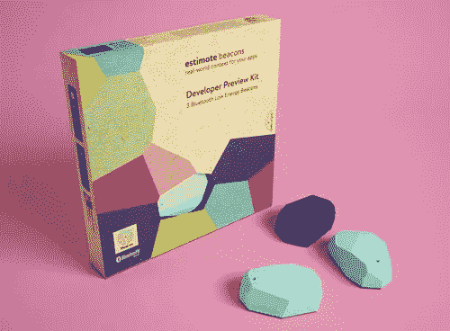
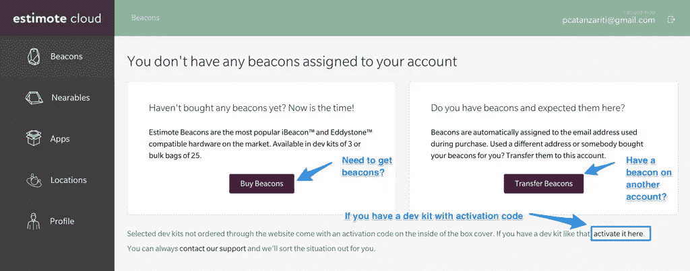
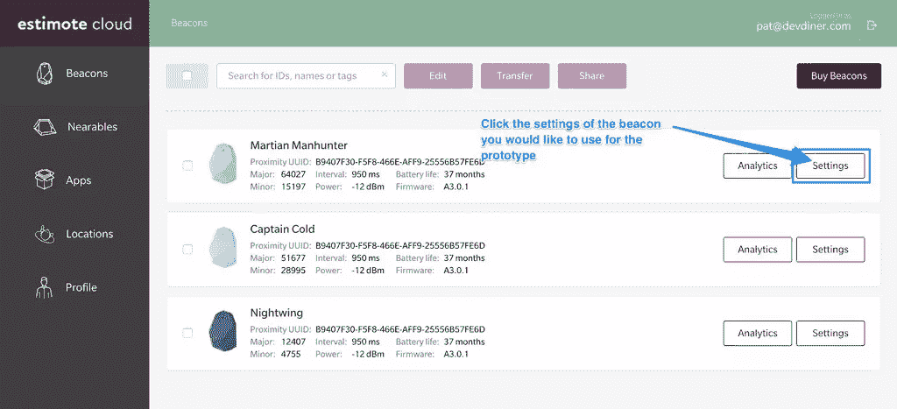
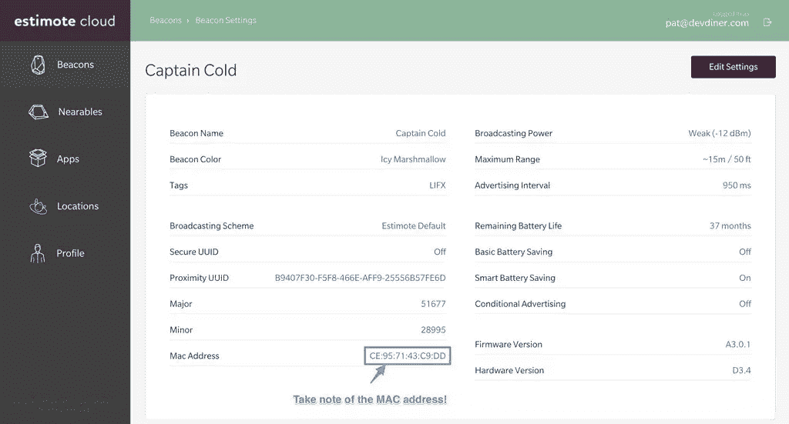
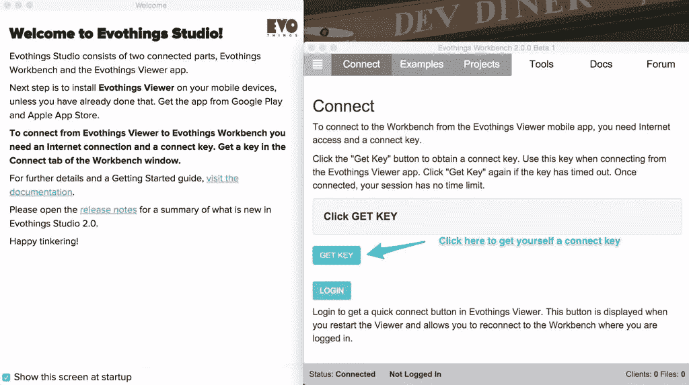
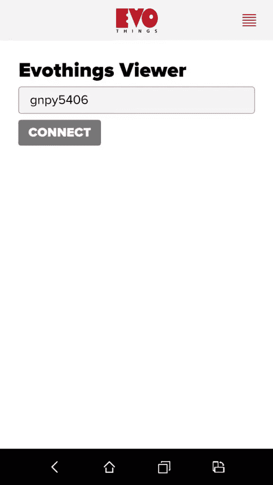
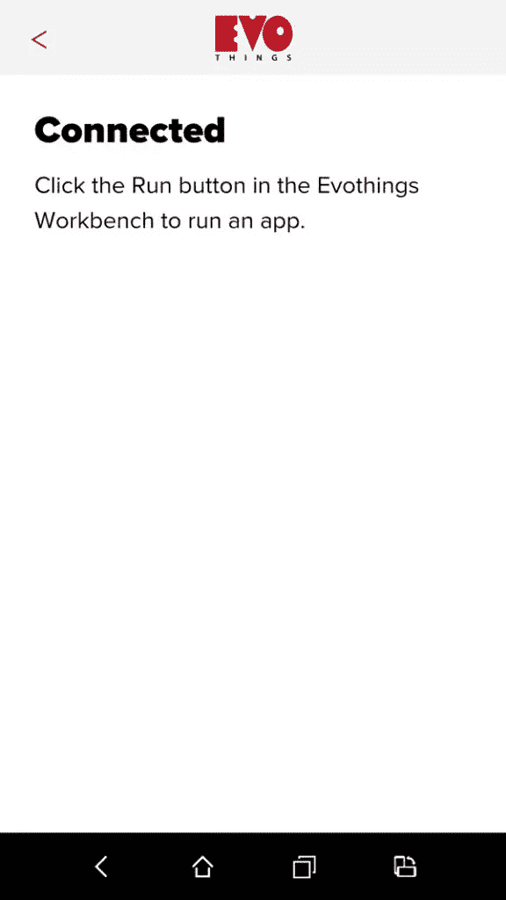
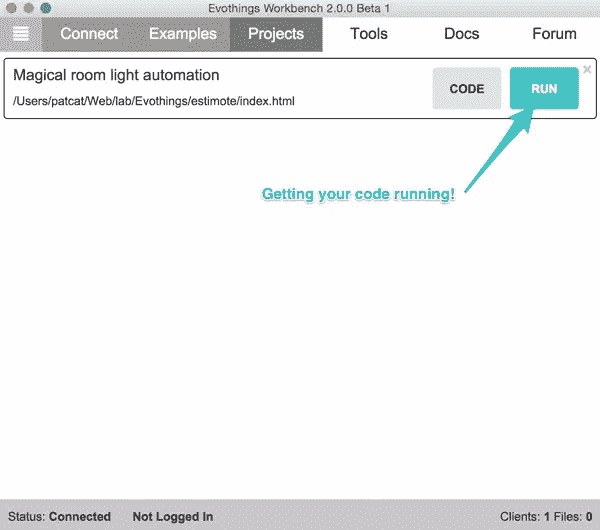
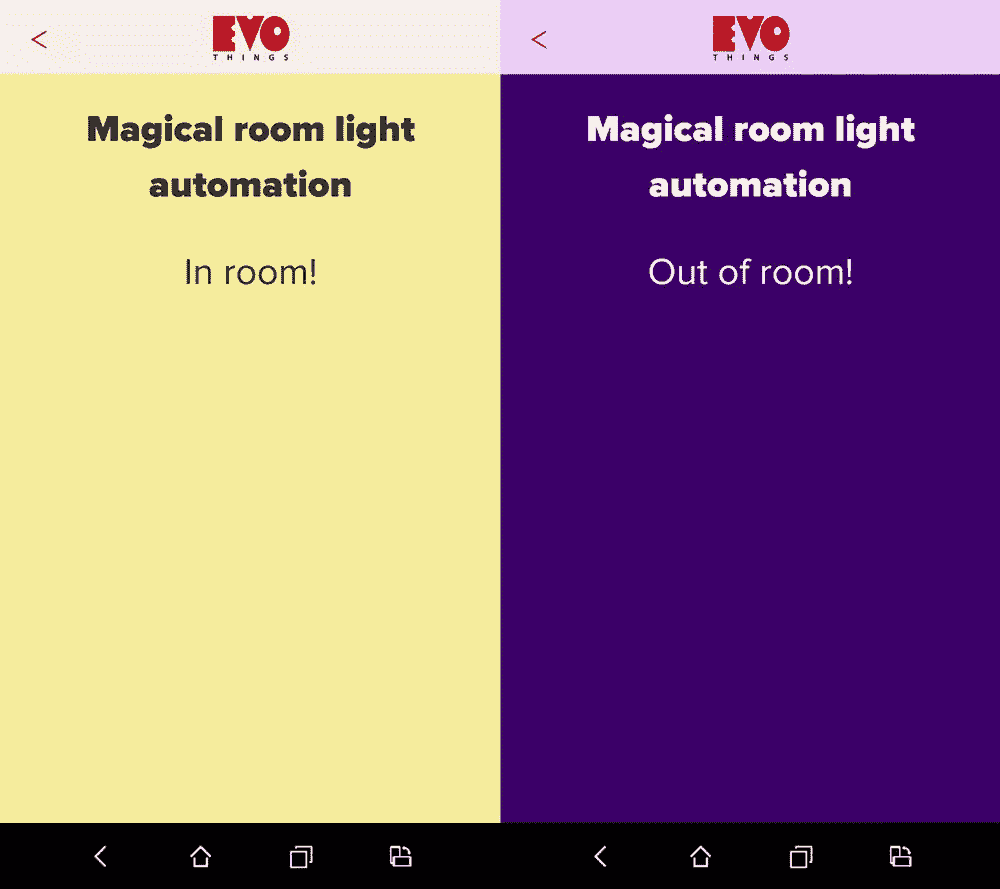

# 如何使用 Estimote 和 Evothings 构建 Beacon 应用原型

> 原文：<https://www.sitepoint.com/how-to-prototype-beacon-apps-with-estimote-and-evothings/>

蓝牙信标是为应用程序设置基于位置的触发器的一种非常有价值的方式。Estimote 有一系列蓝牙信标，很容易设置和试验。



测试蓝牙信标最困难的部分之一是设备模拟器无法访问蓝牙设备，所以你需要使用物理智能手机来测试。这就是 Evothings 派上用场的地方！Evothings 是一种使用 HTML5 和 JavaScript 构建移动 web 应用原型的简洁方法。在 Evothings 中，您可以对您的代码进行更改，并让它们自动出现在您的智能手机上，随时可以访问您的蓝牙信标。

在本文中，我们将着眼于将 Evothings 的强大功能与 Estimote Beacons 结合起来，构建一个支持 beacon 的移动应用原型。特别是，我们将构建一个应用程序，如果你靠近信标，它可以通过 IFTTT 打开和关闭 LIFX 灯。没有 LIFX 灯？没问题！您可以用附近您想切换的任何其他 HTTP 请求来替换这个功能。

## 你需要什么

*   估计信标
*   Evo things Studio–这需要在你的电脑上安装并运行。它适用于 Windows、Mac OSX 和 Linux！
*   [Evothings Viewer 应用](https://evothings.com/download/)–这需要安装在您将要测试的 iPhone 或 Android 设备上。
*   IFTTT 和如何使用他们的 Maker 频道的知识–[我这里有一个指南！](https://www.sitepoint.com/connecting-the-iot-and-node-js-to-ifttt/)
*   一些基本的 HTML 和 JavaScript 知识。

## 代码

这方面的所有代码都可以在 GitHub 上找到，你可以随心所欲地使用！

## 设置您的估计信标

转到 [Estimote Cloud](https://cloud.estimote.com/) 并登录您的帐户(如果您还没有任何信标，请注册一个！).

从那里，您的“信标”部分应该已经被加载了。如果您的帐户还没有分配任何信标，您需要通过“购买信标”按钮购买一些，通过“转移信标”按钮从另一个帐户转移它们，或者激活您的开发套件(如果它带有激活码):



如果你有信标，它们会出现在列表中。选择您想在本演示中使用的一个，然后单击其“设置”按钮:



在这里，您需要记下信标的 MAC 地址，因为我们稍后会用到它:



就估计信标设置而言，这应该就是你所需要的全部了——这在原型水平上是相当容易的。

## 让 Evothings 运行起来

要为我们的编码设置您的 Evothings 工作流，请前往[Evo things 下载页面](https://evothings.com/download/)并下载 Evothings Studio 和 Evothings Viewer 移动应用程序。这为我们提供了一种非常简单的方法来构建我们的应用程序，并在智能手机上即时测试这些变化。

当您第一次打开 Evothings Studio 时，系统会提示您通过获取连接密钥进行连接。点击“获取密钥”以生成您将用于将您的工作台与您的移动应用程序配对的密钥:



然后在你的智能手机上打开 Evothings，你会看到一个要求输入连接键的屏幕。输入并点击“连接”:



当您连接并准备就绪时，您将看到以下屏幕:



现在，您已经准备好开始编写应用程序了。

## 我们的 HTML

这款应用的 HTML 主要来自他们公开提供的 Evothings 模板，只是改变了标题和标题，并添加了一个`<div id="in-room"></div>`用于在屏幕上显示一些基本的状态消息。

```
<!DOCTYPE html>
<html>
  <head>
    <meta charset="utf-8" />
    <meta name="viewport" content="width=device-width, user-scalable=no
      initial-scale=1.0, minimum-scale=1.0, maximum-scale=1.0" />
    <title>Magical room light automation</title>
    <style> @import 'ui/css/evothings-app.css';
      @import 'ui/css/patcat.css'; </style>
    <script> // Redirect console.log to Evothings Workbench.
    if (window.hyper && window.hyper.log) { console.log = hyper.log } </script>

    <script src="cordova.js"></script>
    <script src="libs/jquery/jquery.js"></script>
    <script src="libs/evothings/evothings.js"></script>
    <script src="libs/evothings/ui/ui.js"></script>
    <script src="app.js"></script>
  </head>
  <body>
    <header>
      <button class="back" onclick="history.back()">
        
      </button>

      
    </header>
    <h1>Magical room light automation</h1>
    <div id="in-room"></div>
  </body>
</html>
```

我还将我的自定义 CSS 放在了`ui/css/patcat.css`中:

```
html,
body,
section,
main footer {
  background: #390066;
  color: #fff;
  text-align: center;
}

header {
  background: #EACFF3;
}

.in-room,
.in-room body,
.in-room section,
.in-room main footer {
  background: #F3EC97;
  color: #333;
}

.in-room h1 {
  color: #333;
}

.in-room header {
  background: #F3EDE6;
}

h1 {
  padding: 0 0 1em;
}
```

## 我们的 JavaScript 代码

我们的`app.js`文件看起来是这样的:

```
var app = (function() {
  var app = {},
    roomBeacon,
    updateTimer = null,
    inRoom = false;

  app.initialize = function() {
    document.addEventListener("deviceready", function() {
      evothings.scriptsLoaded(onDeviceReady);
    }, false);
  };

  function onDeviceReady() {
    startScan();

    $("#in-room").html("Out of room!");

    updateTimer = setInterval(checkForBeacon, 1000);
  }

  function startScan() {
    function onBeaconsRanged(beaconInfo) {
      for (var i in beaconInfo.beacons) {
        var beacon = beaconInfo.beacons[i];

        if (beacon.rssi = 2 && inRoom) {
        console.log("Exited the room");
        inRoom = false;
        $("html").removeClass("in-room");
        $("#in-room").html("Out of room!");

        turnOffBulb();
        setTimeout(turnOnBulb, 1000);
      }
    }
  }

  function turnOnBulb() {
    $.getJSON("https://maker.ifttt.com/trigger/entered_room/with/key/{YOURKEYHERE}?jsoncallback=?", {
      format: "json"
    }, function() {
      console.log("Entered room and told IFTTT about it!");
    })
    .done(function(data) {
      console.log("Done");
    })
    .fail(function(data) {
      console.log(JSON.stringify(data));
    })
    .always(function(data) {
      console.log("Finished");
    });
    console.log("Turn on bulb");
  }

  function turnOffBulb() {
    $.getJSON("https://maker.ifttt.com/trigger/left_room/with/key/{YOURKEYHERE}?jsoncallback=?", {
      format: "json"
    }, function() {
      console.log("Left room and told IFTTT about it!");
    })
    .done(function(data) {
      console.log("Done");
    })
    .fail(function(data) {
      console.log(JSON.stringify(data));
    })
    .always(function(data) {
      console.log("Finished");
    });
    console.log("Turn off bulb");
  }

  return app;
})();

app.initialize();
```

### 我们的 JavaScript 代码解释了

让我们简化一下，一步一步来。我们最初的代码框架如下所示:

```
var app = (function() {
  var app = {},
    roomBeacon,
    updateTimer = null,
    inRoom = false;

  app.initialize = function() {
    document.addEventListener("deviceready",
      function() {
        // What we'll want to do when our app is ready!
      }, false);
  };

  // Other code will be here!

  return app;
})();

app.initialize();
```

在上面的代码中，我们将所有内容命名为`app`。一旦我们看到信标，`roomBeacon`变量会存储我们的信标，`updateTimer`会存储我们的常规 JavaScript 间隔来检查信标，`inRoom`会记住应用程序是否认为我们在房间里(取决于它是否在范围内看到信标)。

当我们的 JavaScript 运行时，我们将它指向`app.initialize()`函数。然而，在`deviceReady`事件和`evothings.scriptsLoaded`事件触发之前，我们不会运行任何功能。通过这种方式，我们知道应用程序已经加载，Evothings 可以随时观察和重新加载任何变化。

```
function onDeviceReady() {
  startScan();

  $("#in-room").html("Out of room!");

  updateTimer = setInterval(checkForBeacon, 1000);
}
```

在`onDeviceReady()`中，我们开始扫描信标(我们将很快介绍`startScan()`函数)。然后我们将 HTML 中的`#in-room`元素设置为“Out of room！”作为我们的默认。

然后我们每秒运行`checkForBeacon()`,评估我们的信标有多远，并决定我们是否在房间里。

我们的`startScan()`函数看起来是这样的:

```
function startScan() {
  function onBeaconsRanged(beaconInfo) {
    // Will explain this soon!
  }

  function onError(errorMessage) {
    console.log("Ranging beacons did fail: " + errorMessage);
  }

  estimote.beacons.requestAlwaysAuthorization();

  estimote.beacons.startRangingBeaconsInRegion(
    {},
    onBeaconsRanged,
    onError);
}
```

`startScan()`功能的所有功能都从`estimote.beacons.startRangingBeaconsInRegion()`开始。这将启动我们的应用程序扫描估计信标。我们传入三样东西:

*   一个空白对象(`{}`)来表示我们想要所有的信标。相反，我们可以通过我们在 Estimote beacon 选项中定义的区域，如下所示:`{identifier:'MyRegion'}`。
*   当我们成功地在范围(`onBeaconsRanged()`)内寻找信标时，我们想要运行的成功函数。
*   如果出现问题，我们的失败函数(`onError()`–记录错误的相对简单的函数)。

我们的`onBeaconsRanged()`函数内部看起来是这样的:

```
function onBeaconsRanged(beaconInfo) {
  for (var i in beaconInfo.beacons) {
    var beacon = beaconInfo.beacons[i];

    if (beacon.rssi < 0 && beacon.macAddress == "CE:95:71:43:C9:DD") {
      console.log("Found room beacon");
      roomBeacon = beacon;
    }
  }
}
```

这将接收一个名为`beaconInfo`的数组，其中包含设备可见的所有信标的详细信息。我们的信标是专门在`beaconInfo.beacons`中找到的，所以我们遍历所有的信标并检查它们的 RSSI(接收信号强度指示)和 MAC 地址。如果他们的 RSSI 是负值，我们的应用程序已经发现了灯塔。然后，我们检查信标的 MAC 地址是否与我们正在寻找的信标相同。如果是这样，我们将事件记录到控制台中，并将我们的`roomBeacon`变量设置为这个信标。

对于 iOS 8，您的应用程序需要请求使用位置服务的权限(在其他平台上，该功能会优雅地降级，什么也不做):

```
estimote.beacons.requestAlwaysAuthorization();
```

你会记得我们每秒都运行函数`checkForBeacon()`。这个函数看起来像这样:

```
function checkForBeacon() {
  if (roomBeacon) {
    console.log("Checking beacon distance");

    if (roomBeacon.distance < 2 && !inRoom) {
      console.log("Entered the room");
      inRoom = true;
      $("html").addClass("in-room");
      $("#in-room").html("In room!");

      turnOnBulb();

      setTimeout(turnOnBulb, 1000);
    } else if (roomBeacon.distance >= 2 && inRoom) {
      console.log("Exited the room");
      inRoom = false;
      $("html").removeClass("in-room");
      $("#in-room").html("Out of room!");

      turnOffBulb();
      setTimeout(turnOnBulb, 1000);
    }
  }
}
```

如果我们有一个`roomBeacon`，那么我们运行我们的测试，看看那个信标有多远。如果你在信标两米之内，而我们还没有设置`inRoom`为真，那么我们刚刚进入房间。我们将`inRoom`设置为`true`，向控制台记录一条消息，显示消息“在房间里！”并更改我们的`<html>`标签上的类别，这样我们就可以根据我们是否在房间内来重新设计我们的应用程序。我们还运行`turnOnBulb()`来完成这个任务——使用 IFTTT 打开我们的 LIFX 灯泡。

如果我们距离信标超过两米，但应用程序仍然认为我们在房间里，我们将`inRoom`设置为`false`，并将一切设置为与上述相反。我们运行`turnOffBulb()`关闭 LIFX 灯泡。

有一件事你可能会好奇——为什么我们有一个`setTimeout()`重播`turnOnBulb()`和`turnoffBulb()`？我发现有时使用 IFTTT(或者可能是我家的 LIFX 连接)，它并不总是在第一时间收到请求。运行两次似乎可以很好地解决这个问题！

为了真正打开和关闭 LIFX 灯泡，我们通过`https://maker.ifttt.com/trigger/entered_room/with/key/{YOURKEYHERE}?jsoncallback=?`向 IFTTT 的动作发出一个 JSON 请求。关闭它们是同样的想法，只是用`left_room`代替`entered_room`作为触发名称。如果这一切对你来说听起来像胡言乱语，[请先阅读我的“将物联网和 Node.js 连接到 IFTTT”教程！](https://www.sitepoint.com/connecting-the-iot-and-node-js-to-ifttt/)

```
function turnOnBulb() {
  $.getJSON("https://maker.ifttt.com/trigger/entered_room/with/key/{YOURKEYHERE}?jsoncallback=?", {
    format: "json"
  }, function() {
    console.log("Entered room and told IFTTT about it!");
  })
  .done(function(data) {
    console.log("Done");
  })
  .fail(function(data) {
    console.log(JSON.stringify(data));
  })
  .always(function(data) {
    console.log("Finished");
  });
  console.log("Turn on bulb");
}
```

## 在您的设备上测试

要测试该应用程序，请单击“项目”选项卡，将您的`index.html`拖到 Evothings Studio 中，将其添加到要观看的项目中。然后单击“运行”来运行它:



如果你已经在智能手机上打开了 Evothings Viewer，你应该可以让这个应用程序按照预期的方式出现和运行！如果你带着信标进入房间，你的灯应该打开(应用程序应该直观地显示你已经进入房间)，如果你离开房间，灯应该关闭(应用程序应该显示你已经离开)。



## 结论

使用 Estimote beacons 和 Evothings 进行原型制作只是一个开始，从这里您可以创建一个 Cordova 或 Phonegap 应用程序，从这个应用程序中复制文件并[将其导出到一个应用程序](https://evothings.com/finalizing-an-evothings-app-for-store-submission-phonegap-build/)中，您可以提交到应用程序商店。你只需要在设置中添加自定义信标(因为你不希望每个人都依赖你的信标，除非是在像咖啡馆这样的公共场所)。

如果你用 Estimote beacons 和 Evothings 创建了一个蓝牙 beacon powered 原型，请在评论中分享或在 Twitter 上与我联系( [@thatpatrickguy](http://www.twitter.com/thatpatrickguy) )。我很想看看你想出了什么，并分享给大家！

## 分享这篇文章