# 如何用 Sketch 和 Launchpad 发布响应式网站

> 原文：<https://www.sitepoint.com/how-to-publish-responsive-websites-with-sketch-and-launchpad/>

Anima 内置了**两个超级有用的素描插件**。 [**自动布局**](https://animaapp.github.io/) 帮助设计师在草图中创建响应式布局， [**Launchpad**](https://launchpad.animaapp.com/) 将响应式设计导出为代码质量相当不错的接近完成的 HTML/CSS 网站。*TL；DR —观看视频…*

[https://www.youtube.com/embed/1gnxY6eC_78](https://www.youtube.com/embed/1gnxY6eC_78)

> “等等……另一个网站建设者？*真的*？”

嗯，Launchpad 更像是一个 HTML/CSS 导出器，有一些令人印象深刻的功能。这不是典型的所见即所得编辑器，因为你实际上是在 Sketch 中做设计工作，这是一个顶级的用户界面设计工具。你仍然需要一个开发者，他可以把 4 星级的代码输出变成一个 5 星级的网站，但它仍然会为你节省大量的时间。下面是 Launchpad 实际可以做的事情:

*   响应式设计(如果结合自动布局)
*   视频、链接和表格
*   字体系列后退
*   发布、托管和域
*   搜索引擎优化(标题，元描述等)
*   社交媒体元标签(开放图表等)
*   版本控制
*   谷歌分析(或类似的)集成
*   以键盘为中心的工作流程(非常像素描！)

以下是您需要手动完成的工作，然后使用代码:

1.  插入自定义元标签(如果有)
2.  如果需要，插入任何模式标记
3.  如果需要，改进适应性/响应质量
4.  编写任何需要的 JavaScript 代码
5.  编写任何后端功能
6.  缩小和其他网络性能技巧

Launchpad 为您提供了构建静态网站的工具，这是您可以构建的基础。这会为你节省无数宝贵的时间，但不会带你到达终点。这是一件*好*的事情，因为小的代码优化对 SEO 和转换有很大的影响，所以这些是你想要手动做的事情。

让我们学习如何使用它！

确保你已经先下载了 [Launchpad](https://launchpad.animaapp.com/) 。不要担心自动布局，因为它现在自动捆绑到 Launchpad 中。我们有很多内容要讲，但我会长话短说！

## 具有草图和自动布局的响应式设计

首先，让我们将一组层/对象浮动到*父*容器的右上角(在本例中是画板本身)。在检查器的自动布局选项卡中打开“图钉”下拉菜单，并选中*顶部*和*右侧*复选框(或点击视觉表示上的点)。

此外，确保两侧(顶部和右侧)的偏移量(距画板)为“17px ”,并选中“W”复选框以声明该组具有固定宽度(否则，当调整容器/画板大小时，响应对象将被挤压，就像声明为容器的%一样)。

> *对于 HTML/CSS 开发人员来说，“锁定”可以模仿浮动元素(`float:left`或`float:right`)或定位元素(`position:fixed`或`position:absolute`)与`top:` `right:` `bottom:`或`left:`。*

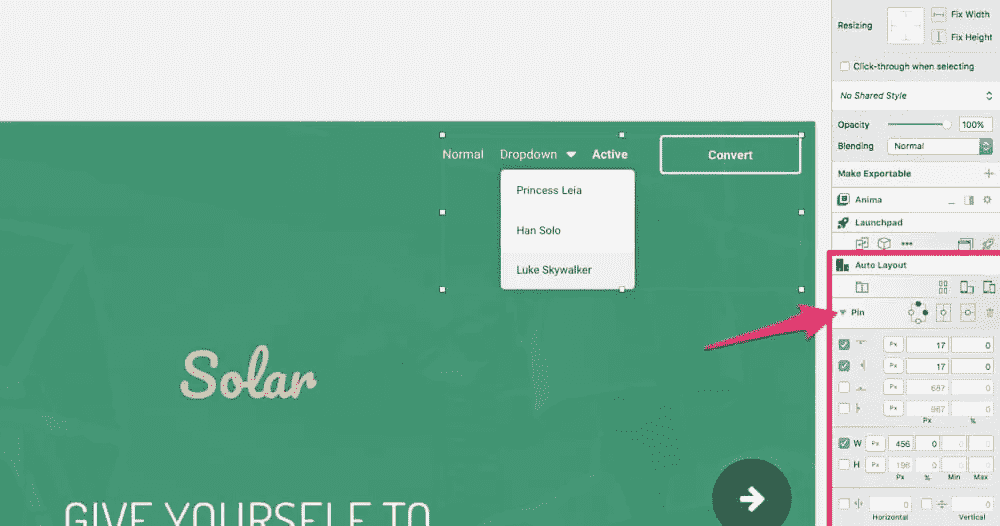

以下是调整大小时的样子(注意其他元素是如何被挤压的，但是我们的*固定的*元素仍然固定在画板的右上角):

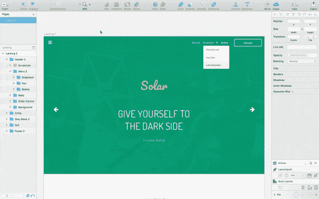

### 自动布局还能做什么？

钉钉是冰山一角。自动布局还可以帮助您:

*   垂直/水平对齐对象
*   以%或像素为单位声明对象的宽度(和最小/最大宽度)
*   以%或像素为单位定义偏移量
*   在“纵向”和“横向”之间快速切换进行测试
*   切换到另一个画板预设，以便在其他设备中进行测试
*   使用可视化图表或传统的复选框 UI 进行导航
*   创建“堆栈”，相当于 flexbox 的草图

如上所述，当使用 Launchpad 导出时，这些布局选项会转换为 CSS(是的，甚至是 flexbox/Stack 设置)。玩一玩吧。它非常简单，因此您在学习如何对齐对象或在不同的设备画板和方向之间切换时不会有任何困难。

## 链接

每个画板基本上都是一个网页，所以连接屏幕很容易。

先设置主页吧。

### 设置主页

在检查器中 Launchpad 标题的正下方，单击 **…** 图标并选择“设为主页”选项。到目前为止都很简单——我们将逐步研究复杂的东西。

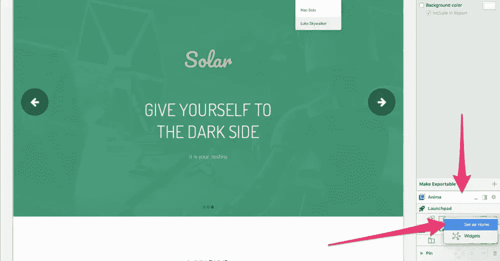

### 创建链接

现在在画布上选择一个层(它将链接到另一个画板/网页)，并单击*创建链接*图标(它类似于由一条线链接的两个画板)。

接下来，单击所需的目标画板以建立链接(如果画板不可见，您可能需要缩小，如下图所示)。或者，您可以选择“外部链接”或“设为主页”选项，分别链接到外部网站和主页画板。

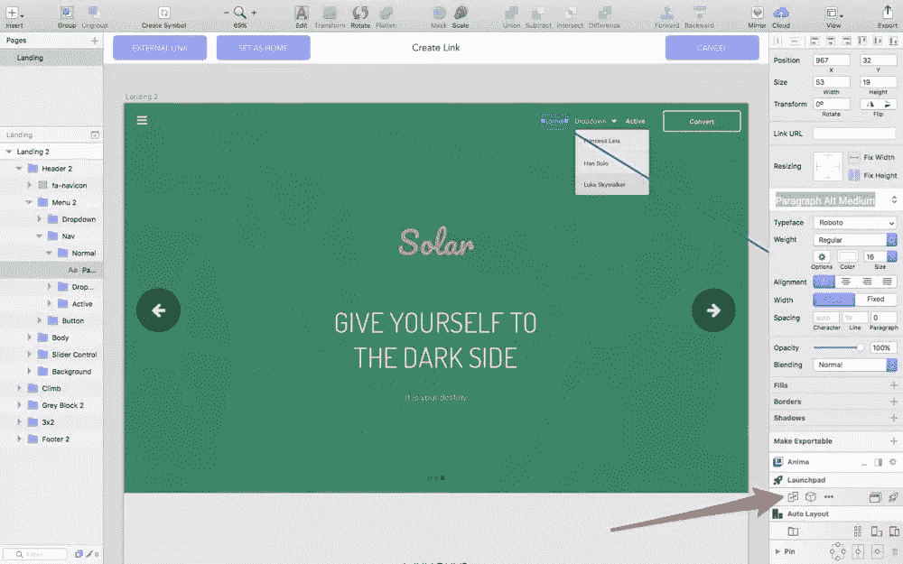

## 录像

视频有各种各样的用途，但由于我们通常不会在所有网站上都包含它们(因为它们需要一段时间来加载)，所以很容易忘记它们的 HTML 标记。

此外，一些视频使用`<video>`标签，而其他视频，如 YouTube 视频，可以使用`<iframe>`嵌入。根据您嵌入视频的位置，还有其他选项，如“自动播放”、“循环”、“无控制”和“覆盖”。YouTube 视频非常受限制，所以*循环*是唯一可定制的选项；然而，如果你使用像 [Giphy](https://giphy.com/) 这样的服务，你可以将 YouTube 视频转换并嵌入(或上传你自己的)为 gif 和 HTML5 视频，这取决于你需要提供的功能种类(例如，HTML5 视频可以作为背景嵌入)。

通过选择画布上的形状来嵌入视频，然后单击检查器中的方框图标，选择“视频播放器”，然后将视频 URL 粘贴到字段中。

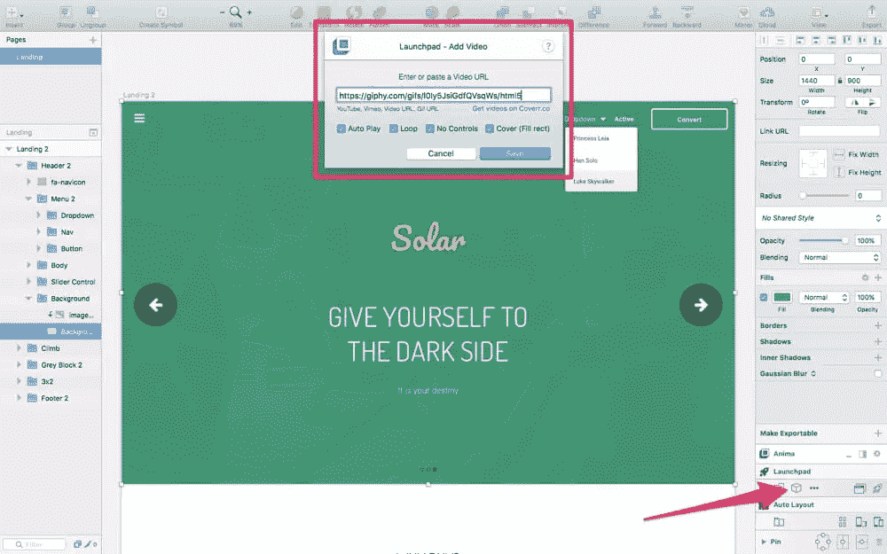

## 形式

表单分为两部分:各种输入字段和提交按钮。我们将从输入字段开始。

再次点击方框图标，然后点击“表格”，然后点击“文本输入”。

搞定，简单！当转换为静态网站时，该元素将是一个输入字段(`<input type="text" value="value">`)。

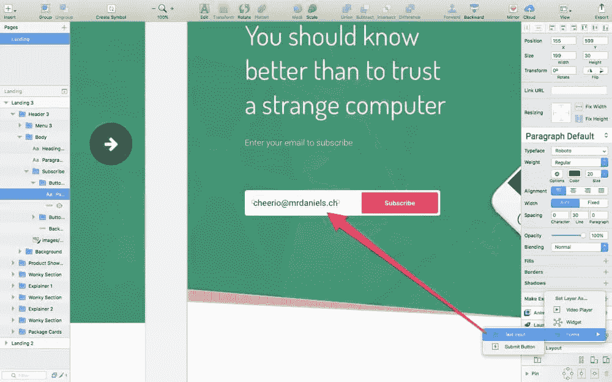

接下来，提交按钮—重复这些步骤，但这次选择“提交按钮”。现在重要的是要记住 Launchpad 不创建动态网站(如前所述)，所以 JavaScript 功能是禁用的。表单功能面向联系人表单，因此第一个可定制选项是“Email to”——这是表单数据(在文本层/输入字段中指定)将被发送到的地方。

您还可以指定两个画板，当用户在表单中出错或成功完成表单时，可以将用户发送到这两个画板。当然，在 Launchpad 导出网站后，您将负责编写表单验证的代码；正如我们所讨论的，Launchpad 提供了基本的 HTML/CSS，所以这取决于你(或者一个开发人员)是否能坚持到底。

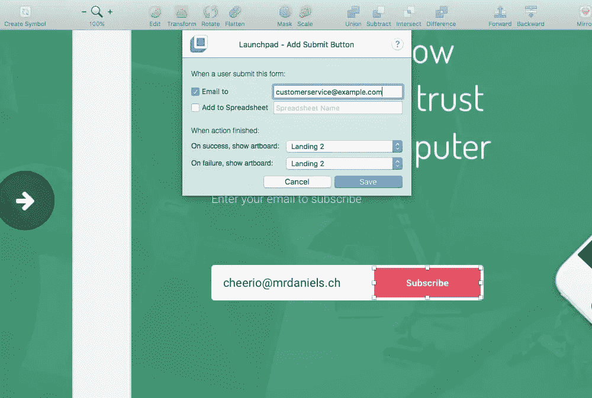

## 悬停效果

*…图标→“悬停效果”。*

所以这个特性很大程度上是关于 CSS 过渡的。我喜欢这个功能的地方是，有一系列的转换，你可以点击并应用(向左移动，向右移动，…，旋转，增长，收缩，阴影，…)，代码输出会自动显示在编辑字段中，供你根据自己的喜好进行定制。

对于像`background-color`动画这样的基本过渡，你可以在这个字段中编写自己的 CSS。无论哪种方式，您都可以通过选择缓动动画(缓入缓出、缓入缓出、缓出、缓动和线性)和动画持续时间来结束此步骤。

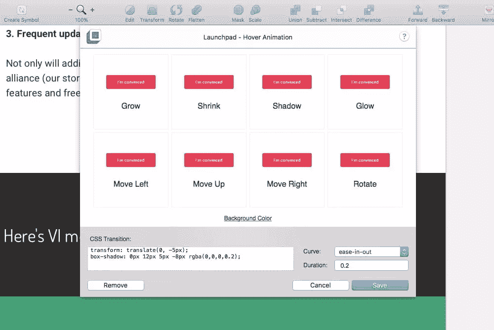

## 固定定位

*… icon →“固定位置”*做你认为它会做的事情。它定义了固定的组件(CSS 中的`position:fixed`),比如固定的页眉、页脚、滚动到顶部按钮、实时聊天小部件和其他类型的总是可见的元素。

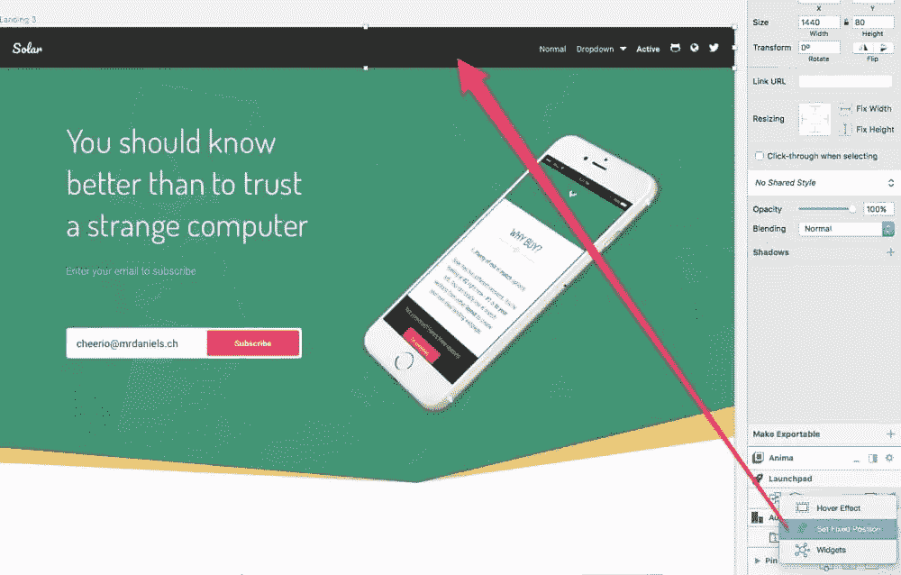

## 小工具

小部件是事情变得更有趣的地方( *…图标→“小部件”*)。您会立即注意到，以下小部件可以嵌入到您的站点中:

*   Crisp.im(实时聊天)
*   用户快照(收集用户反馈)
*   榨汁机. io(社交媒体源)
*   Gumroad(嵌入式购买按钮)
*   HubSpot(集客营销)
*   营销自动化
*   Mailchimp(用于收集订户)
*   谷歌分析(网站分析)
*   谷歌地图(嵌入式地图)
*   Statcounter(谷歌分析的替代产品)
*   Pinterest(嵌入式插接板)
*   打开表格(表格预订小部件)
*   Zendesk(客户支持)
*   *更多即将到来！*

正如你所看到的，其中一些小工具(如 Google Analytics)在每个网页的幕后工作，一些对用户可见(但不只是在每个网页的*上——一些可能只在特定屏幕上出现一次)。这就是为什么这个模块有三个标签来插入你的嵌入代码:*选择层*，*选择画板*和*网站*。点击一个小工具，以获得如何获得嵌入代码的完整说明。*

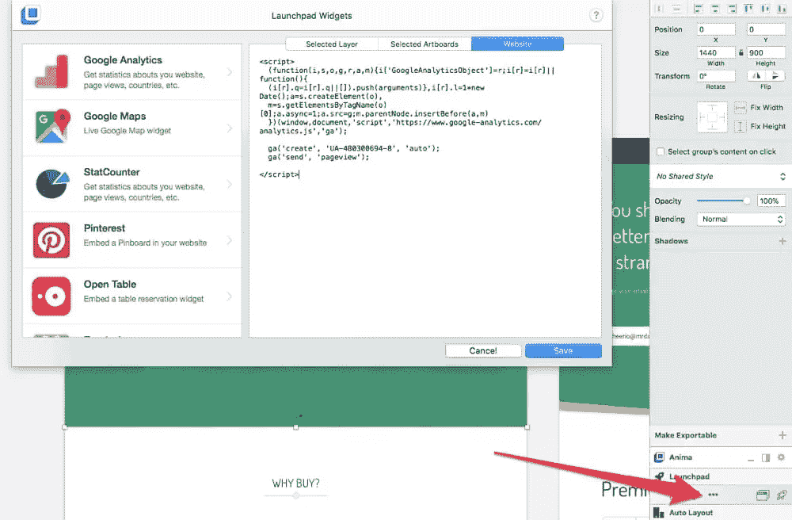

## 字体后退

基本上是一个逗号分隔的字体后备列表，用于用户没有安装该字体或者无法加载自定义字体的情况。字体后退在网页设计中是标准的，所以这个特性总是被包含在内。

你必须从草图菜单栏中找到这个特性(*插件→launch pad by Anima→CSS–Font-family fallbacks*)。

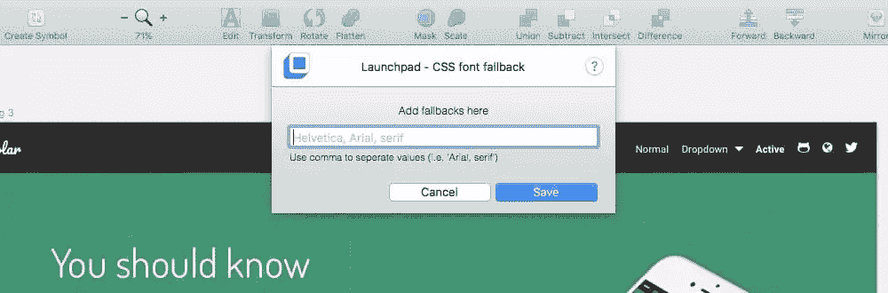

## 网站经理

点击*浏览器标签图标*打开站点管理器，然后点击“管理”打开站点管理器模式。

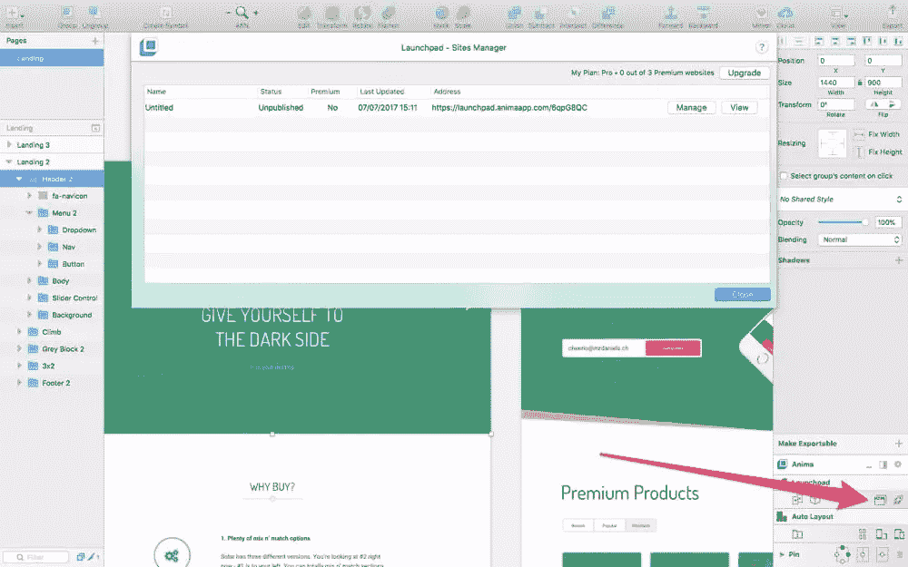

首先，标题和元标签。

虽然有数百个元标签，有些是必需的，有些是重要的，还有一些有特殊的用例，但 Launchpad 专注于两个最重要的标签:对 SEO 有很大贡献的`<title>`标签和影响有机转化的`<meta name="description" content="description">`标签。

您还可以选择指定网站的语言，例如翻译为:`<html lang="en">`。

当然，还有一个选项可以上传一张与脸书/Twitter Open Graph(在社交媒体上共享)一起使用的图像，以及一个定义网站域名的输入字段(有一个关于如何更改`CNAME`和`A`记录的快速教程)。

版本控制也可以从这里访问，在这里可以很容易地点击经过编号和时间戳的网站的旧版本，并直观地看到这些版本的样子，然后回滚到更早的版本。

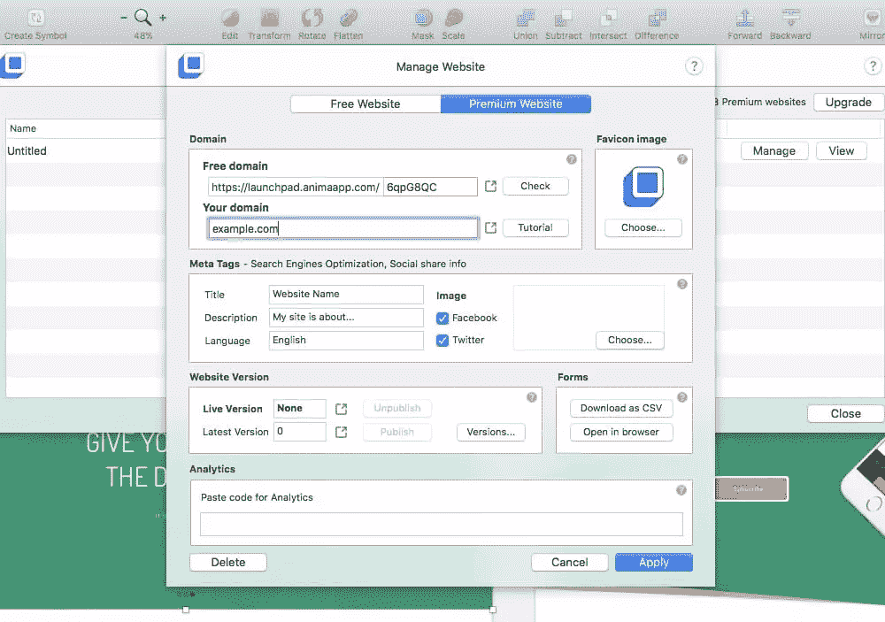

## 发布和代码输出审查

现在是最重要的问题:*代码输出的质量如何？完全不能用还是干净的？*我们来了解一下。点击*火箭图标*(和往常一样，在 Launchpad 界面中)允许 Launchpad 开始将你的设计上传到网络，然后在下面的对话框中点击“打开”来查看它的运行。

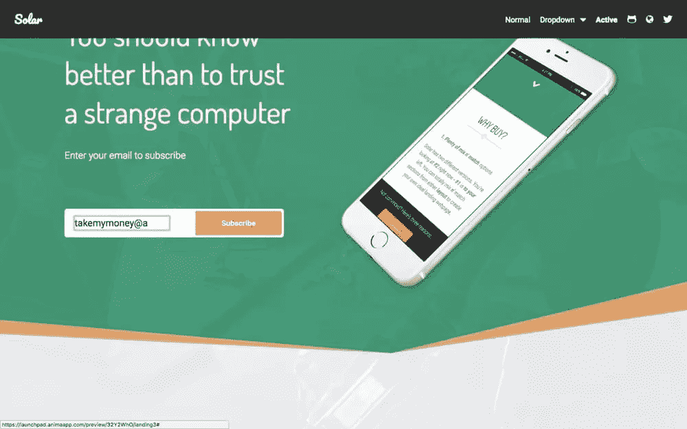

很好，对吧？需要注意的几个障碍:

*   默认的浏览器样式总是会覆盖您的样式
*   如果在同一个文本层中有两种字体样式，那么只有其中的*一种*会起作用
*   偶尔有些东西可能会稍微“偏离”，但通常可以通过简化或重新组织层列表/文档结构来修复
*   有时图像蒙版不像预期的那样工作，但我可以通过插入图像作为图层填充来克服这一点(公平地说，我应该这样做)
*   堆叠/平铺组件显示出非常意外的行为，尽管不难发现 Launchpad 在需要`display:block`时使用了`display:inline-block`——当这种情况发生时，使用自动布局[堆栈](https://animaapp.github.io/docs/v1/guide/12-stacks-flexbox.html)，这模仿了 CSS Flexbox 的行为(效果非常好)

大多数情况下，代码输出很好，图像资产也得到了优化。它并不臃肿，但是有几次使用了`
`而不是更具语义的 HTML 元素。没什么大不了的，因为我总是*想花一个小时清理代码(一个小时比花几个小时从头开始编码要快得多)。*

 *虽然…

*   CSS 代码是内部的，这是不理想的
*   @import 用于字体嵌入(众所周知的慢)
*   如果你有很多小组，你会有很多`
`

我只遇到了几个小问题，而且我一发现自己做错了什么，就能轻松地解决它们，因此，我的评分是 9/10！

## 奖励:键盘快捷键

Launchpad 没有任何快捷键，但如果你导航到*插件→ Launchpad by Anima →键盘快捷键*，你就可以录制自己定制的快捷键。

## 结论

总而言之，我完全推荐 Launchpad 设计网站，并将其导出为静态 HTML/CSS。WYSIWYG 编辑器从来没有与严肃的设计人员相处得很好，但是当您将严肃的设计工具与输出*产品*就绪代码的 Sketch 插件结合起来时，我们就有了真正改变设计人员设计方式的东西，即使我们确实需要在 HTML/CSS 导出后调整代码输出。

那么，你对 Auto Layout 和 Launchpad 有什么想法？

*   代码输出干净吗？
*   你还需要做多少编码工作？
*   设计真的有反应吗？
*   连接你的域名容易吗？

## 分享这篇文章*