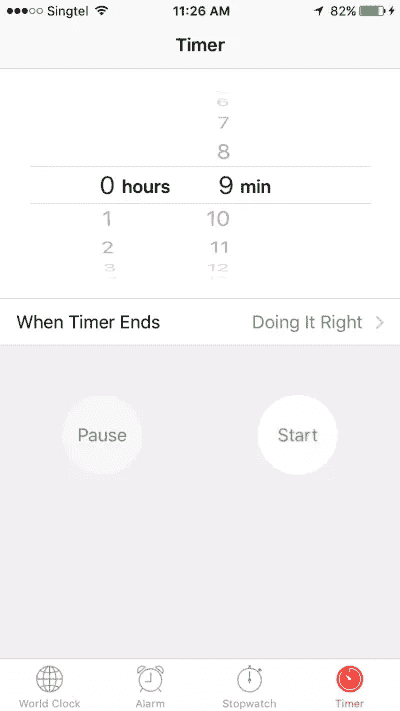
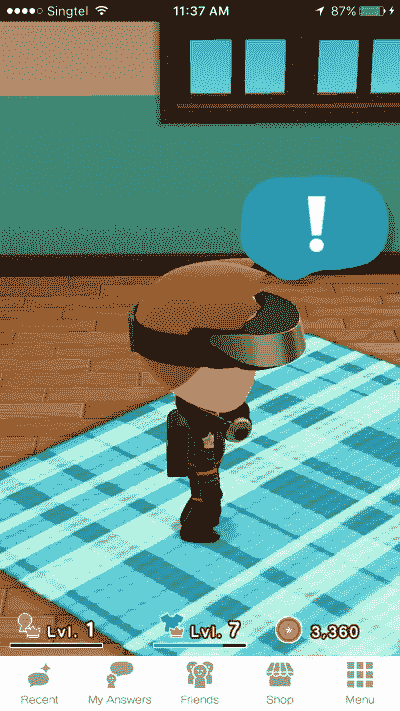

# 如何加快你的骨架屏幕 UX

> 原文：<https://www.sitepoint.com/how-to-speed-up-your-ux-with-skeleton-screens/>

想从头开始学习 UX 吗？使用 SitePoint Premium 获得涵盖基本面、项目、技巧和工具&的 UX 书籍全集。[现在就加入，每月仅需 14.99 美元](https://www.sitepoint.com/premium/products/Z2lkOi8vbGVhcm5hYmxlL1Byb2R1Y3QvMzE3?utm_source=blog&utm_medium=articles)。

无论你的用户界面设计得多么好，在某个时候，使用它的人将不得不等待一些东西的加载。

照片:[马尔科·朱梅利，《等待》](https://www.flickr.com/photos/marcogiumelli/14846579922/)

2014 年麻省理工学院的一项研究表明，人类可以在短短 13 毫秒内感知离散的图像，但决定聚焦在哪里需要 100 到 140 毫秒。实际上，这给了我们大约 200 毫秒的时间来呈现用户界面的状态变化，以便看起来是即时的。

在 200 毫秒到 1 秒之间，人们感觉他们在自己行动的流程中。1 秒钟后没有任何其他反馈，焦点开始转移。超过 10 秒钟，用户的注意力可能会完全丧失。

为了让人们开心，我们需要给出一个迹象，表明*某事*正在发生。这给我们留下了三个基本选项:

*   进度条如果我们能测量持续时间；
*   如果我们不能，旋转器；和
*   什么都没有。

对进步指标的心理学研究表明，我们对它们的解释绝不是线性的。我们处理延误的方法与现实不符。

理解了这个概念，我们就进入了操纵界面以提高感知的领域。

在软件设计中，骨架屏幕为传统方法提供了一种替代方案。骨架屏幕不是显示一个抽象的小部件，而是创造一个对未来的预期，减少认知负荷。

## 野外的骷髅屏风

苹果公司已经将骨架屏幕整合到他们的 iOS 人机界面指南中，命名为“启动图像”。苹果的指南建议显示初始应用程序屏幕的轮廓，不包括文本和任何可能改变的元素。

### 苹果的时钟

苹果的时钟是骨架屏的经典例子。启动屏幕设置了应用程序的预期外观，并创建了应用程序加载速度比实际速度更快的印象。

这个启动屏幕显示了应用程序的基本轮廓和屏幕底部的四个图标。

一旦启动，所有的文本和可变 UI 元素都被填充。

### 任天堂(日本电子游戏公司及其开发的电脑游戏名称)

任天堂最近推出了他们的第一个移动应用程序，它完全没有注意到用户界面指南或普通礼仪。

最初的启动屏幕显示了应用程序的标题和背景图片，没有一个反映应用程序的使用。

启动后，加载屏幕首先有一个“正在加载”的文本指示器，作为一个极简的微调器。

然后你会得到一个数字进度指示器。

接着是另一个旋转器*。*

最后，应用程序本身出现。

在令人难以置信的 *14 秒加载时间*中，任天堂使用了两个微调器和一个进度条，没有一个对缓解加载时间有多大帮助。加载屏幕期间的动态“提示”也通过改变 UI 状态和创建进度感来充当微调器。

每个独立的屏幕都需要一个新的视觉扫描，使得启动过程看起来比实际更慢。

### 脸谱网

虽然任天堂做得非常错误，但脸书做得非常正确。他们最初的启动屏幕遵循苹果的指导方针。

达到了最初的目标，脸书现在用页眉、页脚和占位符图像填充屏幕。因为加载最终内容所花费的时间是未知的，所以这个屏幕上还有一个微妙的动画来代替一个微调器。

然后加载最终的 UI。

## 让它发生

看着上面的例子，你可能已经注意到使用的图像和线框没有太大的不同。在这个观察中，很多工作可能已经为你做了。

在本演示中，我们发现初始加载花费的时间比我们希望的要长，所以是时候添加框架屏幕来改善感知的加载时间了。

这是我们显示屏幕布局的初始线框。

在初始呈现时，只显示标题和为内容保留的空间。

在我们等待的时候，会显示来自线框的图像。

接下来，在我们等待图像的同时呈现文本。

然后显示最终呈现的内容。

通过逐步呈现每个组件，等待时间似乎会更短。

## 摘要

骨架屏幕可以改善任何耗时超过几百毫秒的动作的感觉。将它们应用到你的渲染瓶颈会让你的 UI 感觉更快，让人更开心。

## 分享这篇文章