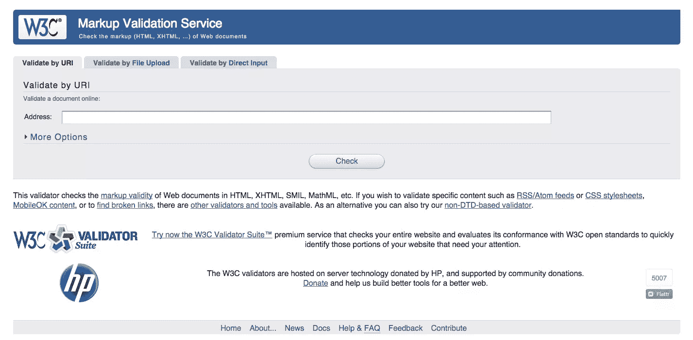
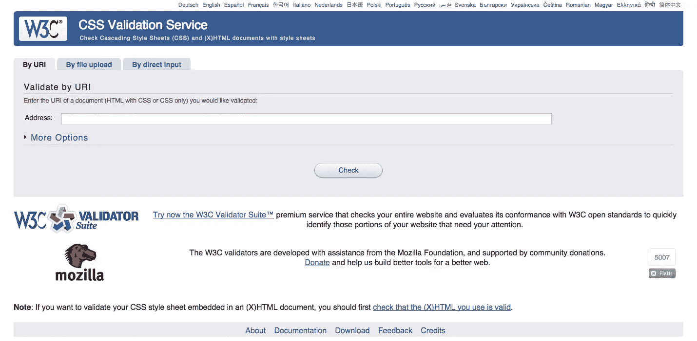
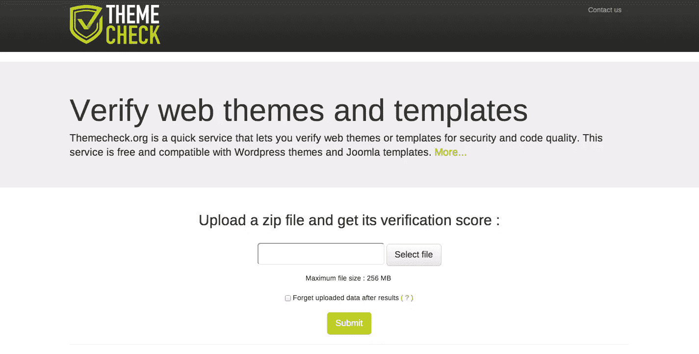
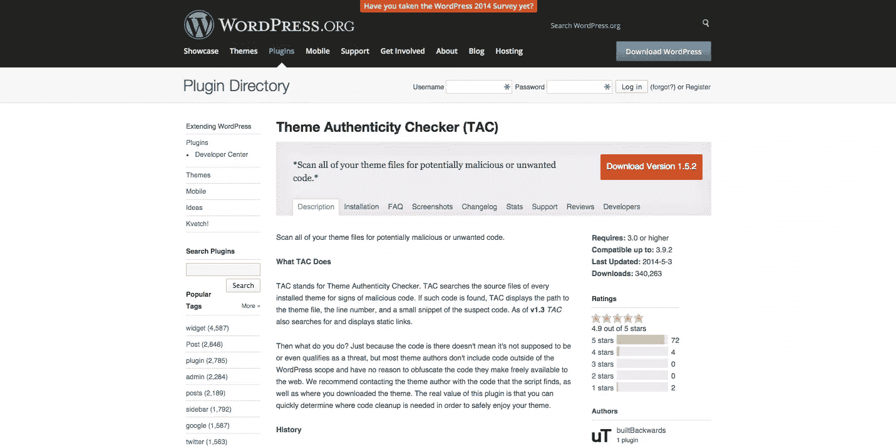

# 如何识别流氓或低劣的主题

> 原文：<https://www.sitepoint.com/how-to-spot-a-rogue-or-subpar-wordpress-theme/>

为你的 WordPress 网站选择一个主题对最有经验的开发者和设计者来说都是一个挑战，因为除了代码越来越复杂，付费设计，购买通常是原样。随着响应能力成为当今大多数设计的关键元素，确保你购买的主题不会成为[响应式网页设计陷阱](https://www.sitepoint.com/4-common-responsive-web-design-pitfalls/)的牺牲品是很重要的。

幸运的是，通过遵循一些常识性的预防措施，你可以减少下载一个对你的网站构成威胁的主题的机会。

## 验证主题代码的简单方法

由于手工检查主题代码是一项乏味的任务，大多数专业人员都没有时间去做，验证工具，如 W3C 标记验证器允许你只需点击几次就可以检查站点的标记有效性。要验证您计划购买的主题，只需将验证器指向现场演示页面，然后检查结果。

一般来说，你不应该太担心主题触发的警告。相反，您应该关注标记错误，因为这些错误通常会对您的站点操作产生重大影响。一旦你检查了你的主题的标记，你也应该运行 W3C CSS 验证器来确保你想要的主题中的 CSS 遵循编码的最佳实践。

如果你正在寻找一个更彻底的方法来确保你的主题符合网页设计的最佳实践，你可以使用[ThemeCheck.org](http://themecheck.org/)来查看一个完整的验证分数，只需将包上传到你的网站。虽然这种方法要求你手头有主题文件，但 ThemeCheck 网站在主页上列出了丰富的主题评级。如果你有名字，这可以让你调出一个主题的分数。

ThemeCheck.org 开源了 Github 上的代码，从技术上来说，它是下面提到的主题检查插件的一个分支。

如果你想让你的验证更进一步，有一些工具允许你在你的服务器上安装后检查你的 WordPress 主题。虽然这一步对于你需要提前验证的主题来说并不理想，但是对于免费主题来说，这是一个有用的安全层。主题检查是一个插件，允许你测试你的 WordPress 主题，确保它符合最新的 WordPress [主题评论](http://codex.WordPress.org/Theme_Review)标准。

要使用主题检查，你只需通过你的 WordPress 管理面板运行测试。结果会立刻显示出来，并且会保存到一个日志中，如果你是一个主题开发者，这个日志会很有帮助。

另一个确保你的 WordPress 主题符合主题最佳实践的有用工具是[主题真实性检查器(TAC)](http://WordPress.org/plugins/tac/) ，这是一个专注于发现隐藏在主题中的恶意软件的工具。

虽然我们很快会讨论如何找到高质量的付费主题，但重要的是要注意到一些免费主题包含恶意软件或垃圾链接，作为开发者创收的一种方式。虽然并不是所有的免费设计都是危险的，但当涉及到确保你的网站没有恶意软件时，确保安全是没有坏处的。

虽然这是一个不同的话题，但是当你验证你的主题是否有恶意软件时，你应该知道如何保护自己免受流氓插件的攻击。

## 坚持信任 WordPress 主题卖家

尽管网上不乏主题开发者，但你可以通过只从有信誉的卖家那里购买主题来保护你的网站的完整性。如果你正在寻找各种各样的主题，ThemeForest 和 T2 mojo themes 是网上最大的两个模板供应商。虽然他们是一个有许多卖家的市场，但他们提供了一个反馈系统，所以你可以看到一个卖家是否有一个经过验证的记录。

其他值得考虑的 WordPress 主题供应商包括:

*   [WooThemes](http://www.woothemes.com/)
*   [优雅的主题](http://www.elegantthemes.com/)
*   [主题化](http://themify.me/)

网上还有许多其他著名的网站，所以前面提到的名字远不是一个完整的列表。

如果出于某种原因，你需要选择一个免费的 WordPress 主题，通常最好坚持使用你在主要博客和知名网站上发现的主题。在可能的情况下，避免从随机网站下载主题，当然也要不惜一切代价避免被清空的主题。对于那些不熟悉这个术语的人来说,“空主题”是一个高级主题，它去掉了版权保护。使用空代码是非法的，而且几乎总是会有修改，让攻击者访问您的网站。

## 如果有疑问，请使用谷歌

当你不确定一个主题创作者是否合法的时候，用谷歌搜索创作者的公司名称，看看他们是否有负面的网络形象，这不会有什么坏处。这对于市场和独立的主题零售商来说是一个很有价值的工具，因为它可以让你收集最初可能不明显的见解。虽然这种方法远非万无一失，但它仍然是一种有效的方式，为你的主题采购带来另一种视角。

## 分享这篇文章