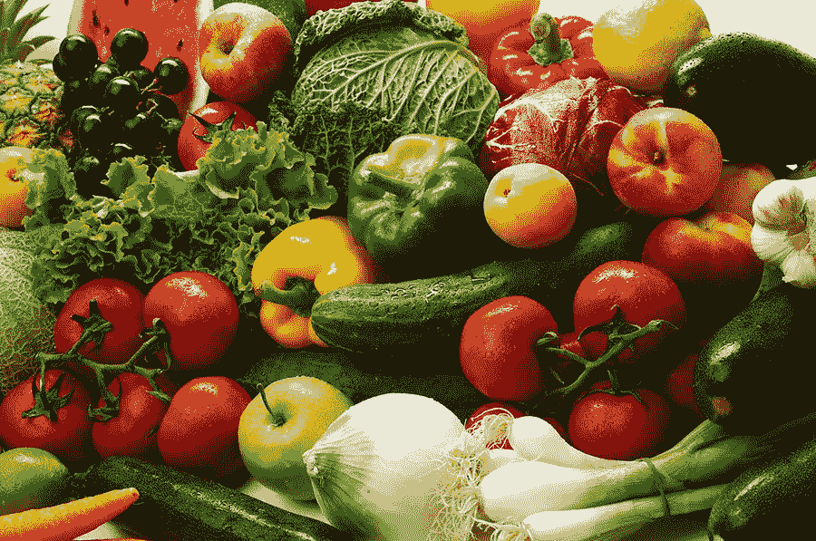

# 在家从事自由职业时如何保持健康

> 原文：<https://www.sitepoint.com/how-to-stay-healthy-while-freelancing-from-home/>

让我们面对现实吧:作为在家工作的自由职业者，我们不像朝九晚五的同事那样活跃。我们不会在早上起床走动一会儿准备离开。我们不必步行或开车去上班。我们不必整天频繁地离开办公桌。

我们朝九晚五的同事在一天中起床走动的时间比我们多得多。我们不仅错过了起身走动的好处，还更有可能在椅子上坐更长时间。更不用说，我们经常有更多的小吃选择，可以随时随地自由就餐，尤其是厨房就在几步之遥。

仔细想想，我们远不如朝九晚五的同事活跃，尽管我们在家工作，控制自己的时间表，有更多的时间来保持健康。如果你在家工作，确保你照顾好自己和你的健康比你想象的要困难一些。

在家工作的自由职业者(甚至那些为别人工作的人)的一些主要健康问题包括体重增加、精力丧失、体力和耐力下降以及眼睛疲劳。这些是在家工作的人更容易出现的主要问题。

有很多方法可以解决这些健康问题，让你重新成为一个健康、有创造力的你。我们选择自由职业的生活方式，因为我们想要自由和控制我们的生活。让我们不要让这种生活方式影响我们的健康，并潜在地夺走我们努力获得的一些自由和控制。

下面，我列出了一些简单的方法，可以帮助你战胜自由职业者中最常见的健康问题，这样你就可以开始掌控自己的健康和幸福。

## 重量的增加

自从转为在家工作的自由职业者后，你注意到体重增加了吗？自从你开始完全在家工作以来，你很可能已经注意到了一些额外的体重。这是因为几个原因:工作所需的运动更少，更久坐的生活方式，零食和食物更容易获得，更容易跳过锻炼。

自由职业者体重增加的两个主要原因是白天运动量的减少和随时可以得到的零食和食物。当你在离你睡觉和吃饭的地方这么近的地方工作时，你会错过一些有价值的步骤，并且很容易找到吃的东西，甚至可能吃得过多。

由于体重增加可能是自由职业者最大的健康问题，有一些方法可以让你的自由职业生活方式更健康，并防止体重增加。首先，起床并在白天散散步。无论如何，你都需要时不时地离开你的电脑(下面讨论)，所以在你的房子周围，在跑步机上，或者在户外(无论什么对你来说最合适)快速走 15 分钟。

这 15 分钟的步行让你的心脏跳动，燃烧一些额外的卡路里，同时帮助你缓解压力，锻炼肌肉，保持新陈代谢。每天散步三次，每次 15 分钟，这意味着一天结束时你已经锻炼了 45 分钟。对我们大多数人来说，这相当于每天走 2.5 到 3 英里(4 到 5 公里)。

第二，通过安排你的早餐、午餐和晚餐时间来对抗暴饮暴食的可能性。想什么时候起床吃什么东西都太容易了。如果你安排好了，你可以告诉你的大脑现在还不是吃饭的时候，防止你暴饮暴食。如果你是那种需要零食的人，投资买一些你能吃的健康零食(水果、什锦水果、订阅像 Graze 或 Nature Box 这样的健康零食订阅)，但即使有这些健康零食，也不要把它们放在你工作的地方。把它们放在厨房里，这样你就不会想吃它们，也不会吃得过多。

最后，远离含糖和高热量的饮料(苏打水、甜茶、多奶油的咖啡等。).这些含糖饮料会增加体重，因为太容易忘记你一天吃了多少(更不用说糖特别会导致体重增加)。坚持喝低热量或无热量的饮料，比如水和茶。

## 能损失

对于自由职业者来说，丧失精力可能是几个原因造成的:睡眠不足、缺乏锻炼、吃垃圾食品以及一直静止不动。当你感到没有能量时，那是因为你要么剥夺了你身体的好东西，要么给了它不好的东西。

解决能量损失问题的一个方法是在晚上得到足够的休息。获得七到八个小时的睡眠会让你更有效率，让你有一个宁静的夜晚，让你的身体有时间自我修复。睡眠太少，疲劳开始出现；睡得太多会打乱你的生物钟。

另一种帮助你恢复精力的方法是定期锻炼。有氧运动和力量训练等常规运动会释放出感觉良好的内啡肽，有助于保持精力充沛。此外，排出运动所需的能量有助于你的身体变得更累，为睡觉做好准备，防止你辗转反侧，让你获得更宁静和恢复性的睡眠。

最后，吃更好的食物可以让你避免不必要的能量消耗。吃添加了大量糖分的垃圾食品会让你快速补充能量，但这种效果不会持续太久。寻找有益健康和持久能量的食物(坚果等蛋白质和鳄梨等脂肪)可以帮助你摆脱低能量的习惯。只要确保这些食物不含糖或盐，不要吃得太多！

## 恶化的力量

这不足为奇。当你不太活跃，一天大部分时间都坐在椅子上时，你的身体不经常使用的部位开始失去力量。例如，你的手臂可能开始失去一些力量，当你举起六个月前可能没有那么有挑战性的东西时，会导致紧张。

定期锻炼有助于增强你的力量，尤其是力量训练、瑜伽、普拉提和其他类似的锻炼。虽然你可能认为这些类型的运动不重要(因为它们不一定有助于你减肥)，但它们有助于你增强力量和肌肉。肌肉比脂肪占据更少的空间，有助于燃烧周围的脂肪。它还需要更多的代谢能量来维持肌肉，所有这些都有助于燃烧卡路里。

如果定期锻炼或去健身房的想法让你紧张，那就想办法在自己家里私下里做，以一种快乐和有趣的方式。你不需要太多设备。

YouTube 是我在家锻炼和指导的首选资源之一。有几个很棒的私人健身教练和其他人制作了很棒的视频锻炼来帮助你，几乎不用设备。尝试其中几个，找到一个你最喜欢的频道。

## 眼睛健康

任何一个连续几个小时坐在电脑前的人都需要特别注意他们花了多少时间盯着电脑。眼睛疲劳、近视和头痛都是长时间使用电脑的症状。

建议你每小时离开电脑一会儿。这样做有助于你的眼睛适应远处的东西，给它们自己的锻炼。你可以在电脑前休息一会儿，在房子周围散散步，在外面走 15 分钟，或者在远离电脑(包括手机或平板电脑在内的任何屏幕)的地方吃午饭。

此外，如果可能的话，尽量远离电脑。在晚上做一些与电脑或屏幕无关的事情会让你的眼睛重新调整并消除坐得离发出有害蓝光的电脑太近的有害影响。

## 结论

对于在家工作的自由职业者来说，大多数(如果不是全部)最常见的主要健康问题都可以通过一些有意识地改变你的生活方式来缓解。诸如多锻炼，散步休息，购买和吃更健康的食物而不暴饮暴食，晚上得到足够的休息，力量训练和提高你的耐力，经常离开电脑休息，这些都可以帮助你避免体重增加，失去能量，失去力量和损害你的眼睛。

作为在家工作的自由职业者，我们可以控制自己的时间表，拥有像我们这样的人可能没有的自由和灵活性。让我们利用这种自由和灵活性来帮助自己保持健康和快乐。

## 分享这篇文章