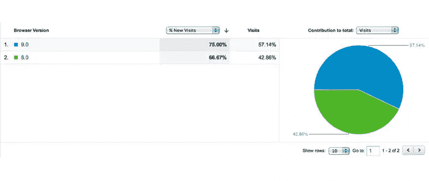
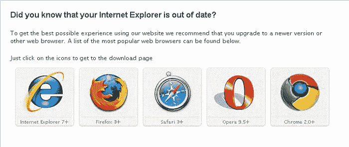
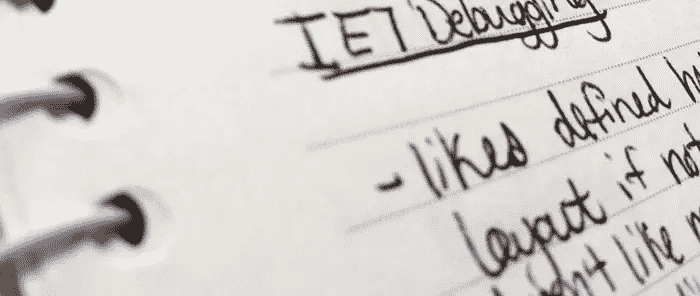

# 如何停止浪费时间开发 Internet Explorer

> 原文：<https://www.sitepoint.com/how-to-stop-wasting-time-developing-for-internet-explorer/>

如果你是一个开发者，你可能已经做过了。前一分钟你还在 IE7 的破页面上揪头发。然后，突然间，平静战胜了你:在一个遥远的地方，你梦想着有一天你可以把剑插向空中，向世界宣布:“Internet Explorer 不会再浪费我的时间了！”你的头上甚至可能戴着一顶维京人的头盔——或者这只是我。

在现实世界中，Internet Explorer 仍然存在。旧版本仍然会让我们感到困惑和愤怒。许多人仍在使用它们。

但是在你精神上辞职，再花几个小时登录互联网浏览器偷走了我的生活之前，考虑一下这个:你*不需要在互联网浏览器上浪费时间。*

为了戏剧效果，我就停在这里。

如果你现在带着怀疑的表情，我不怪你；我也浪费了无尽的时间来开发 IE，而其他浏览器都玩得很好。一夜之间什么都没有改变——我只是有一天醒来，决定浪费不再是等式的一部分。

在我深入细节之前，让我们就几件事达成共识:

首先，我不是建议任何人完全停止为 IE 开发。虽然我们开发人员通常不关心它，但是相当一部分用户关心——根据我们九月份的浏览器趋势报告，将近 33%。相反，我建议的是让开发更有效率和更有价值的方法，所以花在 IE 开发上的时间是*有生产力的*而不是浪费的。

其次，重要的是要认识到 IE9 和即将到来的 IE10 在与现代 web 开发方法的兼容性方面取得了巨大的飞跃。大多数悲伤是由于继续使用过时的浏览器。所以下面的提示大部分都会针对 IE 的过时版本。

## 4 个 Internet Explorer 省时软件

让我们先看看浪费时间的因素，然后讨论如何解决这个问题:

浪费时间:开发过时的 IE，而你的观众甚至都不用它。

**省时:**分析，分析，分析！在您在条件样式表中编写一行代码之前，请检查您的分析，以确定实际使用它的受众的百分比。如果数量很少，花时间为他们开发是否值得？把这些时间花在为用户实际使用的浏览器润色网站上会更好吗？

如果你发现相当多的访问者使用恐龙 IE，那么你猜怎么着——你没有浪费时间为他们工作。你在有目的地满足消费者的需求。

**行动起来:**如果你还没有在你的网站上安装 analytics。[谷歌分析](http://www.google.com/analytics/)是一个受欢迎的免费选项。花些时间了解你的访问者喜欢的技术，并做出相应的回应。

浪费时间:彻底检查你的网站，让它能在最老的 IE 版本中运行。

节省时间:如果你有一个网上商店，不能忍受网站因为一个付费用户而失败，或者有一个复杂的网站，需要大量的代码才能在旧的浏览器上运行，发送一条友好的消息要求用户更新。在 JavaScript 的帮助下，您的网站可以检测到正在使用的浏览器，并显示一条消息，通知用户他们的浏览器已经过时，并提供下载各种浏览器最新版本的链接。

**去做:**对于一个包装外的解决方案，试试这个来自谷歌代码的 [IE6 升级警告](http://code.google.com/p/ie6-upgrade-warning/)。只需将下载的文件夹添加到您的目录中，并在您站点的< body >标签后放置一行 JavaScript 代码。如果您了解 JavaScript，这段代码也可以调整为包含 IE7。

浪费时间:不得不一遍又一遍地研究和回答同样的问题

当我第一次开始开发时，我在 IE 出现的问题中看到了一个模式。我突然意识到，我应该把出现的古怪问题和解决方案记录下来。无论如何，许多解决方案被证明是最佳实践——比如定义侧边栏的宽度(以免它们在页面中途被删除)。所以，你不仅仅是在徒劳地修复一个错误——你是在给一个文档添加有价值的信息，这将在以后的道路上节省几个小时的挫折。

**开始做:**不管是旧的学校纸笔清单还是电子文档，开始做日志吧！如果你和一个团队一起工作，考虑创建一个 Google Drive 电子表格，你们都可以添加和引用。

浪费时间:坚持开发过时浏览器的客户，不管他们的访问者使用的是什么。

**省时:**很简单:收费。我们都有过这样的客户，他们在你的收件箱里塞满了缺陷列表，因为他们在 IE6 中查看网站。如果分析显示，实际上没有访问者真正使用那个浏览器版本，并且他们仍然固执地为它优化网站，你的努力要额外收费。如果有人付钱给你，这不是浪费时间！

**做:**检查你的合同模板，确保它指定了你将为哪些浏览器(包括版本)优化网站。任何高于这个价格的都要额外付费！

你也许不能完全戒掉 IE，但也没有理由浪费时间去处理它。相反，尽可能有效地满足网站访问者的需求——把维京头盔放一边，改天再用。

## 分享这篇文章