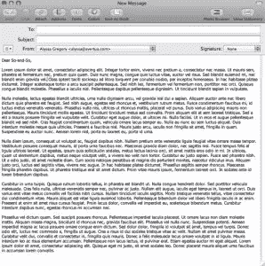
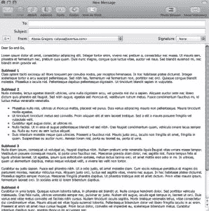

# 如何简化电子邮件通信

> 原文：<https://www.sitepoint.com/how-to-streamline-email/>

你每天花多少时间管理电子邮件？如果你像我一样，你可能会觉得时间太长了，即使你已经确定了过程。电子邮件似乎是生产力的一大消耗，但它是不会消失的商业元素之一。

遵循[电子邮件礼仪规则](https://www.sitepoint.com/email-etiquette-mistakes/)不仅要避免某些事情，而且你还可以做一些事情来进一步简化你的邮件。这不仅会节省你的时间和精力，而且会让你的收件人更容易阅读和回复你的信息。这里有一些想法。

**让你更容易跟上**

尽管我们尽量让电子邮件简明扼要，但有些人还是需要大量邮件，这是无法回避的。让较长的信息更容易理解的一种方法是使用副标题和项目符号列表来分隔文本。这也有助于读者聚焦在最重要的主题上，并给他们一种方法在以后跳转到长邮件的特定部分。参见下面的例子，直文本与被副标题和项目符号分开的文本相比。

**确定行动项目**

通过突出显示、编号或以其他容易注意到的方式标记，为收件人清楚地确定具体的行动项目和问题(请记住，收件人使用的电子邮件客户端可能不支持所有选项)。这不仅有助于收件人了解他们需要采取的行动或需要回答的问题，还能帮助你在第一次回复时得到更完整的回复。

**必要时使用附件**

如果电子邮件中包含的信息特别长，或者需要特殊格式，请将其作为附件。虽然您肯定不希望过度使用附件，因为它们需要更多的步骤来传递信息，并且很容易被放错地方，但是通过电子邮件提供深入的信息是一种有效的方式。

**紧扣主题**

虽然这似乎是显而易见的，但你会发现，当你在邮件正文中包含一个描述性的、准确的主题行并坚持这个主题时，你会得到更快的回复。如果你打算发送 2-3 个主题的简要信息，写一个主题来说明。比如“会议”vs .“会议纪要和下周会议时间。”

**包括行动号召**

几乎每封电子邮件都要求收件人做一些事情。把你信息的最后一个副标题定为“行动号召”,指明接下来会发生什么。你需要在某个时间之前得到回复吗？您是否需要收件人让您知道他们可以参加会议？本周晚些时候你会打电话给她跟进吗？在结束前说出你的要求，这将是收件人脑海中的最后一句话，鼓励并提醒他们采取行动。

你对简化电子邮件有什么建议？

## 分享这篇文章