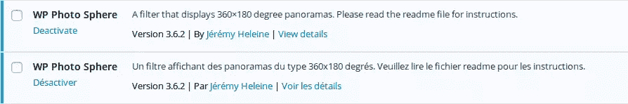

# 快速提示:如何翻译 WordPress 插件描述

> 原文：<https://www.sitepoint.com/how-to-translate-a-wordpress-plugin-description/>

如果你为 WordPress 开发了一个有用的插件，那很好——但是如果你能让说其他语言的用户也能使用你的插件就更好了。

好消息是你可以很容易地[准备好你的插件翻译](https://www.sitepoint.com/wordpress-i18n-make-your-plugin-translation-ready/)。这样，它将有几种不同的语言版本。

然而，有一个细节并不总是被插件开发者翻译出来:插件的描述。在这个快速技巧中，我将介绍如何翻译这个描述。



## 允许人们翻译你的插件描述

为了准备好插件翻译，您需要生成一个 POT 文件。这个文件包含了你在插件中使用的所有字符串。要翻译给定语言的插件，你可以从这个 POT 文件创建一个 PO 文件，然后一个接一个地翻译每个字符串。

默认情况下，POT-file 不仅包含您用于特定功能的字符串，如`__()`或`_e()`，它还包含三个额外的字符串:插件的名称、插件网站的 URL 和插件的描述。

这意味着，默认情况下，贡献者可以翻译这些信息。有一个问题——除非你向 WordPress 表明这些翻译存在，否则它们不会被使用。

为此，回到描述你的插件的评论。位于你插件的主文件中，这个评论是强制性的，WordPress 用它来知道你插件的名字和其他有用的信息。

在这个评论中，有几条必须提供的信息，但是也有一些可选的内容可以选择添加。在这个可选信息列表中，我们找到了要本地化的插件所使用的文本域，以及包含本地化文件的文件夹的路径。

注释是键/值关联的列表。例如，下面是我的插件 [WP Photo Sphere](https://wordpress.org/plugins/wp-photo-sphere/) 以前版本使用的评论。

```
<?php
/*
Plugin Name: WP Photo Sphere
Plugin URI: http://jeremyheleine.me
Description: A filter that displays 360×180 degree panoramas. Please read the readme file for instructions.
Version: 2.0
Author: Jérémy Heleine
Author URI: http://jeremyheleine.me
License: MIT
*/
?> 
```

为这些版本生成的 POT 文件包含描述。然而，由于评论中没有提到 WP Photo Sphere 使用的文本域，所以没有使用描述的翻译。

下面是我最近用的一个评论，因为有好几个版本。

```
<?php
/*
Plugin Name: WP Photo Sphere
Plugin URI: http://jeremyheleine.me
Description: A filter that displays 360×180 degree panoramas. Please read the readme file for instructions.
Version: 3.6.2
Author: Jérémy Heleine
Author URI: http://jeremyheleine.me
Text Domain: wp-photo-sphere
Domain Path: /lang/
License: MIT
*/
?> 
```

这里可以看到两个新条目:`Text Domain`和`Domain Path`。在`Text Domain`中显示的值是你的插件使用的文本域，也就是你用`load_plugin_textdomain()`载入插件的文本域。`Domain Path`条目必须用路径填充。在这个条目中，根是你的插件的文件夹。您必须指定该文件夹的子目录，该子目录包含所有需要的 MO 文件。

如果您使用这些条目，并且插件描述的翻译在当前语言中可用，那么将使用这些翻译。如果你愿意，也可以使用插件名称的翻译(只是不要删除 POT-file 中相应的条目！).如上所述，插件的网址也可以翻译。如果您以多种语言提供此网页，并在 URL 中包含一个参数，这将非常有用。例如，您可以将`http://myplugin.com`指定为您插件的默认 URL，将`http://myplugin.com/fr`指定为法国用户的 URL。

## 结束语

WordPress 提供了所有你需要的工具来翻译你的整个插件，甚至是它的名字或者描述。然而，由于`Text Domain`和`Domain Path`在插件的头注释中不是必需的，它们经常被开发人员遗忘。

现在你可以翻译你的插件的描述，并向世界各地的用户描述它是做什么的，为什么它很棒！

## 分享这篇文章