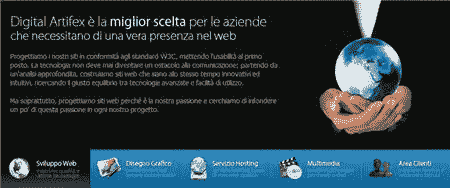
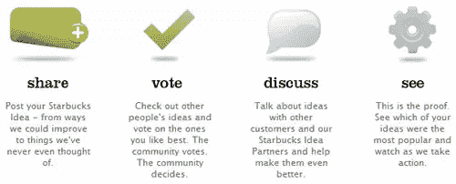
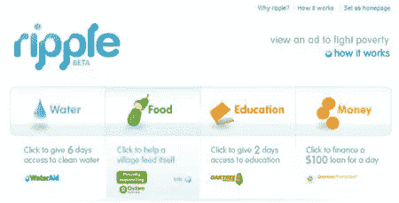
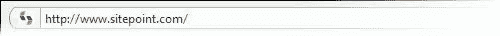

# 如何在你的网站上使用图标

> 原文：<https://www.sitepoint.com/how-to-use-iconse/>

自从设计开始以来，图标就已经在设计中使用了。从古埃及金字塔上的象形文字到现在出现在许多网站上的橙色 RSS 图标，图标在印刷和网页设计中都被用于相同的目的——将注意力快速吸引到文档或网页的重要部分。

## 实际使用

图标可以快速总结和传达大量信息，你可以在你的网站上使用它们来吸引访问者的注意力，快速传达一个想法，或者突出网站的一个部分。

让我们来看看一些随机的网站，看看他们是如何使用图标来交流，让导航更容易，或者只是让页面看起来漂亮！

图标使用的一些例子包括:

**1。增加导航的视觉趣味。**

[digital artifex](http://www.digitalartifex.com/) 站点使用图标和一些文本进行页面中间导航设置。

**2。将注意力吸引到页面的特定部分，例如特价商品。**

在[我的星巴克创意](http://mystarbucksidea.force.com/ideaHome)主页上，图标将用户的眼睛吸引到一个有大量文本的混乱页面上。

**3。把注意力吸引到你提供的服务上。**

Sitemaker 使用图标进行沟通，使用易于理解的图像，例如，一个饼图图标来说明不断增长的销售额。

**4。给标题添加额外的“魅力”。**

Ripple 网站目前处于测试阶段，但主页几乎完全由四个图标组成。它非常简单，引人入胜。

除了提供非常实用的功能之外，你也可以使用图标来达到美观的目的。在一些网页上，你会发现所用的图标是公司品牌的延伸，而在另一些网页上，有时会有一种感觉，图标在那里只是为了看起来漂亮。如果你使用图标为你的网站增加一点额外的“魅力”,请记住，对于大多数访问者来说，图标应该有某种意义或联系，所以要确保你选择的图标不会让你的用户感到困惑。

## 网络图标的演变

代表“家”的小房子和代表“电子邮件”的信封轮廓等老派图标现在已经被微型艺术作品所取代。

 
*(是的这其实是一个图标！)*

如果你喜欢挑战，你可以在图像编辑器中制作自己的图标，如 Photoshop 或 Paint Shop Pro。另外，还有一些非常漂亮的图标可以免费下载，比如[丝绸图标套装](http://famfamfam.com/)或者那些在[图标点](http://www.iconpot.com/)可以买到的图标。在谷歌上快速搜索会让你大吃一惊。

## 一个新图标

我认为有必要提一下一种新的图标，这种图标是最近发展起来的，完全用于网站上 favicon。毫无疑问，你知道，favicon 是出现在你的浏览器的 URL 地址栏和一些浏览器的标签上的小图片。

网站图标现在是每一个网页设计的一部分，应该作为你整体品牌的一部分。艾丽莎最近报道了一份惊人的名单，包括 88 个杰出的例子。

你认为怎样才能成为一个好的图标？你在你的网站上使用图标吗？如果没有，为什么没有？

**相关阅读:**

*   [使用 Illustrator 或 Freehand 创建 XP 风格的图标](https://www.sitepoint.com/article/create-xp-style-icons/)
*   设计有用的图标！

## 分享这篇文章