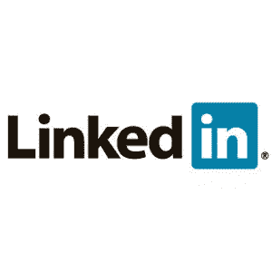

# 如何从 LinkedIn 获得更多

> 原文：<https://www.sitepoint.com/how-to-use-linkedin/>

 [LinkedIn](http://www.linkedin.com) 是一个拥有超过 3900 万会员的职业网络。虽然它有一些社交网络功能，但它显然是最专业的商业网络之一，用于分享信息、促进业务和扩大你的联系。

如果你目前正在使用 LinkedIn，但不确定如何从它那里获得更多，或者如果你刚刚开始建立你的网络，这篇文章将概述一些从你的 LinkedIn 帐户获得更多的方法。

**简介**

LinkedIn 账户最重要的部分是你的个人资料，因为这是人脉、其他用户和公众搜索你时会看到的。如果你在 LinkedIn 上什么都不做，确保你的个人资料完整准确。以下是您需要完成的一些领域:

*   总结:这本质上是你的[电梯推销](https://www.sitepoint.com/why-you-need-a-powerful-elevator-pitch/)，以及你如何在社交场合介绍自己。
*   经历和教育:就像简历一样，这些部分按时间顺序显示你现在和过去的职位以及你在哪里接受的教育。同样像简历一样，你应该以一种易读、清晰和简洁的方式来格式化这些数据。
*   附加信息:这是你包括网站和博客链接、个人和职业兴趣、你所属的 LinkedIn 群组、职业协会和你获得的奖项的地方。
*   公开资料:这些信息将显示给没有登录 LinkedIn 的用户，他们正在通过 Google 等搜索引擎搜索你。您可以控制您的个人资料中哪些元素是公开的，并选择一个简短的 URL 来宣传您的个人资料。

附上一张你自己的照片也是一个好主意，因为这可以让你认出你见过的人，并为新的联系提供安全感，因为你知道他们正在和一个真实的人联系。

**组**

LinkedIn 上的群组为你提供了一个与其他有共同兴趣的成员联系和协作的途径。通过搜索群组目录，您可以找到特定经验、行业、附属机构、组织、学校和公司的群组。

**答案**

LinkedIn [Answers](http://www.linkedin.com/answers) 是网站的一个部分，让会员提问和回答同事发布的问题，同时跟上行业话题。当你问一个问题时，你将它分配到一个特定的类别，它会发布在你的个人资料和 LinkedIn 主页的“答案”选项卡下。您也可以通过电子邮件将问题直接发送给 connections，这是开始直接对话的好方法。

回答问题给了你一个分享知识的机会，同时也让你成为了这方面的专家。当你回答问题时，你有机会获得“专业知识”如果发布问题的人认为你的答案是最好的，你就在这个问题的类别中获得一分专业知识。你获得的专业知识越多，你在 LinkedIn 的专家列表中的排名就越高。

**搜索**

有几种方法可以让你搜索 LinkedIn:

*   快速搜索:这是一个下拉选项，当你登录后，可以通过人、工作、公司、答案、收件箱和群组进行搜索。
*   人物搜索:人物搜索是通过输入你想找的人的关键字来完成的。你甚至不需要知道他们的全名，只需要知道公司、头衔、学校等的组合。可能足以确认他们的身份。
*   证明人搜索:此搜索选项可用于对同事进行证明人调查。您可以输入公司名称和工作年限来查找可以提供证明人的同事。

作为自由职业者或企业主，有很多方法可以利用 LinkedIn 来提升你的前景和职业网络。就像社交网络工具一样，在 LinkedIn 上建立一个强大而广泛的网络需要时间，但一旦开始，好处是无限的。

**了解更多信息**

戴维·泰勒是学习 LinkedIn 基础知识的绝佳资源。他是一名技术和商业专家，他写了许多关于如何有效使用 LinkedIn 的帖子。

这篇文章中的大部分信息是由 LinkedIn 学习中心提供的。有丰富的信息可以帮助各种水平的用户增强他们的 LinkedIn 体验。

对我来说，LinkedIn 是与过去和现在的同事重新联系的一个很好的方式，我主要用它来与我在职业上遇到的人建立联系。你最喜欢 LinkedIn 的哪个功能？LinkedIn 在职业上对你有什么帮助？

## 分享这篇文章