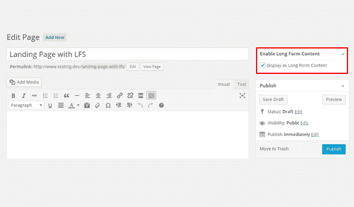
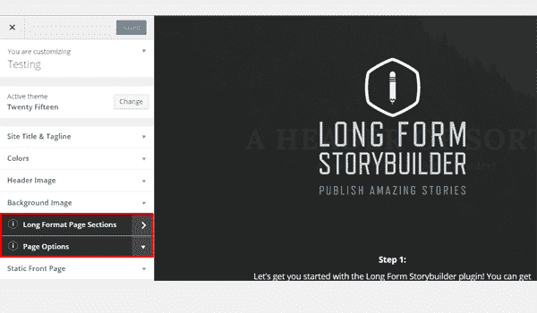
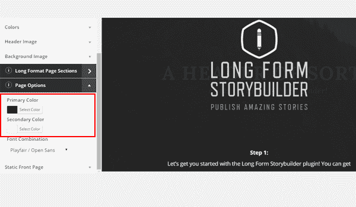
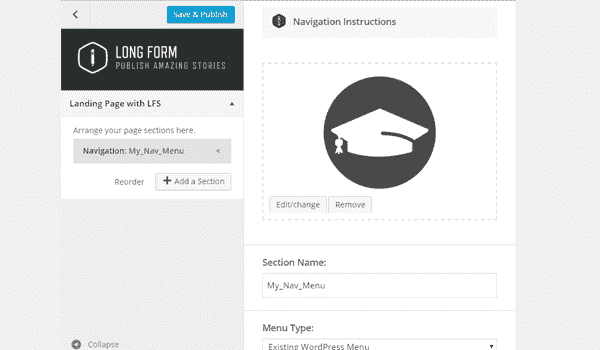
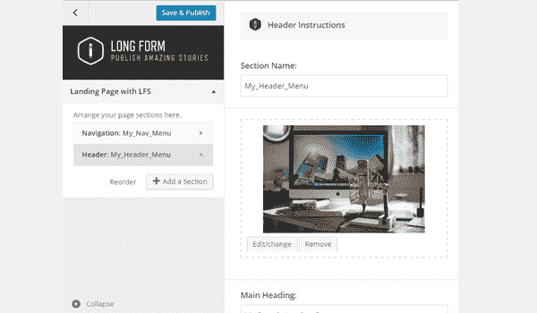
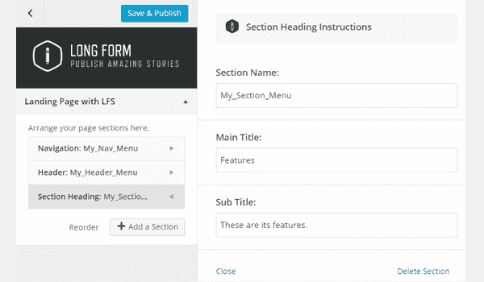
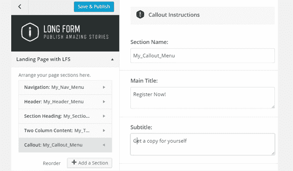
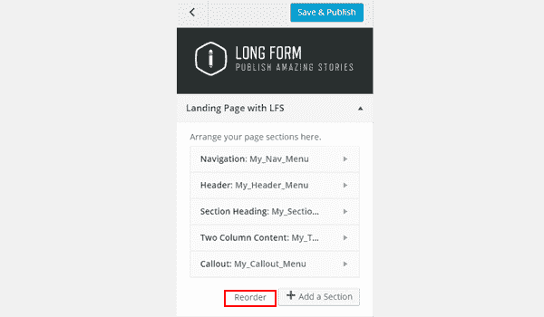
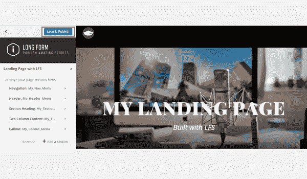
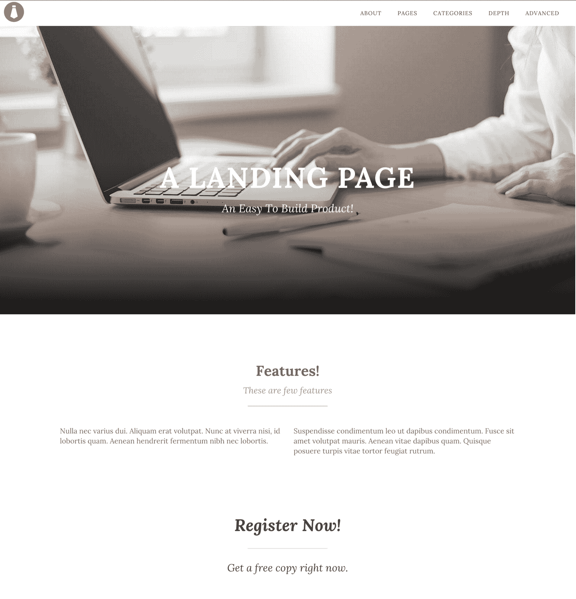

# 如何使用 WordPress 的长篇故事会插件

> 原文：<https://www.sitepoint.com/how-to-use-the-long-form-storybuilder-plugin-for-wordpress/>

在我的上一篇文章“[在 WordPress 中使用 Long Form Storybuilder 的简易登录页面](https://www.sitepoint.com/easy-landing-pages-in-wordpress-with-long-form-storybuilder/)”中，我强调了一些关于登录页面的重要事实，这是营销研究和分析的最佳成果之一。虽然登录页面会带来令人印象深刻的线索和转换，但建立一个并不总是容易的，尤其是如果你不知道如何编码的话。出于这个目的，我向你介绍了一个方便的解决方案，它是 WordPress 的长格式 Storybuilder (LFS)插件。在本文中，我将向您展示如何只需几次点击就能创建直观的登录页面。

## 基本设置

让我们为你做好准备。在这一点上，我假设您有以下设置:

*   本地机器或网络服务器上的 WordPress 网站
*   安装的&插件激活

一旦完成，进入 WordPress 仪表盘，通过 **Pages > Add New** 添加一个新页面。给它一个合适的标题，保存它。接下来，通过点击右上角元框中的**启用长格式内容**复选框，允许 LFS 插件包含在您的项目中。

上面的截图显示我已经创建了一个页面并启用了复选框。现在再次点击**保存草稿**按钮。

此时，您会收到一条消息，通知您长格式内容已启用，您可以使用长格式 Storybuilder 插件编辑此页面。点击**编辑我的长格式内容页面**按钮。

在这个阶段，主题定制器打开，你可以在那里找到这个插件添加的两个新面板。新面板包括

*   长格式页面部分
*   页面选项

页面选项有助于设置登录页面的主要和次要颜色，而长格式页面部分可用于添加登录页面的多个部分。

在我的上一篇文章中，我提到了可以用长格式 Storybuilder 插件添加的部分的完整列表。进入**长格式页面部分>添加一个部分**并为你的登陆页面选择一个部分。

现在，在每个部分中，在它成为登录页面的一部分之前，都需要配置某些设置。

## 构建登录页面

既然我已经解释了长篇故事会插件的基本架构，让我们用它来创建一个登陆页面。

我直接跳到**页面选项**面板，选择黑色作为我的主要颜色，白色作为我的次要颜色。

接下来是向登录页面添加部分的激动人心的部分。

### 步骤 1:添加导航栏

我在登陆页面中添加的第一个部分是导航栏。我将其命名为`My_Nav_Menu`，并通过添加徽标图像和菜单类型来配置其设置。

### 第二步:标题

在导航栏之后，登陆页面的下一个最重要的部分是产品的介绍部分。这通常需要一个特色图片以及居中对齐的标题。

你可以参考上面的截图，我已经添加了这个部分，并将其命名为`My_Header_Menu`。首先我加了一个特色图片。然后是主标题字段，您可以在其中添加产品名称。

### 第三步:章节标题

接下来，我向登录页面添加了一个标题部分。这只是一个普通的标题，表示一个新章节的开始。您可以查看下面截图中的详细信息。

### 第 4 步:两栏内容

然后，我在登录页面中为我的产品添加了一些功能。您一定已经注意到，功能通常以两列或三列的布局显示。人们可以很容易地通过长篇故事会插件添加这些内容。现在，我将添加一个两列内容部分。

这个部分的设置非常简单，你所要做的就是添加你想要显示的文本。我在第一栏和第二栏都贴了一些虚拟文本。

### 步骤 5:标注部分

最后，我添加了一个标注部分，鼓励人们购买有问题的产品。在这种情况下，我要求最终用户注册。另一方面，你可以把它们发送到一个结帐页面或其他地方。

我在这个特定的登录页面中添加了五个部分。在下图中，你可以找到一个叫做**重新排序**的按钮，你可以用它来改变你的部分的顺序。

### 第六步:发布

完成后，点击顶部的**保存&发布**按钮。请注意一件重要的事情，无论您创建哪个部分，您都可以立即看到它的实时预览，这是一个非常吸引人的功能。

### 步骤 7:预览结果

转到第**页**。找到你用 LFS 编辑过的页面，点击**查看页面**查看你的登陆页面。这是我刚刚创建的登陆页面的结果。

## 结论

您可以重复这些部分，添加更多的部分，并根据您的需要重新排序。我敢肯定，用不了 5-10 分钟，你就可以用这个插件创建很酷的登陆页面了。您可以使用 [PicJumbo](https://picjumbo.com/) 查找具有 CC0 许可证的免费高分辨率图像。

使用长格式 Storybuilder 插件，创建一个登陆页面变得非常容易和简单。现在你几乎每隔一天就可以推出一个新的登录页面。那么，你对这个插件有什么看法？我很乐意收到你的来信。

## 分享这篇文章