# 如何在 WordPress 中使用网络字体

> 原文：<https://www.sitepoint.com/how-to-use-web-fonts-in-wordpress/>

最近，每个人似乎都在谈论龙虾。不是海洋中的甲壳类动物，而是网络字体。对于那些没有听说过它的人来说，Lobster 是一个很好的嵌入到网页中的流行谷歌字体的例子。

嵌入字体并不像你想象的那样新奇。早在 1998 年，CSS 2 就引入了@font-face 规则。理论上，这使得设计者可以将任何 TrueType 或 PostScript 字体下载到用户的计算机上，以便在网页上显示。不幸的是，当时只有 Internet Explorer 4 支持该规则。人们普遍担心授权费用高昂的字体会被盗版。今天，CSS 3 仍然不能解决盗版问题，但是所有的网络浏览器都支持这个规则。从那时起，屏幕分辨率也有了显著的提高。所以，如果你还没有接受字体嵌入，现在是时候了。

## 当前 Web 字体选项

在我们讨论如何在 WordPress 中使用网络字体之前，让我们先回顾一下网络上的字体。

对字体最基本的支持来自用户使用的操作系统。这可能会为台式机或笔记本电脑系统提供几十种字体，而在 Android 上只有三种字体。

不幸的是，这仍然是一个相当碰运气的系统。我们都知道 Helvetica 在基于 Windows 的机器上设置为 16px 及以下时看起来有多差，Arial 在一些旧版本的 OS X 上看起来也不怎么样

许多这些差异的产生是因为最初的苹果 Mac 操作系统依赖于每英寸 72 点的旧印刷技术。因此，10 点字体在显示器上被分配了 10 个像素。当时，苹果提供了与标准美国纸一样大小的垂直(纵向)显示器，可以从屏幕上与印刷版本进行直接的一对一比较。另一方面，微软选择 96 *PPI* 是基于人们坐在电脑显示器前的距离比坐在打印页面前多 1/3。因此，在基于 Windows 的电脑上，一切都放大了 1/3。

自 20 世纪 90 年代这些技术出现以来，事情已经取得了很大进展，我们现在有无数不同的屏幕尺寸和分辨率要处理。然而，除非您指定字体，否则用户的设备和浏览器仍然会为您选择字体。

另一个问题是一些组织限制用户电脑上的字体。我曾经在一家公司工作，该公司的电脑上只安装了佐治亚州和凡尔达纳州的软件。这样一来，员工发送的信件和电子邮件只能使用与公司标识相匹配的字体。

## 充分利用内置字体

尽管使用公司字体，但大多数台式机和笔记本电脑都有为 Web 项目创建的[微软核心字体。1996 年的这套字体包括 Andale Mono、Arial、Arial Black、Comic Sans MS、Courier New、Georgia、Impact、Times New Roman、Trebuchet MS、Verdana 和 Webdings。尽管大多数台式机和笔记本电脑上都有这些字体或其等效字体的版本，但浏览器可能无法按照您的预期显示这些字体。](https://en.wikipedia.org/wiki/Core_fonts_for_the_Web)

这种限制可以通过使用*字体堆栈*来最小化。这为浏览器设置了一个 CSS 规则来使用多种字体中的一种。它总是包含全部衬线字体(在笔画末端有小的修饰)或无衬线字体(没有修饰)。因此，我们可能有字体家族:坎布里亚，霍夫勒文本，解放衬线，时代，新罗马时代，衬线。浏览器应该检查你的“堆栈”,并使用它在用户计算机上的列表中找到的第一个定义的字体来显示文本。如果找不到任何一种字体，它就使用一种后备字体，在本例中定义为 serif。

目的是挑选一系列字体，在一系列不同的分辨率和缩放级别下，在一系列浏览器上呈现良好。

这里有一篇加拿大设计师阿姆林德·桑德胡关于字体堆栈的精彩讨论。

不幸的是，如果您的观众使用手持设备，使用字体堆栈没有帮助。Android 设备使用 Droid Sans、Droid Serif 和 Droid Sans Mono，而苹果 iOS 设备使用 Helvetica Neue，该公司拥有各种各样的风格和重量。

比起依赖众多操作系统和版本的内置字体，你可能更喜欢控制你的 WordPress 页面的外观。我们可以通过嵌入字体来克服这个问题。

现在，让我们看看可用的网络字体类型。

## 免费字体

绝大多数可用字体都以某种方式获得了许可。当你购买安装了操作系统的电脑、平板电脑或手机时，部分费用是字体的许可费。但是，有许多方法可以使用各种免费的嵌入字体。

嵌入式字体是在页面活动时从第三方平台下载到用户计算机上的字符集，当页面关闭时会丢失。这允许服务公司保留对字体的控制，但是允许你显示字体而不需要付费使用。有大量的公司提供字体服务。最著名的有:

1.  谷歌字体(Google Fonts)，可能是最受欢迎的免费字体服务，该平台提供超过 700 种精心设计的字体，包括龙虾。
2.  Adobe 还通过他们的 [Edge 网络字体平台](https://edgewebfonts.adobe.com/fonts)提供字体。这直接与 Typekit 服务接口(见下文)，但是过滤付费字体，留下免费的开放字体。
3.  另一个值得考虑的平台是[开放字体库](http://openfontlibrary.org/en)。这有 600 多种字体。

这些平台上的所有字体，以及其他一些平台，都使用开放字体许可证。开放字体许可证(OFL)的目标是刺激全球协作字体项目的发展，支持学术和语言社区的字体创建工作，并提供一个免费和开放的框架，在该框架中，字体可以与他人合作共享和改进。

开放字体的优势在于它们可以在你的网站上免费使用，无需支付年费。缺点是你选择的字体可能没有完整的风格和粗细范围。

## 付费字体

尽管免费字体盛行，但仍有大量字体代工厂提供优质字体。例如， [Type Foundries Archive](http://type-foundries-archive.com) 列出了近 300 个提供优质字体的创作者和网站，尽管并不是所有的都提供嵌入网页的功能。

在为网络使用提供优质字体的组织中，德国的[字体商店](https://www.fontshop.com)可能是最受欢迎的付费字体市场。有高质量的字体，以及不寻常的字形集，如 Ulrike Rausch 的厨房水果和蔬菜，刀叉，锅和家用电器集，LiebeCook。

如果您拥有 Adobe Creative Cloud 帐户，您将自动访问 Adobe 的 [Typekit](https://typekit.com) 服务。Typekit 提供超过 450 种字体。问题是，虽然许可证允许您在印刷出版物和您的个人非商业网站上使用字体，但如果您为客户工作，您只能在拥有 Adobe 商业帐户的情况下使用 web 字体。Adobe 建议您在开发期间为客户建立一个帐户，并将其交给他们。这样做的缺点是，如果客户未能支付他们的帐户，网站将恢复到您定义的字体堆栈中的备用字体，即系统字体。

## 在你的 WordPress 页面和文章中获得你想要的字体

有很多插件可以让你在你的 WordPress 网站上使用网络字体，其中最受欢迎的是 [Easy Google Fonts](https://wordpress.org/plugins/easy-google-fonts/) 。在这篇文章中，我不打算把重点放在插件上，而是看看如何通过修改我们的主题来手动地做这件事。此外，市场上的一些主题带有各种 web 字体选项。

实际代码因服务而异。我将概述 Google 字体和 Adobe Edge/Typekit 的方法。其他服务以类似的方式工作。不过首先，记住备份你的网站(或者最好是在一个单独的开发副本上工作)，并备份文件以防出错。应该使用子主题进行样式更改，以便每次更新主题时不会覆盖您的更改。

### 谷歌字体

有三种方法(除了插件)可以用谷歌字体在你的 WordPress 页面和帖子上显示外部字体:`@import`、link 和 JavaScript。

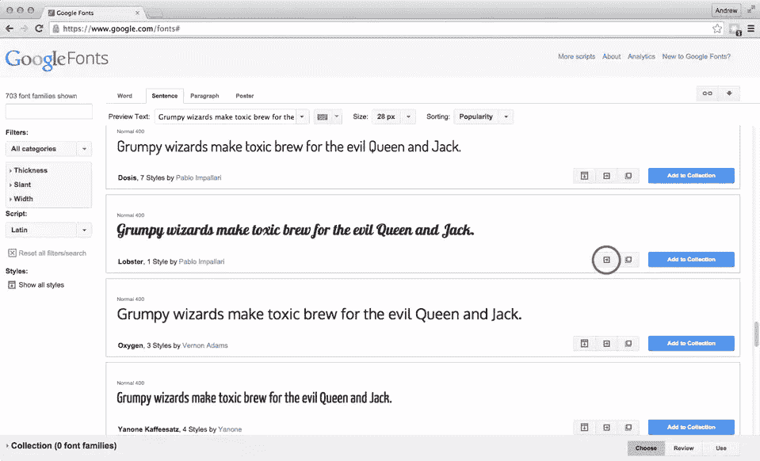

一旦你选择了你的字体，点击快速使用按钮。如果提供，检查所需的重量和样式，以及字符集。

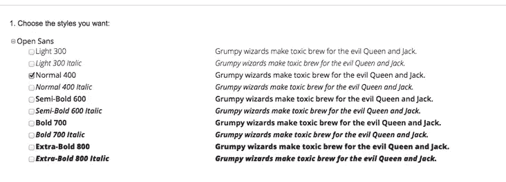

接下来，你需要选择嵌入的方法。最简单的方法是将`@import`规则添加到您想要修改的主题的`style.css`文件中。在`style.css`规则中，将代码放在哪里似乎并不重要。但是，`@import`会阻止任何其他内容下载，直到它完成任务。因此，如果您计划对多种字体使用这种方法，您应该将这些请求合并到一个@import 规则中。

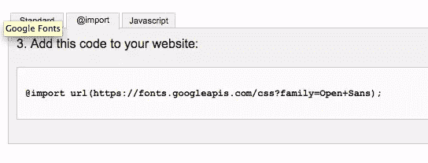

第二种方法同样简单，它使用链接方法，代码包含在标准选项卡上。这次代码被放入`header.php`文件中。将代码放在文件的顶部。然后，您可以将字体名称添加到字体堆栈中。记住将其添加为第一种字体，然后是首选系统字体和备用字体样式。

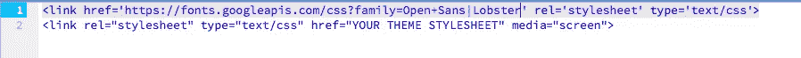

这里值得注意的是 Google Web Fonts 博客声明，如果脚本标签出现在`@font-face`声明之前，那么在字体文件下载完成之前，Internet Explorer 不会显示任何页面内容。因此，如果文件下载失败，Internet Explorer 用户可能会留下一个空白或部分加载的页面。因此，尽可能早地将`@font-face`声明放在文件中。

另一种方法是*在`functions.php`文件中查询*字体。下面显示的函数将加载所需的字体样式和粗细。

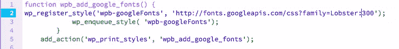

最后，您可以使用 JavaScript 加载字体。有支持和反对使用 JavaScript 的争论，但是关闭 JavaScript 的用户数量非常少。代码被添加到子主题的`header.php`中，放在<头>和</头>标签之间。谷歌再次建议，它应该是第一个元素，这种方式将加载字体，而页面的其他部分加载，这应该避免“无样式文本的闪光”。

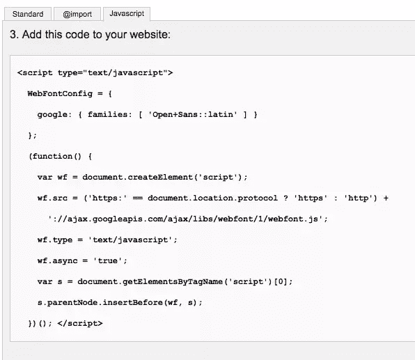

### Adobe Edge Web 字体和类型工具包

将 Adobe Typekit 字体添加到 WordPress 就不那么简单了。虽然你可以使用与谷歌字体相似的方法，但是经验较少的开发者可以使用 WordPress 插件的 Typekit 字体。一旦安装，插件将出现在您的设置菜单。同样，记得在做这些修改之前备份 WordPress。

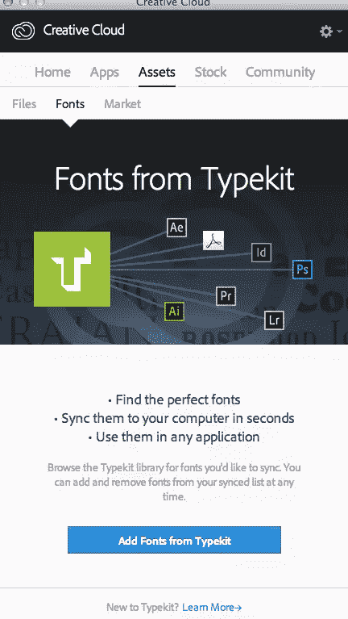

要使用 Typekit，请通过 Creative Cloud 应用程序登录您的帐户。一旦你选择了一种字体，创建一个工具包。给你的工具包取一个名字，然后添加你使用该字体的网站的域名。一旦你输入了你的网站信息，你会得到一段 JavaScript 代码。使用纯文本编辑器(如“文本编辑”或记事本)将它拷贝并存储在文本文件中。

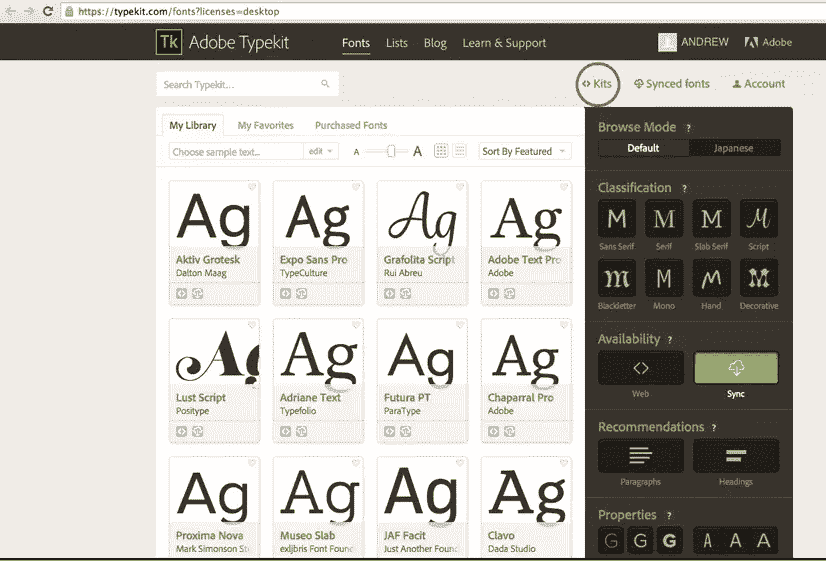

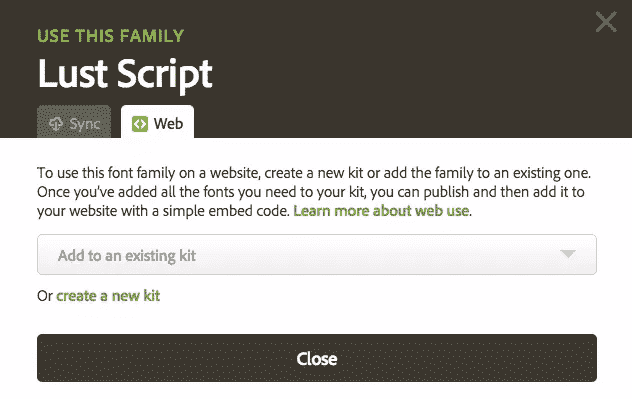

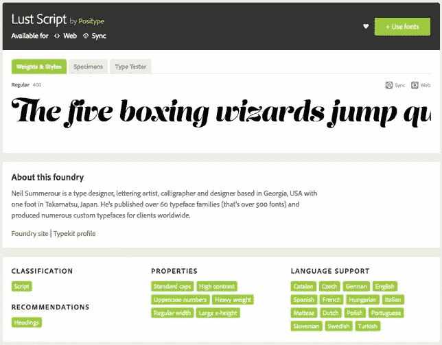

下一步是选择您的字体，将其添加到您的站点工具包，并发布它。添加您希望使用的任何其他字体并发布它们。

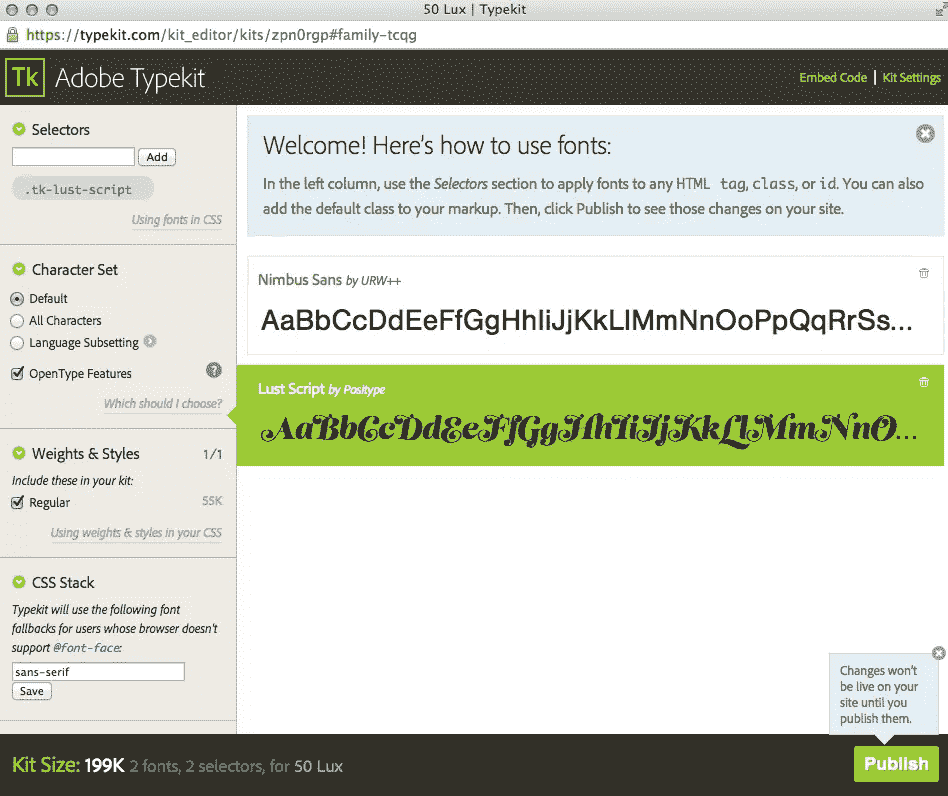

工具包发布后，进入 WordPress 插件的字体工具包。

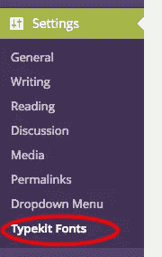

添加您保存在文本文件中的这段代码。

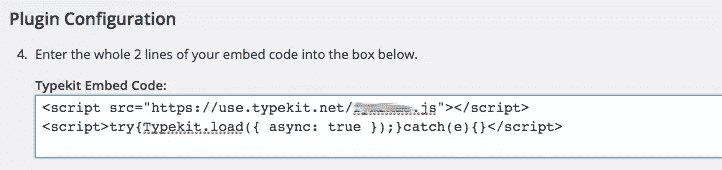

根据需要添加 CSS 代码选择器。在这个例子中，我已经添加了文章标题来显示为`H1`文本(WordPress 页面和文章标题是`H1`文本。).我还添加了副标题，即正文中的`H2`副标题。注意，在命名选择器之前，最好检查一下名称是否已经被主题使用。您可以通过使用浏览器中的开发工具检查元素来实现这一点。不要忘记在每次更改后刷新屏幕，字体可能需要几分钟才能出现在您的网站上。

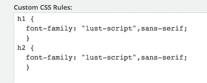

最后，我们还建议您在每次使用字体时都同时指定`font-weight`和`font-style`属性。同样，这有助于您在无数可能的平台上保持对字体显示的控制。

## 结论

在你的网站上添加字体是一种公认的制作吸引人的网站的方法。这也是让一个常用的 WordPress 主题脱颖而出的好方法。

然而，不要因为你能添加大量的字体而受到诱惑——我在高中视觉传达的第一个任务就是数麦片包装上的字体数量(一个玉米片包装上有超过 25 种字体！).字体越少越好，无论从加载速度还是视觉设计的角度来看，将自己限制在两到三种设计通常是最佳实践。

谷歌在弹出窗口中提供了字体配对功能，该按钮位于快速使用按钮旁边，可以帮助你开始使用。图形设计是一门需要多年才能掌握的手艺，但是嵌入一些好的字体将确保你选择的设计能被你的所有用户看到。

## 分享这篇文章