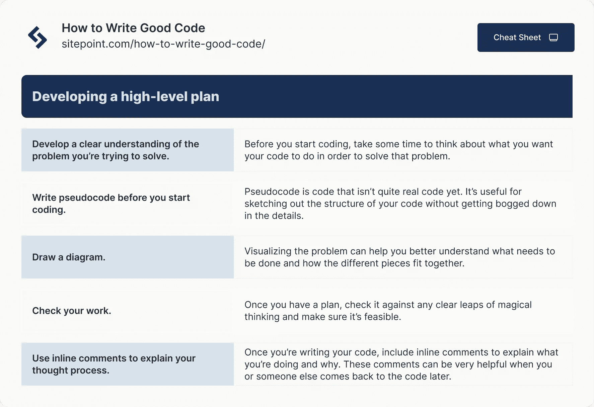
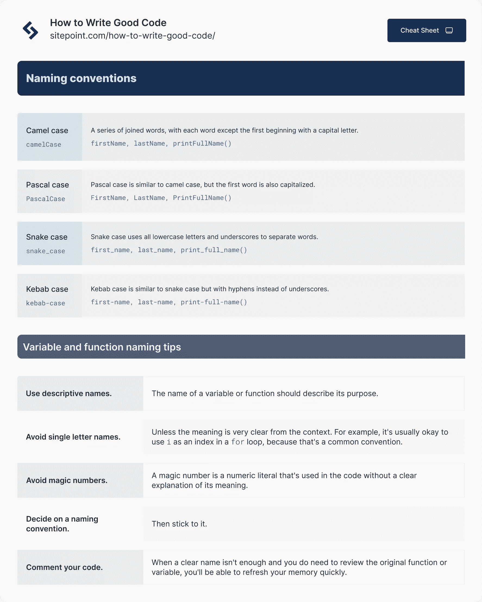

# 如何写好代码:10 个初学者友好的立竿见影的技巧

> 原文：<https://www.sitepoint.com/how-to-write-good-code/>

作为一名初级开发人员，提高您的代码技能可能是您的首要任务之一。但是你从哪里开始呢？有了这么多信息，很难知道哪些技术值得学习，哪些技术实际上会帮助您编写更好的代码。

在这篇博文中，我们将分享 10 个初学者友好的技巧，帮助你马上写出更好的代码。因此，如果你准备好将你的编码技能提升到一个新的水平，请继续阅读！

## 1.从计划开始


编写更好代码的最好方法之一是从计划开始。在开始编码之前，花几分钟时间想想你希望你的代码做什么。

不要因为你认为你知道需要做什么就马上开始写代码。花些时间真正理解手头的问题。

*   什么是输入和输出？
*   预期结果是什么？
*   从一个到另一个的步骤是什么？
*   你需要什么样的数据结构？
*   有没有需要考虑的边缘情况？

在开始编码之前回答这些问题可以帮助你避免在兔子洞里迷失几个小时或几天。它给你一个机会来巩固你对项目将如何工作的心理概念，根据任何明显的神奇思维来验证它，并开发一组测试案例来检查你的工作。

即兴表演可能很有趣(通常也很诱人)，但这种方法不需要束缚你，也不需要占用你几个小时的时间。甚至在你启动你的编辑器之前，花几分钟在纸上画一个草图，都会获得巨大的回报。

对需要做的事情有一个清晰的认识能让你把你的想法变成一个具体的计划。即使你开发的高级程序结构并不完美(让你内心的完美主义者解脱出来——它不会完美的！)，您会发现生成的代码更容易阅读，扩展代码的复杂性也更容易管理。

虽然你的代码会更干净，但你真的会从节省的无数时间中获益最大，如果你确定了一些未知并制定了计划，这些问题本来是可以避免的。这将为解决更高级的问题和发展有益于你和你的职业的技能赢得无数的时间。

### **制定高级计划的技巧**



1.  对你试图解决的问题有一个清晰的理解。
2.  在你开始编码之前，花点时间**想想你希望你的代码做什么**来解决这个问题。
3.  **开始编码前先写伪代码**。伪代码是还不是真正代码的代码。它有助于勾勒出代码的结构，而不会陷入细节中。
4.  **画一张图。**将问题形象化可以帮助你更好地理解需要做什么，以及不同的部分如何组合在一起。
5.  检查你的工作。一旦你有了一个计划，对照任何明显的神奇思维来检查它，确保它是可行的。
6.  **使用行内评论**来解释你的思考过程。一旦你开始写代码，包括行内注释来解释你在做什么和为什么。当您或其他人稍后回到代码时，这些注释会非常有帮助。如果你正在处理一个复杂的问题，而这个问题可能会让其他人感到困惑，这一点尤其正确。

## 2.编写有意义的变量名和函数名

写得好的代码的特征之一是易于阅读和理解。让你的代码易于阅读的一大部分是使用有意义的变量名和函数名。

给事物取个好名字很难。但这很重要，即使是在 web 开发中。当人们试图理解你的代码时，你的变量名和函数名通常是他们首先要看的。

考虑下面的例子:

```
let x, y, z;

function f() { 

// function

}
```

这段代码不太容易读懂。x，y，z 分别代表什么？f()是做什么的？

现在考虑这个例子:

```
let firstName, lastName;

function printFullName(firstName, secondName) { 

// function

}
```

这段代码更容易阅读。变量名是信息性的，函数名让我们很好地了解了它的作用。

在审查代码时，您也更有可能捕捉到错误。当名称是描述性的时，发现错误要容易得多，比如将错误的变量传递给函数。否则，你必须在你的工作记忆中一直保持那个变量的含义。

很容易记住我们为什么定义变量*为*，但是在你定义 *z* 之前，在你的工作记忆中保存密码变得非常快。这成为了一个认知瓶颈，严重限制了你能够管理的复杂程度。

您还应该采用一致的名称格式。当人们在开发中提到命名约定时，他们通常会谈到使用大写和分隔符来增强可读性的方式。

以下是您在开发过程中最常看到的命名约定:

*   **Camel case:** 变量名由一系列连接在一起的单词组成，除了第一个单词以外，每个单词都以大写字母开头。示例:firstName，lastName，printFullName()。骆驼大小写在 JavaScript 中很常见。
*   **帕斯卡大小写:**帕斯卡大小写类似骆驼大小写，但第一个字也是大写。示例:FirstName，LastName，PrintFullName()。
*   **Snake case:** Snake case 使用全部小写字母和下划线来分隔单词。示例:名，姓，名()。
*   **烤肉串大小写:**烤肉串大小写类似于蛇的大小写，但用连字符代替了下划线。示例:名字、姓氏、打印全名()。

一旦你选择了一个命名约定，保持一致并坚持下去是很重要的。

例如，您可能决定对变量名使用 camel case (firstName ),对函数使用 snake case (print_full_name())。在这种情况下，使用不同的约定使得一致性对于可读性尤为重要。你暗示每个命名约定都有一个含义。

如果这种变化是随机的，其他需要解释你的代码的人将不得不放慢速度并且可能会误解它，或者仅仅是不得不放慢速度并且投入更多的精力。

### 书写清晰变量名的技巧



变量名和函数名应该是:

*   描述性的。
*   容易记忆和发音。
*   与代码中的其他名称一致。

为此，您应该:

*   使用描述性名称。变量或函数的名字应该描述它的用途。
*   避免使用单个字母的名字，除非从上下文来看意思非常清楚。例如，在 For 循环中使用 I 作为索引通常是没问题的，因为这是一个常见的约定。
*   避免神奇的数字。幻数是代码中使用的数字文字，没有明确解释其含义。
*   决定一个命名约定，然后坚持下去。
*   像往常一样，注释你的代码。当一个清晰的名字还不够，而你确实需要回顾原来的函数或变量时，你将能够快速地刷新你的记忆。

当你为事物取名字时，问自己以下问题:

*   这个变量或函数是做什么用的？
*   它的名字描述了它的用途吗？
*   我什么时候发音容易记住吗？
*   与代码中的其他名称一致吗？

如果您不能轻松回答所有这些问题，选择不同的名称可能是个好主意。

## 3.编写小型模块化函数


函数是程序员工具箱中最强大的工具之一。它们允许你把一个大问题分解成更小、更容易处理的部分。

较小的函数更容易测试、调试和重用。它们也使你的代码可读性更好，因为每个函数的目的都很清楚。

考虑这个例子:

```
function multiplySquaredNumbers(x, y) {
  let xSquared = x * x;
  let ySquared = y * y;
  return xSquared * ySquared;
}

console.log(multiplySquaredNumbers(5, 6)); // Output: 360
```

如您所见，这个函数有两个参数。它声明变量来管理输入参数平方的结果，以便它们可以被后续行操作。在这里，这发生在返回行上，当这些变量在一个数字被传递回调用者之前被相乘。

还有其他方法可以简化这个函数，你可能已经发现了。这里有一个:

```
function multiplySquaredNumbers(num1, num2) {
    return Math.pow(num1, 2) * Math.pow(num2, 2);
}

console.log(multiplySquaredNumbers(2, 3));
```

但是为了展示模块化代码的实用性，我们将把平方数字的过程外包给它自己的函数。

```
function square(x) {
  return x * x;
}

function multiplySquaredNumbers(x, y) {
  return square(x) * square(y);
}

console.log(multiplySquaredNumbers(5, 6)); // Output: 360
```

乍一看，很难看出这种方法如何帮助我们写出更好的代码。这个例子太简单了(并且依赖于太多的基本操作符),无法减少代码行数。事实上，我们增加了几个。

简洁的代码总是比不必要的冗长代码更受青睐。但是，除非你正在完成一项代码挑战，否则不要以牺牲健壮、可读的代码为代价来实现它。

理解代码模块化并不是对代码中极简主义的苦行僧式追求，这一点很重要。这是关于当问题再次出现时，从你花在解决问题上的时间中获益。

现在，将来任何时候我们想要平方一个数，我们都可以使用我们的模函数来完成这项工作，即使我们再也不需要将两个平方数相乘。我们已经告诉计算机如何做这项工作。我们不妨从中受益！

如果我们采用最初例子中的方法，我们将不得不告诉解释器如何在任何时候对一些数字求平方以进行后续操作。

这是一个简单的例子，但它说明了如何使用函数将一个大问题分解成小问题。

你需要反复解决的问题通常在 web 开发中更复杂。例如，您可能需要显示来自 API 调用的数据列表。这包括获取数据、迭代数据，以及动态创建在页面上显示部分数据的元素。

解决这个问题一次是很好的，但是如果每次进行 API 调用或更新数据列表时都需要这样做，就必须复制大量代码。这将很快变得难以管理，尤其是当需要显示该列表的不同位置的数量增加时。

相反，您可以创建一个函数，该函数获取一些数据并返回在页面上显示这些数据所需的元素。然后，每当您需要创建这些元素时，您可以使用适当的数据调用该函数。这将允许我们保持代码干燥，避免重复。

### 编写模块化函数的技巧

在编写模块化函数时，您可以遵循一些最佳实践:

#### 通过赋予他们单一的职责来保持职能的精简

当你写一个函数时，考虑它应该做什么，并且只让它做这些。

编写一个大型的、包罗万象的函数，一次性完成所有的事情，这很有诱惑力。但是这使得您的代码更难推理，并可能导致错误。

通常最好编写几个小函数，每个函数做一件事。这些更容易测试，更有可能在代码的不同部分重用。

#### **描述您的函数名称**

函数名应该清晰明了，便于描述，以便您(和其他开发人员)在阅读代码时能够容易地理解它们的作用。我们已经讨论了命名，但是这对于在整个代码库中重复使用的函数尤其重要。

#### **避免副作用**

如果一个函数修改了它作用域之外的东西，我们就说它有副作用。例如，将数组作为参数并对数组进行排序的函数会被认为有副作用。

没有副作用的函数叫纯函数。这些通常是首选，因为它们更容易预测。

一直避免副作用可能很难，但是在编写函数时要记住这一点。

#### **明智地使用论据**

当您决定在函数中包含什么参数时，请考虑它们是否真的有必要。

参数通常用于使函数更加灵活，以便在不同的情况下使用。但是太多的参数会使函数难以理解和使用。

通常，包含少量精心挑选的论点比包含大量不太重要的论点要好。

## 4.恰当地使用数据结构

数据结构是组织数据的方式，以便可以有效地使用数据。有许多不同类型的数据结构，但最常见的是数组和对象。

数组是数据列表。它们可以用来存储任何类型的数据，但是数组中的每一项必须具有相同的类型。数组使用方括号声明:

```
 const arr = ['a', 'b', 'c']; 
```

对象是使用键值对组织的数据集合。这些键用于访问值，这些值可以是任何类型的数据。使用花括号声明对象:

```
 const obj = {
  key1: 'value1',
  key2: 'value2',
  key3: 'value3',
}; 
```

应该恰当地使用数据结构，使您的代码更具可读性和效率。例如，如果您有一个需要在页面上显示的数据列表，使用数组比使用对象更合适。这是因为迭代数组并创建显示数据所需的元素会更容易。

另一方面，如果您有一个需要在页面上显示的数据集合，但是每个数据块也有一些关联的元数据，那么使用对象比使用数组更合适。这是因为使用键可以更容易地访问数据和元数据。

## 5.自由地注释你的代码


注释是不执行的代码行，但是开发人员可以在那里为自己或他人留下注释。在 JavaScript 中，注释用//表示单行注释，用/* */表示多行注释:

```
// this is a single-line comment

/*

  this is
  a multi-line
  comment

*/
```

注释是提高代码可读性的好方法。使用注释来解释你的代码在做什么以及你为什么要这么做。

注释很重要，有两个主要原因:它们可以帮助你记住你的代码在做什么，它们可以帮助别人理解你的代码。在编写代码时，养成注释代码的习惯是很重要的。这将帮助您跟踪您的想法，并使其他人更容易理解您的代码。

一个常见的惯例是使用 TODO 注释为自己留下需要完成的事情的注释:

```
// TODO: Implement login functionality
```

另一个常见的约定是使用 FIXME 注释为自己留下关于需要修复的事情的注释:

```
// FIXME: This code is not working properly
```

这是一种跟踪需要做什么的有用方式，也让其他人很容易看到需要做什么。

总的来说，当你不确定某件事应该做什么，或者你认为可能有更好的方法做某事时，留下评论是个好主意。注释通常也用于解释复杂或不明显的代码。

重要的是要记住，注释应该用来提高代码的可读性，而不是让代码更难理解。如果你发现自己写的注释比它所注释的代码还长，那就表明你的代码不可读，应该重构。

### 注释代码的提示

*   使用注释来解释你的代码在做什么以及你为什么要这么做。
*   使用注释为自己留下需要完成或解决的事情的注释。
*   使用注释来解释复杂或不明显的代码。
*   使用注释来增强代码的可读性，而不是作为拐杖。
*   在编写代码时对其进行注释。不要等到以后。
*   不要过度注释你的代码。只评论需要解释的部分。
*   在你的评论中使用清晰简洁的语言。
*   避免使用缩略语或行话。
*   让您的注释与您的代码保持同步。如果你改变你的代码，改变你的注释。
*   删除过时的评论。

## 4.为了可读性，缩进你的代码

缩进代码使其更容易阅读，也有助于发现错误。当您的代码适当缩进时，就更容易看到代码的结构以及每一部分的开始和结束位置。这对于调试代码和查找错误很有帮助。

在 JavaScript 中，标准缩进是两个空格。在 Python 中，标准缩进是四个空格。在 Python 这样的语言中，缩进非常重要，使用错误的缩进会导致代码中断。

但是，即使在 JavaScript 这样的语言中，缩进纯粹是表示的问题，保持缩进的一致性也很重要。不一致的缩进会使代码更难阅读和理解。

缩进代码的主要原因是为了提高可读性。但是缩进代码也可以帮助你发现错误。如果你的代码缩进得合适，就更容易发现什么地方不合适。

例如，看看下面的代码示例:

```
// Unindented code

function printHello() {
console.log("Hello, world!");
}
printHello();

// Indented code

function printHello() {
  console.log("Hello, world!");
}

printHello();
```

在未缩进的代码中，很难看出`console.log()`语句在`printHello()`函数内部。但是在缩进的代码中，很明显`console.log()`语句在`printHello()`函数内部。这使得发现错误变得更容易，比如你忘了加一个花括号。

缩进代码是一个风格问题，但是保持缩进的一致性是很重要的。大多数编程语言都有代码缩进的约定，所以遵循这些约定是个好主意。

一般来说，无论何时开始一个新块，都应该缩进代码。块是一起执行的一段代码。例如，块可以是函数、if 语句或 For 循环。

## 6.使用空白来提高可读性

除了缩进代码之外，还可以使用空格来提高代码的可读性。通过在代码行之间增加额外的间距，可以使代码更容易浏览和理解。当您审查大块代码时，这尤其有用。

就像自然语言中的段落一样，空格本身可以更容易地记录你的阅读位置。但是当空白将相关的代码行组合在一起时，它最能使代码更容易阅读。

在一个函数的结束和下一个函数的开始之间放一个空行是一种常见的做法。

```
function printHello() {
       console.log("Hello, world!");
}

function printWelcome(name) {
      console.log("Hello, " + name);
}
```

您可以在条件语句的子句之间添加一个空行。

```
function printWelcome(name) {

if (name === "John") {
     print("Welcome, John!");
} 

else {
     print("Welcome, stranger!");
}
```

您还可以在声明变量的代码行和使用这些变量的代码行之间添加一个空行。

```
<?php
$name = "John";
$location = "Sydney";

echo "Welcome to $location, $name!";
?>
```

空白和缩进各有各的好处，但是它们共同创建了一个可视化的层次结构，阐明了执行的流程。当您结合使用空白来分组相关的行和缩进来指示范围时，您的代码及其可读性将受益最大。

## 7.使用数组和循环来提高效率

数组和循环是基础但强大的工具，可以帮助你编写更好的代码。如果你已经开始学习编码，你可能已经知道它们了。

通过使用数组，您可以有组织地存储数据。这可以使你的代码更有效，更容易阅读。另一方面，循环可以帮助你自动化重复的任务。

一旦你知道如何正确使用它们，它们可以节省你很多时间和精力。例如，它们通常可以消除对复杂的嵌套条件块的需求。

嵌套的 if 语句很难阅读，因为它们有如此多的代码行，并且在逻辑流中涉及如此多的分支。

下面是一个嵌套 if 语句的示例:

```
if (x > 0) {
  if (x < 10) {
    print("x is between 0 and 10");
  } else {
    print("x is greater than 10");
  }
} else {
  print("x is less than or equal to 0");
}
```

使用数组和循环可以更清楚地表达相同的逻辑:

```
let numbers = [-5, 0, 5, 10, 15];

for (let i = 0; i < numbers.length; i++) {

  let x = numbers;

  if (x > 0 && < 10) {
    console.log(`x is between 0 and 10`);

  } else if  (x > 10) {
    console.log(`x is greater than 10`);

  } else {
    console.log(`x is less than or equal to 0`);
  }
}
```

这段代码更容易阅读，因为它更简洁，逻辑流程也更线性。for 循环遍历数组的元素，if 语句测试每个元素，看它是否满足指定的条件。

这通常更有效，因为它消除了对多个条件测试的需要。

## 8.尽可能编写自我文档化的代码

自文档化代码是易于阅读和理解的代码，不需要注释。这种类型的代码以一种目的明确的方式编写。

这并不能取代好的注释习惯，但是它确实迫使你记住你的高级程序结构。您将生成更容易理解的代码，更容易维护，更不容易出错。

有很多方法可以让你的代码自文档化。我们已经介绍了其中一些:

*   使用清晰和描述性的变量名和函数名。
*   编写做一件事并把它做好的简短函数。
*   通过使用命名常量来避免幻数(没有明显意义的数字)。
*   使用空格将代码分成逻辑块。
*   使用清晰一致的编码约定。这使得您的代码更容易阅读和理解，即使对于不熟悉您的代码库的人也是如此。

以下是使代码自文档化的一些其他方法:

*   避免不必要的代码。这包括死代码(不再使用但没有被删除的代码)和陈述明显事实的注释。
*   编写易于测试的代码。这意味着您的代码应该是模块化的，并具有定义良好的接口。它还应该优雅地以一致的方式处理错误。
*   保持代码库较小。这使得找到您想要的东西和理解代码是如何工作的变得更加容易。
*   保持你的代码组织良好。这意味着使用一致的编码风格和结构，并使用注释来解释复杂的代码。
*   文档很重要，但是自文档化代码更好。它更容易阅读、理解和维护。所以下次你写代码的时候，问问你自己是否可以做些什么来使它更加自文档化。

这些只是一些指导方针。随着您成为一名更有经验的开发人员，您会发现更多的方法使您的代码自文档化。

## 9.不要重复自己(干)

好的编码最重要的原则之一就是干原则:不要重复自己。

这意味着您应该尽可能避免重复代码。重复的代码更难维护，也更容易出错。

有许多工具可以用来避免代码中的重复。

*   **功能和模块。**函数允许你封装你想要重用的代码，这一点我们之前已经讨论过了(当我们第一次提到 DRY 原则的时候)。模块允许您将相关的功能组合在一起。
*   **数据结构。**数据结构可以用来以一种易于访问和修改的方式存储信息。例如，如果您有一个名字列表，您可以将它们存储在一个数组中，而不是将它们硬编码到整个代码的函数调用中。
*   **继承。避免重复的更高级的方法是使用继承。这是一种通过让一个类继承另一个类来共享代码的方法。我们不会在这里详细讨论继承，但可以说它是一个强大的工具，可以帮助您避免重复代码。**
*   **图书馆。**最后，你可以通过使用工具和库来避免重复。有许多开源库可以用来执行常见的任务。例如，lodash 库提供了广泛的实用函数。

DRY 原则是优秀编码最重要的原则之一。尽可能避免重复代码是很重要的。这将节省您的时间，因为您只需解决一次问题，并且当其他因素发生变化时，只需更改解决方案的一个实现。

而且，因为当出现问题时，你只需要*修复*一个实现，干代码更容易维护，更不容易出错。

### 编写枯燥代码的技巧

1.  尽可能重用代码，避免重复。如果您知道您将在代码的其他地方再次做一些事情，那么您可以在第一次将代码编写为一个离散的实体，以避免再次进行重构。
2.  当你重用代码时，模块化它。不要将解决方案复制到新位置。相反，将它移动到适当类型的对象或数据结构中，然后引用它。
3.  当您发现将代码重写为干代码有很大好处时，请重构您的代码。这意味着在不改变代码功能的情况下重新构建代码。重构有时可能是一个拖延陷阱，但是如果你意识到你将再次需要一个大函数的一部分，这是值得做的。
4.  使用库和框架来避免重新发明轮子。如果你不应该重复自己，你为什么要写代码来解决一个已经解决的问题呢？
5.  使用继承在类之间共享代码。
6.  创建文档时遵循干燥原则，不要重复不必要的信息。
7.  使用清晰的变量名和函数名，并在必要的地方注释代码。

## 11.编写可靠的代码

思考如何编写软件的一个流行框架叫做 SOLID。

SOLID 是一个首字母缩写词，引用了五个关键的软件设计原则，是由敏捷软件开发宣言的创始人和干净代码的作者 Robert C. Martin 创造的。

SOLID 的五个设计原则是:

*   **单一责任原则。这个原则声明每个类或模块应该有一个(且只有一个)改变的理由。换句话说，每个类或模块应该只负责一件事。**
*   **开/关原理。这个原则声明软件应该对扩展开放，但对修改关闭。也就是说，您应该能够扩展类或模块的功能，而不必修改代码本身。**
*   **利斯科夫替代原理。这个原则声明子类应该可以替换它们的超类。也就是说，子类应该能够代替它的超类，而不会引起任何问题。**
*   **界面分离原理。**这个原则表明，客户不应该被迫依赖他们不使用的方法。换句话说，每个界面都应该很小，并专注于特定的用途。
*   **依存倒置原则。**这个原则规定，依赖关系应该反转。也就是说，高级模块不应该依赖于低级模块。相反，两者都应该依赖于抽象。

你不需要记住这些原则中的每一条，但是它们是值得注意的。当你开始编写更好的代码时，你可能会发现自己自然而然地遵循了这些原则。

## 12.不要多此一举

好的编码最重要的原则之一是不要重新发明轮子。这意味着您应该尽可能使用现有的库、工具和框架，而不是从头开始编写自己的代码。

遵循这个原则有很多原因。首先，它节省你的时间。你不必写已经写好的代码。其次，它减少了您必须维护的代码量。第三，它增加了其他人找到并修复现有代码中任何错误的机会。

当然，这个规则也有例外。如果你需要一些还不存在的东西，你必须自己创造。但是一般来说，尽可能重用现有代码是最好的。

## 13.使用版本控制系统

版本控制系统是一种工具，它允许您跟踪代码随时间的变化。

这是一种很有用的方法，可以恢复到代码的以前版本，或者查看谁在何时对代码进行了更改。使用版本控制系统也有助于改善协作，因为它允许多人同时在同一个代码库上工作。

有一些不同的版本控制系统，但是最流行的包括 Git 和 Mercurial。

我们建议学习 Git，因为您可以放心地假设您将来加入的大多数团队都会使用它。

GitHub 是一个流行的在线服务，它为 Git 存储库提供了一个基于 web 的接口。它构建在 Git 之上，是当今团队用来协作编写代码的最流行的服务之一。即使作为初学者，你也可能会遇到这种情况。

如果您有兴趣了解更多关于版本控制的信息，我们建议您查看下面的一些资源:

*   [跳跃开始 Git](https://www.sitepoint.com/premium/books/jump-start-git-2nd-edition/) ( [阅读第一章](https://www.sitepoint.com/premium/books/jump-start-git-2nd-edition/read/1/))
*   [探索 Git 工作流](https://www.sitepoint.com/premium/books/exploring-git-workflows/read/1/)
*   [职业饭桶](https://www.sitepoint.com/premium/books/professional-git/read/1/jynz7emd/)
*   [加入团队前你需要知道的 10 个 Git 技巧](https://www.sitepoint.com/git-techniques-to-know-before-you-join-a-team/)
*   [Git 和 GitHub 的区别](https://www.sitepoint.com/screencast-difference-git-github/)
*   [从 GitHub 部署到服务器](https://www.sitepoint.com/deploying-from-github-to-a-server/)

## 结论

编写好的代码对任何开发人员来说都是一项重要的技能，但是需要时间和练习才能掌握。

如果你刚刚开始，这篇文章中的技巧将帮助你马上写出更好的代码。

当你继续提高你的技能时，记住这些提示，必要时参考它们。通过练习，你很快就会写出优秀的代码！

## 分享这篇文章