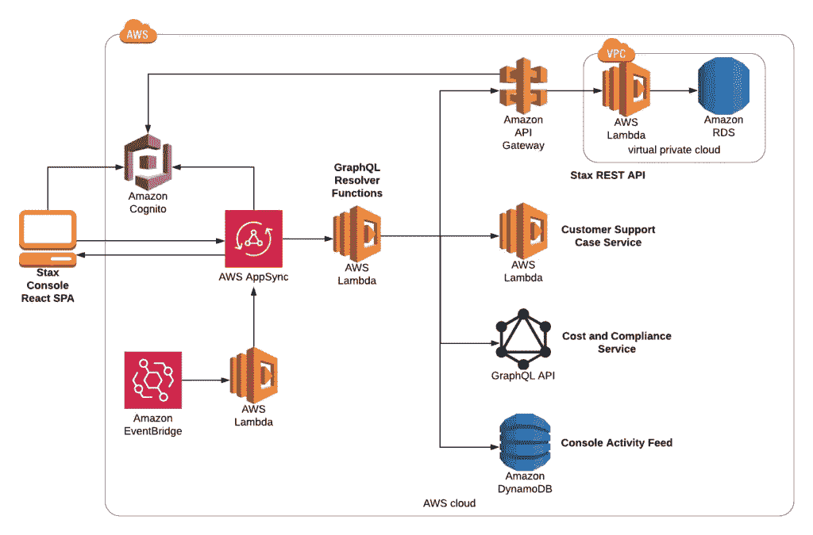

# 我们如何为 Stax 控制台构建无服务器的 Web 应用程序

> 原文：<https://www.sitepoint.com/how-we-built-a-serverless-web-app-for-the-stax-console/>

*这篇文章最初发表在 [Stax 网站](https://www.stax.io/blog/2020-06-19-how-we-built-a-serverless-web-app-for-the-stax-console/?utm_source=sitepoint&utm_medium=blog&utm_campaign=sp-serv-ext&utm_content=blog)上。*

为像 Stax 这样复杂的产品构建 web 控制台面临着许多挑战。我们的 API 优先、无服务器平台为想要管理和优化其 AWS 生态系统的企业提供了各种各样的功能。

有了这样一个以开发人员为中心的基础，我们需要为客户提供一个高性能的、反应式的 web 应用，一个直观的用户体验，而不隐藏我们的 API 的能力和功能。通过我们的控制台进行的数据访问也需要像我们产品的其他部分一样，具有同样高的安全性和合规性标准。

这篇文章将涵盖我们在构建 Stax 控制台时要实现的目标，我们构建无服务器 GraphQL API 来支持它的经验，以及我们在这个过程中所学到的经验。

## 无服务器设计

我们希望从一开始就产生一个无服务器的解决方案，以匹配我们用于产品其余部分的架构。我们在 Stax 上看到的全部采用[无服务器架构](https://www.stax.io/how-it-works/?utm_source=sitepoint&utm_medium=blog&utm_campaign=sp-serv-ext&utm_content=how)的最大好处之一是正常运行时间和可靠性。避免依赖可能成为单点故障的服务器使我们能够满足我们的服务级别协议，并确保客户可以在高峰负载时间访问平台。使用[AWSλ](https://aws.amazon.com/lambda/)意味着来自我们前端的查询可以横向扩展，并且总是有足够的计算资源来处理请求。

使用无服务器产品还可以提高开发过程中的安全性，因为像 AWS Lambda 这样的服务提供了现成的内置合规性和服务级别。允许 Amazon 处理我们代码运行的基础设施的升级和修补，允许我们专注于构建软件，而不是管理硬件。

无服务器时最小的基础设施开销允许我们的团队完全拥有我们的 GraphQL API 的部署和监控。例如，开发人员可以使用单独的 Lambda 函数来添加新的[网络](https://www.stax.io/networks/?utm_source=sitepoint&utm_medium=blog&utm_campaign=sp-serv-ext&utm_content=net)功能，以获取帐户数据，从而最大限度地减少将新更改推向生产的影响范围。

## 早期

我们控制台的第一次迭代有一个相当传统的 web 架构。一个 React 单页应用(SPA)直接调用 Stax REST API，这是一个在关系数据库前使用 [AWS API Gateway](https://aws.amazon.com/api-gateway/) 和 AWS Lambda 的无服务器解决方案。 [AWS Cognito](https://aws.amazon.com/cognito/) 处理控制台和 REST API 的用户认证和登录。

我们在这个方法中遇到了一些技术问题:

1.  **工装**。现代前端框架发展很快。使用 React 从 REST APIs 消费数据很复杂，并且很难管理状态。
2.  **稳定性**。我们的前端 SPA 与后端 REST API 的紧密耦合是高效的，但是系统之间的契约随着功能的发展而不断变化，这有可能破坏我们的用户界面。
3.  **实时更新**。我们需要构建自己的 WebSocket 实现来将数据推送到我们的前端 SPA，以提供实时更新。这在前端和后端都很难实现。

同样显而易见的是，随着 Stax 作为一个产品的发展，控制台需要与 REST API 之外的其他后端服务相集成，例如帐户的成本和合规性数据以及我们的客户支持案例服务。与多个 API 和协议接口，所有这些都有不同的认证机制，这让我们考虑用一个 GraphQL API 实现前端模式的[后端。](https://samnewman.io/patterns/architectural/bff/)

## 我们现在的控制台架构

该架构以一个 graph QL API 层为中心，该层充当我们的前端和后端服务之间的代理。GraphQL 是 API 的查询语言；它允许开发人员定义系统中的数据类型(模式)，并连接函数以从不同的源(解析器)获取数据。可以在单个 GraphQL 查询中扩展数据之间的关系。例如，一个请求可以一次性解决一个 [Stax 工作负载](https://www.stax.io/workloads/?utm_source=sitepoint&utm_medium=blog&utm_campaign=sp-serv-ext&utm_content=work)和部署它的用户。

GraphQL 满足我们需求的一个关键原因是，解析器可以从任何来源获取数据，并作为单一接口呈现给前端。这意味着随着 Stax 的增长，我们可以重构和优化后端服务，而对前端开发人员和客户的影响最小。身份验证也大大简化了。前端在一个地方对我们的 GraphQL API 进行认证，它在后台处理与各种 REST 和 graph QL API 以及事件源的连接。

在 Stax，我们与 AWS 紧密合作，尽可能使用原生 AWS 解决方案作为我们开发理念的一部分。我们选择使用 [AWS AppSync](https://docs.aws.amazon.com/appsync/index.html) ，一个完全托管的无服务器 GraphQL 实现作为我们服务的核心。

AWS AppSync 实现主要的 GraphQL 指令，包括管理客户端和您的 GraphQL API 之间的 WebSocket 连接的 GraphQL 订阅。AWS Lambda 在 GraphQL 解析器函数中获取和转换数据， [AWS DynamoDB](https://aws.amazon.com/dynamodb/) 用于无服务器数据存储， [AWS EventBridge](https://aws.amazon.com/eventbridge/) 触发 Lambda 函数以响应系统事件。

## 用 Stax 制造

Stax 是 API 优先的产品，因此我们利用公开可用的 Stax REST API 来构建大部分客户控制台。消费( [dogfooding](https://en.wikipedia.org/wiki/Eating_your_own_dog_food) ，真的)我们自己的 REST API 意味着我们可以在功能发布给客户之前路测功能并改进我们的文档，作为我们自己的质量控制。拥有一个代理我们后端的 GraphQL API 还允许我们在 Stax REST API 中向客户公开新特性之前将它们引入控制台。我们可以简单地将它连接到 AppSync，并将其作为“测试版”功能添加到控制台中。

我们的 GraphQL API 通过在服务之间共享来自 AWS Cognito 的认证信息来与 Stax 后端进行通信。这可确保在流程的每个步骤中，用户数据都由客户的组织严格隔离，并维护与发起操作的特定用户相关的审计跟踪。为我们的前端提供一个单一的 GraphQL API 还可以让我们实施[基于角色的访问控制](https://en.wikipedia.org/wiki/Role-based_access_control)，这意味着我们可以在查询级别基于用户的角色来实施对用户操作的限制。

AppSync API 还连接到 Stax 事件总线，以侦听后端服务生成的系统事件，如[个人帐户设置步骤](https://www.stax.io/blog/2020-03-12-why-stax-account-automation-matters/?utm_source=sitepoint&utm_medium=blog&utm_campaign=sp-serv-ext&utm_content=auto)完成的状态。我们使用 [GraphQL 订阅](https://docs.aws.amazon.com/appsync/latest/devguide/real-time-data.html)来增强 Stax 事件总线提供的功能，并将更新推送到控制台，而无需客户刷新页面。

## 拥抱局限

在无服务器架构中，身份验证通常会带来挑战，因为用户身份验证信息需要与完成请求所涉及的每个服务或 API 共享。单个 GraphQL 查询可能导致调用多个下游服务——例如，显示网络、部署它的帐户以及创建它的用户。

AWS AppSync 通过使用 AppSync 管道解析器使[抽象身份验证变得容易，但确保对 AWS Cognito 等具有严格速率限制的服务的调用最小化仍然很重要。我们通过将与 Cognito 的交互抽象成一个专用的服务来实现这一点，但是通过缓存还有改进的空间。](https://docs.aws.amazon.com/appsync/latest/devguide/pipeline-resolvers.html)

作为一个相对较新的产品，AWS AppSync 在其 GraphQL 实现中有一些我们必须克服的限制。AppSync 对所有查询施加了严格的 30 秒超时，这意味着需要小心处理具有嵌套关系的大型分页数据列表。AppSync 还允许在处理一对多关系时批处理 Lambda 函数，但目前的批处理限制为 5，这在实践中太低了。部署我们自己的 GraphQL 实现可以让我们避免这些问题，但是使用完全托管的无服务器解决方案的好处超过了这些棘手的问题。

## 后续步骤

我们的 GraphQL API 的未来将专注于通过数据缓存提高性能，并将实时更新扩展到所有 Stax 组件。缓存数据将允许客户管理其 Stax 环境并查看数据，即使下游服务不可用。

随着 Stax 平台的不断发展，我们将继续向我们的控制台添加新功能，以尽可能方便您的组织从单一位置管理其 AWS 生态系统的各个方面。但是，由于我们正在利用无服务器方法，我们不需要分配精力来维护服务器。相反，我们可以专注于为我们的客户构建更令人惊叹的体验，同时保持安全性和合规性，即使平台变得越来越复杂。

如果您有兴趣了解更多关于 Stax 的信息，以及它如何融入贵组织的 AWS 生态系统，[请联系我们，我们将安排一次演示](https://www.stax.io/request-demo/)。

## 分享这篇文章