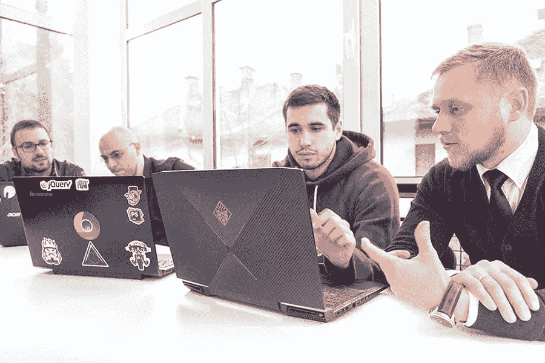
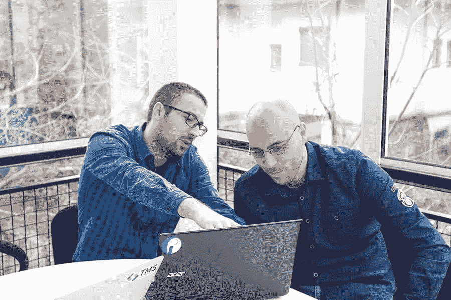
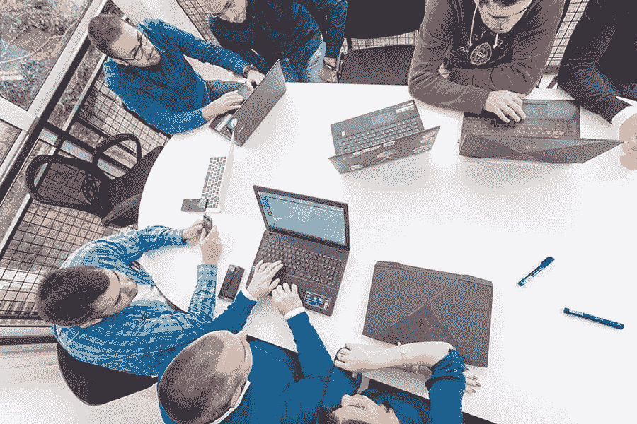

# 我们如何帮助这家金融科技初创公司成为利基领导者

> 原文：<https://www.sitepoint.com/how-we-helped-this-fintech-startup-become-a-niche-leader/>

*这篇赞助文章由我们的内容合作伙伴 [BAW 媒体](https://bawmedia.com?utm_source=sitepoint.com&utm_campaign=oct18&utm_medium=content)创作。感谢您对使 SitePoint 成为可能的合作伙伴的支持。*

在 TMS 这里，我们每天都能看到有前途的公司，他们有着惊人的想法和巨大的潜力。不幸的是，他们经常被技术细节卡住，而求救邮件只是不停地流向我们。

然而，这其实是一件好事。如果我们能帮助他们充分发挥潜力，实现目标，这就是双赢。

我们见过的一些创业公司确实有可以让我们的世界变得更好的想法。因此，我们不是看着他们挣扎，而是在这里尽我们所能帮助他们。

这就给我们带来了一个常见的问题，那就是许多创业公司都陷入了困境；他们的 SaaS 或其他 web 应用程序的技术实现。所以，让我们再多谈谈 [TMS](https://tms-outsource.com/?utm_source=sitepoint.com&utm_campaign=oct18&utm_medium=content) 解决方案。

## 挑战来了

在理论上谈论它是一回事，但在实践中事情往往会完全不同。为了更好地描述我们如何帮助初创公司处理他们的应用程序开发，让我们来看一个案例研究。

四年前，一家英国金融科技公司联系了我们，他们带着一个很棒的想法找到我们，其中包括一个非常复杂的网络应用开发。

从定制设计到多用户角色和复杂的用户流程，我们知道这将是一个复杂的项目。

除此之外，他们需要不断的维护和支持，因为他们在过去已经有过一些令人失望的经历。他们不得不放弃几个未完成的应用，这些应用根本不符合他们的标准，最终他们损失了很多钱。

## TMS 解决方案

为了让事情有一个好的开始，在他们决定联系我们之前，我们必须了解他们的项目出了什么问题。

我们认真听取了他们的意见，以找出他们过去面临的问题的根源。似乎以前的承包商跳过了许多基本步骤，直接进行开发，而没有适当的规划、线框和估计过程。

这听起来是个不错的提议；小时工资低，工作时间少。不幸的是，事实证明，这让这家金融科技初创公司付出了更大的代价。

我们解释说，我们将采取完全不同的方法；一个系统化的、一步一步的过程，每个开发人员专注于他们的部分，同时很好地掌握全局，而不是同时处理项目的多个组件，感觉对交付没有所有权。

由于我们在应用程序开发方面有丰富的经验，尤其是我们为自己的公司(主要是 SaaS)开发的应用程序，我们对自己交付最佳产品的能力非常有信心。

对我们来说，这个项目感觉像一个令人兴奋的挑战，但仍然是我们的拿手好戏。

## 应对挑战

我们之前已经这样做了很多次，但是底线是每个应用都是不同的。

在这个项目中，我们是资本筹集业务领域的新手，我们对 FCA 分类和法律法规等一点都不熟悉。

除此之外的另一个挑战是试图理清之前开发团队的工作。我们被警告了令人困惑的 UX 和在最糟糕的时刻会出现的错误，尤其是在演示中。

所以我们的第一步是建立一个由技术领导和产品负责人领导的团队。这将允许我们创建理想的团队结构、良好的项目架构和合适的项目交付策略。

组建一个可靠的团队最初要比雇佣一群随机的开发人员花费更多的时间——但是它总是有回报的！不仅生产力和质量更好，而且在 12-18 个月的时间里还能降低成本。

对于每个项目，团队都是根据特定的项目需求和要求而不同地组成的。它有时只需要一名项目经理、一名 QA 工程师和两名中级全栈开发人员。有时，我们需要额外的用户界面/UX 设计师，安全工程师，前端工程师等。

## 独特的解决方案:引入我们的全应用生命周期方法

一旦团队成立，我们就准备开始使用我们自己的定制方法—**全应用生命周期方法**。

它基于一个简单的事实:

如果开发团队理解应用程序的大画面，而不是只关注小任务，那么错误就更容易避免。从最初的推介到最后一轮反馈，重要的是每个项目都要有一个核心评估和适当的分析。

我们总是与企业的营销和开发团队交谈，首先获得基本问题的答案:我们用这个产品解决了什么问题？目标客户是谁？竞争对手是谁？我们面临什么风险？预算和时间表是什么？

所有这些问题以及更多的问题都必须在一个好的分析中涵盖，以及影响映射和故事映射会议。在这一点上，我们能够提出最佳的发展战略和产品推广计划。

我们需要在整个过程中保持灵活性，以便能够适应变化，但我们总是从团队结构、软件架构、项目阶段、功能优先级和我们记住的其他小细节的清晰愿景开始。

> “TMS 与我们的团队合作得很好，并在各种情况下代表我们的业务行事。这帮助我们创建了一个世界级的团队，并在国际上共同成长。”

## 金融科技应用开发

开始合作的最佳方式是建立彼此的信任。对于金融科技初创公司，我们知道，在他们之前的经历之后，赢得他们的信任需要一些时间。

他们同意我们的方法，我们决定从两名开发人员开始，与金融科技初创公司提供的项目经理合作开展他们的项目。一旦我们有了一个好的开始，我们增加了其他关键成员，以便在紧迫的期限内完成原型。

我们有一个基于 WordPress 的原型，使用不同的数据库管理插件和大量的 PHP 定制，准备在不到 3 个月的时间里展示给他们的客户。那时，我们已经准备好在后端使用 MVC 框架(Symfony，DoctrineORM)，在前端使用 AngularJS 来构建一个全功能的应用程序。

我们逐渐增加了更多的团队成员，包括 QA 和 QA 自动化工程师、前端开发人员、不同资历的全栈开发人员等等。然后我们将团队分成更小的子团队，每个子团队都有自己的项目经理。

该应用与我们的团队一起成长，我们知道我们走在正确的道路上。当前版本在后端使用 Symfony 4 作为 API 核心，使用教条 ORM 来处理 MySQL 数据库。一些服务在 Node 上运行，以利用 web sockets，Vue.js 在前端作为 web 应用程序 UI，Android 和 iOS 的原生移动应用程序，以及 RabbitMQ 作为消息队列系统。Redis 和 Varnish 用于缓存，故障转移基础设施、备份和监控系统基于 Amazon AWS 服务。

自始至终，我们都参与了整个产品开发，我们的客户知道，即使在今天，他们也可以依靠我们的全力支持。

以下是我们为客户带来的一些最重要的**结果:**

*   在与我们一起工作了几个月后，他们完全腾出时间来扩展他们的业务，只加入我们进行敏捷冲刺评审。
*   使用的地域从英国扩展到欧洲其他地区，而其他市场则“在等待名单上”。
*   客户范围从寻求小额投资的小型创业公司扩大到需要重大投资交易的大型公司。
*   这个成熟的产品吸引了数百万美元的投资。

在我们这边，**致力于这个项目的产品开发团队从 2 人增长到 25 人，并且还在继续增长。**

## 为什么我们的方法有效

我们的全应用生命周期方法已经证明自己相当成功，其主要原因是精心的规划和管理。这些都贯彻在我们的一举一动的整个过程中。

当一个团队是根据一个特定的产品定制的，并且当每个团队成员都致力于他们特定的任务时，所有人最终都会把这个产品看作是他们自己的。它不仅有助于提高生产率和质量，而且还将员工的注意力从费用转移到产品本身。

除此之外，与客户团队和行业的整合、持续的分析和深入的规划也有助于提高质量和交付速度。

需要补充的是，我们的团队总是被鼓励去尝试所有的新技术，跟随最新的发展趋势，去参加会议，去跟上行业的最高标准。

我们在金融科技项目上取得的成功不是一次性的成功，而是一个展示我们的方法如何运作的例子。

我们正在寻找长期的合作伙伴关系，而不是快速断断续续的项目，我们也很高兴加入后期阶段。我们的重点是建立致力于产品的团队，并随着时间的推移与产品一起发展。

## 结论

如果您已经认识到上述任何问题是您自己的问题，包括寻找可靠开发公司的困难，请随时[联系我们](https://tms-outsource.com/contact/?utm_source=sitepoint.com&utm_campaign=oct18&utm_medium=content)，我们将很乐意帮助您找到正确的解决方案。

我们在该领域拥有丰富的经验，我们迄今为止成功完成的项目、我们自己开发的产品的 20，000+付费客户、数百万最终用户以及自 2014 年以来 50%的平均年增长率都证明了这一点。

以下是我们在项目不同部分使用的一些技术:PHP、Symfony framework、JS/ECMA6、AngularJS、React、Vue.js、MySQL、Doctrine ORM、Redis、Varnish、Swift、Java、Node.js、SASS/LESS、PHPUnit、PHPSpec。

除了使用这些技术，我们还应用了这些方法:敏捷 SCRUM，测试驱动开发(TDD)和行为驱动开发(BDD)，领域驱动设计(DDD)。

## 分享这篇文章