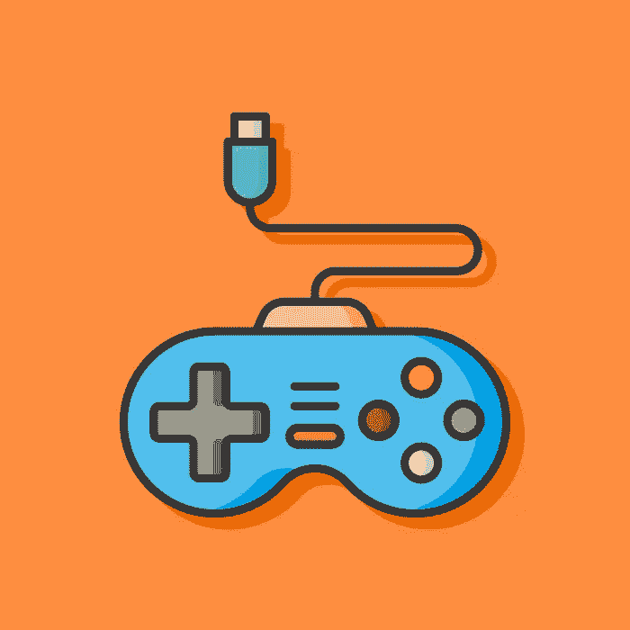
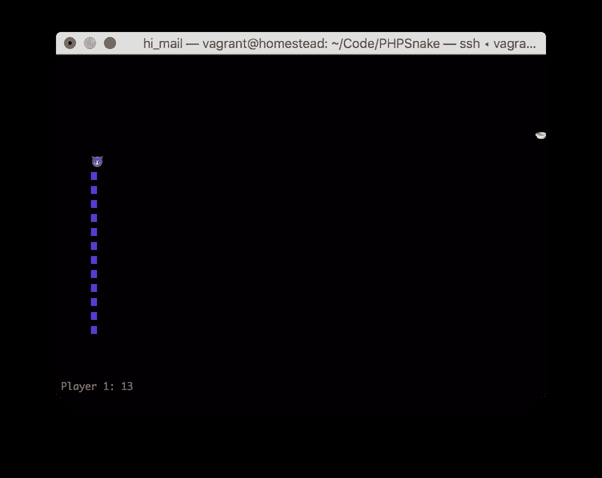
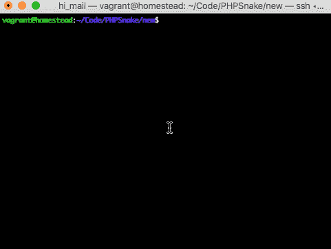
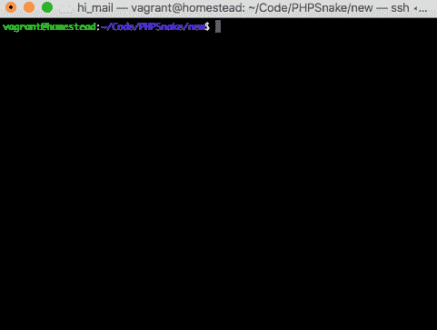

# 他们是怎么做到的？PHPSnake:检测按键

> 原文：<https://www.sitepoint.com/howd-they-do-it-phpsnake-detecting-keypresses/>



在最近的一次会议上，有一个黑客马拉松， [Andrew Carter](https://www.sitepoint.com/author/andrewcarter/) 为其创建了一个 PHP 控制台版本的流行“贪吃蛇”游戏。

我认为这是一个非常有趣的概念，因为 Andrew 有使用 PHP 做奇怪事情的历史，我想我应该揭开神秘的面纱，解释一下是怎么做的。

原始存储库在这里是，但是我们将在本系列中从头开始构建它的一个版本，所以不需要克隆它。



## 先决条件和规则

像往常一样，我将使用我的 [Homestead 改良版](https://www.sitepoint.com/quick-tip-get-homestead-vagrant-vm-running/)盒子立即启动并运行。您可以使用您自己的环境，只要确保它有一个体面的 PHP 版本，可以从命令行运行。

我们正在复制的贪吃蛇游戏有以下特点:

*   一条蛇从屏幕上的一个字符开始，每吃一点食物就会变长一个字符。
*   食物在地图上的任何地方随机产生。
*   在单人模式下，蛇由箭头键控制。
*   在双人模式下，一条蛇由 WSAD 键控制，而另一条由箭头键控制。
*   在单人模式下，墙是障碍物，会造成碰撞。撞墙或撞到自己会结束游戏。
*   在多人游戏模式中，只有你自己的蛇或敌人的蛇是障碍——墙环绕着整个世界。碰撞会将你的蛇的长度重置为 0。100 秒后拥有最长蛇的玩家获胜。
*   它是 CLI，所以不在浏览器中运行，而是在终端窗口中运行

请注意，该游戏不能在原生 Windows 中运行——要在 Windows 平台上运行它，请使用像 [Homestead Improved](https://www.sitepoint.com/quick-tip-get-homestead-vagrant-vm-running/) 这样的好虚拟机。

## 拔靴带

要启动 CLI(控制台)游戏，我们需要一个类似于传统网站中的`index.php`文件的东西——一个“前端控制器”,它读取我们的命令行输入，解析它，然后启动所需的类，就像在传统的 web 应用程序中一样。我们将这个文件称为`play.php`。

```
<?php

$param = ($argc > 1) ? $argv[1] : '';

echo "Hello, you said: " . $param; 
```

好的，如果我们用`php play.php something`启动这个文件，我们会得到:

```
Hello, you said: something 
```

现在让我们在这个前端控制器调用的子文件夹`classes`类中创建一个假的`SnakeGame.php`。

```
// classes/Snake.php

<?php

namespace PHPSnake;

class SnakeGame
{
    public function __construct()
    {
        echo "Hello, I am snake!";
    }
} 
```

让我们也更新前端控制器来加载这个类并调用它:

```
<?php

use PHPSnake\SnakeGame;

require_once 'classes/SnakeGame.php';

$param = ($argc > 1) ? $argv[1] : '';

$snake = new SnakeGame(); 
```

好的，如果我们重新运行`php play.php`，我们应该会看到*蛇形*问候。

## 框架

传统游戏的工作方式是每帧重新检查系统的状态，更高的帧速率意味着更频繁的检查。例如，当渲染屏幕时(单个帧)，系统可以告诉我们按下了字母 A，并且其中一个玩家正在与食物碰撞，因此需要发生蛇生长。所有这些都发生在一个帧中，“FPS”或每秒*帧*就是这个意思——每秒发生多少次这样的系统观测。

为此设计的编程语言具有用于检查状态的内置循环。PHP…没那么多。我们可以解决这个问题，但是让我们一步一步来。让我们像这样修改 Snake 的构造函数:

```
 public function __construct()
    {
        echo "Hello, I am snake!";

        $stdin = fopen('php://stdin', 'r');

        while (1) {
            $key = fgetc($stdin);
            echo $key;
        }
    } 
```

首先，我们打开一个“stdin”流，这意味着我们正在为 PHP 创建一种从命令行获取“标准输入”的方式，将它视为一个文件(因此，`fopen`)。`fgetc`函数用于从文件指针中获取单个字符(相对于`fgets`获取一整行)，然后密钥被打印在屏幕上。这里有`while`循环，所以 PHP 一直等待更多的输入，并且不会在按下一个键后结束脚本。

但是，如果我们尝试运行我们的应用程序，我们会注意到，只有在我们按下 enter 键后，按键才会被回显出来——所以是在新的一行之后。更重要的是，我们写的所有东西都会得到回应。相反，我们想要的是 PHP 在我们按下每一个键的时候都发出回声。

这里有两种方法来实现这一点。

### 斯蒂蒂

第一种方式是通过一个名为 [`stty`](https://linux.die.net/man/1/stty) 的工具，它是*nix 系统上的终端应用自带的(所以没有 Windows，除非你使用的是像 [Homestead Improved](https://www.sitepoint.com/quick-tip-get-homestead-vagrant-vm-running/) 这样的虚拟机)。它用于通过使用标志来修改和配置终端输入和输出——当前缀为`-`时，通常意味着“停用”,反之亦然。

我们想要的是 stty 的旗帜。根据文件:

> 通常，tty 驱动程序会缓冲键入的字符，直到键入换行符或回车符。cbreak 例程禁用行缓冲和擦除/删除字符处理(中断和流控制字符不受影响)，使程序可以立即使用用户输入的字符。

通俗地说，我们不再等待回车键被触发来发送输入。

```
 public function __construct()
    {
        echo "Hello, I am snake!";

        system('stty cbreak');
        $stdin = fopen('php://stdin', 'r');

        while (1) {
            $c = ord(fgetc($stdin));
            echo "Char read: $c\n";
        } 
```

我们调用`system`函数，它基本上充当一个 shell 代理，并将作为参数提供的命令转发给运行 PHP 应用程序的终端。在这之后，用`php play.php`运行应用程序应该可以让你写下字符，并在每次按键后立即回显。

*注意，我们得到的是密钥**代码**，因为我们将字符包装到了`ord`中——这个函数返回给定字符的 ASCII 代码。*


### 读取线回调

第二种方式是通过使用令人惊讶的神秘且未被记录的 [`readline_callback_handler_install`](http://php.net/manual/en/function.readline-callback-handler-install.php) 函数结合 [`stream_select`](http://php.net/manual/en/function.stream-select.php) (也*nix 只是因为`stream_select`调用系统`select`命令，这在 Windows 中是不可用的)。

`readline_callback_handler_install`将一条提示消息作为它的第一个参数(因此，要“问”用户什么)，将一个回调作为第二个参数。在我们的例子中，我们将它保留为一个空函数，因为我们并不真正需要它——我们通过解析 STDIN 来读取字符，STDIN 是一个常量，实际上只是`fopen('php://stdin', 'r');`的快捷方式。这部分的代码如下所示:

```
 public function __construct()
    {
        echo "Hello, I am snake!";

        readline_callback_handler_install('', function() { });
        while (true) {
            $r = array(STDIN);
            $w = NULL;
            $e = NULL;
            $n = stream_select($r, $w, $e, null);
            if ($n) {
                $c = ord(stream_get_contents(STDIN, 1));
                echo "Char read: $c\n";

            }
        }
    } 
```

流选择接受几个流，并在其中任何一个流发生变化时充当事件监听器。假设我们只寻找“读取”(即输入)，我们将其定义为一个数组格式`STDIN`。其他的设置为空，我们不需要它们。由于`stream_select`只接受引用的值，我们不能直接传入 NULL，它们必须预先定义为变量。

`if`块检查`$n`是否为正(`$n`是更新流的数量)，如果是，它从 STDIN 中提取第一个字符*，这是我们的输入按键:*



### 哪个更好？

我更喜欢`stty`方法，因为两者都是*nix only，都调用系统命令，但后者可能更复杂，其效果可能因给定操作系统中的当前终端设置而异。

注意上面两张 gif 的一个重要区别——`stty`方法也在输出键码之前回显被按下的字符。要完全移除所有自动输出并让 PHP 处理所有输出，我们需要另一个`stty`标志:`-echo`。

```
 public function __construct()
    {
        echo "Hello, I am snake!";

        system('stty cbreak -echo');
        $stdin = fopen('php://stdin', 'r');

        while (1) {
            $c = ord(fgetc($stdin));
            echo "Char read: $c\n";
        }

    } 
```

根据[文件](https://tldrify.com/kj5)，`-echo`禁用输入字符输出。

## 将蛇映射到方向

不言而喻，我们需要一种方法来告诉每条蛇向哪个方向移动。首先，让我们在`Snake.php`中创建一个新的`Snake`类来表示一个玩家的实例并保存他们的状态。

```
<?php

namespace PHPSnake;

class Snake
{

    /** @var string */
    private $name;

    /** @var string */
    private $direction;

    /** @var int */
    private $size = 0;

    const DIRECTIONS = ['UP', 'DOWN', 'LEFT', 'RIGHT'];

    public function __construct(string $name = null)
    {
        if ($name === null) {
            $this->name = $this->generateRandomName();
        } else {
            $this->name = $name;
        }
    }

    public function getName() : string
    {
        return $this->name;
    }

    public function setDirection(string $direction) : Snake
    {
        $direction = strtoupper($direction);
        if (!in_array($direction, Snake::DIRECTIONS)) {
            throw new \InvalidArgumentException(
                'Invalid direction. Up, down, left, and right supported!'
            );
        }
        $this->direction = $direction;
        echo $this->name.' is going '.$direction."\n";

        return $this;
    }

    private function generateRandomName(int $length = 6) : string
    {
        $length = ($length > 3) ? $length : 6;
        $name = '';

        $consonants = 'bcdfghklmnpqrstvwxyz';
        $vowels = 'aeiou';

        for ($i = 0; $i < $length; $i++) {
            if ($i % 2 == 0) {
                $name .= $consonants[rand(0, strlen($consonants)-1)];
            } else {
                $name .= $vowels[rand(0, strlen($vowels)-1)];
            }
        }

        return ucfirst($name);
    }
} 
```

在实例化时，蛇被赋予一个名称。如果没有提供，一个简单的函数会随机生成一个。实例化时方向为空，可以传入的方向受类的`DIRECTIONS`常量限制。

接下来，我们将更新我们的`SnakeGame`类。

```
<?php

namespace PHPSnake;

class SnakeGame
{

    /** @var array */
    private $snakes = [];

    public function __construct()
    {

    }

    /**
     * Adds a snake to the game
     * @param Snake $s
     * @return SnakeGame
     */
    public function addSnake(Snake $s) : SnakeGame
    {
        $this->snakes[] = $s;
        return $this;
    }

    /**
     * Runs the game
     */
    public function run() : void
    {
        if (count($this->snakes) < 1) {
            throw new \Exception('Too few players!');
        }
        system('stty cbreak -echo');

        $stdin = fopen('php://stdin', 'r');

        while (1) {
            $c = ord(fgetc($stdin));
            echo "Char read: $c\n";
        }
    }
} 
```

这将按键观察逻辑移动到一个运行函数中，我们通过`addSnake`将必要的蛇添加到游戏中后调用这个函数。

最后，我们可以更新 frontcontroller 来使用这些更新的类。

```
<?php

use PHPSnake\Snake;
use PHPSnake\SnakeGame;

require_once 'classes/Snake.php';
require_once 'classes/SnakeGame.php';

$param = ($argc > 1) ? $argv[1] : '';

$game = new SnakeGame();
$game->addSnake(new Snake());
$game->run(); 
```

现在事情变得更有条理了！最后，让我们绘制蛇的方向图。

我们将为每个玩家定制键映射，根据我们包含的玩家数量，我们将加载多少映射。这种方式比长开关块简单得多。让我们将`$mappings`属性添加到我们的`SnakeGame`类中:

```
 /**
     * Key mappings
     * @var array
     */
    private $mappings = [
        [
            65 => 'up',
            66 => 'down',
            68 => 'left',
            67 => 'right',
            56 => 'up',
            50 => 'down',
            52 => 'left',
            54 => 'right',
        ],
        [
            119 => 'up',
            115 => 'down',
            97 => 'left',
            100 => 'right',
        ],

    ]; 
```

每个数组对应一个玩家/蛇。主播放器可以通过光标键或相应的数字小键盘来控制。玩家二只能通过 WSAD 键来控制。您可以看到这使得为其他玩家添加新的映射变得多么容易。

然后，让我们更新一下`run`方法:

```
 /**
     * Runs the game
     */
    public function run() : void
    {
        if (count($this->snakes) < 1) {
            throw new \Exception('Too few players!');
        }

        $mappings = [];
        foreach ($this->snakes as $i => $snake) {
            foreach ($this->mappings[$i] as $key => $dir) {
                $mappings[$key] = [$dir, $i];
            }
        }

        system('stty cbreak -echo');

        $stdin = fopen('php://stdin', 'r');

        while (1) {
            $c = ord(fgetc($stdin));
            echo "Char read: $c\n";

            if (isset($mappings[$c])) {
                $mapping = $mappings[$c];
                $this->snakes[$mapping[1]]->setDirection($mapping[0]);
            }

        }
    } 
```

run 方法现在加载与 snake 一样多的映射，并对它们进行重新排序，这样 keycode 就是映射数组的键，而 direction 和 snake index 是一个子数组——这使得以后只需单行更改方向就非常容易了。如果我们现在运行游戏(我更新了`play.php`添加了两条蛇)，我们会注意到按下随机键只会产生键码，而按下 WSAD 或光标键会输出蛇的名字和按键后蛇移动的方向:



我们现在有了一个非常好的游戏基础来监控按键并对其做出反应。

## 结论

在本教程中，我们看了 PHP CLI 应用程序中的按键输入游戏循环。在第二部分中，PHP 的这种非传统用法将变得更加奇怪，我们将处理渲染玩家、运动、边界和碰撞。

同时，你对如何进一步提高抓取按键有什么想法吗？请在评论中告诉我们！

## 分享这篇文章