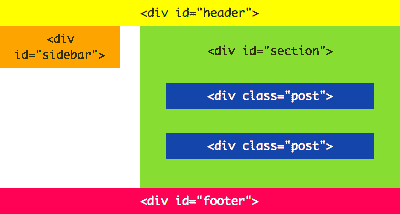
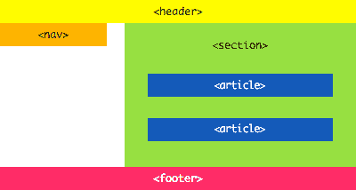
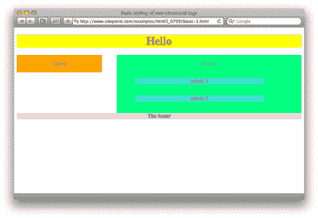
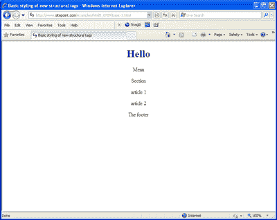
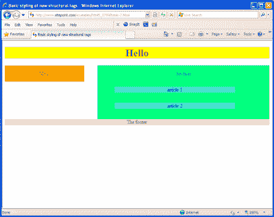
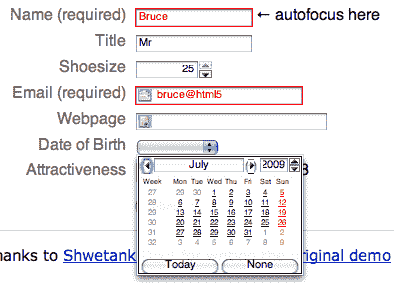

# 可以，今天就可以用 HTML 5 了！

> 原文：<https://www.sitepoint.com/html-5-snapshot-2009/>

当谷歌展示其新服务 Google Wave 的预览版时，博客圈一片兴奋。只有少数人拥有账户，但 YouTube 上有一个 80 分钟的视频供我们其他人使用。这项服务是一款 HTML 5 应用，因此 HTML 5 已经从一个遥不可及的话题变成了今天的热门话题。

自从我的同事拉克伦·亨特在 2007 年发表了一篇名为《名单之外》的文章，HTML 5 的前景发生了很多变化。让我们看看 HTML 5 的世界正在发生什么。

### 这是什么？

对一些人来说，这是浏览器制造商将他们想要的东西强加给开发者的无耻尝试。在 SitePoint 的 HTML 5 中:现在还是永远？文章，汤米·奥尔森将其描述为“令人憎恶的……它嘲弄了我认为在网络上重要的一切。”其他人认为它是在开放架构上开发强大的多媒体 web 应用程序的前进方向，不需要 Flash 或 Silverlight 或类似的专有技术。Doug Schepers，W3C SVG 和 Web Apps 工作组的团队联系人[说，](http://schepers.cc/?p=133)“HTML 5 不是一项技术成就，它是一场社会运动。”

意见如此分歧的原因是 HTML 5 不像 HTML 4 那样仅仅是文档的标记语法。一个线索是在工作组被纳入 W3C 阵营之前的原名:Web 超文本应用技术工作组。HTML 5 最初的目标是让开发 Web 应用程序变得更容易。大量新的 JavaScript APIs 和对离线开发的支持就证明了这一点，其中一些已经可以在你身边的浏览器中使用。

### 利润

今天，我们将从思考如何标记一个典型的博客开始。像绝大多数网站一样，博客包括一个标题、一些导航(通常是一两个侧边栏)、一个主要内容区和一个页脚:



目前，HTML 4 中没有办法以语义的方式标记这些元素——也就是说，HTML 4 没有提供自己的页脚或页眉元素。相反，它们通常被包装在一个通用的`div`元素中，这是一种在 HTML 4 规范中描述的技术[:](https://www.w3.org/TR/html4/struct/global.html#h-7.5.4)

> `DIV`和`SPAN`元素，与`id`和`class`属性一起，提供了一种通用的机制来为文档添加结构。这些元素将内容定义为内联(`SPAN`)或块级(`DIV`)，但没有对内容强加其他表示习惯用法。因此，作者可以结合样式表、`lang`属性等使用这些元素。，根据自己的需求和口味来定制 HTML。

在开发 HTML 5 规范时，编辑，谷歌的伊恩·希克森[分析了超过 10 亿个网页](http://code.google.com/webstats/2005-12/classes.html)来找出作者实际上是如何使用这些元素的。他发现，在这个庞大数据集的标记中使用的前 20 个类名中，都是常见需求的类:`footer`、`header`、`nav`、`menu`、`content`和`main`。

因此，HTML 5 规范有许多新的结构化标签，如`header`、`footer`、`nav`、`article`和`section`，它们符合这些常见要求，并允许我们用更有意义的元素来标记我们的原型博客，如下所示:



真正有趣的是，我们现在就可以使用 HTML 5 元素，尽管主流浏览器还不支持 HTML 5，因为 CSS 允许你对任何东西进行样式化。

默认情况下，CSS 假设元素是内联的。对于像 DIV 这样的 HTML 4 元素，浏览器自己的默认样式表会覆盖这个默认样式表，但是对于我们的 HTML 5 元素，我们需要手动完成。下面的 CSS 规则可以解决这个问题:

```
header, footer, nav, section, article {
display:block;
}
```

然后我们可以添加样式规则——浮动、背景颜色、边距。我举了一个例子。[我们来看看吧！](https://www.sitepoint.com/examples/html5_0709/basic-1.html)

根据你使用的浏览器，你会看到一个彩色的布局，或者没有任何样式。它应该是这样的，就像在 Safari 4 中看到的那样:



目前在 Firefox 2 和 Camino 中使用的 Gecko 渲染引擎的旧版本有一个解析错误，这意味着 Gecko 在看到像`p`、`h1`或`div`这样的块级元素的开始标签时会关闭一个未知元素。[有解决办法，](http://remysharp.com/2009/04/14/html5-and-firefox2/)但是随着 Firefox 3 的发布，Camino 2 处于测试阶段，这两种浏览器的用户都倾向于快速升级，可以肯定的是，当你开始为现实世界构建 HTML 5 网站时，这个问题将成为历史。

我们的老朋友 Internet Explorer 有一个更严重的问题。它拒绝显示这个基本的 CSS，直到你用一根尖尖的 JavaScript 形状的棍子戳它。是的，你没听错——你需要一些 JavaScript 来使 CSS 样式成为你的 HTML。在这一页中，我们会发现我们需要做些什么来使 HTML 5 元素在 IE 8 中工作。

以下是 IE 8 目前如何显示我们的示例:



我们希望 IE 承认这些元素的存在。在页面顶部，我们需要添加以下 JavaScript，它只是一系列 document.createElement 语句:

```
<!--[if IE]>
<script>
document.createElement("header");
document.createElement("footer");
document.createElement("nav");
document.createElement("article");
document.createElement("section");
</script>
<![endif]-->
```

我用一个条件注释把它包围起来，所以其他浏览器可以忽略只有 IE 的代码。现在，你瞧，你在 IE 中的页面风格–[如果你正在使用 IE，你可以在这里看到固定的例子。](https://www.sitepoint.com/examples/html5_0709/basic-2.html)



当然，这种变通方法只有在使用 IE 的访问者打开了 JavaScript 时才有帮助，但是对于一个成熟的 HTML 5 应用程序来说，如果关闭了 JavaScript，整个站点就不太可能工作。

让我们更详细地看看这些结构标签的用途，并认识一些新的结构标签。

### `header`和`footer`

奇怪的是,`header`是我们的标题新元素。使用该元素的自然位置是网站顶部的主横幅，但是一个页面当然可以包含多个`header`。你会注意到在我们的初级博客文章中有多篇文章；每一个都可以有另一个标题，包含文章的标题、署名和日期。

同样的道理也适用于`footer`。在整个页面的底部有一个`footer`,但是在每篇文章的底部也有一个`footer`,列出了文章所在的类别以及有多少评论。所以每篇文章都被标记如下:

```
<article>
<header>
<h1>Header for article 2</h1>
<p>Posted 14 June 2009</p>
</header>
<p>article 2</p>
<footer>Posted in the "trains" category by Thomas T. Tang-Kenjin</footer>
</article>
```

这是完全有效的 HTML 5: [关于页脚的主题，规范说](http://www.whatwg.org/specs/web-apps/current-work/multipage/semantics.html#the-footer-element)“`footer`元素表示它所应用的节的页脚”，还有:“页脚不一定要出现在节的末尾，尽管它们通常会出现。”查看我们示例的源代码并验证它。附加的页眉和页脚可以很容易地用简单的派生选择器——`article header`和`article footer`来设计。[我们的第三个例子](https://www.sitepoint.com/examples/html5_0709/multi-header-footers.html)展示了一个有两个条目的博客，每个条目都有自己的`header`和`footer`元素。

有一个新提议的将标题和副标题组合在一起的元素——`hgroup`——看起来像这样:

```
<header>
<hgroup>
<h1>HTML 5</h1>
<h2>The mark-up language for fun and profit</h2>
</hgroup>
</header>
```

对我来说，`hgroup`元素不太可能通过规范的各种修订，我很难在这个例子中找到它的真实用例。

### `nav`

`nav`用来表示导航区域。一个页面中可以有多个`nav`元素，就像一个网页上可以有主次`nav`一样，没有必要把每组链接都放入`nav`元素中。正如说明书所说:

> “并不是页面上的所有链接组都需要出现在导航元素中——只有包含主要导航块的部分才适合使用导航元素。”

我认为这写得含糊不清；我认为它应该说的是“只有由主要目的是围绕网站导航的块组成的部分才是合适的”，这样才能将赞助商或广告商的链接列表与网站导航区分开来。

如果您愿意，可以在`header`元素中包含主导航，但这是可选的。就像现在一样，导航通常被标记为一个无序的链接列表，或者在面包屑路径的情况下，被标记为一个有序列表。

### `article`

`article`代表您内容的独立部分。[根据规范，](http://www.whatwg.org/specs/web-apps/current-work/multipage/semantics.html#the-article-element)`article`可以是“论坛帖子、杂志或报纸文章、网络日志条目、用户提交的评论或任何其他独立的内容。”

从博客的角度来看，特别有趣的是，用户提交的评论也是一篇文章，所以您可以将每个评论嵌套在帖子的`article`元素中。说明书还说:

> 当文章元素嵌套时，内部文章元素表示原则上与外部文章的内容相关的文章。例如，接受用户提交的评论的站点上的 Web 日志条目可以将评论表示为嵌套在 Web 日志条目的 article 元素内的 article 元素。

下面是一篇带有两条评论的文章的标记:

```
<article>
<header><h1>Header for article 2</h1>
<p>Posted 14 June 2009</p>
</header>
<p>article 2</p>
<article>
<p>Comment 1</p>
</article>
<article>
<p>Comment 2</p>
</article>
<footer>Posted in the "trains" category by Thomas T. Tang-Kenjin</footer>
</article>
```

我们的第四个例子显示了博客条目中的评论。

### `aside`

我们将`aside`排除在基本示例之外。这是一个有用但令人困惑的野兽:我看到人们认为这是标记侧边栏的方式，侧边栏在网页上通常是导航菜单，因此最好用`nav`标记。

关于`aside`、[的话题，说明书上说:](http://www.whatwg.org/specs/web-apps/current-work/multipage/semantics.html#the-aside-element)

> “`aside`元素表示页面的一部分，该部分由与 side 元素周围的内容无关的内容组成，并且可以被视为与该内容分离。在印刷字体中，这种部分通常被表示为侧栏……这种元素也可以用于印刷效果，如引用。

### `figure`和`legend`

`figure`元素通常用于包装图片和标题，称为`legend`，因此将它们关联起来。[说明书上说可能是:](http://www.whatwg.org/specs/web-apps/current-work/multipage/embedded-content-0.html#the-figure-element)

> …用于注释插图、图表、照片、代码清单等，它们是从文档的主要内容中引用的，但可以在不影响文档流程的情况下从主要内容中移出，例如移到页面的侧面、专用页面或附录。

让我们来看一个例子:

```
<figure>

<legend>Bruce Lawson, a sort of modern-day Clark Gable
<small>Photo copyright Bruce's mum, all rights reserved</small>
</legend>
</figure>
```

你会注意到我也使用了`small`元素——与 HTML 4 不同，这是[定义的](http://www.whatwg.org/specs/web-apps/current-work/multipage/text-level-semantics.html#the-small-element),作为一种表示“描述免责声明、警告、法律限制或版权的法律术语”的方式。小字有时也用于归属。”在其他情况下，`figure`非常接近于`aside`元素——在我看来太接近了。

### `section`

如果上面没有更合适的结构标签，那么`section`元素会分割页面。然而，它不仅仅是另一种类型的`div`——section 在内容上强加了一种层次结构。在一个纯 HTML 5 的世界里，你只需要使用`h1`(为了向后兼容)，大纲算法会根据页面各部分的上下文计算出标题级别。

所以:

`<body><h1>`是标题 1
是标题 2
`<body> ... <section><section><h1>`是标题 3，以此类推。

通过这种方式，您可以拥有六个以上的标题级别。然而，现在最好继续使用`h1`–`h6`，如果您愿意，也可以使用部分。屏幕阅读器等辅助技术还没有跟上新的大纲算法，适当的标题层次对盲人用户导航页面至关重要。

### 面向 Web 应用开发者的新特性

随着 HTML 5 对 web 应用程序开发的重视，有许多新特性可供开发人员使用，其中一些我们今天就可以使用:

*   一个 2D 绘图 API，使用新的`canvas`元素编写图形脚本，除了 Internet Explorer 之外，所有主流浏览器都支持它。
*   `registerProtocolHandler`和`registerContentHandler`，它们允许 web 应用程序注册某些协议或 MIME 类型。两者在 Firefox 中都有。
*   一种支持离线 web 应用程序的清单缓存机制，在 Firefox 和 Safari 中可用。
*   视频和音频 API。大多数 API 都可以在 Firefox、Opera(实验版)和 Safari 上运行——尽管 Safari 只使用苹果的专有软件。mov 格式，而不是 Firefox 和 Opera 支持的开源 Ogg 格式。
*   `window.postMessage`:在所有主流浏览器中实现跨文档信息传递。
*   在 Ajax 应用程序中实现更好的后退按钮支持。(还没有实现，但是 IE8 支持`window.onhashchange`。)
*   Firefox 3.5 中支持的带有`draggable`属性的拖放 API。
*   一个编辑 API，挂钩到任何元素上允许的`contenteditable`属性，已经在所有主流浏览器中。
*   使用键/值对的客户端持久存储和对嵌入式 SQL 数据库的支持:键/值对存在于 Firefox、Safari 和 IE8 中，而 SQL 目前仅在 Safari 中受支持。

(请注意，浏览器正在快速增加支持——这是 2009 年 6 月的快照。预计它会逐月变化。)

### 形式

HTML 5 中一个令人兴奋的发展是在 Web 表单领域。由于篇幅原因，我们无法详细介绍表单。然而，如果你使用的是 Opera 9.6，[看看我的表单演示](https://www.sitepoint.com/examples/html5_0709/html5-forms-demo.html)——Opera 是目前唯一一个完全支持的浏览器——看看浏览器如何验证必填字段、数据类型，如电子邮件、URL 和任何没有 JavaScript 的模式。您还会看到，浏览器现在可以提供一个日期选择日历，并针对一个字段设置自动聚焦。一定要查看源代码，看看它是如何组合在一起的。当引入对这些元素的更广泛支持时，我们也将能够开始使用这些元素。



### 参与其中——让你的名字出现在聚光灯下！

希望这篇简短的文章已经向您展示了 HTML 5 的足够多的结构方面，证明现在开始考虑它是好的；就在我们说话的时候，它正被添加到浏览器中使用。当然，目前它主要用于个人网站，但这就是纯 CSS 布局开始的方式，现在它们成为了主流。像`article`或`nav`这样的结构元素现在就可以使用，随着浏览器不断增加对更多功能的支持，现在是开始使用 HTML 5 的好机会。

如果你想参与更多，还有时间——试着利用它，并通过 WHAT-WG 邮件列表向规范小组[提供反馈。编辑伊恩·希克森呼吁人们](http://www.whatwg.org/mailing-list)[审查说明书](http://blog.whatwg.org/help-us-review-html5)，寻找令人困惑的条目、错别字和其他小问题。如果你找到一个，你会在致谢中被提到。有很多事情要做，所以开始吧！

## 分享这篇文章