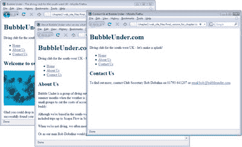
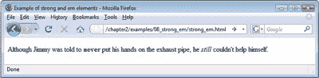

# 学习 HTML 和 CSS:绝对初学者指南

> 原文：<https://www.sitepoint.com/html-css-beginners-guide-10/>

## 分割页面

我们在虚构的网站上取得了良好的进展…但是当一个网站只包含一个页面时，它真的是一个网站吗？正如问题“你能有一个只有一个词的句子吗？”可以用一句话来回答(“是”)，关于我们的单页网站的问题也是如此。但是你买这本书不是为了学习如何创建一个单页网站，对吗？

让我们来看看如何将我们正在处理的页面分割成独立的实体，以及这些页面如何相互关联。

首先，让我们在继续之前确保你的页面状态良好。页面应该反映上一节中最后一个大块中显示的标记(在我们添加了`
`标签之后)。如果没有，就去代码归档并获取包含`div` s ( `/chapter2/website_files/06_adding_structure_with_divs/index.html`)的版本。将其作为`index.html`保存在您网站的文件夹中(如果您看到询问您是否要覆盖现有文件的提示，请单击“是”)。

文件准备好了吗？让我们把它分成三页。首先，制作该文件的两份副本:

*   在 Windows 资源管理器或 Finder 中点击`index.html`图标。
*   要复制文件，请选择编辑>复制。
*   要在同一位置粘贴副本，请选择编辑>粘贴。
*   再次重复该过程。

现在，保存网站文件的文件夹中应该有三个 HTML 文件。`index.html`文件应该暂时保持原样，但是花点时间将另外两个文件只用小写字母重命名。依次选择每个文件，选择文件>重命名，如果你使用的是 WindowsMac 用户只需点击选择文件，然后按下**回车键**编辑文件名。

*   将一个文件重命名为`contact.html`。
*   将另一个重命名为`about.html`。

提示:我的文件扩展名在哪里？

*如果您的文件名在 Windows 资源管理器中显示为`index`，则您的系统当前设置为隐藏 Windows 识别的文件扩展名。要使扩展可见，请遵循以下简单步骤:*

1.  *启动 Windows 资源管理器。*
2.  *Vista 用户，选择**整理>文件夹和搜索选项……**；Windows XP 用户，选择**工具>文件夹选项……***
3.  *选择**视图**选项卡。*
4.  *在**高级设置**组中，确保**隐藏已知文件类型的扩展名**旁边没有打勾。*

我们有三个相同的 XHTML 页面副本。现在，我们需要编辑这些页面的内容，以便每个页面只包含与该页面相关的内容。

要在记事本中打开现有文件，选择**文件>打开…** ，在出现的窗口中，将类型的**文件更改为**所有文件**。现在，当你进入你的 **Web** 文件夹时，你会看到该文件夹中的所有文件都可以打开。**

在“文本编辑”中打开文件也是类似的过程。选择**文件>打开…** 打开一个文件，但确保勾选了**忽略富文本命令**。

在文本编辑器中，依次打开每个页面，并按如下方式编辑它们(记得在打开下一个文件之前保存对每个页面的更改):

**T2`index.html`**

删除“关于我们”和“联系我们”部分(包括标题和后面的段落)，确保标记的其余部分保持不变。注意不要删除包含正文内容的`
`和`
`标签。

**T2`about.html`**

删除介绍性文字(二级标题和相关段落，包括图片)，并删除“联系我们”部分(包括标题和段落)。

**T2`contact.html`**

你现在应该已经找到窍门了。这一次，我们删除了介绍性的说教和“关于我们”的部分。(如果您不确定自己是否理解正确，请继续阅读:我们稍后将展示修改后的标记。)

现在，这三个文件中的每一个都包含适合其各自文件名的内容，但是需要对这两个新创建的文件进行进一步的更改。在文本编辑器中打开`about.html`,进行以下修改:

*   将`title`元素的内容改为“关于 BubbleUnder.com:我们是谁；这个网站是做什么的。”
*   将三级航向`<h3>About Us</h3>`改为二级航向。在编辑原始主页的过程中，我们丢失了一个标题级别。以前，“关于我们”和“联系我们”标题被标记为三级标题，位于二级“欢迎”标题之下。跳过标题级别并不是一个好的做法——跟在`h1`后面的`h2`比跟在`h1`后面的`h3`更好。

接下来，在文本编辑器中打开`contact.html`,进行以下更改:

*   将`title`元素的内容修改为“联系我们”
*   将三级标题更改为二级标题，就像您对`about.html`所做的那样。

如果一切按计划进行，您应该有三个名为`index.html`、`about.html`和`contact.html`的文件。

每个标记应该如下所示:

**T2`index.html`**

" https://www . w3 . org/TR/XHTML 1/DTD/XHTML 1-strict . DTD ">
<html>
<head>
<title>Bubble Under–The diving club for The south west
UK</title>
<meta http-equiv = " Content-Type "
Content = " text/html；charset = utf-8 "/>
</head>
<body>

<h1>BubbleUnder.com</h1>
</div

<p

<！–end of header div->

<H2>欢迎来到我们的超级潜水爱好者网站</H2>

<！–body content div->
</body>
</html>

**T2`about.html`**

" https://www . w3 . org/TR/XHTML 1/DTD/XHTML 1-strict . DTD ">
<html>
<head>
<title>关于泡下:我们是谁，这个网站是什么
for</title>
<meta http-equiv = " Content-Type "
Content = " text/html；charset = utf-8 "/>
</head>
<body>

<h1>/h1</h1>

<！–end of header div->

<H2>关于我们</H2>

Bubble 下面是一群来自英国西南部
的潜水爱好者，他们在
夏季天气好、腊肉
卷流动的时候聚在一起进行潜水旅行。我们以小组形式安排周末外出，以降低住宿和旅行成本，并确保每个人都有一个值得信赖的潜水伙伴。虽然我们位于西南部，但我们不会呆在自己的地盘上:过去的周末外出潜水包括去苏格兰的斯卡帕湾和马耳他的众多沉船遗址。当我们不潜水的时候，我们经常在当地的酒吧见面谈论我们最近的冒险(任何借口，嗯？).

T94！–body content div->
</body>
</html>

 **`contact.html`**

" https://www . w3 . org/TR/XHTML 1/DTD/XHTML 1-strict . DTD ">
<html>
<head>
<title>联系我们在</title>
<meta http-equiv = " Content-Type "
Content = " text/html；charset = utf-8 "/>
</head>
<body>

<h1>BubbleUnder.com</h1>

div id = " tagline ">
<p<

<！–end of header div->

<H2>联系我们< /h2 >
< p >要了解更多信息，请联系俱乐部秘书 Bob Dobalina，电话:
01793 641207 或<a
href = " mailto:Bob @ bubble under . com "【T71

！–body content div->
</body>
</html>

## 我们的新页面之间的链接

我们已经成功地创建了一个三页的网站，但是有一个小问题:页面之间没有链接。自己试试:在网络浏览器中打开`index.html`,看看显示屏。你如何从一页跳到另一页？

为了让网站访问者四处走动，我们需要添加导航。导航依赖于*锚*，通常被称为链接。锚或链接的 XHTML 如下:
`<a href="filename.html">Link text here</a>`

`a`元素可能不直观(它代表“锚”)，但你会很快了解它:它是网络的基础。

*   `a`元素包含将被点击的*链接文本*(默认情况下，在屏幕上显示为带下划线的蓝色文本)。
*   `href`属性指的是你所链接的 URL(可以是本地存储在你的计算机上的文件，或者是一个实时网站上的页面)。不幸的是，`href`不会马上被记住(它代表“超文本参考”)，但是你会经常使用它，很快就会记住它。

### 注意:不要点这里！

链接文本——锚元素中的单词，在屏幕上显示为下划线——应该是链接目的的简洁总结(例如，email bob@bubbleunder.com)。很多时候，当“提交图像”或“通知我们您的地址变更”已经足够时，您会看到人们要求您“单击此处提交图像”，或“单击此处通知我们您的地址变更”。永远不要使用“点击这里”链接——这确实是一种糟糕的链接方式，出于可用性和可访问性的原因，不鼓励使用这种方式。

让我们创建一个简单的导航菜单，您可以将它放入您的页面。我们的导航只是三个链接的列表。下面是标记:

我们将所有这些都放在一个`div`中，这样我们就可以快速而容易地看到这个 XHTML 块代表了什么。

**
**
<ul>
<李><a href = " index . html ">首页</a></李>
<李><a href = " About . html "</a></李>
【T30–导航分区结束—>

现在，我们只需要将这些标记粘贴到每个页面的适当位置。一个好的位置应该是在页眉结束之后，主体内容开始之前。

在下面的代码中，导航块出现在主页上的适当位置:

**T2`index.html`**

" https://www . w3 . org/TR/XHTML 1/DTD/XHTML 1-strict . DTD ">
<html>
<head>
<title>Bubble Under–The diving club for The south west
UK</title>
<meta http-equiv = " Content-Type " Content = " text/html；
charset = utf-8 "/>
</head>
<body>

<h1>BubbleUnder.com</h1>

div id = " tagline ">

<！–header div->
**

<ul>
<李><a href = " index . html ">Home</a></李>
<李><a href = " About . html ">关于我们>–导航结束 div->**

<H2>欢迎来到我们的超级潜水员潜水地点</H2>

！–body content div->
</body>
</html>

您现在应该会看到如下所示的页面。

将链接块添加到`contact.html`和`about.html`，然后尝试点击刚刚添加的链接。应该可以在所有三页之间快速切换。这是一个里程碑:你现在是一个工作的、可导航的网站的创建者。现在让我们讨论几个可以添加到页面中的 XHTML 元素。

## `blockquote`(谁说的？)

我们将在“关于我们”页面上添加一段原话，确切地说是一段文字引用。这是台词:

幸福是在海里泡一泡，然后喝一两杯老母鸡汤。你可以引用我的话！

我们将使用一个`blockquote`元素在`about.html`的最后一段后添加引用；下面是您需要的标记:

**`about.html`(节选)**

> < p > "Happiness is taking a dip in the sea and then drinking one or two cups of
> old hen. You can quote me! " < /p >

或者是？谁在说话？好吧，是我们亲爱的(虚构的)俱乐部秘书，鲍勃·多芭丽娜:

或者就像我们的人鲍勃·多巴林娜所说的那样:“幸福是在大海里泡一泡，然后喝一两杯
的老母鸡。你可以引用我的话！”
T5</block quote>

引语可以包含任意多的段落，只要每一段的开始和结束正确，并且开始的`<blockquote>`标记正确结束。

### 注意:显示`blockquote` s

在大多数浏览器中，使用`blockquote`会看到引用的文本在页面中缩进显示。如果不合你的口味，这个效果可以被覆盖，但是这是我们将在后面的章节中讨论的内容。另一方面，你应该*永远不要*使用`blockquote`元素来缩进文本。这是非常糟糕的形式。仅将`blockquote`用于其预期目的:提供报价。还有其他更好的方法来创建视觉缩进，即 CSS。

## `cite`元素

如果你引用的引文是在别处写的——例如，在一本杂志上，或者一本书上，甚至是你自己的网站上——你可以添加一些信息来传达引文的来源。一种方法是使用`cite`元素。默认情况下，引用会以斜体显示文本。下面是标记寻找引用的方式:

我记得小时候读过斯蒂芬·金的《塞勒姆的命运》( T3 ),之后的几天里非常害怕黑暗。< /p >

那么，如果某个东西既是引用又是引证，我们该怎么办呢？为此，`blockquote`元素有一个`cite`属性:

没多久，一套日常生活就形成了:当他们
早上去上班时，我还在床上。当他们回家时，他们会发现我坐在沙发上，喝着 T4 啤酒，看着肥皂剧。
T5</block quote>

我们没有在 diving web 站点中使用`cite`元素(或者`cite`属性),但是您可能会发现它们在您自己的 web 站点项目中很有用。

## `strong`和`em`

我们在本章前面提到了`em`元素。这是一个需要记住的相当简单的元素。如果你能想象自己在说一个词的时候加上某种变调，那么强调可能就是你所需要的。如果你想让语气稍微强硬一点，那么你应该考虑“进入`strong`”。

默认情况下，添加`em`会将文本设为斜体，而使用`strong`会将文本设为粗体。如果你愿意，你可以把两者结合起来，但是通常，一个或另一个就足够了。下面的例子可以帮助你理解这些元素的用途。下图显示了它们在浏览器中的显示方式。

尽管吉米被告知**永远不要**把手
放在排气管上，他还是< em >忍不住< /em >自己动手
。< /p >

## 休息一下

这一章快结束了，为什么要休息一下呢？这只是一个双关语的借口。我们还有一个元素要看:break 元素。

break 元素(`br`)基本上复制了在旧打字机上按回车时发生的情况。要在一台旧打字机上创建一个段落，你需要按两次**回车**来给出必要的间距。在 XHTML 中，你用`
`和`
`标签标记一个段落的事实意味着间距是自动计算出来的。但是，如果您只想表示新行的开始，而不是新段落的开始，那么您需要的元素是`br`，如下面这首打油诗所示:

把五行打油诗打包成笑解剖， *< br/ >*
送入太空那是相当合算的。 *< br/ >*
但是我见过的好的， *< br/ >*
所以很少是干净的， *< br/ >*
而干净的所以很少是滑稽的。< /p >

### 重要提示:避免多次休息

在网页中使用多个断点来达到视觉效果实在是太容易了。如果你发现自己在这样做，那就有问题了:你几乎肯定需要寻找一种更合适的技术(我们稍后会看看这种视觉效果应该如何实现)。小心使用`br`。

注意`br`是一个空元素，就像`meta`和`img`一样，所以在 XHTML 中写成` `。

## 摘要

哇——我们开了一个多么好的头。在这一章中，你已经将一个单独的网页逐步构建成三个链接的页面。您已经熟悉了最常用的 XHTML 标记，以及一些不常用的可以应用于 web 页面的标记。但是，不知何故，尽管你做了所有的努力，网页看起来还是有点平淡无奇。我们将很快解决这个问题:在下一章，我们将开始添加一些颜色，使网站看起来更像一个有趣的潜水网站，而不像一个无聊的旧 Word 文档。

**Go to page:** [1](https://sitepoint.com/html-css-beginners-guide) | [2](https://sitepoint.com/html-css-beginners-guide-2/) | [3](https://sitepoint.com/html-css-beginners-guide-3/) | [4](https://sitepoint.com/html-css-beginners-guide-4/) | [5](https://sitepoint.com/html-css-beginners-guide-5/) | [6](https://sitepoint.com/html-css-beginners-guide-6/) | [7](https://sitepoint.com/html-css-beginners-guide-7/) | [8](https://sitepoint.com/html-css-beginners-guide-8/) | [9](https://sitepoint.com/html-css-beginners-guide-9/) | [10](https://sitepoint.com/html-css-beginners-guide-10/) | [11](https://sitepoint.com/html-css-beginners-guide-11/) | [12](https://sitepoint.com/html-css-beginners-guide-12/) | [13](https://sitepoint.com/html-css-beginners-guide-13/) | [14](https://sitepoint.com/html-css-beginners-guide-14/) | [15](https://sitepoint.com/html-css-beginners-guide-15/) | [16](https://sitepoint.com/html-css-beginners-guide-16/) | [17](https://sitepoint.com/html-css-beginners-guide-17/) | [18](https://sitepoint.com/html-css-beginners-guide-18/) | [19](https://sitepoint.com/html-css-beginners-guide-19/)

## 分享这篇文章