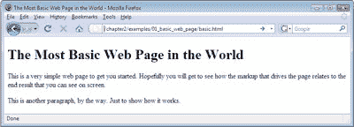
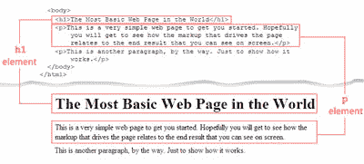
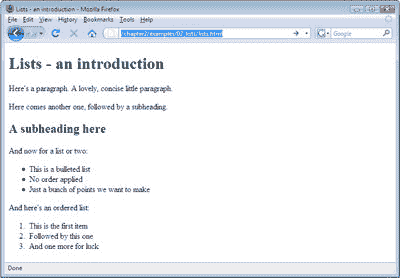

# 学习 HTML 和 CSS:绝对初学者指南

> 原文：<https://www.sitepoint.com/html-css-beginners-guide-5/>

## 世界上最基本的网页

实际上，这个标题有点用词不当:我们已经向您展示了最基本的页面——没有任何内容的页面。然而，要开始理解所有的东西是如何组合在一起的，你真的需要看到一个简单的页面，上面有一些实际的内容。让我们试一试，好吗？

打开您的文本编辑器，在一个新的空文档中键入以下内容(或者，如果您不想把它打出来，可以从代码归档中获取该文件):

" https://www . w3 . org/TR/XHTML 1/DTD/XHTML 1-strict . DTD ">
<html>
<head>
<title>世界上最基本的网页</title>
<meta http-equiv = " Content-Type "
Content = " text/html；charset = utf-8 "/>
</head>
<body>
<h1>世界上最基础的网页< /h1 >
< p >这是一个非常简单的让你入门的网页。
希望你能看到驱动
页面的标记如何与你在
屏幕上看到的最终结果相关联。< /p >
< p >这是另外一段，顺便说一下。只是为了展示它是如何工作的。

</正文>
< /html >

一旦你把它打出来，就把它存为`basic.html`。

如果您使用记事本:

1.  从菜单中选择“文件”>“另存为”,然后在“文档”文件夹中找到您创建的 Web 文件夹。

3.  输入文件名为 basic.html。

5.  从编码下拉列表中选择 UTF-8。

7.  单击保存。

如果您在 Mac 上使用“文本编辑”,首先确定您处于纯文本模式，然后:

1.  从菜单中选择文件>另存为…。

3.  找到网站文件夹，输入文件名为 basic.html。

5.  从纯文本编码下拉列表中选择 Unicode (UTF-8)。

7.  单击保存。

9.  “文本编辑”会警告您，您正在存储扩展名不是的纯文本文件。txt，并提供附加。txt 到文件名的末尾。我们想用一个。html 扩展名，所以单击“不追加”按钮，您的文件将被保存。

### 警告:UTF-8 的重要性

如果你在保存文件时忽略了选择 UTF-8，很可能你不会注意到太大的区别。然而，当其他人试图浏览你的网站时(比如说，你的一个韩国朋友)，他们可能会以一屏官样文章而告终。为什么？因为他们的电脑设置为阅读韩文文本，而你的电脑设置为创建英文文本。UTF-8 可以处理几乎所有的语言(包括一些非常晦涩的语言),而且大多数计算机都可以阅读它，所以 UTF-8 永远是一个安全的赌注。

接下来，使用 Windows 资源管理器或 Finder，找到您刚刚保存的文件，双击以在浏览器中打开它。下图显示了该页面的显示方式。

## 分析网页

我们在简单的页面中引入了两个新元素:一个标题元素和几个段落元素，分别用`<h1>`标签和`
`标签表示。你能看出你输入的标记和你在浏览器中看到的有什么关系吗？下图显示了文档显示的直接比较。

开始标签`<h1>`和结束标签`</h1>`被包裹在“世界上最基本的网页”周围，使其成为页面的主要标题。同样的，`p`元素包含了两段中的文本。

*重要:保持低位的案例*

标签都是小写的。我们所有的属性名也将是小写的。许多旧的 HTML 文档包含大写的标签和属性，但这在 XHTML 中是不允许的。

## 标题和文档层次结构

在上面的例子中，我们使用一个`h1`元素来显示一个主要的标题。如果我们想在这个标题下包含一个副标题，我们可以使用`h2`元素。一个`h2`下的副标题将使用一个`h3`元素，以此类推，直到我们到达`h6`。标题级别越低，它的重要性就越小，字体大小也越小(除非你已经用 CSS 重新设计了标题的样式，但是在本文后面会有更多的介绍。

对于标题，一个重要且常识性的做法是确保它们不会打乱顺序。换句话说，你应该从第一级开始，按照数字顺序一级一级往下。你可以从一个较低层次的标题跳回到一个较高层次的标题，只要你跳到的较高层次标题下的内容不涉及较低层次标题下的概念。将标题可视化为列表可能会很有用:

*   第一个主要标题
    *   第一个副标题
    *   第二小标题
        *   副标题

*   另一个大标题
    *   另一个副标题

下面是上面示例的 XHTML 视图:

# 第一个大标题

< h2 >第一个小标题< /h2 >
< h2 >第二个小标题< /h2 >
< h3 >一个小标题< /h3 >
< h1 >另一个大标题< /h1 >
< h2 >另一个小标题< /h2 >

## 段落

当然，没有人想阅读只包含标题的文档——你需要在里面放一些文字。我们用来处理文本块的元素是`p`元素。不难记，因为`p`是段落。这也无妨，因为您几乎肯定会发现自己比其他任何元素都更多地使用这个元素。这就是 XHTML 的美妙之处:大多数经常使用的元素要么非常明显，要么一旦介绍给你就很容易记住。

## 对于喜欢列表的人来说

让我们假设您希望在您的网页上有一个列表。为了包含项目的有序列表(编号列表的 HTML 术语)，我们使用了元素。一个*无序列表*——对普通人来说被称为要点——利用了`ul`元素。在这两种类型的列表中，单独的点或列表项都是使用`li`元素指定的。所以我们用`ol`表示有序列表，`ul`表示无序列表，`li`表示列表项。简单。

要查看此标记的实际效果，请在新的文本文档中键入以下内容，将其另存为`lists.html`，并通过双击保存文件的图标在浏览器中查看它:

" https://www . w3 . org/TR/XHTML 1/DTD/XHTML 1-strict . DTD ">
<html>
<head>
<title>Lists–an introduction</title>
<meta http-equiv = " Content-Type "
Content = " text/html；charset = utf-8 "/>
</head>
<body>
<h1>Lists-a 简介< /h1 >
< p >这里有一段。一个可爱的，简洁的小段落。< /p >
< p >又来了一个，后面还有个小标题。< /p >
< h2 >这里有一个小标题< /h2 >
< p >现在举一两个例子:

<ul>
<李>这是一个列表</李>
<李>没有应用顺序> 列表:

<ol>
<李>这是第一项</李>
<李>接下来是这一项</李>
<李>还有一项为运气</李>
</ol>
<

你觉得怎么样？你都打出来了吗？请记住，如果打出示例似乎很麻烦，您可以在代码档案中找到所有的标记，正如我在前言中解释的那样。然而，请记住，简单地复制和粘贴标记，然后保存和运行它，并不能真正给你一种创建自己的网站的感觉——在实践中学习确实是值得的。即使你犯了错误，这仍然是一个更好的学习方法(当你能自己发现并改正自己的错误时，你会很高兴的)。当在浏览器中显示时，上面的标记应该看起来像下面显示的页面。

你可以在你的网页上使用很多很多不同的元素，随着我们网站开发的进展，我们会学到更多。除了你会遇到的更明显的元素之外，还有其他一些不太明确的元素:例如，你会用`div`、`span`或`a`元素做什么？有什么猜测吗？一切都会在适当的时候揭晓。

**Go to page:** [1](https://sitepoint.com/html-css-beginners-guide) | [2](https://sitepoint.com/html-css-beginners-guide-2/) | [3](https://sitepoint.com/html-css-beginners-guide-3/) | [4](https://sitepoint.com/html-css-beginners-guide-4/) | [5](https://sitepoint.com/html-css-beginners-guide-5/) | [6](https://sitepoint.com/html-css-beginners-guide-6/) | [7](https://sitepoint.com/html-css-beginners-guide-7/) | [8](https://sitepoint.com/html-css-beginners-guide-8/) | [9](https://sitepoint.com/html-css-beginners-guide-9/) | [10](https://sitepoint.com/html-css-beginners-guide-10/) | [11](https://sitepoint.com/html-css-beginners-guide-11/) | [12](https://sitepoint.com/html-css-beginners-guide-12/) | [13](https://sitepoint.com/html-css-beginners-guide-13/) | [14](https://sitepoint.com/html-css-beginners-guide-14/) | [15](https://sitepoint.com/html-css-beginners-guide-15/) | [16](https://sitepoint.com/html-css-beginners-guide-16/) | [17](https://sitepoint.com/html-css-beginners-guide-17/) | [18](https://sitepoint.com/html-css-beginners-guide-18/) | [19](https://sitepoint.com/html-css-beginners-guide-19/)

## 分享这篇文章