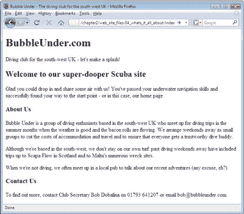
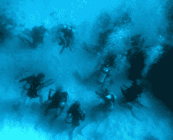
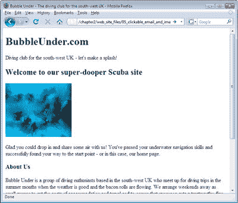

# 学习 HTML 和 CSS:绝对初学者指南

> 原文：<https://www.sitepoint.com/html-css-beginners-guide-8/>

## 这是怎么回事？

请注意，尽管我们包含了几个标题和几个段落，但几乎没有暗示这个网站是关于什么的。目前为止，所有的访问者都知道这个网站是关于潜水的。让我们在页面上添加更多的说明性文本，以及一些联系信息:

*   在页面上已经有的内容下面，添加另一个标题:这一次，使它成为三级标题，即“关于我们”(记住要包括 heading 元素的开始和结束标签)。

*   Next, add the following text. Note that there is more than one paragraph.

    Bubble Under 是一群居住在英国西南部的潜水爱好者，他们在天气好、培根卷飘香的夏季聚会，进行潜水旅行。我们以小组形式安排周末外出，以降低住宿和旅行成本，并确保每个人都有一个值得信赖的潜水伙伴。

    虽然我们位于西南部，但我们不会呆在自己的地盘上:过去的潜水周末包括去苏格兰的斯卡帕湾和马耳他的众多沉船遗址。

    当我们不潜水时，我们经常在当地的酒吧见面，谈论我们最近的冒险(任何借口，嗯？).

*   接下来，添加一个联系我们部分，同样由三级标题表示。
*   Finally, add some simple contact details as follows:

    如需了解更多信息，请拨打 01793 641207 联系俱乐部秘书鲍勃·多巴拉纳，或发电子邮件给 bob@bubbleunder.com。

所以，简单回顾一下，我们建议使用不同的标题级别来表示文档中不同章节和段落的重要性。考虑到这一点，您应该在文档正文中包含类似于以下标记的内容:

# BubbleUnder.com

英国西南部的潜水俱乐部——让我们来制造轰动吧！欢迎来到我们的超级潜水爱好者网站< /h2 >
< p >很高兴你能来和我们分享一些空气！您已经
通过了水下导航技能，并成功
找到了到达起点的路——或者在这种情况下，找到了我们的主页
。< /p >
**< h3 >关于我们</H3>**
**
Bubble Under 是一群总部设在英国西南部的潜水爱好者，他们在天气好的夏季
月和腊肉卷流淌的
月聚在一起进行潜水旅行。我们以小组形式安排周末外出，以减少住宿和旅行成本，并确保每个人都有一个值得信赖的潜水伙伴。虽然我们的基地在西南部，但我们不会呆在自己的
领地上:过去的周末外出潜水包括去苏格兰的
斯卡帕湾和马尔他的众多沉船遗址。当我们不潜水的时候，我们经常在当地的酒吧见面谈论我们最近的冒险(任何借口，嗯？).
**
**<H3>联系我们</H3>**
**
要了解更多信息，请联系俱乐部秘书鲍勃·多巴莉娜，电话
01793 641207 或发电子邮件至 bob@bubbleunder.com。
**

你可以在下面看到我们的主页是如何形成的。

还是不太刺激，是吧？相信我，我们会成功的。在这一阶段需要关注的重要事情是你的网站内容应该包括什么，以及它可能是如何构建的。除了讨论不同层次标题的使用，我们还没有深入讨论文档结构的细节，但是我们将在本章后面更详细地讨论这个问题。在下一章中，我们将看到如何开始*设计*你的文档——也就是说，改变字体、颜色、字母间距等等——但是现在，让我们把注意力集中在内容和结构上。

### 注意:可点击的电子邮件链接

在页面上放一个电子邮件地址当然很好，但它并不完美。要使用该地址，站点访问者需要将该地址复制并粘贴到电子邮件中。肯定有更简单的方法吧？当然有:

如需了解更多信息，请联系俱乐部秘书鲍勃·多芭丽娜
，电话 01793 641207 或**<a href = " mailto:Bob @ bubble under . com ">电子邮件 bob@bubbleunder.com</a>**。< /p >

这个可点击的电子邮件链接使用了`a`元素，该元素用于在网页上创建链接(这将在本章后面解释)。`mailto:`前缀告诉浏览器这个链接需要被当作一个邮件地址(也就是要为这个链接打开邮件程序)。`mailto:`部分后面的内容应该是有效的电子邮件地址，格式为`*`username`* @ *`domain`*` 。

现在将它添加到网页中，保存它，然后刷新浏览器中的视图。尝试点击带下划线的文本:它会自动打开你的电子邮件程序，并显示一个电子邮件表单，其中的收件人地址已经填写完毕。

这一页到目前为止似乎有点无聊，不是吗？让我们把它削尖一点。我们只能看一页黑白图片这么长时间，让我们在文档中插入一张图片。下面是如何在页面标记的上下文中应用`img`元素:

## 欢迎来到我们的超级潜水爱好者网站

**

** 
很高兴你能来和我们一起分享空气！您已经
通过了水下导航技能，并成功
找到了到达起点的路——或者在这种情况下，找到了我们的主页
。< /p >

`img`元素用于将图像插入到我们的 web 页面中，属性`src`、`alt`、`width`和`height`描述了我们正在插入的图像。`src`只是图像文件的名称。在这种情况下，它是`divers-circle.jpg`，您可以从代码档案中获取它。`alt`是一些可替换的文本，如果由于某种原因，它不能显示，它可以代替图像显示。这对盲人访问者、搜索引擎和网速慢的用户很有用。`width`和`height`应该很明显:它们给出了图像的宽度和高度，以像素为单位。稍后，当我们更详细地研究图像时，我们将涉及像素。

去从代码档案中取出`divers-circle.jpg`,并把它放入你网站的文件夹中。图像如下所示。

在文本编辑器中打开`index.html`，在二级标题(`h2`)后添加以下标记:

 alt= "一圈潜水员练技术"/ > < /p >

保存更改，然后在浏览器中查看主页。它应该看起来像下面的显示。

**Go to page:** [1](https://sitepoint.com/html-css-beginners-guide) | [2](https://sitepoint.com/html-css-beginners-guide-2/) | [3](https://sitepoint.com/html-css-beginners-guide-3/) | [4](https://sitepoint.com/html-css-beginners-guide-4/) | [5](https://sitepoint.com/html-css-beginners-guide-5/) | [6](https://sitepoint.com/html-css-beginners-guide-6/) | [7](https://sitepoint.com/html-css-beginners-guide-7/) | [8](https://sitepoint.com/html-css-beginners-guide-8/) | [9](https://sitepoint.com/html-css-beginners-guide-9/) | [10](https://sitepoint.com/html-css-beginners-guide-10/) | [11](https://sitepoint.com/html-css-beginners-guide-11/) | [12](https://sitepoint.com/html-css-beginners-guide-12/) | [13](https://sitepoint.com/html-css-beginners-guide-13/) | [14](https://sitepoint.com/html-css-beginners-guide-14/) | [15](https://sitepoint.com/html-css-beginners-guide-15/) | [16](https://sitepoint.com/html-css-beginners-guide-16/) | [17](https://sitepoint.com/html-css-beginners-guide-17/) | [18](https://sitepoint.com/html-css-beginners-guide-18/) | [19](https://sitepoint.com/html-css-beginners-guide-19/)

## 分享这篇文章