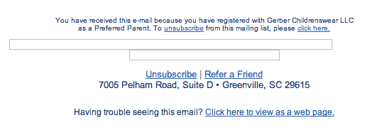
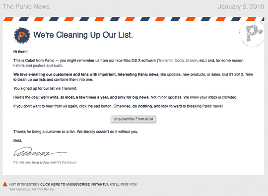
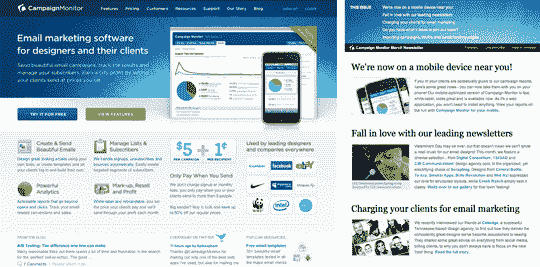
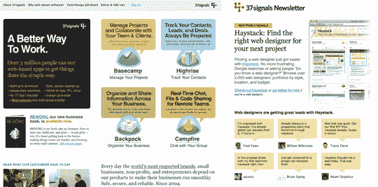
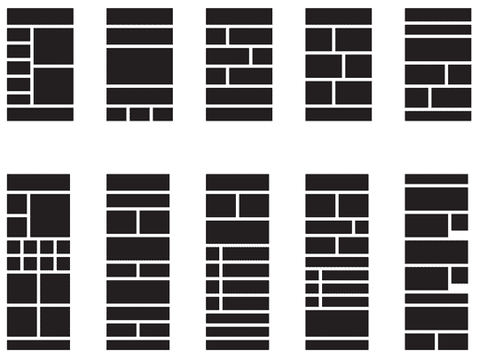

# HTML 邮件设计的原则

> 原文：<https://www.sitepoint.com/html-email-design/>

SitePoint 的最新图书版本， [*创造出令人惊叹的 HTML 电子邮件，*](https://www.sitepoint.com/blog/) ，包含了大量关于规划、设计和编码 HTML 电子邮件的信息。它将帮助你理解基于许可的营销，并向你展示如何向你的客户销售电子邮件设计服务。我们正在制作《T4》第三章:收件箱设计，作为本书的[免费样本 PDF 的一部分。这篇文章是从那一章中摘录的，集中在 HTML 邮件设计的基本原则上。请继续阅读，开始学习如何设计漂亮有效的 HTML 电子邮件，或者下载免费示例，在方便的时候离线阅读。](https://www.sitepoint.com/books/htmlemail1/samplechapters.php)

## 电子邮件设计环境

设计一封邮件不就像设计一个小的单页网页吗？是的，在很多方面都是。我们确实使用相同的设计工具和技术来产生最终结果。同样的一般设计原则仍然在起作用:对比、重复、接近和对齐都很重要。

任何有能力的网页设计师都已经具备了设计 HTML 邮件的能力。然而，还是有一些重要的区别，理解这些区别将会使一个小小的网页挤进你的收件箱和一封有价值的可读的电子邮件之间产生差别。

如果我们比较网页设计和电子邮件设计，我们可以得出一些核心区别。让我们逐一检查一下，看看我们能从中吸取什么教训。

### 您的订户可能不会阅读该邮件

电子邮件的第一个设计元素严格来说根本不是“设计”。是文案。你的电子邮件可以像《死星战壕》中的卢克·天行者(Luke Skywalker)一样穿越垃圾邮件过滤器，成功地进入收件箱，但随后仍未被打开。这是因为，不像网页——访问者可以通过其他页面或搜索引擎的链接到达——电子邮件只有当用户 *决定* 打开它时才会打开，通常他们会根据主题行做出决定。

精心设计一个吸引人和信息丰富的主题是成功设计的第一步。我们不能对主题行做任何视觉设计上的改变，但是作为设计师，我们应该确保它代表了邮件中的内容，并且是可识别的和有帮助的。

如果主题行失败了，你精美的设计将永远不会被看到。有大量的信息可以帮助改进主题，也有关于主题成功或失败的原因的研究。[1](#ftn.id2357696)

Design Guideline 1: Write a subject line that is …

*   信息丰富(提及一些主题)

*   简短(或至少在开始就有最重要的信息)

*   易于识别(以便与您客户的其他电子邮件保持一致)

### 透过长方形的窗户看

假设我们在主题行方面做得不错，我们的电子邮件可能会从收件箱中选择，并以简短的形式显示。对于像 Outlook 和 Apple Mail 这样的桌面电子邮件客户端，默认的预览窗格是一个很小的矩形空间，占屏幕不到 20%，如图[图 1，“显示预览窗格大小的示例屏幕”](#fig_preview_pane "Figure 1. Sample screen showing preview pane size")所示。

**图一。显示预览窗格大小的示例屏幕**

想象一下穿过一个商场。每家商店前面都有一个标志，但是除了一个方形信箱大小的窥视孔外，所有的窗户都是黑色的。为了决定你是否想进去，你需要从那个槽缝里偷看，看看你能看到什么。这就是预览窗格的样子——设计和内容的有限视图。因此，电子邮件的开头信息丰富非常重要。如果读者所能看到的只是 300 像素的背景色或者一个无法辨认的标志，那么他们一定会很想继续读下去。

Design Guideline 2: Find out what your email looks like in a minimal preview pane.

什么文案位于邮件的前几百像素？它是否吸引人们继续阅读？你的头球太大了吗？

### 图像阻塞

如果你使用过任何呈现 HTML 的电子邮件程序，你很可能会打开看起来像[图 2 中所示的电子邮件，“图像被屏蔽的全图像电子邮件”](#fig_all_image "Figure 2. All-image email with images blocked")。

**图二。图像被阻止的全图像电子邮件**

取代文字或图片的是一堆不同大小的方块，就好像有人在你的收件箱里输掉了一场俄罗斯方块游戏。大多数主要的电子邮件客户端，包括 Outlook、Lotus Notes 和 Hotmail，默认情况下不会显示图像。相反，它们显示一个破碎的图像图标或一个空的矩形。

图像屏蔽如此普遍的原因与我们之前讨论的电子邮件的入侵有关。当电子邮件到达时，你还没有采取任何行动，没有任何可以想象到的内容，很容易就能看出事情会变得多么糟糕。没有人想向老板解释为什么他们的屏幕上满是不适合工作场所的图片。为了避免这种情况，电子邮件程序在查看过程中插入了一个额外的步骤，让读者明确要求查看图像。

默认情况下，电子邮件软件程序处理图像的方式有所不同，无论是使用全局设置，还是只显示来自已知联系人的图像，还是逐个电子邮件地显示图像。在某些情况下，将图像作为 MIME 编码的附件嵌入可以避免图像阻塞，这是值得了解的。然而，以附件形式发送图像会增加被过滤的风险，降低下载速度，并使流程更加复杂。你可以打赌，如果垃圾邮件发送者开始将他们所有的图像作为附件嵌入，电子邮件客户端将会响应并开始阻止这些图像。

作为电子邮件设计师，我们要传达的信息是，我们不能简单地期望我们的读者看到图像。此外，许多读者不知道图像丢失或如何启用它们，所以他们可能会认为电子邮件没有意义或损坏，如果除了图像之外没有其他内容，就将其扔掉。

那我们该怎么办？完全避免图像？嗯，你可以，而且在很多情况下，一封没有图片的格式良好的 HTML 电子邮件可以非常有效地实现你的所有目标。然而，这并不总是正确的，不可避免地，我们会有客户或老板对形象有着合理的要求。

答案是，设计时要知道你的图像是不可靠的。确保如果它们没有加载，邮件仍然是可读和可识别的。

Design Guideline 3: Always check your email with images turned off.

邮件中还有有用的、可读的内容吗？请特别考虑没有图像时预览窗格的外观。预览区域中有可见文本吗？

### 水平挑战

GA_googleFillSlot(“Articles_6_300x250”);

我还记得 800×600 的桌面分辨率最终普及到足以让网页设计师们将*全部转移到设计这种尺寸的网站的重要时刻。我们已经辛苦工作多年，将网站压缩到 600 像素，所以被允许扩展到 760 像素就像从行军床搬到女王套装。*

 *不幸的是，我有一些坏消息。当涉及到电子邮件设计时，你需要去车库把那个行军床拖回楼上，因为你的电子邮件可能是在一个非常狭窄的窗口或框架中阅读的。大多数人不会全屏窗口打开邮件；相反，他们在预览窗格或查看栏中滚动，预览窗格或查看栏只占屏幕的一部分。

除此之外，想想那些使用移动电子邮件客户端的穷人，他们最多只有几百个像素。网络冲浪者已经克服了他们对垂直滚动的恐惧，但是水平滚动仍然很少见。因此，我们的电子邮件设计通常会很窄，只能在有限的屏幕空间中工作。大多数商业邮件看起来最多只有 600 像素宽，当你习惯了 24 英寸的桌面显示器时，你会感觉有点幽闭恐惧症。这种宽度限制自然会导致某些设计风格，比如限制列数，垂直拆分元素多于水平拆分元素。

Design Guideline 4: Keep email designs reasonably narrow.

一个好的最大目标宽度是 600 像素。*  *## 一封有效邮件的基本要素

有了我们的设计指南，我们几乎可以开始创建我们的电子邮件了。就像几乎所有的汽车都有一个方向盘、四个轮子和一个仪表盘，大多数网站都有页眉、页脚和联系页面一样，商业邮件也有一个基本的结构。

在过去的几年里，我查阅了成千上万封电子邮件，其中的模式非常清晰。我们将在下面讨论的元素可以通过多种方式实现，但它们几乎总是出现在时事通讯和营销电子邮件中。法律上可能不要求你把它们都保存下来，但是每一个都增加了你的信息的可信度和被阅读的可能性。

### 权限提醒

根据你在世界上的位置，有许多不同的法律适用于商业电子邮件。几乎在任何地方都适用的一条规则是，你绝对必须获得许可，才能给别人群发电子邮件。在大多数情况下，提醒人们他们是如何给你许可的也是有意义的。我们将在[中更详细地讨论这个话题。？？](#)，但我们将在这里简单描述一下，因为这是在你开始设计之前需要考虑的一个重要因素。

人们很容易忘记他们已经注册了，尤其是如果你只是很少发邮件，或者他们只是因为一场比赛或特别优惠才加入的。邮件顶部的简短信息可以帮助人们记忆，让他们更有可能继续阅读。你可能已经看到一些公司试图这样做，但使提醒非常含糊，如“你收到这封邮件是因为你的地址在我们的名单上。”嗯，咄！

收件人想知道 *为什么* 他们的地址出现在你的名单上，以及它是如何出现的。你越具体越好。在我们的*现代党羽*时事通讯中，我们知道人们上榜的原因有三个:

*   他们最近从网站上购买了产品。

*   他们在网站上填写了注册表格。

*   他们是付费用户，这是他们购买的一部分。

因此，一个简单的权限提醒将是这样的:“你收到这封邮件是因为你是一个当前的订户，已经从我们这里购买了(谢谢)，或者在我们的网站上注册了。”

和你的客户一起写一个权限提醒也是检查客户*是否有权限发送他们的列表的好方法。看到提醒明明白白地写出来，可以引发他们说:“哦，我们还添加了我们的联系人列表、商会成员和本地电话号码簿。”啊哦。*

 *在你发出 电子邮件之前，最好弄清楚 *你的客户对权限的理解与你(或你的电子邮件服务提供商)截然不同。然后，你可以与他们合作，将名单缩减为更有可能积极接收的人，以及符合你的电子邮件服务提供商规则的人。*

存储关于每个人如何注册的信息(可能作为列表中的自定义数据字段)可以简化创建个性化权限提醒。如果你知道这个人是今年 5 月从你这里购买的，你可以提前提醒他们，让他们更有可能对你的邮件做出良好的回应。

[Panic](https://www.panic.com/) 发送了一封非常有吸引力且设计巧妙的电子邮件，如图[图 3 所示，“Panic 的权限提醒电子邮件是个性化的，带有用户特定的信息”](#fig_panic "Figure 3. Panic’s permission reminder email is personalized with user-specific information")，但正是添加了“您通过[产品名称]注册了我们的列表”这一行帮助他们避免了投诉。

**图 3。Panic 的权限提醒电子邮件带有个性化的用户特定信息**

* *### 拥有可识别的发件人详细信息

对邮件打开率的研究发现，信任发件人是决定邮件是否被打开的最重要的因素。这意味着选择有效且一致的“发件人”姓名和电子邮件地址至关重要。你需要选择一个能被你的读者识别的名字或标题。这通常是公司的名字，或者是人们已经注册了解的产品或服务。

一些公司有一个众所周知的领导者(bgates@microsoft.com)，如果你的客户在其中，你也许可以使用他们的名字。一旦你选择了一个地址，坚持使用它是很重要的，因为电子邮件客户端不太可能过滤来自已知发件人的电子邮件。您的用户可能已经手动将您的发送地址列入白名单(这是您应该鼓励的)，更改地址将意味着失去任何白名单的好处。

### 法律合规

本书的大部分内容是关于指导方针、建议和一般提示，但根据你和你的客户居住的地方，你发送的任何商业电子邮件也可能有法律要求。

这些法律中最著名的当然是效果可疑的 *CAN-SPAM 法案(2003)* ，它适用于美国“主要目的是广告或推销商业产品或服务，包括网站内容的电子邮件”的发送者处理电子邮件(如订单确认之类的)大多是免税的。

CAN-SPAM 法律要求您的电子邮件必须:

*   拥有准确的“发件人”和“收件人”地址、电子邮件标题和可识别发件人的路由信息

*   避免欺骗性或误导性的主题

*   包含取消订阅或选择退出机制

*   将自己标识为商业电子邮件，并包含发件人的有效物理地址

这条法律对设计者的主要影响是需要在设计中包含物理地址，通常是在页脚，你会看到。在联邦贸易委员会的网站上找到更多关于 CAN-SPAM 的信息。

在美国之外，有很多类似的立法，所以确保你知道什么适用于你发送的电子邮件。要想抢先找到你所在地区的相关法律，请访问马克·布朗罗的帮助列表。

### 退订链接

即使法律没有要求退订，这通常也是个好主意。给用户一个简单明了的方式说“我想现在停止接收你的邮件”对各方来说都是最好的选择。作为发件人，这有助于你，因为你避免了向收件人发送电子邮件的费用，而收件人无论如何都会把它扔掉。它会让你的用户对你的公司或服务有一个积极的体验——你给了他们在关系中的控制权。

当我回顾电子邮件活动时，我能感觉到一些设计师不情愿地向退订要求妥协。他们把它隐藏在一个四像素的浅灰色字体中，放在一个不相关的段落中间。这就像在玩一个特别令人沮丧的版本“沃尔多在哪里”，如果你这次找不到他，他下周就会来敲你的门，让你再玩一次。

这真的没有意义。如果一个人不想收到你的邮件，他们无论如何也不会看，激怒他们，让他们为难，你只是增加了他们举报垃圾邮件的风险。所以，让你的退订方法响亮而自豪。不过，你可以从中得到一点乐趣。

一位 Campaign Monitor 客户在邮件结尾写道:“每个退订的人都会让我们落泪，但如果你必须这样做，请点击这里。”另一封发给夜总会的邮件显示了一些诚实:“如果你是在喝醉时注册的，你可以在这里退订。”

一个知道退订非常容易的人，如果他们需要你的信息或服务，很可能会再次退订。

现在我们已经熟悉了 HTML 邮件的设计限制，以及一些我们必须记住的关键部分，我们已经准备好开始设计邮件的实际工作了。但是从哪里开始呢？幸运的是，几乎所有的电子邮件设计都可以基于现有的网站设计。*  *## 将网站设计改编成电子邮件设计

典型的电子邮件设计项目会与一个现有的品牌相关联，你几乎总是会有一个网站设计来开始工作。让你的邮件设计看起来像是来自同一家公司或网站，这一点非常重要。Return Path 年的一项调查显示，对电子邮件是否被打开影响最大的是[“了解并信任发件人”](https://returnpath.net/)如果电子邮件使用可识别的颜色、标题和图像，主题行和预览窗格将提醒收件人邮件的发件人，提供采取行动的信心。

一封从视觉上与它链接的网站断开的电子邮件将会受到影响，即使它确实说服了一些收件人点击一个链接。

但是，不要疯狂地试图在一封电子邮件中复制整个网站。你的设计应该抓住品牌的本质感觉(原谅营销术语)，并将其转化为适合电子邮件的内容。

Campaign Monitor 自己的电子邮件简讯模板就是一个例子。将当前活动监控主页与简讯进行比较，二者均可在[图 4“活动监控网站和简讯”](#fig_campaign_monitor_comparison "Figure 4. Campaign Monitor website and newsletter")中看到。

**图 4。竞选监督网站和时事通讯**

从结构上看，电子邮件要简单得多，只包含一个栏目。电子邮件标题与网站标题的阳光效果相结合，但是内容已经被重新排序。乍一看，这两幅图像非常相似，但并不完全相同。这是我们要达到的相似程度:一封感觉像是网站自然延伸的电子邮件。它应该作为一个设计良好、可读性强的文档独立存在，但显然是一个更大设计的一部分。[2](#ftn.id2359340)[图 5，“37signals 主页和简讯”](#fig_37signals_comparison "Figure 5. 37signals home page and newsletter")，[图 6，“Wufoo 主页和简讯”](#fig_wufoo_comparison "Figure 6. Wufoo home page and newsletter")，[图 7，“Authentic Jobs 主页和简讯”](#fig_authentic_comparison "Figure 7. Authentic Jobs home page and newsletter")是一些其他流行服务的当前主页(左侧)，以及它们的简讯(右侧)。

**图 5。37 信号主页和简讯**

**图 6。Wufoo 主页和简讯**

**图 7。真实工作主页和时事通讯**

如果你看到一个很棒的时事通讯的例子，一定要点击进入公司或发件人的主页，并比较它们。通过设计者选择包含的内容和遗漏的内容，你将确切地了解到他们认为网站设计和品牌的关键元素是什么。

## 布局可能性

即使在 600 像素的情况下，也有很多方式来布局内容。设计师通常是如何设计电子邮件布局的？[图 8，“通过活动监视器发送的最受欢迎的布局变化”](#fig_layouts "Figure 8. The most popular layout variations sent through Campaign Monitor")显示了一些最受欢迎的块级电子邮件布局，摘自通过活动监视器发送的电子邮件活动的典型日。

(事实上，这些是最受欢迎的布局，一旦我们排除了常见但可怕的“杂乱无章的文本和图像”，这仍然是许多发送者的不幸最爱。)

两栏布局(大约 80/20 分割)是目前最流行的布局，十年前的网站也是如此。用全宽块点缀两列块的想法很受欢迎，如果做得好的话，会给邮件一种更动态的感觉。它也非常灵活，允许您使用各种不同的内容类型。

**图 8。通过活动监视器发送的最受欢迎的布局变化**

很少会看到超过三栏，考虑到我在“电子邮件的设计环境”一节中谈到的设计约束，这并不奇怪。

如果您有一个发送几种不同类型内容的客户端，您当然可以创建许多设计变体来适应；尽管如此，你还是想让它们被认为是来自同一个发送者和相同的主题。

请记住，实际内容可能比我们计划的要短，也可能更长，或者每月都有变化。因此，我们的设计需要足够灵活，以便随着时间的推移保持一致。像素完美的设计在网络上从来都不太好用，在电子邮件客户端也肯定不行。

一些设计师喜欢在这一点上创建一个更详细的模型，在他们适合的地方插入内容部分。你可能会发现，在你对特定的配色方案或布局尺寸做出承诺之前，向你的客户展示模型是一份有用的文件。

## 结论

既然你已经学会了设计一封吸引人的成功的 HTML 邮件的原则，是时候将它们付诸实践了。首先下载*的[样本 PDF](https://www.sitepoint.com/books/htmlemail1/samplechapters.php) 创建令人惊叹的 HTML 电子邮件*，它包括本文的所有内容，以及*第三章:收件箱设计*的其余部分。当你准备好将你的 HTML 电子邮件设计技能提升到一个新的水平时，[购买这本书](https://www.sitepoint.com/blog/)，学习如何编写你的模板，帮助你的客户以合法有效的方式管理他们的订户列表，并开始向你的客户销售电子邮件设计服务。

* * *

[ [1](#id2357696) ] 访问[https://www . campaign monitor . com/blog/post/2546/writing-better-subject-lines/](https://www.campaignmonitor.com/blog/post/2546/writing-better-subject-lines/)了解一些不错的起点。

[ [2](#id2359340) ] 你可以在[https://www . Campaign Monitor . com/blog/post/2677/re designing-the-Campaign-Monitor-newsletter/](https://www.campaignmonitor.com/blog/post/2677/redesigning-the-campaign-monitor-newsletter/)了解更多关于《竞选监控通讯》是如何策划和制作的。* 

## *分享这篇文章**